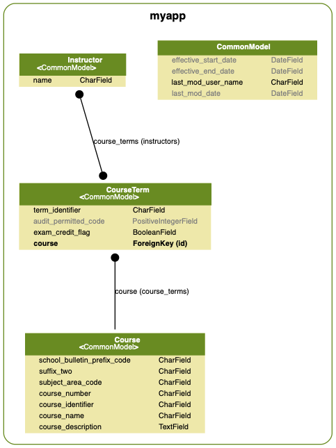

# Another Modification: Add an Instructor Model and additional relationship

Let's further enhance our model such that any given instance of a Course (a CourseTerm) can have zero
or more Instructors. We'll:

1. Add an Instructor model.
2. Do a new migration.
3. Create new serializers and views for that Instructor model.
4. Update the existing serializers to demonstrate a second relationship for CourseTerm.
5. Add some fancy searching features that allow a client to, for instance, GET all the instructors for
   a given course name:
   http://localhost:8000/v1/instructors/?filter[course_name]=accounting%20for%20consultants

   Or keyword search the Course and Instructor names:
   http://localhost:8000/v1/instructors/?filter[search]=accounting%20morris

## Instructor model
This model is ManyToMany with CourseTerm.



```python
class Instructor(CommonModel):
    """
    An instructor.
    """
    name = models.TextField(max_length=100, unique=True)
    course_terms = models.ManyToManyField('myapp.CourseTerm', related_name='instructors')

    class Meta:
        ordering = ['name']

    def __str__(self):
        return '%s,%s' % (self.id, self.name)

```

See `myapp/migrations/0004_instructor.py` for the migration
and some updates to the test case fixture(`myapp/fixtures/testcases.yaml`).

## Instructor serializer 

We define a new `InstructorSerializer` but also add an _instructors_ `ResourceRelatedField` to the
`CourseTermSerializer`. This demonstrates a second relationship for CourseTerm such that GET
http://localhost:8000/v1/course_terms/00d14ddb-9fb5-4cff-9954-d52fc33217e7/ now returns two flavors
of `relationships` and `related` links: course (to-one) and instructors (to-many).

```json
{
    "data": {
        "type": "course_terms",
        "id": "00d14ddb-9fb5-4cff-9954-d52fc33217e7",
        "attributes": {
            "term_identifier": "20191ACCT8122B",
            "audit_permitted_code": 0,
            "exam_credit_flag": false,
            "effective_start_date": null,
            "effective_end_date": null,
            "last_mod_user_name": "loader",
            "last_mod_date": "2018-08-03"
        },
        "relationships": {
            "course": {
                "links": {
                    "self": "http://localhost:8000/v1/course_terms/00d14ddb-9fb5-4cff-9954-d52fc33217e7/relationships/course/",
                    "related": "http://localhost:8000/v1/course_terms/00d14ddb-9fb5-4cff-9954-d52fc33217e7/course/"
                },
                "data": {
                    "type": "courses",
                    "id": "00fb17bb-e4a0-49a0-a27e-6939e3e04b62"
                }
            },
            "instructors": {
                "meta": {
                    "count": 3
                },
                "data": [
                    {
                        "type": "instructors",
                        "id": "aae87c7f-8515-44cf-b1c7-79c6f81cc5c5"
                    },
                    {
                        "type": "instructors",
                        "id": "0a879dc6-63d4-4a79-aae6-63ee2b379b32"
                    },
                    {
                        "type": "instructors",
                        "id": "40678ab5-07fa-4c93-a680-bceda8a34735"
                    }
                ],
                "links": {
                    "self": "http://localhost:8000/v1/course_terms/00d14ddb-9fb5-4cff-9954-d52fc33217e7/relationships/instructors/",
                    "related": "http://localhost:8000/v1/course_terms/00d14ddb-9fb5-4cff-9954-d52fc33217e7/instructors/"
                }
            }
        },
        "links": {
            "self": "http://localhost:8000/v1/course_terms/00d14ddb-9fb5-4cff-9954-d52fc33217e7/"
        }
    }
}
```

Here's the new code:

```diff
diff --git a/myapp/serializers.py b/myapp/serializers.py
index cabd404..f60741f 100644
--- a/myapp/serializers.py
+++ b/myapp/serializers.py
@@ -3,7 +3,7 @@ from datetime import datetime
 from rest_framework_json_api.relations import ResourceRelatedField
 from rest_framework_json_api.serializers import HyperlinkedModelSerializer
 
-from myapp.models import Course, CourseTerm
+from myapp.models import Course, CourseTerm, Instructor
 
 
 class HyperlinkedModelSerializer(HyperlinkedModelSerializer):
@@ -80,7 +80,7 @@ class CourseTermSerializer(HyperlinkedModelSerializer):
             'exam_credit_flag',
             'effective_start_date', 'effective_end_date',
             'last_mod_user_name', 'last_mod_date',
-            'course')
+            'course', 'instructors')
 
     course = ResourceRelatedField(
         model=Course,
@@ -92,8 +92,40 @@ class CourseTermSerializer(HyperlinkedModelSerializer):
         self_link_view_name='course_term-relationships',
         related_link_view_name='course_term-related',
     )
+    instructors = ResourceRelatedField(
+        model=Instructor,
+        many=True,
+        read_only=False,
+        allow_null=True,
+        required=False,
+        queryset=Instructor.objects.all(),
+        self_link_view_name='course_term-relationships',
+        related_link_view_name='course_term-related',
+    )
 
     # json api 'included' support
     included_serializers = {
         'course': 'myapp.serializers.CourseSerializer',
+        'instructors': 'myapp.serializers.InstructorSerializer',
+    }
+
+
+class InstructorSerializer(HyperlinkedModelSerializer):
+    class Meta:
+        model = Instructor
+        fields = ('name', 'course_terms', 'url')
+
+    course_terms = ResourceRelatedField(
+        model=CourseTerm,
+        many=True,
+        read_only=False,
+        allow_null=True,
+        required=False,
+        queryset=CourseTerm.objects.all(),
+        self_link_view_name='instructor-relationships',
+        related_link_view_name='instructor-related',
+    )
+
+    included_serializers = {
+        'course_terms': 'myapp.serializers.CourseTermSerializer',
     }
```

## Instructor views

Here's the new InstructorViewSet and InstructorRelationshipView:
```python
class InstructorViewSet(CourseBaseViewSet):
    """
    API endpoint that allows Instructor to be viewed or edited.
    """
    queryset = Instructor.objects.all()
    serializer_class = InstructorSerializer
    

class InstructorRelationshipView(AuthnAuthzSchemaMixIn, RelationshipView):
    """
    view for instructors.relationships
    """
    queryset = Instructor.objects
    self_link_view_name = 'instructor-relationships'
```

and the new urlpatterns:
```diff
diff --git a/training/urls.py b/training/urls.py
index d186cf0..f29c44f 100644
--- a/training/urls.py
+++ b/training/urls.py
@@ -32,6 +32,7 @@ admin.autodiscover()
 router = routers.DefaultRouter()
 router.register(r'courses', views.CourseViewSet)
 router.register(r'course_terms', views.CourseTermViewSet)
+router.register(r'instructors', views.InstructorViewSet)
 
 urlpatterns = [
 
@@ -55,6 +56,14 @@ urlpatterns = [
     path('v1/course_terms/<pk>/<related_field>/',
         views.CourseTermViewSet.as_view({'get': 'retrieve_related'}), # a toOne relationship
         name='course_term-related'),
+    # instructor relationships
+    path('v1/instructors/<pk>/relationships/<related_field>/',
+        views.InstructorRelationshipView.as_view(),
+        name='instructor-relationships'),
+    # use new `retrieve_related` functionality in DJA 2.6.0:
+    path('v1/instructors/<pk>/<related_field>/',
+        views.InstructorViewSet.as_view({'get': 'retrieve_related'}), # a toMany relationship
+        name='instructor-related'),
     # browseable API and admin stuff. TODO: Consider leaving out except when debugging.
     path('api-auth/', include('rest_framework.urls', namespace='rest_framework')),
     path('admin/', admin.site.urls),
```

# Filters

Let's further make the InstructorViewSet more useful by adding a few filters. In this case,
we'll use the [django-filter](https://django-filter.readthedocs.io/en/master/guide/rest_framework.html)
"long form" method of specifying a FilterSet to the `DjangoFilterBackend`
as a means of aliasing a more complex ORM-based filter search keyword for *course_name*:

```python
from django_filters import rest_framework as filters


class InstructorFilterSet(filters.FilterSet):
    """
    :py:class:`django_filters.rest_framework.FilterSet` for the Instructor model
    """
    # A filter "alias" for a chained search from instructor->course_term->course:
    # There does not appear to be a way to supply a list of `lookup_expr`'s as is allowed with the `fields` dict.
    #: `course_name` is an alias for the path `course_terms.course.course_name`
    course_name = filters.CharFilter(field_name="course_terms__course__course_name", lookup_expr="iexact")
    course_name__gt = filters.CharFilter(field_name="course_terms__course__course_name", lookup_expr="gt")
    course_name__gte = filters.CharFilter(field_name="course_terms__course__course_name", lookup_expr="gte")
    course_name__lt = filters.CharFilter(field_name="course_terms__course__course_name", lookup_expr="lt")
    course_name__lte = filters.CharFilter(field_name="course_terms__course__course_name", lookup_expr="lte")

    class Meta:
        usual_rels = ('exact', 'lt', 'gt', 'gte', 'lte')
        model = Instructor
        fields = {
            'id': usual_rels,
            'name': usual_rels,
        }
```

We'll also use the `rest_framework.filters.SearchFilter` to add a keyword search that spans multiple fields,
including via ORM paths. 

```python
class InstructorViewSet(CourseBaseViewSet):
    """
    API endpoint that allows Instructor to be viewed or edited.
    """
    queryset = Instructor.objects.all()
    serializer_class = InstructorSerializer
    filterset_class = InstructorFilterSet
    search_fields = ('name', 'course_terms__course__course_name')
```

## Challenge Question: A Through Model

Using a filter we can see which named Courses have CourseTerm and Instructor instances associated with them,
but wouldn't it be cool to GET `/courses/<id>` and get back an `instructors` relationship? This means drilling
down to the CourseTerm model and then from there to the Instructor model.

How would you do this?  Let me know! 

