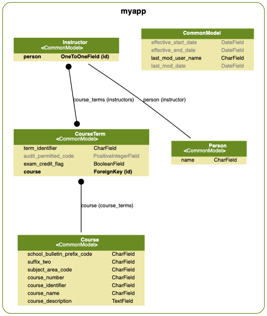

## Split Instructor model to be OneToOne with new Person model

Just as a thought experiment, let's decide that we want a generic Person model.
For the time being, this model will be one-to-one with an Instructor.
Let's assume that our production database has live data in it that we don't want to break
things, so we'll need some migration magic.

We want to:
1. [Create the new Model, Serializer, and Views.](#new-person-models-serializers-views)
2. [Make the new migration and customize it](#custom-person-migration) 
   to fix our data, moving `Instructor.name` to `Person.name` and
   add a relationship from `Instructor` to that `Person`.
3. [Update our test fixtures](#update-fixtures) to reflect the changes, including
   migrating forward and [backward](#make-sure-reverse-migrations-work).
4. Finally, be fairly confident that this will run on our production database. 

### New Person models, serializers, views

As we did previously when we added Instructor, let's create the new stuff
and check it all in as one git commit. We'll see why in a second.

You may note that our `makedocs` script generates a UML diagram into `docs/media/current-uml.png`.
Let's rename that to reflect our current person model:
```bash
mv docs/media/current-uml.png docs/media/person-uml.png
```

Here's the new model:



### Custom Person migration

We customize the migration:
1. Rename it from the auto name.
1. Move adding the new `Instructor.person` OneToOneField up to the top.
1. Add Python code to move the `Instructor.name` field into `Person.name` and vice-versa.

```console
(env) django-training$ ./manage.py makemigrations
Migrations for 'myapp':
  myapp/migrations/0006_auto_20181205_1804.py
    - Create model Person
    - Change Meta options on instructor
    - Remove field name from instructor
    - Add field person to instructor
```

```console
(env) django-training$ mv myapp/migrations/0006_auto_20181205_1804.py myapp/migrations/0006_person.py 
```

Here's the edited version of the person migration. Note the `instr_name_to_person()` and
`person_name_to_instr()` forward and reverse migrations.

```python
# Generated by Django 2.1.3 on 2018-12-05 18:04
# modified to move instructor.name into person.name

from django.db import migrations, models
import django.db.models.deletion
import uuid


class Migration(migrations.Migration):

    dependencies = [
        ('myapp', '0005_auto_20181205_1532'),
    ]

    def instr_name_to_person(apps, schema_editor):
        """
        Move the instructor name to person model.
        Creates a new person instance for each instructor.
        """
        Person = apps.get_model('myapp', 'Person')
        Instructor = apps.get_model('myapp', 'Instructor')
        for row in Instructor.objects.all():
            row.person = Person(name=row.name)
            row.save(update_fields=['person'])
            row.person.save()

    def person_name_to_instr(apps, schema_editor):
        """
        Move the person name to instructor model.
        """
        Person = apps.get_model('myapp', 'Person')
        Instructor = apps.get_model('myapp', 'Instructor')
        for row in Instructor.objects.all():
            row.name = row.person.name
            row.save(update_fields=['name'])

    operations = [
        migrations.CreateModel(
            name='Person',
            fields=[
                ('id', models.UUIDField(default=uuid.uuid4, editable=False, help_text='globally unique id (UUID4)', primary_key=True, serialize=False)),
                ('effective_start_date', models.DateField(blank=True, default=None, help_text='date when this model instance becomes valid', null=True)),
                ('effective_end_date', models.DateField(blank=True, default=None, help_text='date when this model instance becomes invalid', null=True)),
                ('last_mod_user_name', models.CharField(default=None, help_text='who last modified this instance', max_length=80, null=True)),
                ('last_mod_date', models.DateField(auto_now=True, help_text='when they modified it.')),
                ('name', models.CharField(db_column='person_name', max_length=100, unique=True)),
            ],
            options={
                'verbose_name_plural': 'people',
                'ordering': ['name'],
            },
        ),
        migrations.AddField(
            model_name='instructor',
            name='person',
            field=models.OneToOneField(default=None, null=True, on_delete=django.db.models.deletion.CASCADE, related_name='people', to='myapp.Person'),
        ),
        migrations.RunPython(
            code=instr_name_to_person,
            reverse_code=person_name_to_instr,
        ),
        migrations.AlterModelOptions(
            name='instructor',
            options={'ordering': ['id']},
        ),
        migrations.RemoveField(
            model_name='instructor',
            name='name',
        ),
    ]
```

Now we'll commit this work:

```console
(env) django-training$ git add myapp training/
(env) django-training$ git status
On branch master
Your branch is ahead of 'origin/master' by 3 commits.
  (use "git push" to publish your local commits)

Changes to be committed:
  (use "git reset HEAD <file>..." to unstage)

        new file:   myapp/migrations/0006_person.py
        modified:   myapp/models.py
        modified:   myapp/serializers.py
        modified:   myapp/views.py
        modified:   training/urls.py

(env) django-training$ git commit -m "add person model"
```

### Update fixtures

Our test fixtures currently only work with an older version of our app's models, so let's:
1. Checkout that older version.
2. Start with a fresh sqlite3 database.
3. Migrate and load the current fixture data.
4. Dump out the new fixture data.

```console
(env) django-training$ git log 
commit c085297f67fd586ef9d9f8a027c51c9930ae3c31 (HEAD -> master)
Author: Alan Crosswell <alan@columbia.edu>
Date:   Wed Dec 5 13:27:48 2018 -0500

    add person model

commit d6ee827f7ffbb81772d73ef6d8dc9084fdd4df2b
Author: Alan Crosswell <alan@columbia.edu>
Date:   Wed Dec 5 10:42:54 2018 -0500

    apply migrations forced by help_text
...

(env) django-training$ git checkout d6ee827f7ffbb81772d73ef6d8dc9084fdd4df2b
M       docs/conf.py
Note: checking out 'd6ee827f7ffbb81772d73ef6d8dc9084fdd4df2b'.

You are in 'detached HEAD' state. You can look around, make experimental
changes and commit them, and you can discard any commits you make in this
state without impacting any branches by performing another checkout.

If you want to create a new branch to retain commits you create, you may
do so (now or later) by using -b with the checkout command again. Example:

  git checkout -b <new-branch-name>

HEAD is now at d6ee827 apply migrations forced by help_text
(env) django-training$ rm db.sqlite3 
(env) django-training$ ./manage.py migrate
Operations to perform:
  Apply all migrations: admin, auth, contenttypes, myapp, oauth2_provider, sessions
Running migrations:
  Applying contenttypes.0001_initial... OK
  Applying auth.0001_initial... OK
  Applying admin.0001_initial... OK
  Applying admin.0002_logentry_remove_auto_add... OK
  Applying admin.0003_logentry_add_action_flag_choices... OK
  Applying contenttypes.0002_remove_content_type_name... OK
  Applying auth.0002_alter_permission_name_max_length... OK
  Applying auth.0003_alter_user_email_max_length... OK
  Applying auth.0004_alter_user_username_opts... OK
  Applying auth.0005_alter_user_last_login_null... OK
  Applying auth.0006_require_contenttypes_0002... OK
  Applying auth.0007_alter_validators_add_error_messages... OK
  Applying auth.0008_alter_user_username_max_length... OK
  Applying auth.0009_alter_user_last_name_max_length... OK
  Applying myapp.0001_initial... OK
  Applying myapp.0002_auto_20181019_1821... OK
  Applying myapp.0003_unique_term_identifier... OK
  Applying myapp.0004_instructor... OK
  Applying myapp.0005_auto_20181205_1532... OK
  Applying oauth2_provider.0001_initial... OK
  Applying oauth2_provider.0002_08_updates... OK
  Applying oauth2_provider.0003_auto_20160316_1503... OK
  Applying oauth2_provider.0004_auto_20160525_1623... OK
  Applying oauth2_provider.0005_auto_20170514_1141... OK
  Applying oauth2_provider.0006_auto_20171214_2232... OK
  Applying sessions.0001_initial... OK
(env) django-training$ rm db.sqlite3 
(env) django-training$ ./manage.py migrate
Operations to perform:
  Apply all migrations: admin, auth, contenttypes, myapp, oauth2_provider, sessions
Running migrations:
  Applying contenttypes.0001_initial... OK
  Applying auth.0001_initial... OK
  Applying admin.0001_initial... OK
  Applying admin.0002_logentry_remove_auto_add... OK
  Applying admin.0003_logentry_add_action_flag_choices... OK
  Applying contenttypes.0002_remove_content_type_name... OK
  Applying auth.0002_alter_permission_name_max_length... OK
  Applying auth.0003_alter_user_email_max_length... OK
  Applying auth.0004_alter_user_username_opts... OK
  Applying auth.0005_alter_user_last_login_null... OK
  Applying auth.0006_require_contenttypes_0002... OK
  Applying auth.0007_alter_validators_add_error_messages... OK
  Applying auth.0008_alter_user_username_max_length... OK
  Applying auth.0009_alter_user_last_name_max_length... OK
  Applying myapp.0001_initial... OK
  Applying myapp.0002_auto_20181019_1821... OK
  Applying myapp.0003_unique_term_identifier... OK
  Applying myapp.0004_instructor... OK
  Applying myapp.0005_auto_20181205_1532... OK
  Applying oauth2_provider.0001_initial... OK
  Applying oauth2_provider.0002_08_updates... OK
  Applying oauth2_provider.0003_auto_20160316_1503... OK
  Applying oauth2_provider.0004_auto_20160525_1623... OK
  Applying oauth2_provider.0005_auto_20170514_1141... OK
  Applying oauth2_provider.0006_auto_20171214_2232... OK
  Applying sessions.0001_initial... OK
(env) django-training$ ./manage.py loaddata myapp/fixtures/testcases.yaml
Installed 34 object(s) from 1 fixture(s)
(env) django-training$ git checkout master
M       docs/conf.py
Previous HEAD position was d6ee827 apply migrations forced by help_text
Switched to branch 'master'
Your branch is ahead of 'origin/master' by 4 commits.
  (use "git push" to publish your local commits)
(env) django-training$ ./manage.py migrate
Operations to perform:
  Apply all migrations: admin, auth, contenttypes, myapp, oauth2_provider, sessions
Running migrations:
  Applying myapp.0006_person... OK
(env) django-training$ sqlite3 db.sqlite3 
-- Loading resources from /Users/ac45/.sqliterc
SQLite version 3.24.0 2018-06-04 14:10:15
Enter ".help" for usage hints.
sqlite> select * from myapp_instructor;
id                                effective_start_date  effective_end_date  last_mod_user_name  last_mod_date  person_id                       
--------------------------------  --------------------  ------------------  ------------------  -------------  --------------------------------
0a879dc663d44a79aae663ee2b379b32                                                                2018-11-12     4a64f7fa0c47402c907b83fa339afc64
1b3b7d1a7eb543a2941fc18364013f9c                                                                2018-11-12     b3e1d967e8864797aaf28dbe669ceb07
40678ab507fa4c93a680bceda8a34735                                                                2018-11-12     8c1bf6eb810e40608a41e87e9732e545
4baaf8fa98324732a1ddee7bc5e58c21                                                                2018-11-12     a060bdbe6a3f49a08172ad89742b82c4
aae87c7f851544cfb1c779c6f81cc5c5                                                                2018-11-12     7fe24e43eceb4d0394e773ef73ffccb0
sqlite> select * from myapp_person;
id                                effective_start_date  effective_end_date  last_mod_user_name  last_mod_date  person_name       
--------------------------------  --------------------  ------------------  ------------------  -------------  ------------------
b3e1d967e8864797aaf28dbe669ceb07                                                                2018-12-05     Alexander Hamilton
7fe24e43eceb4d0394e773ef73ffccb0                                                                2018-12-05     Gouverneur Morris 
4a64f7fa0c47402c907b83fa339afc64                                                                2018-12-05     John Jay          
a060bdbe6a3f49a08172ad89742b82c4                                                                2018-12-05     Robert Livingston 
8c1bf6eb810e40608a41e87e9732e545                                                                2018-12-05     Samuel Johnson    
sqlite> 
(env) django-training$ ./manage.py dumpdata myapp --format yaml >myapp/fixtures/testcases.yaml
(env) django-training$ git diff myapp
```
```diff
diff --git a/myapp/fixtures/testcases.yaml b/myapp/fixtures/testcases.yaml
index 9572763..8dd3672 100644
--- a/myapp/fixtures/testcases.yaml
+++ b/myapp/fixtures/testcases.yaml
@@ -55,7 +55,6 @@
     last_mod_date: 2018-08-03, school_bulletin_prefix_code: B, suffix_two: '00', subject_area_code: BUEC,
     course_number: '72074', course_identifier: BUEC7255B, course_name: 'FinTech: Consumer
       Financial Se', course_description: 'FinTech: Consumer Financial Se'}
-# this course has no courseterm children:
 - model: myapp.course
   pk: 04893b8f-0cbe-4e09-b8e6-17a4745900c1
   fields: {effective_start_date: null, effective_end_date: null, last_mod_user_name: loader,
@@ -123,6 +122,11 @@
   fields: {effective_start_date: null, effective_end_date: null, last_mod_user_name: loader,
     last_mod_date: 2018-08-03, term_identifier: 20181ACCT7022B, audit_permitted_code: 0,
     exam_credit_flag: false, course: 016659e9-e29f-49b4-b85d-d25da0724dbb}
+- model: myapp.courseterm
+  pk: 48a7ab4f-35d7-4004-97b2-2a95626dd25a
+  fields: {effective_start_date: null, effective_end_date: null, last_mod_user_name: admin,
+    last_mod_date: 2018-12-05, term_identifier: 20181COMS3109W, audit_permitted_code: 0,
+    exam_credit_flag: false, course: null}
 - model: myapp.courseterm
   pk: 52cc86dd-7a78-48b8-a6a5-76c1fc7fc9be
   fields: {effective_start_date: null, effective_end_date: null, last_mod_user_name: loader,
@@ -153,12 +157,26 @@
   fields: {effective_start_date: null, effective_end_date: null, last_mod_user_name: loader,
     last_mod_date: 2018-08-03, term_identifier: 20181AMST3704X, audit_permitted_code: 0,
     exam_credit_flag: false, course: 01ca197f-c00c-4f24-a743-091b62f1d500}
-# a coursterm item that doesn't refers back to a parent course:
-- model: myapp.courseterm
-  pk: 48a7ab4f-35d7-4004-97b2-2a95626dd25a
-  fields: {effective_start_date: null, effective_end_date: null, last_mod_user_name: admin,
-    last_mod_date: 2018-12-05, term_identifier: 20181COMS3109W, audit_permitted_code: 0,
-    exam_credit_flag: false, course: null}
+- model: myapp.person
+  pk: 4a64f7fa-0c47-402c-907b-83fa339afc64
+  fields: {effective_start_date: null, effective_end_date: null, last_mod_user_name: null,
+    last_mod_date: 2018-12-05, name: John Jay}
+- model: myapp.person
+  pk: 7fe24e43-eceb-4d03-94e7-73ef73ffccb0
+  fields: {effective_start_date: null, effective_end_date: null, last_mod_user_name: null,
+    last_mod_date: 2018-12-05, name: Gouverneur Morris}
+- model: myapp.person
+  pk: 8c1bf6eb-810e-4060-8a41-e87e9732e545
+  fields: {effective_start_date: null, effective_end_date: null, last_mod_user_name: null,
+    last_mod_date: 2018-12-05, name: Samuel Johnson}
+- model: myapp.person
+  pk: a060bdbe-6a3f-49a0-8172-ad89742b82c4
+  fields: {effective_start_date: null, effective_end_date: null, last_mod_user_name: null,
+    last_mod_date: 2018-12-05, name: Robert Livingston}
+- model: myapp.person
+  pk: b3e1d967-e886-4797-aaf2-8dbe669ceb07
+  fields: {effective_start_date: null, effective_end_date: null, last_mod_user_name: null,
+    last_mod_date: 2018-12-05, name: Alexander Hamilton}
 - model: myapp.instructor
   pk: 0a879dc6-63d4-4a79-aae6-63ee2b379b32
   fields:
@@ -166,7 +184,7 @@
     effective_end_date: null
     last_mod_user_name: null
     last_mod_date: 2018-11-12
-    name: John Jay
+    person: 4a64f7fa-0c47-402c-907b-83fa339afc64
     course_terms: [39ca7b38-f273-4fa3-9494-5a422780aebd, 00d14ddb-9fb5-4cff-9954-d52fc33217e7]
 - model: myapp.instructor
   pk: 1b3b7d1a-7eb5-43a2-941f-c18364013f9c
@@ -175,7 +193,7 @@
     effective_end_date: null
     last_mod_user_name: null
     last_mod_date: 2018-11-12
-    name: Alexander Hamilton
+    person: b3e1d967-e886-4797-aaf2-8dbe669ceb07
     course_terms: []
 - model: myapp.instructor
   pk: 40678ab5-07fa-4c93-a680-bceda8a34735
@@ -184,7 +202,7 @@
     effective_end_date: null
     last_mod_user_name: null
     last_mod_date: 2018-11-12
-    name: Samuel Johnson
+    person: 8c1bf6eb-810e-4060-8a41-e87e9732e545
     course_terms: [00d14ddb-9fb5-4cff-9954-d52fc33217e7, 00290ba0-ebae-44c0-9f4b-58a5f27240ed]
 - model: myapp.instructor
   pk: 4baaf8fa-9832-4732-a1dd-ee7bc5e58c21
@@ -193,7 +211,7 @@
     effective_end_date: null
     last_mod_user_name: null
     last_mod_date: 2018-11-12
-    name: Robert Livingston
+    person: a060bdbe-6a3f-49a0-8172-ad89742b82c4
     course_terms: []
 - model: myapp.instructor
   pk: aae87c7f-8515-44cf-b1c7-79c6f81cc5c5
@@ -202,5 +220,5 @@
     effective_end_date: null
     last_mod_user_name: null
     last_mod_date: 2018-11-12
-    name: Gouverneur Morris
+    person: 7fe24e43-eceb-4d03-94e7-73ef73ffccb0
     course_terms: [00d14ddb-9fb5-4cff-9954-d52fc33217e7]
```

Run tox to make sure our test cases still work.
```console
(env) django-training$ tox
```
It's probably a good idea to update the test cases for the changed models.... Volunteers, anyone?

### Make sure reverse migrations work

Let's also test the reverse migration to make sure we got that right.
This works fine if there's no data loaded, but fails if there is data to migrate:

```console
(env) django-training$ DJANGO_DEBUG=true ./manage.py migrate myapp 0005_auto_20181205_1532
2018-12-05 20:58:16,667 (0.000) 
            SELECT name, type FROM sqlite_master
            WHERE type in ('table', 'view') AND NOT name='sqlite_sequence'
            ORDER BY name; args=None
2018-12-05 20:58:16,668 (0.000) SELECT "django_migrations"."app", "django_migrations"."name" FROM "django_migrations"; args=()
2018-12-05 20:58:16,669 (0.000) 
            SELECT name, type FROM sqlite_master
            WHERE type in ('table', 'view') AND NOT name='sqlite_sequence'
            ORDER BY name; args=None
2018-12-05 20:58:16,669 (0.000) SELECT "django_migrations"."app", "django_migrations"."name" FROM "django_migrations"; args=()
Operations to perform:
  Target specific migration: 0005_auto_20181205_1532, from myapp
Running migrations:
2018-12-05 20:58:16,685 (0.000) 
            SELECT name, type FROM sqlite_master
            WHERE type in ('table', 'view') AND NOT name='sqlite_sequence'
            ORDER BY name; args=None
  Rendering model states... DONE
2018-12-05 20:58:16,704 (0.000) PRAGMA foreign_keys = OFF; args=None
2018-12-05 20:58:16,704 (0.000) BEGIN; args=None
2018-12-05 20:58:16,719 ALTER TABLE "myapp_instructor" RENAME TO "myapp_instructor__old"; (params ())
2018-12-05 20:58:16,720 (0.001) ALTER TABLE "myapp_instructor" RENAME TO "myapp_instructor__old"; args=()
2018-12-05 20:58:16,720 CREATE TABLE "myapp_instructor" ("id" char(32) NOT NULL PRIMARY KEY, "effective_start_date" date NULL, "effective_end_date" date NULL, "last_mod_user_name" varchar(80) NULL, "last_mod_date" date NOT NULL); (params None)
2018-12-05 20:58:16,720 (0.000) CREATE TABLE "myapp_instructor" ("id" char(32) NOT NULL PRIMARY KEY, "effective_start_date" date NULL, "effective_end_date" date NULL, "last_mod_user_name" varchar(80) NULL, "last_mod_date" date NOT NULL); args=None
2018-12-05 20:58:16,720 INSERT INTO "myapp_instructor" ("id", "effective_start_date", "effective_end_date", "last_mod_user_name", "last_mod_date") SELECT "id", "effective_start_date", "effective_end_date", "last_mod_user_name", "last_mod_date" FROM "myapp_instructor__old"; (params ())
2018-12-05 20:58:16,721 (0.000) INSERT INTO "myapp_instructor" ("id", "effective_start_date", "effective_end_date", "last_mod_user_name", "last_mod_date") SELECT "id", "effective_start_date", "effective_end_date", "last_mod_user_name", "last_mod_date" FROM "myapp_instructor__old"; args=()
2018-12-05 20:58:16,721 DROP TABLE "myapp_instructor__old"; (params ())
2018-12-05 20:58:16,721 (0.000) DROP TABLE "myapp_instructor__old"; args=()
2018-12-05 20:58:16,722 ALTER TABLE "myapp_instructor" RENAME TO "myapp_instructor__old"; (params ())
2018-12-05 20:58:16,722 (0.000) ALTER TABLE "myapp_instructor" RENAME TO "myapp_instructor__old"; args=()
2018-12-05 20:58:16,722 CREATE TABLE "myapp_instructor" ("instr_name" varchar(100) NOT NULL UNIQUE, "id" char(32) NOT NULL PRIMARY KEY, "effective_start_date" date NULL, "effective_end_date" date NULL, "last_mod_user_name" varchar(80) NULL, "last_mod_date" date NOT NULL); (params None)
2018-12-05 20:58:16,722 (0.000) CREATE TABLE "myapp_instructor" ("instr_name" varchar(100) NOT NULL UNIQUE, "id" char(32) NOT NULL PRIMARY KEY, "effective_start_date" date NULL, "effective_end_date" date NULL, "last_mod_user_name" varchar(80) NULL, "last_mod_date" date NOT NULL); args=None
2018-12-05 20:58:16,723 INSERT INTO "myapp_instructor" ("id", "effective_start_date", "effective_end_date", "last_mod_user_name", "last_mod_date", "instr_name") SELECT "id", "effective_start_date", "effective_end_date", "last_mod_user_name", "last_mod_date", NULL FROM "myapp_instructor__old"; (params ())
2018-12-05 20:58:16,723 (0.000) INSERT INTO "myapp_instructor" ("id", "effective_start_date", "effective_end_date", "last_mod_user_name", "last_mod_date", "instr_name") SELECT "id", "effective_start_date", "effective_end_date", "last_mod_user_name", "last_mod_date", NULL FROM "myapp_instructor__old"; args=()
2018-12-05 20:58:16,725 (0.000) PRAGMA foreign_keys = ON; args=None
  Unapplying myapp.0006_auto_20181205_2048...Traceback (most recent call last):
  File "/Users/alan/src/django-training/env/lib/python3.6/site-packages/django/db/backends/utils.py", line 85, in _execute
    return self.cursor.execute(sql, params)
  File "/Users/alan/src/django-training/env/lib/python3.6/site-packages/django/db/backends/sqlite3/base.py", line 296, in execute
    return Database.Cursor.execute(self, query, params)
sqlite3.IntegrityError: NOT NULL constraint failed: myapp_instructor.instr_name
```

It's clear what the problem is (with database backend debugging turned on).
`instructor.name` can't be NULL but the steps used to reverse the migration do in fact make it NULL:

```sql
INSERT INTO "myapp_instructor" ("id", "effective_start_date", "effective_end_date", "last_mod_user_name", "last_mod_date", "instr_name") SELECT "id", "effective_start_date", "effective_end_date", "last_mod_user_name", "last_mod_date", NULL FROM "myapp_instructor__old"
```

It appears that this is a
[documented restricition of RemoveField](https://docs.djangoproject.com/en/2.1/ref/migration-operations/#removefield)
however, here's a simple workaround: Simply convert the `instructor.name` field to NULLable with a default value
as the first step in the migration. This will then reverse back to allow the preceding INSERT to work and then
further reverse to make the name non-NULLable.

```diff
diff --git a/myapp/migrations/0006_person.py b/myapp/migrations/0006_person.py
index f25f676..f150ac8 100644
--- a/myapp/migrations/0006_person.py
+++ b/myapp/migrations/0006_person.py
@@ -35,6 +35,12 @@ class Migration(migrations.Migration):
             row.save(update_fields=['name'])
 
     operations = [
+        # temporarily alter instructor.name to be nullable to enable reversing the migration.
+        migrations.AlterField(
+            model_name='instructor',
+            name='name',
+            field=models.CharField(db_column='instr_name', max_length=100, unique=True, null=True, default=None)
+        ),
         migrations.CreateModel(
             name='Person',
             fields=[
```


```console
(env) django-training$  ./manage.py migrate
Operations to perform:
  Apply all migrations: admin, auth, contenttypes, myapp, oauth2_provider, sessions
Running migrations:
  Applying myapp.0006_person... OK
(env) django-training$ sqlite3 db.sqlite3 
-- Loading resources from /Users/ac45/.sqliterc
SQLite version 3.24.0 2018-06-04 14:10:15
Enter ".help" for usage hints.
sqlite> select * from myapp_instructor;
id                                effective_start_date  effective_end_date  last_mod_user_name  last_mod_date  person_id                       
--------------------------------  --------------------  ------------------  ------------------  -------------  --------------------------------
0a879dc663d44a79aae663ee2b379b32                                                                2018-11-12     fc313d67f29c40e48664481a6b7a3dae
1b3b7d1a7eb543a2941fc18364013f9c                                                                2018-11-12     3df528fed5064878a423983a2181bf3d
40678ab507fa4c93a680bceda8a34735                                                                2018-11-12     7077ee3c840c4e41a303953142f8a784
4baaf8fa98324732a1ddee7bc5e58c21                                                                2018-11-12     9ded69e493aa4343a0af3bccfbe05c93
aae87c7f851544cfb1c779c6f81cc5c5                                                                2018-11-12     9612c115b96747d98dfa07fe2c0f1313
sqlite> select * from myapp_person;
id                                effective_start_date  effective_end_date  last_mod_user_name  last_mod_date  person_name       
--------------------------------  --------------------  ------------------  ------------------  -------------  ------------------
3df528fed5064878a423983a2181bf3d                                                                2018-12-06     Alexander Hamilton
9612c115b96747d98dfa07fe2c0f1313                                                                2018-12-06     Gouverneur Morris 
fc313d67f29c40e48664481a6b7a3dae                                                                2018-12-06     John Jay          
9ded69e493aa4343a0af3bccfbe05c93                                                                2018-12-06     Robert Livingston 
7077ee3c840c4e41a303953142f8a784                                                                2018-12-06     Samuel Johnson    
sqlite>
(env) django-training$ ./manage.py migrate myapp 0005_auto_20181205_1532
Operations to perform:
  Target specific migration: 0005_auto_20181205_1532, from myapp
Running migrations:
  Rendering model states... DONE
  Unapplying myapp.0006_person... OK
(env) django-training$ sqlite3 db.sqlite3 
-- Loading resources from /Users/ac45/.sqliterc
SQLite version 3.24.0 2018-06-04 14:10:15
Enter ".help" for usage hints.
sqlite> select * from myapp_person;
Error: no such table: myapp_person
sqlite> select * from myapp_instructor;
instr_name  id                                effective_start_date  effective_end_date  last_mod_user_name  last_mod_date
----------  --------------------------------  --------------------  ------------------  ------------------  -------------
John Jay    0a879dc663d44a79aae663ee2b379b32                                                                2018-11-12   
Alexander   1b3b7d1a7eb543a2941fc18364013f9c                                                                2018-11-12   
Samuel Joh  40678ab507fa4c93a680bceda8a34735                                                                2018-11-12   
Robert Liv  4baaf8fa98324732a1ddee7bc5e58c21                                                                2018-11-12   
Gouverneur  aae87c7f851544cfb1c779c6f81cc5c5                                                                2018-11-12   
sqlite>  
```
