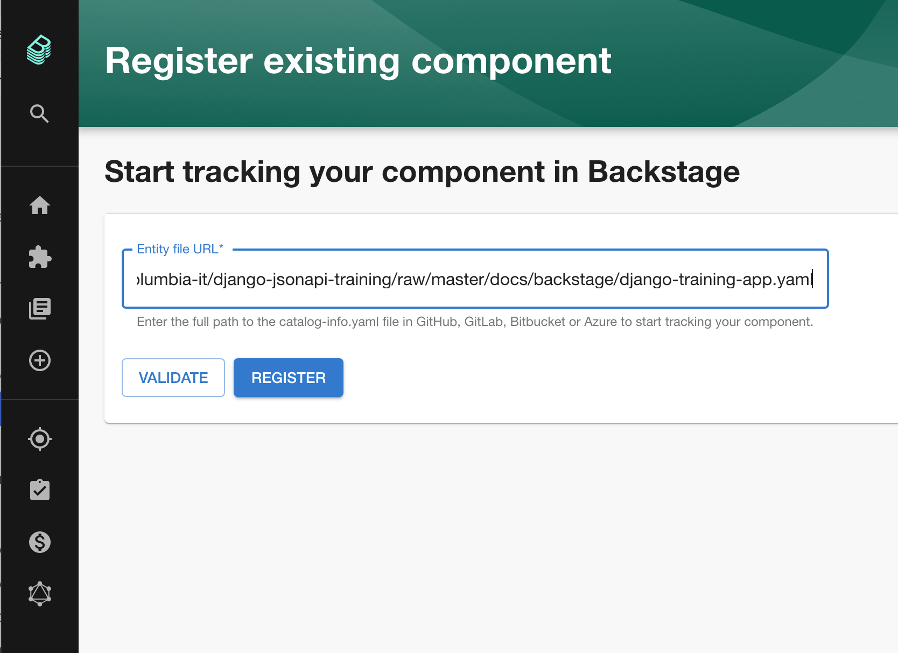
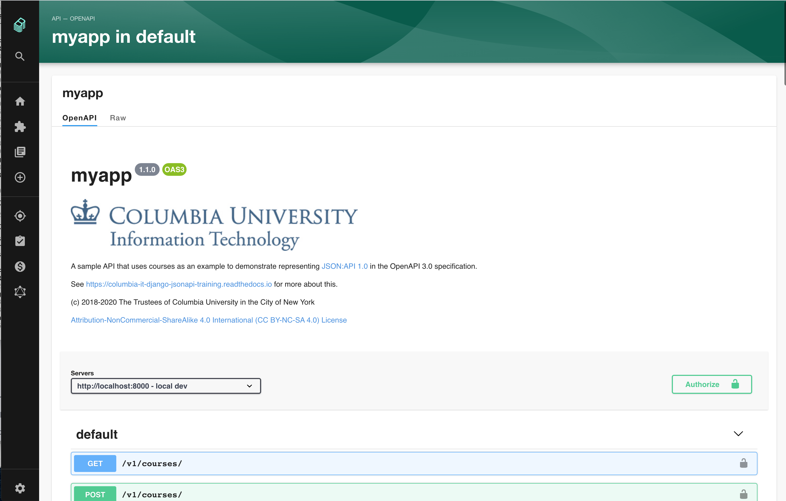
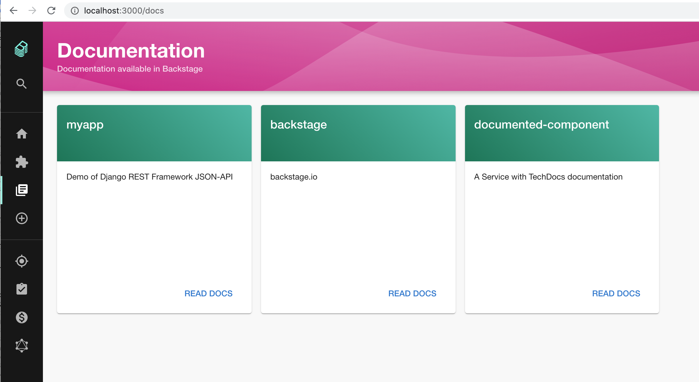
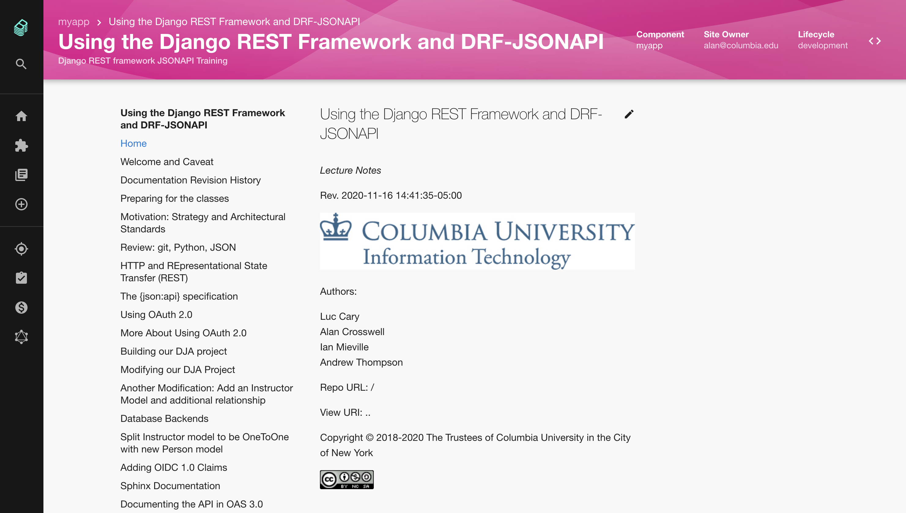

# Backstage Developer Portal

[Backstage](https://backstage.io) is Spotify's recently-open sourced developer portal. I've been experimenting with
it with the eventual goal(s) of supporting:

1. deployment of OpenAPI 3.0 swagger-UI documentation and "try it" functionality.
1. associated project documentation.
1. developers acquiring client credentials to use an API.
1. templating creation of new projects.
1. more...

## Initial Backstage setup

TODO

## Adding our project

After creating [this configuration file]({{view_uri}}/docs/backstage/django-training-app.yaml),
simply load it via the Backstage API's page:

This generates both API and TechDocs tiles:

