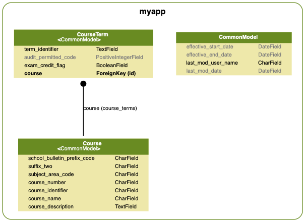
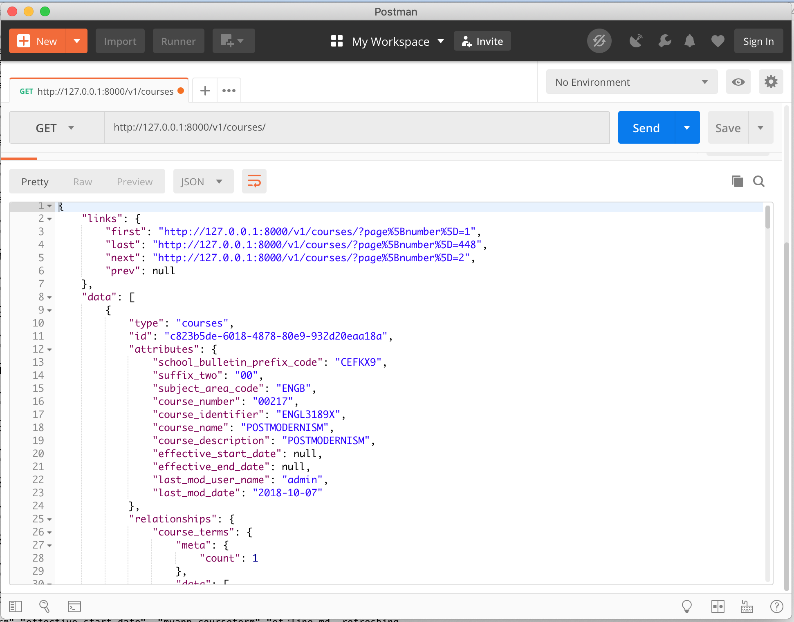
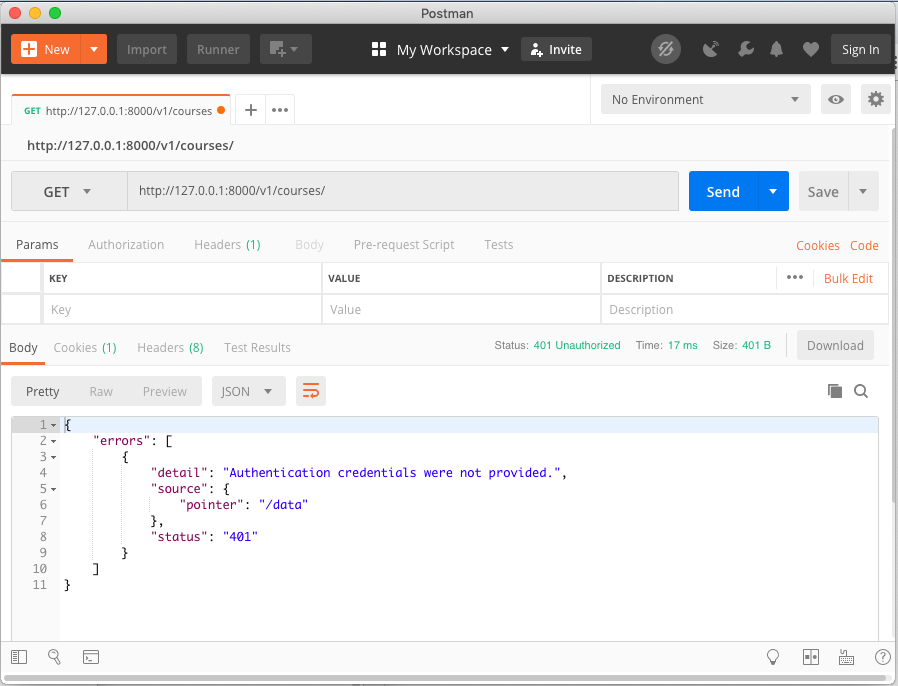
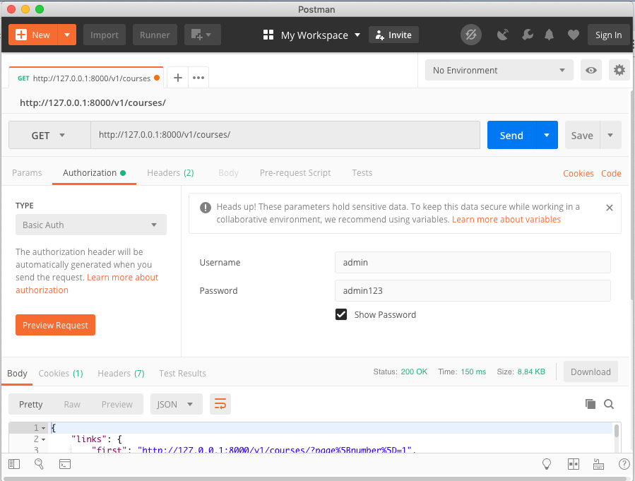
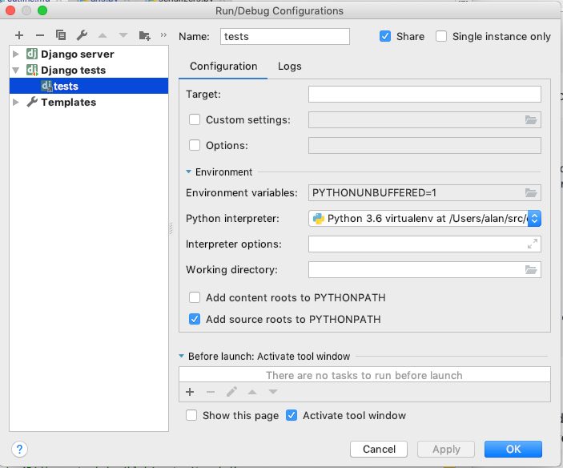
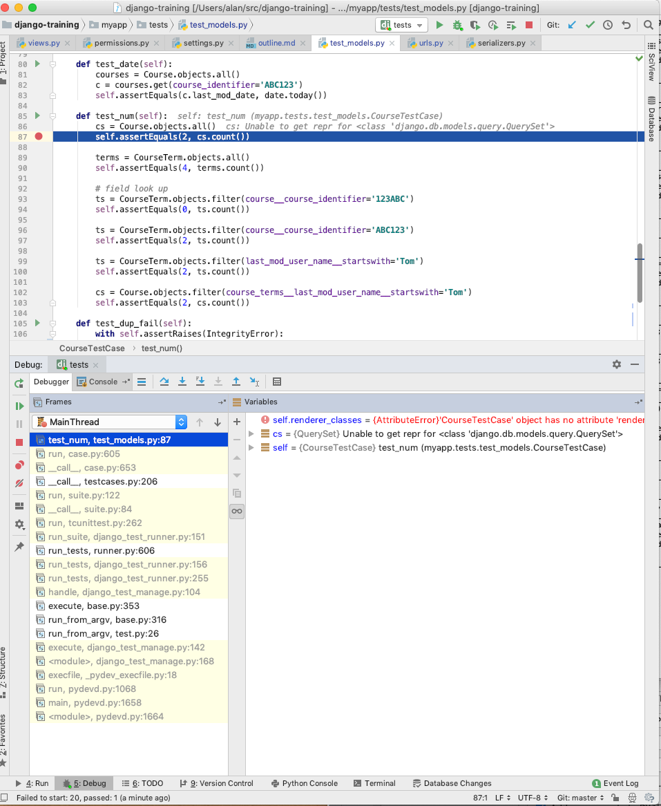
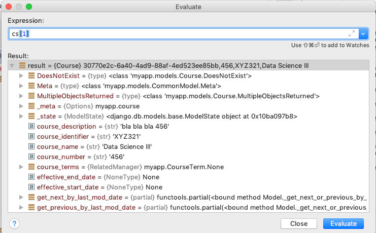
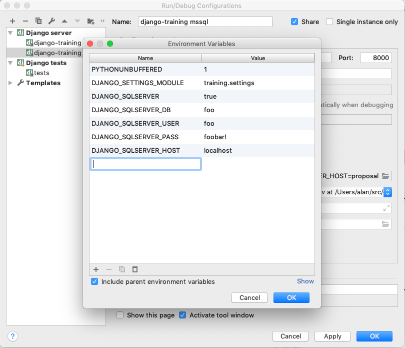
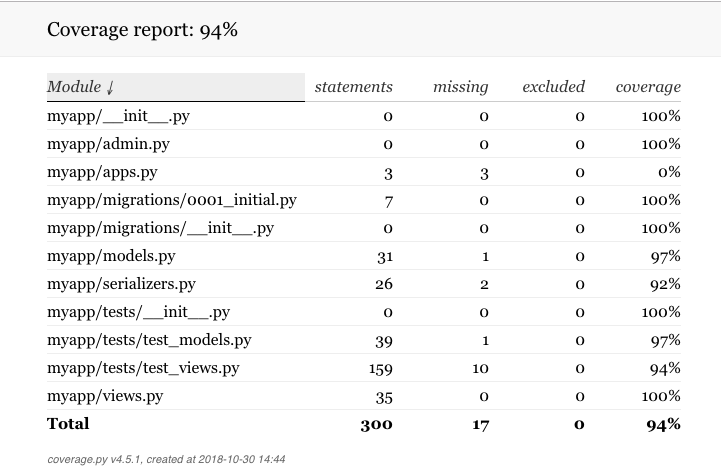
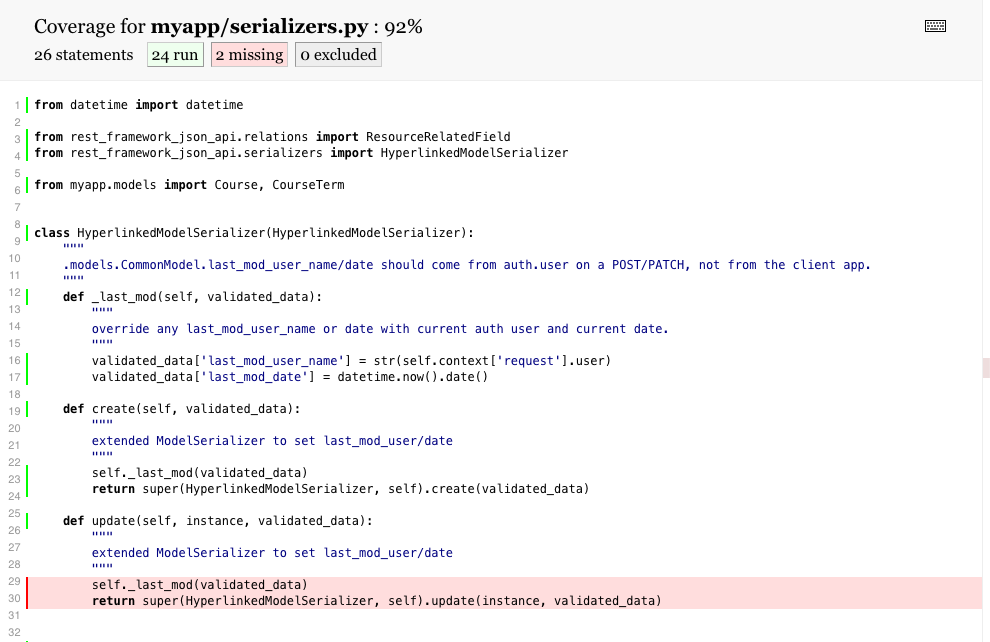

# Building our DJA project

## Quick Start

You can skip ahead and simply clone this project at https://github.com/columbia-it/django-jsonapi-training
with ssh:
```console
src$ git clone git@github.com:columbia-it/django-jsonapi-training.git
src$ cd django-jsonapi-training
```
or with https:
```console
src$ git clone https://github.com/columbia-it/django-jsonapi-training.git
src$ cd django-jsonapi-training
```

If you want to see how this project was built up over time, follow along below. Just be aware that
versions of Django, DOT, DJA, DRF, etc. have progressed from when this was initially written.

## Start a new project with a blank slate

*Development project teams generally have a starter template which avoids a lot of
these steps; they are provided here just as an illustration of what's happening.*

### Create initial project
```console
src$ mkdir django-jsonapi-training
src$ cd django-jsonapi-training
django-jsonapi-training$ git init
Initialized empty Git repository in /Users/alan/src/django-jsonapi-training/.git/
```

### Set up virtualenv
```console
django-jsonapi-training$ python3 -m venv venv
django-jsonapi-training$ source venv/bin/activate
```

### Install required packages

We are going to use a few Python packages for Django and various add-ons. This mostly-complete list of requirements
is here, but, in practice, you would build up this list over time as you develop your project.

- **Django** is the core Django framework. 
- **Django Debug Toolbar** adds an in-browser debugger for the Django UI.
- **Django REST Framework** (DRF) makes it easy to write RESTful APIs.
- **Django REST Framework JSON API** (DJA) extends DRF to use the
  {json:api} format.
- **Django OAuth Toolkit** (DOT) adds an [OAuth 2.0-based](oauth2.md) security layer.
- **Django CORS Middleware** is needed for OAuth
  [Cross-Origin Resource Sharing](https://en.wikipedia.org/wiki/Cross-origin_resource_sharing).
- **Django Filter** for filtering results using the {json:api} `filter` query parameter.
- **PyYAML** for YAML file utilities.
- **tox** for automated unit tests, etc.
- **tox-pip-extensions** makes tox work better with `pip`.

For the complete list of required packages and any version constraints, see `requirements.txt`.

Following is an example of "manually" adding the packages, one at a time, but you
would more likely use `pip install -r requirements.txt` as [shown below](#freeze-python-package-requirements).

```console
(venv) django-jsonapi-training$ pip install django
Collecting django
  Using cached https://files.pythonhosted.org/packages/32/ab/22530cc1b2114e6067eece94a333d6c749fa1c56a009f0721e51c181ea53/Django-2.1.2-py3-none-any.whl
Collecting pytz (from django)
  Using cached https://files.pythonhosted.org/packages/52/8b/876c5745f617630be90cfb8fafe363c6d7204b176dc707d1805d1e9a0a35/pytz-2018.6-py2.py3-none-any.whl
Installing collected packages: pytz, django
Successfully installed django-2.1.2 pytz-2018.6
You are using pip version 10.0.1, however version 18.1 is available.
You should consider upgrading via the 'pip install --upgrade pip' command.
(venv) django-jsonapi-training$ pip install --upgrade pip
Collecting pip
  Using cached https://files.pythonhosted.org/packages/c2/d7/90f34cb0d83a6c5631cf71dfe64cc1054598c843a92b400e55675cc2ac37/pip-18.1-py2.py3-none-any.whl
Installing collected packages: pip
  Found existing installation: pip 10.0.1
    Uninstalling pip-10.0.1:
      Successfully uninstalled pip-10.0.1
Successfully installed pip-18.1
(venv) django-jsonapi-training$ pip install django-debug-toolbar
Collecting django-debug-toolbar
  Downloading https://files.pythonhosted.org/packages/97/c6/523fc2ca98119d21c709bbc47217b1d5fd17c6f9449ef32490889363d97d/django_debug_toolbar-1.10.1-py2.py3-none-any.whl (207kB)
    100% |████████████████████████████████| 215kB 3.6MB/s 
Collecting sqlparse>=0.2.0 (from django-debug-toolbar)
  Downloading https://files.pythonhosted.org/packages/65/85/20bdd72f4537cf2c4d5d005368d502b2f464ede22982e724a82c86268eda/sqlparse-0.2.4-py2.py3-none-any.whl
Requirement already satisfied: Django>=1.11 in ./env/lib/python3.6/site-packages (from django-debug-toolbar) (2.1.2)
Requirement already satisfied: pytz in ./env/lib/python3.6/site-packages (from Django>=1.11->django-debug-toolbar) (2018.6)
Installing collected packages: sqlparse, django-debug-toolbar
Successfully installed django-debug-toolbar-1.10.1 sqlparse-0.2.4
(venv) django-jsonapi-training$ pip install djangorestframework
...
```

### Freeze Python package requirements

To make sure your code is working against a consistent known set of package versions, it's a good
idea to "pin" or "freeze" your installed package versions.  You will want to upgrade these from time to time though.
Next time you or someone else works on a clone of your project, all the preceding steps can be replaced by
`pip install -r requirements.txt`.

```console
(venv) django-jsonapi-training$ pip freeze >requirements.txt 
(venv) django-jsonapi-training$ cat requirements.txt 
certifi==2018.10.15
chardet==3.0.4
Django==2.1.2
django-cors-middleware==1.3.1
django-debug-toolbar==1.10.1
django-filter==2.0.0
django-oauth-toolkit==1.2.0
djangorestframework==3.9.0
djangorestframework-jsonapi==2.6.0
filelock==3.0.9
idna==2.7
inflection==0.3.1
oauthlib==2.1.0
pluggy==0.8.0
py==1.7.0
pytz==2018.6
PyYAML==3.13
requests==2.20.0
rest-condition==1.0.3
six==1.11.0
sqlparse==0.2.4
toml==0.10.0
tox==3.5.2
tox-pip-extensions==1.4.1
urllib3==1.24
virtualenv==16.0.0
```

See [below](#using-unreleased-packages) for an example of a more sophisticated `requirements.txt` that uses
specific version ranges and pre-released package versions to work around some bugs or use new features.

### Make sure git ignores irrelevant (non-source) files

We want to ignore our virtualenv directory, and various output files created by IDEs, editors, tox,
compiled python and so on.

```console
(venv) django-jsonapi-training$ cat >.gitignore
venv/
*.pyc
db.sqlite3
.idea/
.tox/
.coverage
htmlcov/
*~
*.egg-info/
```

### Do initial migration and superuser account setup

Now that all the prerequisite Python packages are installed we can
start:

1. Start a new Django project.
1. Start a new app within that project.
1. Perform initial database setup (migrations).
1. Create the Django superuser account.

```console
(venv) django-jsonapi-training$ django-admin startproject training .
(venv) django-jsonapi-training$ django-admin startapp myapp
(venv) django-jsonapi-training$ ./manage.py migrate
Operations to perform:
  Apply all migrations: admin, auth, contenttypes, sessions
Running migrations:
  Applying contenttypes.0001_initial... OK
  Applying auth.0001_initial... OK
  Applying admin.0001_initial... OK
  Applying admin.0002_logentry_remove_auto_add... OK
  Applying admin.0003_logentry_add_action_flag_choices... OK
  Applying contenttypes.0002_remove_content_type_name... OK
  Applying auth.0002_alter_permission_name_max_length... OK
  Applying auth.0003_alter_user_email_max_length... OK
  Applying auth.0004_alter_user_username_opts... OK
  Applying auth.0005_alter_user_last_login_null... OK
  Applying auth.0006_require_contenttypes_0002... OK
  Applying auth.0007_alter_validators_add_error_messages... OK
  Applying auth.0008_alter_user_username_max_length... OK
  Applying auth.0009_alter_user_last_name_max_length... OK
  Applying sessions.0001_initial... OK
(venv) django-jsonapi-training$ ./manage.py createsuperuser
Username (leave blank to use 'ac45'): admin
Email address: 
Password: admin123 
Password (again): admin123 
This password is too common.
Bypass password validation and create user anyway? [y/N]: y
Superuser created successfully.
```

### Initial git checkin
Let's look at what's been created. We'll ignore the `env` directory as that's where the virtualenv stuff
lives, including all the Python packages in `env/lib/python3.6/site-packages/`.

```console
(venv) django-jsonapi-training$ ls
db.sqlite3        env/              manage.py*        myapp/            requirements.txt  training/
(venv) django-jsonapi-training$ tree myapp training
myapp
├── __init__.py
├── admin.py
├── apps.py
├── migrations
│   └── __init__.py
├── models.py
├── tests.py
└── views.py
training
├── __init__.py
├── __pycache__
│   ├── __init__.cpython-36.pyc
│   ├── settings.cpython-36.pyc
│   └── urls.cpython-36.pyc
├── settings.py
├── urls.py
└── wsgi.py

2 directories, 14 files
(venv) django-jsonapi-training$ git status
On branch master

No commits yet

Untracked files:
  (use "git add <file>..." to include in what will be committed)

	.gitignore
	manage.py
	myapp/
	requirements.txt
	training/

nothing added to commit but untracked files present (use "git add" to track)
(venv) django-jsonapi-training$ git add .
(venv) django-jsonapi-training$ git status
On branch master

No commits yet

Changes to be committed:
  (use "git rm --cached <file>..." to unstage)

	new file:   .gitignore
	new file:   manage.py
	new file:   myapp/__init__.py
	new file:   myapp/admin.py
	new file:   myapp/apps.py
	new file:   myapp/migrations/__init__.py
	new file:   myapp/models.py
	new file:   myapp/tests.py
	new file:   myapp/views.py
	new file:   requirements.txt
	new file:   training/__init__.py
	new file:   training/settings.py
	new file:   training/urls.py
	new file:   training/wsgi.py

(venv) django-jsonapi-training$ git commit -m "initial project"
[master (root-commit) f6c154d] initial project
 14 files changed, 221 insertions(+)
 create mode 100644 .gitignore
 create mode 100755 manage.py
 create mode 100644 myapp/__init__.py
 create mode 100644 myapp/admin.py
 create mode 100644 myapp/apps.py
 create mode 100644 myapp/migrations/__init__.py
 create mode 100644 myapp/models.py
 create mode 100644 myapp/tests.py
 create mode 100644 myapp/views.py
 create mode 100644 requirements.txt
 create mode 100644 training/__init__.py
 create mode 100644 training/settings.py
 create mode 100644 training/urls.py
 create mode 100644 training/wsgi.py
(venv) django-jsonapi-training$ git log
commit f6c154d15771c01e3034a75024b308d0db36ae8d (HEAD -> master)
Author: Alan Crosswell <alan@columbia.edu>
Date:   Fri Oct 26 16:36:49 2018 -0400

    initial project

```

You can now use the above commit as a template to start future projects if you like.

Browse the source code for this project or clone it. Most of the code is reproduced below as well,
but is not completely up to date. Here's a summary of cloning, assuming you've already
setup your git SSH keys:

```console
src$ git clone git@github.com:columbia-it/django-jsonapi-training.git
src$ cd django-jsonapi-training
django-jsonapi-training$ git checkout initial
```

## Edit Settings to add DRF, DJA, OAuth, Debug, etc.

An initial version of `training/settings.py` is created by
`django-admin startproject` and `django-admin startapp`. It's full of comments suggesting changes. 

We will make the following additions to the default settings.py:

1. Weaken security (allowed hosts) for CORS.
2. Identify when to show the debug toolkit (internal IPs)
3. Add installed apps
4. Add middleware
5. Configure admin view permissions
6. Configure DRF and DJA
7. Configure DOT
8. Enable debug logging so we can see what's happening
9. Parametrize various credentials and options using environment variables
10. Configure an optional external Microsoft SQLServer database 

You can take a look at the latest version of `settings.py`. Following is the
diff between the initial boilerplate code and our edits.

```diff
diff --git a/training/settings.py b/training/settings.py
index 52940b5..a8dcdb6 100644
--- a/training/settings.py
+++ b/training/settings.py
@@ -11,22 +11,23 @@ https://docs.djangoproject.com/en/2.1/ref/settings/
 """
 
 import os
+from distutils.util import strtobool
 
 # Build paths inside the project like this: os.path.join(BASE_DIR, ...)
 BASE_DIR = os.path.dirname(os.path.dirname(os.path.abspath(__file__)))
 
-
 # Quick-start development settings - unsuitable for production
 # See https://docs.djangoproject.com/en/2.1/howto/deployment/checklist/
 
 # SECURITY WARNING: keep the secret key used in production secret!
-SECRET_KEY = 'qjsj20h)-^8418dp)jf)(v&+84jfv%!pc6&pm1lo(nxp-t7c$x'
+SECRET_KEY = os.environ.get('DJANGO_SECRET_KEY', 'c3pz+#@g%crl=bihc347a5)+l@cp==cs=d!3@p7*+_3!fd!yzu')
 
 # SECURITY WARNING: don't run with debug turned on in production!
-DEBUG = True
-
-ALLOWED_HOSTS = []
+DEBUG = strtobool(os.environ.get('DJANGO_DEBUG', 'true'))
+SQLSERVER = strtobool(os.environ.get('DJANGO_SQLSERVER', 'false'))
 
+ALLOWED_HOSTS = ['*']
+INTERNAL_IPS = ['127.0.0.1']
 
 # Application definition
 
@@ -37,6 +38,12 @@ INSTALLED_APPS = [
     'django.contrib.sessions',
     'django.contrib.messages',
     'django.contrib.staticfiles',
+    'rest_framework',
+    'debug_toolbar',
+    'corsheaders',
+    'oauth2_provider',
+    'django_filters',
+    'myapp',
 ]
 
 MIDDLEWARE = [
@@ -47,6 +54,8 @@ MIDDLEWARE = [
     'django.contrib.auth.middleware.AuthenticationMiddleware',
     'django.contrib.messages.middleware.MessageMiddleware',
     'django.middleware.clickjacking.XFrameOptionsMiddleware',
+    'debug_toolbar.middleware.DebugToolbarMiddleware',
+    'corsheaders.middleware.CorsMiddleware',
 ]
 
 ROOT_URLCONF = 'training.urls'
@@ -73,12 +82,33 @@ WSGI_APPLICATION = 'training.wsgi.application'
 # Database
 # https://docs.djangoproject.com/en/2.1/ref/settings/#databases
 
-DATABASES = {
-    'default': {
-        'ENGINE': 'django.db.backends.sqlite3',
-        'NAME': os.path.join(BASE_DIR, 'db.sqlite3'),
+if SQLSERVER:
+    # Use the following if testing with MS SQL:
+    DATABASES = {
+        'default': {
+            'ENGINE': 'sql_server.pyodbc',
+            'NAME': os.environ['DJANGO_SQLSERVER_DB'],
+            'USER': os.environ['DJANGO_SQLSERVER_USER'],
+            'PASSWORD': os.environ['DJANGO_SQLSERVER_PASS'],
+            'HOST': os.environ['DJANGO_SQLSERVER_HOST'],
+            'PORT': '1433',
+            'OPTIONS': {
+                'driver': 'ODBC Driver 17 for SQL Server',
+            },
+        },
     }
-}
+else:
+    DATABASES = {
+        'default': {
+            'ENGINE': 'django.db.backends.sqlite3',
+            'NAME': os.path.join(BASE_DIR, 'db.sqlite3'),
+            'OPTIONS': {
+                'timeout': 20,
+            }
+        }
+    }
+
 
 
 # Password validation
@@ -118,3 +148,94 @@ USE_TZ = True
 # https://docs.djangoproject.com/en/2.1/howto/static-files/
 
 STATIC_URL = '/static/'
+
+# DRF and DJA settings
+REST_FRAMEWORK = {
+    'PAGE_SIZE': 10,
+    'EXCEPTION_HANDLER': 'rest_framework_json_api.exceptions.exception_handler',
+    'DEFAULT_PAGINATION_CLASS': 'rest_framework_json_api.pagination.JsonApiPageNumberPagination',
+    # 'DEFAULT_PAGINATION_CLASS': 'rest_framework_json_api.pagination.JsonApiLimitOffsetPagination',
+    'DEFAULT_PARSER_CLASSES': (
+        'rest_framework_json_api.parsers.JSONParser',
+        'rest_framework.parsers.FormParser',
+        'rest_framework.parsers.MultiPartParser',
+    ),
+    'DEFAULT_RENDERER_CLASSES': (
+        'rest_framework_json_api.renderers.JSONRenderer',  # application/vnd.api+json
+        'rest_framework.renderers.BrowsableAPIRenderer',  # text/html: ?format=api
+    ),
+    'DEFAULT_FILTER_BACKENDS': (
+        'rest_framework_json_api.filters.QueryParameterValidationFilter',  # for query parameter validation
+        'rest_framework_json_api.filters.OrderingFilter',  # for sort
+        'rest_framework_json_api.django_filters.DjangoFilterBackend',    # for `filter[field]` filtering
+        'rest_framework.filters.SearchFilter',    # for keyword filtering across multiple fields
+    ),
+    'SEARCH_PARAM': 'filter[search]',
+    'DEFAULT_METADATA_CLASS': 'rest_framework_json_api.metadata.JSONAPIMetadata',
+    'TEST_REQUEST_DEFAULT_FORMAT': 'vnd.api+json',
+    'TEST_REQUEST_RENDERER_CLASSES': (
+        'rest_framework_json_api.renderers.JSONRenderer',
+    ),
+}
+
+JSON_API_FORMAT_TYPES = 'underscore'
+# JSON_API_FORMAT_FIELD_NAMES = 'camelize'
+JSON_API_PLURALIZE_TYPES = True
+
+# django-oauth-toolkit settings
+CORS_ORIGIN_ALLOW_ALL = True
+
+OAUTH2_PROVIDER = {
+    # here's where we add the external introspection endpoint:
+    'RESOURCE_SERVER_INTROSPECTION_URL': os.environ.get('OAUTH2_SERVER','https://oauth-test.cc.columbia.edu')
+                                            + '/as/introspect.oauth2',
+    'RESOURCE_SERVER_INTROSPECTION_CREDENTIALS': (
+        os.environ.get('RESOURCE_SERVER_ID','demo_resource_server'),
+        os.environ.get('RESOURCE_SERVER_SECRET','wL0pgS5RcNOgdOSSmejzZNA605d3MtkoXMVSDaJxmaTU70XnYQPOabBAYtfkWXay')
+    ),
+}
+
+# debug logging
+LOGGING = {
+    'version': 1,
+    'disable_existing_loggers': False,
+    'filters': {
+        'require_debug_true': {
+            '()': 'django.utils.log.RequireDebugTrue',
+        }
+    },
+    'formatters': {
+        'verbose': {
+            'format': '%(asctime)s %(message)s'
+        },
+        'simple': {
+            'format': '%(levelname)s %(message)s'
+        },
+    },
+    'handlers': {
+        'console': {
+            'level': 'DEBUG',
+            'filters': ['require_debug_true'],
+            'class': 'logging.StreamHandler',
+            'formatter': 'verbose'
+        }
+    },
+    'loggers': {
+        'django.db.backends': {
+            'level': 'DEBUG',
+            'handlers': ['console'],
+        },
+        'oauth2_provider': {
+            'level': 'DEBUG',
+            'handlers': ['console'],
+        },
+        'myapp': {
+            'level': 'INFO',
+            'handlers': ['console'],
+        },
+        'cuit_enterprise_scope_shim': {
+            'level': 'DEBUG',
+            'handlers': ['console'],
+        },
+    }
+}
```

## Define Models

Generally, you need to have an application architecture sketched out in advance. This includes a data model.
You can start by sketching your entity-relationship diagrams on a whiteboard or use a modeling tool to generate a
[UML](https://en.wikipedia.org/wiki/Unified_Modeling_Language)
diagram. Or, you can make Django models
and then pretend you designed them first using the `django-extensions` package. Your manager will never known;-)

```bash
./manage.py graph_models -g -S --disable-abstract-fields -E -o docs/media/initial-uml.png myapp
```

Here's our model with the CommonModel (which is "copied" by all models) off to the side to make things more readable:



`django-admin startapp` created a starter `myapp/models.py`. Now add some actual model definitions to it.

We're going to:

1. Make a `CommonModel` abstract class that adds some common fields that we want all our models to include.
   These are things like various dates, modifying users, etc. We also choose to make our `id` a UUID4
   as [recommended in the {json:api} spec](https://jsonapi.org/format/#crud-creating-client-ids).
2. Create a `Course` "parent" model and a `CourseTerm` "child model" that references each `Course` instance via
   a `ForeignKey`.
3. Each model has a default parameter to order by. These will come in handy when we get to pagination and want
   consistent paginated results. 

```python
import uuid

from django.db import models


class CommonModel(models.Model):
    """
    Abstract model with common fields for all "real" Models:
    - id: globally unique UUID version 4
    - effective dates
    - last modified dates
    """
    id = models.UUIDField(primary_key=True, default=uuid.uuid4, editable=False)
    effective_start_date = models.DateField(default=None, blank=True, null=True)
    effective_end_date = models.DateField(default=None, blank=True, null=True)
    last_mod_user_name = models.CharField(default=None, null=True, max_length=80)
    last_mod_date = models.DateField(auto_now=True)

    class Meta:
        abstract = True


class Course(CommonModel):
    """
    A course of instruction. e.g. COMSW1002 Computing in Context
    """
    school_bulletin_prefix_code = models.CharField(max_length=10)
    suffix_two = models.CharField(max_length=2)
    subject_area_code = models.CharField(max_length=10)
    course_number = models.CharField(max_length=10)
    course_identifier = models.CharField(max_length=10, unique=True)
    course_name = models.CharField(max_length=80)
    course_description = models.TextField()

    class Meta:
        ordering = ["course_number"]

    def __str__(self):
        return '%s,%s,%s,%s' % (
            self.id,
            self.course_number,
            self.course_identifier,
            self.course_name
        )


class CourseTerm(CommonModel):
    """
    A specific course term (year+semester) instance.
    e.g. 20183COMSW1002
    """
    term_identifier = models.TextField(max_length=10)
    audit_permitted_code = models.PositiveIntegerField(blank=True, default=0)
    exam_credit_flag = models.BooleanField(default=True)
    course = models.ForeignKey('myapp.Course', related_name='course_terms', on_delete=models.CASCADE, null=True,
                               default=None)

    class Meta:
        ordering = ["term_identifier"]

    def __str__(self):
        return '%s,%s,%s' % (self.id, self.term_identifier, self.course.course_identifier)
```

## Define Serializers

Serializers render the Models in the "wire" format, which is JSON, and specifically {json:api},
so we import our serializers from `rest_framework_json_api.serializers`.
We will:

1. Use a `HyperlinkedModelSerializer` which gives us the HATEOAS links.
2. For each Model, choose which model fields to serialize.
3. Define the `ResourceRelatedField` linkage between the models and the {json:api} representation.
   This is where the {json:api} `relationships` and `related` attributes get created.
4. Add `included_serializers` which are needed to serialize the `included` compound document data.

See `myapp/serializers.py` for the final code.

```python
from rest_framework_json_api.relations import ResourceRelatedField
from rest_framework_json_api.serializers import HyperlinkedModelSerializer

from myapp.models import Course, CourseTerm


class CourseSerializer(HyperlinkedModelSerializer):
    """
    (de-)serialize the Course.
    """
    class Meta:
        model = Course
        fields = (
            'url',
            'school_bulletin_prefix_code', 'suffix_two', 'subject_area_code',
            'course_number', 'course_identifier', 'course_name', 'course_description',
            'effective_start_date', 'effective_end_date',
            'last_mod_user_name', 'last_mod_date',
            'course_terms')

    course_terms = ResourceRelatedField(
        model=CourseTerm,
        many=True,
        read_only=False,
        allow_null=True,
        required=False,
        queryset=CourseTerm.objects.all(),
        self_link_view_name='course-relationships',
        related_link_view_name='course-related',
    )

    # {json:api} 'included' support (also used for `related_serializers` for DJA 2.6.0)
    included_serializers = {
        'course_terms': 'myapp.serializers.CourseTermSerializer',
    }
    # Uncomment this and the course_terms will be included by default,
    # otherwise '?include=course_terms' must be added to the URL.
    # class JSONAPIMeta:
    #    included_resources = ['course_terms']


class CourseTermSerializer(HyperlinkedModelSerializer):
    class Meta:
        model = CourseTerm
        fields = (
            'url',
            'term_identifier', 'audit_permitted_code',
            'exam_credit_flag',
            'effective_start_date', 'effective_end_date',
            'last_mod_user_name', 'last_mod_date',
            'course')

    course = ResourceRelatedField(
        model=Course,
        many=False,  # this breaks new 2.6.0 related support. Only works when True.
        read_only=False,
        allow_null=True,
        required=False,
        queryset=Course.objects.all(),
        self_link_view_name='course_term-relationships',
        related_link_view_name='course_term-related',
    )

    # {json:api} 'included' support
    included_serializers = {
        'course': 'myapp.serializers.CourseSerializer',
    }
```

Note the Django style of forward-referencing classes that have not yet been defined: In the `included_serializers`
you can either provide a reference to the serializer (e.g. `{'course': CourseSerializer}`) or a string containing
the full Python path name of the serializer (`{'course': 'myapp.serializers.CourseSerializer'}`). In a case like
the one shown here, where the first serializer references the second and vice-versa, there will always be one
that is referenced before being defined, so we consistently use the string reference style. (We also saw this
in `settings.py` for `INSTALLED_APPS` and so on.)

### Keep it DRY

I could have made life easier for myself by using `fields = "__all__""` which tells the ModelSerializer to
include all the fields of the model plus the additional fields defined in this class (and, for the
HyperlinkedModelSerializer, also the `url` field). Also, to keep things DRY (Don't Repeat Yourself) I've tried to
minimize repetive code:

```diff
diff --git a/myapp/serializers.py b/myapp/serializers.py
index 32604cb..beb962c 100644
--- a/myapp/serializers.py
+++ b/myapp/serializers.py
@@ -8,11 +8,24 @@ from myapp.models import Course, CourseTerm, Instructor, Person
 
 class HyperlinkedModelSerializer(HyperlinkedModelSerializer):
     """
+    Common serializer class for all model serializers.
     Extends :py:class:`.models.CommonModel` to set `last_mod_user_name` and `...date` from auth.user on a
     POST/PATCH, not from the client app.
+    This silently *ignores* anything CREATEd or PATCHed for these fields.
     """
-    #: these are read-only fields
-    read_only_fields = ('last_mod_user_name', 'last_mod_date')
+    class Meta:
+        """
+        In order for this Meta inner class to be inherited by the various serializers,
+        one must explicitly inherit it as in this example::
+
+            class MySerializer(HyperlinkedModelSerializer):
+                class Meta(HyperlinkedModelSerializer.Meta):
+                    model = MyModel
+        """
+        #: serialize all model fields unless otherwise overridden
+        fields = "__all__"
+        #: mark these fields as read-only
+        read_only_fields = ('last_mod_user_name', 'last_mod_date')
 
     def _last_mod(self, validated_data):
         """
@@ -40,18 +53,12 @@ class HyperlinkedModelSerializer(HyperlinkedModelSerializer):
 
 class CourseSerializer(HyperlinkedModelSerializer):
     """
-    (de-)serialize the Course.
+    (de-)serialize the Course model.
     """
-    class Meta:
+    class Meta(HyperlinkedModelSerializer.Meta):
         model = Course
-        fields = (
-            'url',
-            'school_bulletin_prefix_code', 'suffix_two', 'subject_area_code',
-            'course_number', 'course_identifier', 'course_name', 'course_description',
-            'effective_start_date', 'effective_end_date',
-            'last_mod_user_name', 'last_mod_date',
-            'course_terms')
 
+    #: a course has zero or more course_term instances
     course_terms = ResourceRelatedField(
         model=CourseTerm,
         many=True,
@@ -63,7 +70,8 @@ class CourseSerializer(HyperlinkedModelSerializer):
         related_link_view_name='course-related',
     )
 
-    #: json api 'included' support (also used for `related_serializers` for DJA 2.6.0)
+    #: `{json:api} compound document <https://jsonapi.org/format/#document-compound-documents>`_
+    #: (also used for `related_serializers` for DJA 2.6.0)
     included_serializers = {
         'course_terms': 'myapp.serializers.CourseTermSerializer',
     }
@@ -74,16 +82,13 @@ class CourseSerializer(HyperlinkedModelSerializer):
 
 
 class CourseTermSerializer(HyperlinkedModelSerializer):
-    class Meta:
+    """
+    (de-)serialize the CourseTerm model.
+    """
+    class Meta(HyperlinkedModelSerializer.Meta):
         model = CourseTerm
-        fields = (
-            'url',
-            'term_identifier', 'audit_permitted_code',
-            'exam_credit_flag',
-            'effective_start_date', 'effective_end_date',
-            'last_mod_user_name', 'last_mod_date',
-            'course', 'instructors')
 
+    #: a course_term has zero or one parent courses
     course = ResourceRelatedField(
         model=Course,
         many=False,
@@ -94,6 +99,7 @@ class CourseTermSerializer(HyperlinkedModelSerializer):
         self_link_view_name='course_term-relationships',
         related_link_view_name='course_term-related',
     )
+    #: a course_term can have many instructors
     instructors = ResourceRelatedField(
         model=Instructor,
         many=True,
@@ -105,7 +111,8 @@ class CourseTermSerializer(HyperlinkedModelSerializer):
         related_link_view_name='course_term-related',
     )
 
-    #: json api 'included' support
+    #: ``?include=course`` or ``?include=instructors``
+    #: `{json:api} compound document <https://jsonapi.org/format/#document-compound-documents>`_
     included_serializers = {
         'course': 'myapp.serializers.CourseSerializer',
         'instructors': 'myapp.serializers.InstructorSerializer',
@@ -113,10 +120,13 @@ class CourseTermSerializer(HyperlinkedModelSerializer):
 
 
 class PersonSerializer(HyperlinkedModelSerializer):
-    class Meta:
+    """
+    (de-)serialize the Person model.
+    """
+    class Meta(HyperlinkedModelSerializer.Meta):
         model = Person
-        fields = ('url', 'name', 'instructor')
 
+    #: a person is an instructor
     instructor = ResourceRelatedField(
         model=Instructor,
         many=False,
@@ -128,16 +138,21 @@ class PersonSerializer(HyperlinkedModelSerializer):
         related_link_view_name='person-related',
     )
 
+    #: `{json:api} compound document <https://jsonapi.org/format/#document-compound-documents>`_
     included_serializers = {
         'instructor': 'myapp.serializers.InstructorSerializer',
     }
 
 
 class InstructorSerializer(HyperlinkedModelSerializer):
-    class Meta:
+    """
+    (de-)serialize the Instructor model.
+    """
+    class Meta(HyperlinkedModelSerializer.Meta):
         model = Instructor
-        fields = ('person', 'course_terms', 'url')
+        fields = "__all__"
 
+    #: an instructor teaches zero or more course instances
     course_terms = ResourceRelatedField(
         model=CourseTerm,
         many=True,
@@ -149,6 +164,7 @@ class InstructorSerializer(HyperlinkedModelSerializer):
         related_link_view_name='instructor-related',
     )
 
+    #: an instructor is a person
     person = ResourceRelatedField(
         model=Person,
         many=False,
@@ -160,6 +176,7 @@ class InstructorSerializer(HyperlinkedModelSerializer):
         related_link_view_name='instructor-related'
     )
 
+    #: `{json:api} compound document <https://jsonapi.org/format/#document-compound-documents>`_
     included_serializers = {
         'course_terms': 'myapp.serializers.CourseTermSerializer',
         'person': 'myapp.serializers.PersonSerializer',

```


!!! Note
    I've followed a somewhat common pattern of extending a class using the same name as the
    base class (HyperlinkedModelSerialzer). This can be somewhat confusing at first glance but also
    makes it easy to add functionality without changing a lot of source code.

## Define URL routing and Views 

A view function is defined for each HTTP endpoint in the app. DRF uses Class-based views (CBV) in which
the ViewSet class has an `as_view()` function that returns a view function. The HTTP endpoints are
defined in the `urlpatterns` list in `urls.py` and reference the CBV's in `views.py`.

See `training/urls.py`.

Let's start with the URL routing:

1. Version our API by prepending `/v1` in front of our resources.
1. Redirect from `/` to `/v1` (the current version).
1. Use the DRF `DefaultRouter` to generate "the usual" URL routes to our ViewSets
  (`CourseViewSet` and `CourseTermViewSet`)
1. Because DJA doesn't have a `DefaultRouter`, we then have to explicitly add
   routes for each resource's `relationships` and `related` attributes.
   
We'll explain the `kwargs` that are set with `<arg>` in each `path()` when we get to the views.

```python
"""training URL Configuration

The `urlpatterns` list routes URLs to views. For more information please see:
    https://docs.djangoproject.com/en/2.1/topics/http/urls/
Examples:
Function views
    1. Add an import:  from my_app import views
    2. Add a URL to urlpatterns:  path('', views.home, name='home')
Class-based views
    1. Add an import:  from other_app.views import Home
    2. Add a URL to urlpatterns:  path('', Home.as_view(), name='home')
Including another URLconf
    1. Import the include() function: from django.urls import include, path
    2. Add a URL to urlpatterns:  path('blog/', include('blog.urls'))
"""

from django.conf import settings
from django.contrib import admin
from django.contrib.auth import views as auth_views
from django.contrib.staticfiles.urls import staticfiles_urlpatterns
from django.urls import include, path
from django.views.generic.base import RedirectView
from rest_framework import routers

from myapp import views

API_TITLE = 'Demo API'

admin.autodiscover()

router = routers.DefaultRouter()
router.register(r'courses', views.CourseViewSet)
router.register(r'course_terms', views.CourseTermViewSet)

urlpatterns = [
    path('', RedirectView.as_view(url='/v1', permanent=False)),
    path('v1/', include(router.urls)),
    # TODO: Is there a Router than can generate these for me? If not, create one.
    # course relationships:
    path('v1/courses/<pk>/relationships/<related_field>/',
        views.CourseRelationshipView.as_view(),
        name='course-relationships'),
    # use new `retrieve_related` functionality in DJA 2.6.0 which hangs all the related serializers off the parent.
    # (we only have one relationship in the current model so this doesn't really demonstrate the power).
    path('v1/courses/<pk>/<related_field>/',
        views.CourseViewSet.as_view({'get': 'retrieve_related'}),
        name='course-related'),
    # course_terms relationships
    path('v1/course_terms/<pk>/relationships/<related_field>/',
        views.CourseTermRelationshipView.as_view(),
        name='course_term-relationships'),
    # use new `retrieve_related` functionality in DJA 2.6.0:
    path('v1/course_terms/<pk>/<related_field>/',
        views.CourseTermViewSet.as_view({'get': 'retrieve_related'}), # a toOne relationship
        name='course_term-related'),
    # browseable API and admin stuff. TODO: Consider leaving out except when debugging.
    path('api-auth/', include('rest_framework.urls', namespace='rest_framework')),
    path('admin/', admin.site.urls),
    path('accounts/login/', auth_views.LoginView.as_view()),
    path('accounts/logout/', auth_views.LogoutView.as_view(), {'next_page': '/'}, name='logout'),
]

urlpatterns += staticfiles_urlpatterns()

if settings.DEBUG:
    import debug_toolbar
    urlpatterns = [
        path('__debug__/', include(debug_toolbar.urls)),
    ] + urlpatterns
```  

See `myapp/views.py` for the views.

The views is where a lot of the work happens regarding authentication and authorization. We're going
to start simple and leave all that out initially so we can focus on our ViewSets.

```python
from rest_framework_json_api.views import ModelViewSet, RelationshipView

from myapp.models import Course, CourseTerm
from myapp.serializers import CourseSerializer, CourseTermSerializer

class CourseViewSet(ModelViewSet):
    """                                                                                                                          
    API endpoint that allows course to be viewed or edited.                                                                      
    """
    queryset = Course.objects.all()
    serializer_class = CourseSerializer


class CourseTermViewSet(ModelViewSet):
    """                                                                                                                          
    API endpoint that allows CourseTerm to be viewed or edited.                                                                  
    """
    queryset = CourseTerm.objects.all()
    serializer_class = CourseTermSerializer


class CourseRelationshipView(RelationshipView):
    """                                                                                                                          
    view for relationships.course                                                                                                
    """
    queryset = Course.objects
    self_link_view_name = 'course-relationships'


class CourseTermRelationshipView(RelationshipView):
    """                                                                                                                          
    view for relationships.course_terms                                                                                          
    """
    queryset = CourseTerm.objects
    self_link_view_name = 'course_term-relationships'
```

## Migrate the newly-installed apps.

Now we'll make sure our database is in sync with the newly-defined app models and then apply migrations
that include those for Django core and various add-on packages as well as `myapp`.

(Because we've configured debug logging for the database in `settings.py`, 
let's override DEBUG for the time being to reduce the noise. 
Recall that the `DJANGO_DEBUG` environment variable is used to customize `settings.DEBUG`.)

```console
(venv) django-jsonapi-training$ export DJANGO_DEBUG=false
(venv) django-jsonapi-training$ ./manage.py makemigrations
Migrations for 'myapp':
  myapp/migrations/0001_initial.py
    - Create model Course
    - Create model CourseTerm
(venv) django-jsonapi-training$ ./manage.py migrate
Operations to perform:
  Apply all migrations: admin, auth, contenttypes, myapp, oauth2_provider, sessions
Running migrations:
  Applying contenttypes.0001_initial... OK
  Applying auth.0001_initial... OK
  Applying admin.0001_initial... OK
  Applying admin.0002_logentry_remove_auto_add... OK
  Applying admin.0003_logentry_add_action_flag_choices... OK
  Applying contenttypes.0002_remove_content_type_name... OK
  Applying auth.0002_alter_permission_name_max_length... OK
  Applying auth.0003_alter_user_email_max_length... OK
  Applying auth.0004_alter_user_username_opts... OK
  Applying auth.0005_alter_user_last_login_null... OK
  Applying auth.0006_require_contenttypes_0002... OK
  Applying auth.0007_alter_validators_add_error_messages... OK
  Applying auth.0008_alter_user_username_max_length... OK
  Applying auth.0009_alter_user_last_name_max_length... OK
  Applying myapp.0001_initial... OK
  Applying oauth2_provider.0001_initial... OK
  Applying oauth2_provider.0002_08_updates... OK
  Applying oauth2_provider.0003_auto_20160316_1503... OK
  Applying oauth2_provider.0004_auto_20160525_1623... OK
  Applying oauth2_provider.0005_auto_20170514_1141... OK
  Applying oauth2_provider.0006_auto_20171214_2232... OK
  Applying sessions.0001_initial... OK
```

Anytime things are feeling confusing, remove the sqlite3 database and re-migrate.
```console
(venv) django-training$ rm db.sqlite3
(venv) django-training$ /manage.py makemigrations
(venv) django-training$ /manage.py migrate
(venv) django-training$ /manage.py createsuperuser
```

## Add some test data

See `client/loader.py` which loads some data found at
[opendataservice.columbia.edu](http://opendataservice.columbia.edu/).

A small subset of this data is available in a
[test fixture](https://django-testing-docs.readthedocs.io/en/latest/fixtures.html) 
in `myapp/fixtures/testcases.yaml` which can be
conveniently loaded into the database as follows:
```console
(venv) django-jsonapi-training$ ./manage.py loaddata myapp/fixtures/testcases.yaml
Installed 28 object(s) from 1 fixture(s)
```

A much larger test dataset (best not used with sqlite3) is in
[myapp/fixtures/courseterm.yaml]({{view_uri}}/myapp/fixtures/courseterm.yaml)

## Run the server
Now let's run the server and see what happens.

```console
(venv) django-jsonapi-training$ ./manage.py runserver
Performing system checks...

System check identified no issues (0 silenced).
October 27, 2018 - 21:16:53
Django version 2.1.2, using settings 'training.settings'
Starting development server at http://127.0.0.1:8000/
Quit the server with CONTROL-C.
[27/Oct/2018 21:34:40] "GET /v1/courses/ HTTP/1.1" 200 8820
[27/Oct/2018 21:43:27] "GET /v1/courses/?page%5Bnumber%5D=2 HTTP/1.1" 200 8902
[27/Oct/2018 21:43:37] "GET /v1/courses/fb223036-ee99-496a-b3c3-34e0accc98a3/ HTTP/1.1" 200 875
[27/Oct/2018 21:45:40] "POST /v1/courses/ HTTP/1.1" 201 814
^C
```

## Experiment with Postman
Now do a few experiments with Postman, using it to simulate a client
application.



## Adding Authentication and Authorization

To make life easy, we started the example above with no 
[authentication](#authentication-authentication_classes) (identifying clients)
or [authorization](#authorization-permission_classes) (permission to GET, POST, PATCH, DELETE resources).
Let's add them in to `views.py`:

1. We'll use [OAuth 2.0](oauth2.md) to authenticate clients:
   - The client app can have a live person using it, using the Authorization Code grant type, or, 
   - it can be a program, using the Client Credentials grant.
   
   These are indicated by the use of a Columbia-specific OAuth 2.0 scope configuration:
   - `auth-columbia` indicates that a Shibboleth/CAS login is required.
   - `auth-none` indicates that there is no user login.
   
   OAuth 2.0 clients are (carefully) configured such that the above scopes are only grantable
   in the "right" cases. (e.g. `auth-none` scope is not generally available unless the client app is a trusted
   program that has properly secured its OAuth 2 client credentials.)
   
1. In addition to OAuth 2.0, to make life easy for testing and perhaps using the DRF Browseable API
   (which is *not* meant to be used for production clients), we'll add options for
   HTTP Basic Auth and Session cookies.
   
1. Additional OAuth 2.0 scopes are used to authorize those clients (CRUD: `create`, `read`, `update`, `delete`)
   as well as app-specific scopes such as `demo-netphone-admin`.
   _N.B. These are all Columbia-specific scope configurations._

1. As an **alternative** to OAuth 2.0 scopes for permissions, using DRF's bitwise operators, 
   we'll also take advantage of the Django authorization framework's
   [`DjangoModelPermissions`](https://www.django-rest-framework.org/api-guide/permissions/#djangomodelpermissions)
   for known users. The key thing we do here is disallow blanket GET by just anyone, which is the Django default.
   Again, for this sample app, DjangoModelPermissions don't apply; it's all about OAuth 2.0 scopes. A real app
   will likely do the `or`s and `and`s differently.
   
Lot's more can be done with Django's permission system such as adding object and/or field-level permissions.

!!! Note
    A lot of the permissions configuration has changed in the latest version(s) of the app, so some of
	the above may no longer work.

```diff
diff --git a/myapp/views.py b/myapp/views.py
index 3fbc325..57897c8 100644
--- a/myapp/views.py
+++ b/myapp/views.py
@@ -1,9 +1,79 @@
+from oauth2_provider.contrib.rest_framework import (OAuth2Authentication,
+                                                    TokenMatchesOASRequirements)
+from rest_framework.authentication import (BasicAuthentication,
+                                           SessionAuthentication)
+from rest_framework.permissions import DjangoModelPermissions, IsAuthenticated
 from rest_framework_json_api.views import ModelViewSet, RelationshipView
 
 from myapp.models import Course, CourseTerm
 from myapp.serializers import CourseSerializer, CourseTermSerializer
 
-class CourseViewSet(ModelViewSet):
+# TODO: simplify the following
+REQUIRED_SCOPES_ALTS = {
+    'GET': [['auth-columbia', 'read'], ['auth-none', 'read']],
+    'HEAD': [['read']],
+    'OPTIONS': [['read']],
+    'POST': [
+        ['auth-columbia', 'demo-djt-sla-bronze', 'create'],
+        ['auth-none', 'demo-djt-sla-bronze', 'create'],
+    ],
+    # 'PUT': [
+    #     ['auth-columbia', 'demo-djt-sla-bronze', 'update'],
+    #     ['auth-none', 'demo-djt-sla-bronze', 'update'],
+    # ],
+    'PATCH': [
+        ['auth-columbia', 'demo-djt-sla-bronze', 'update'],
+        ['auth-none', 'demo-djt-sla-bronze', 'update'],
+    ],
+    'DELETE': [
+        ['auth-columbia', 'demo-djt-sla-bronze', 'delete'],
+        ['auth-none', 'demo-djt-sla-bronze', 'delete'],
+    ],
+}
+
+
+class MyDjangoModelPermissions(DjangoModelPermissions):
+    """
+    Override DjangoModelPermissions to require view permission as well.
+    https://docs.djangoproject.com/en/dev/topics/auth/#permissions
+    """
+    perms_map = {
+        'GET': ['%(app_label)s.view_%(model_name)s'],
+        'OPTIONS': ['%(app_label)s.view_%(model_name)s'],
+        'HEAD': ['%(app_label)s.view_%(model_name)s'],
+        'POST': ['%(app_label)s.add_%(model_name)s'],
+        # PUT not allowed by JSON:API; use PATCH
+        # 'PUT': ['%(app_label)s.change_%(model_name)s'],
+        'PATCH': ['%(app_label)s.change_%(model_name)s'],
+        'DELETE': ['%(app_label)s.delete_%(model_name)s'],
+    }
+
+
+class AuthnAuthzSchemaMixIn(object):
+    """
+    Common Authn/Authz stuff for all View and ViewSet-derived classes:
+    - authentication_classes: in production: Oauth2 preferred; Basic and Session for testing purposes.
+    - permission_classes: either use Scope-based OAuth 2.0 token checking
+      OR authenticated user w/Model Permissions.
+    """
+    authentication_classes = (BasicAuthentication, SessionAuthentication, OAuth2Authentication, )
+    permission_classes = [TokenMatchesOASRequirements | (IsAuthenticated & MyDjangoModelPermissions)]
+    required_alternate_scopes = REQUIRED_SCOPES_ALTS
+
+
+class CourseBaseViewSet(AuthnAuthzSchemaMixIn, ModelViewSet):
+    """
+    Base ViewSet for all our ViewSets:
+    - Adds Authn/Authz
+    """
+    pass
+
+
+class CourseViewSet(CourseBaseViewSet):
     """
     API endpoint that allows course to be viewed or edited.
     """
@@ -11,7 +81,7 @@ class CourseViewSet(ModelViewSet):
     serializer_class = CourseSerializer
 
 
-class CourseTermViewSet(ModelViewSet):
+class CourseTermViewSet(CourseBaseViewSet):
     """
     API endpoint that allows CourseTerm to be viewed or edited.
     """
@@ -19,7 +89,7 @@ class CourseTermViewSet(ModelViewSet):
     serializer_class = CourseTermSerializer
 
 
-class CourseRelationshipView(RelationshipView):
+class CourseRelationshipView(AuthnAuthzSchemaMixIn, RelationshipView):
     """
     view for relationships.course
     """
@@ -27,7 +97,7 @@ class CourseRelationshipView(RelationshipView):
     self_link_view_name = 'course-relationships'
 
 
-class CourseTermRelationshipView(RelationshipView):
+class CourseTermRelationshipView(AuthnAuthzSchemaMixIn, RelationshipView):
     """
     view for relationships.course_terms
     """
```

Let's give these changes a try with Postman:



We get denied with a `401 Unauthorized`:
```json
{
    "errors": [
        {
            "detail": "Authentication credentials were not provided.",
            "source": {
                "pointer": "/data"
            },
            "status": "401"
        }
    ]
}
```

Since we're testing and Oauth 2.0 is pretty complicated, let's use Basic Auth with our
previously-added `admin` superuser:


 
!!! Note
    In the latest version of the app, only OAuth2 is configured; You can set up the [internal DOT OAuth2 server](using_dot.md)
	to to this. TODO: Fix the documentation to match!

## Pagination, Sorting and Sparse Fieldsets

For "free" out of the box with DJA are pagination, sorting and _sparse fieldsets_. For an example,
try this GET: 

[http://127.0.0.1:8000/v1/courses/?page[size]=3&page[number]=42&sort=-course_number&fields[courses]=course_number,course_name](http://127.0.0.1:8000/v1/courses/?page[size]=3&page[number]=42&sort=-course_number&fields[courses]=course_number,course_name)


The result should look like this:
```json
{
    "links": {
        "first": "http://127.0.0.1:8000/v1/courses/?fields%5Bcourses%5D=course_number%2Ccourse_name&page%5Bnumber%5D=1&page%5Bsize%5D=3&sort=-course_number",
        "last": "http://127.0.0.1:8000/v1/courses/?fields%5Bcourses%5D=course_number%2Ccourse_name&page%5Bnumber%5D=1491&page%5Bsize%5D=3&sort=-course_number",
        "next": "http://127.0.0.1:8000/v1/courses/?fields%5Bcourses%5D=course_number%2Ccourse_name&page%5Bnumber%5D=43&page%5Bsize%5D=3&sort=-course_number",
        "prev": "http://127.0.0.1:8000/v1/courses/?fields%5Bcourses%5D=course_number%2Ccourse_name&page%5Bnumber%5D=41&page%5Bsize%5D=3&sort=-course_number"
    },
    "data": [
        {
            "type": "courses",
            "id": "ad326e70-bc7f-4068-a67e-75e0ca6cbb50",
            "attributes": {
                "course_number": "93635",
                "course_name": "EVID & POLITICS OF HLTH POL"
            },
            "links": {
                "self": "http://127.0.0.1:8000/v1/courses/ad326e70-bc7f-4068-a67e-75e0ca6cbb50/"
            }
        },
        {
            "type": "courses",
            "id": "09f60887-8e2b-494d-8ff8-d83077488d0e",
            "attributes": {
                "course_number": "93634",
                "course_name": "PHILOSOPHY OF BIOETHICS"
            },
            "links": {
                "self": "http://127.0.0.1:8000/v1/courses/09f60887-8e2b-494d-8ff8-d83077488d0e/"
            }
        },
        {
            "type": "courses",
            "id": "a903c98a-bd4b-4da4-8470-3058b7dcc94d",
            "attributes": {
                "course_number": "93633",
                "course_name": "BASKETBALL ANALYTICS"
            },
            "links": {
                "self": "http://127.0.0.1:8000/v1/courses/a903c98a-bd4b-4da4-8470-3058b7dcc94d/"
            }
        }
    ],
    "meta": {
        "pagination": {
            "page": 42,
            "pages": 1491,
            "count": 4473
        }
    }
}
```

See `settings.py` for where the `REST_FRAMEWORK` default classes are configured.
You can also add these classes on a per-view basis using, for example, the `.pagination_class` attribute.
 
## Configure additional Filter Backends

As you may have noticed in `settings.py`, we've added several Filter Backends: 
- [`rest_framework_json_api.filters.QueryParameterValidationFilter`](https://django-rest-framework-json-api.readthedocs.io/en/stable/usage.html#queryparametervalidationfilter)
  makes sure only valid {json:api} query
  parameters are provided. If you leave this out, a client could misspell `sprt` and they'd wonder why
  the results were not properly sorted.

- [`rest_framework_json_api.filters.OrderingFilter`](https://django-rest-framework-json-api.readthedocs.io/en/stable/usage.html#orderingfilter)
  implements sorting.
- [`rest_framework_json_api.django_filters.DjangoFilterBackend`](https://django-rest-framework-json-api.readthedocs.io/en/stable/usage.html#djangofilterbackend)
  implements the `filter` query parameter and requires additional configuration to define what filters are allowed.
- [`rest_framework.filters.SearchFilter`](https://www.django-rest-framework.org/api-guide/filtering/#searchfilter)
  implements a keyword search across multiple fields.

Both the `DjangoFilterBackend` and `SearchFilter` require additional configuration before they'll work:

```diff
diff --git a/myapp/views.py b/myapp/views.py
index 57897c8..7d58129 100644
--- a/myapp/views.py
+++ b/myapp/views.py
@@ -79,6 +79,21 @@ class CourseViewSet(CourseBaseViewSet):
     """
     queryset = Course.objects.all()
     serializer_class = CourseSerializer
+    usual_rels = ('exact', 'lt', 'gt', 'gte', 'lte', 'in')
+    text_rels = ('icontains', 'iexact', 'contains')
+    # See https://docs.djangoproject.com/en/2.0/ref/models/querysets/#field-lookups for all the possible filters.
+    filterset_fields = {
+        'id': usual_rels,
+        'subject_area_code': usual_rels,
+        'course_name': ('exact', ) + text_rels,
+        'course_description': text_rels + usual_rels,
+        'course_identifier': text_rels + usual_rels,
+        'course_number': ('exact', ),
+        'course_terms__term_identifier': usual_rels,
+        'school_bulletin_prefix_code': ('exact', 'regex'),
+    }
+    search_fields = ('course_name', 'course_description', 'course_identifier',
+                     'course_number')
 
 
 class CourseTermViewSet(CourseBaseViewSet):
@@ -87,6 +102,14 @@ class CourseTermViewSet(CourseBaseViewSet):
     """
     queryset = CourseTerm.objects.all()
     serializer_class = CourseTermSerializer
+    usual_rels = ('exact', 'lt', 'gt', 'gte', 'lte')
+    filterset_fields = {
+        'id': usual_rels,
+        'term_identifier': usual_rels,
+        'audit_permitted_code': ['exact'],
+        'exam_credit_flag': ['exact'],
+    }
+    search_fields = ('term_identifier', )
``` 

### Configuring SearchFilter

The `search_fields` attribute is used by the `SearchFilter`. Try this GET:

[http://127.0.0.1:8000/v1/courses/?filter[search]=data analytics&fields[courses]=course_name,course_description](http://127.0.0.1:8000/v1/courses/?filter[search]=data analytics&fields[courses]=course_name,course_description)


Expect to see this result:
```json
{
    "links": {
        "first": "http://127.0.0.1:8000/v1/courses/?fields%5Bcourses%5D=course_name%2Ccourse_description&filter%5Bsearch%5D=data+analytics&page%5Bnumber%5D=1",
        "last": "http://127.0.0.1:8000/v1/courses/?fields%5Bcourses%5D=course_name%2Ccourse_description&filter%5Bsearch%5D=data+analytics&page%5Bnumber%5D=1",
        "next": null,
        "prev": null
    },
    "data": [
        {
            "type": "courses",
            "id": "0e3f05e6-ab39-4e4c-82d3-10ba329e4cdb",
            "attributes": {
                "course_name": "TOPICS-INFORMATION PROCESSING",
                "course_description": "TPC: ADV BIG DATA ANALYTICS"
            },
            "links": {
                "self": "http://127.0.0.1:8000/v1/courses/0e3f05e6-ab39-4e4c-82d3-10ba329e4cdb/"
            }
        },
        {
            "type": "courses",
            "id": "4fa73679-aeef-482d-97b2-fab1e9e92cae",
            "attributes": {
                "course_name": "IoT - SYS &PHY DATA ANALYTICS",
                "course_description": "IoT - SYS & PHY DATA ANALYSIS"
            },
            "links": {
                "self": "http://127.0.0.1:8000/v1/courses/4fa73679-aeef-482d-97b2-fab1e9e92cae/"
            }
        },
        {
            "type": "courses",
            "id": "4fd59f80-4359-4a94-a610-30284a0b5e55",
            "attributes": {
                "course_name": "DATA ANALYTICS/METRICS IN NONPROF SECTOR",
                "course_description": "DATA ANL/MTRC IN NONPROF"
            },
            "links": {
                "self": "http://127.0.0.1:8000/v1/courses/4fd59f80-4359-4a94-a610-30284a0b5e55/"
            }
        }
    ],
    "meta": {
        "pagination": {
            "page": 1,
            "pages": 1,
            "count": 3
        }
    }
}
```

### Configuring DjangoFilterBackend

In our example, we configure `filterset_fields` with a variety of relational operations. Note that
some of these perform related field path searches, for example: `course_terms__term_identifier`.
This is configured using the standard Django double-underscore notation but can also use {json:api} dotted
notation: `course_terms.term_identifier`.

Try this GET:

[http://127.0.0.1:8000/v1/courses/?page[size]=2&filter[course_terms.term_identifier.lt]=20182&include=course_terms&filter[search]=psych](http://127.0.0.1:8000/v1/courses/?page[size]=2&filter[course_terms.term_identifier.lt]=20182&include=course_terms&filter[search]=psych)

And expect this result:
```json
{
    "links": {
        "first": "http://127.0.0.1:8000/v1/courses/?filter%5Bcourse_terms.term_identifier.lt%5D=20182&filter%5Bsearch%5D=psych&include=course_terms&page%5Bnumber%5D=1&page%5Bsize%5D=2",
        "last": "http://127.0.0.1:8000/v1/courses/?filter%5Bcourse_terms.term_identifier.lt%5D=20182&filter%5Bsearch%5D=psych&include=course_terms&page%5Bnumber%5D=29&page%5Bsize%5D=2",
        "next": "http://127.0.0.1:8000/v1/courses/?filter%5Bcourse_terms.term_identifier.lt%5D=20182&filter%5Bsearch%5D=psych&include=course_terms&page%5Bnumber%5D=2&page%5Bsize%5D=2",
        "prev": null
    },
    "data": [
        {
            "type": "courses",
            "id": "e92164fc-4d87-4a27-867a-bd05c1a5d108",
            "attributes": {
                "school_bulletin_prefix_code": "XCEFK9",
                "suffix_two": "00",
                "subject_area_code": "PSYB",
                "course_number": "00241",
                "course_identifier": "PSYC1138X",
                "course_name": "SOCIAL PSYCHOLOGY-LEC",
                "course_description": "SOCIAL PSYCHOLOGY-LEC",
                "effective_start_date": null,
                "effective_end_date": null,
                "last_mod_user_name": "admin",
                "last_mod_date": "2018-10-07"
            },
            "relationships": {
                "course_terms": {
                    "meta": {
                        "count": 1
                    },
                    "data": [
                        {
                            "type": "course_terms",
                            "id": "70034667-3159-4f0d-9158-a7e256d37931"
                        }
                    ],
                    "links": {
                        "self": "http://127.0.0.1:8000/v1/courses/e92164fc-4d87-4a27-867a-bd05c1a5d108/relationships/course_terms/",
                        "related": "http://127.0.0.1:8000/v1/courses/e92164fc-4d87-4a27-867a-bd05c1a5d108/course_terms/"
                    }
                }
            },
            "links": {
                "self": "http://127.0.0.1:8000/v1/courses/e92164fc-4d87-4a27-867a-bd05c1a5d108/"
            }
        },
        {
            "type": "courses",
            "id": "3df00e8f-6fd2-4dcb-ab1b-c6480287944c",
            "attributes": {
                "school_bulletin_prefix_code": "XCEFK9",
                "suffix_two": "00",
                "subject_area_code": "PSYB",
                "course_number": "00721",
                "course_identifier": "PSYC3382X",
                "course_name": "ADOLESCENT PSYCHOLOGY",
                "course_description": "ADOLESCENT PSYCHOLOGY",
                "effective_start_date": null,
                "effective_end_date": null,
                "last_mod_user_name": "admin",
                "last_mod_date": "2018-10-07"
            },
            "relationships": {
                "course_terms": {
                    "meta": {
                        "count": 1
                    },
                    "data": [
                        {
                            "type": "course_terms",
                            "id": "3d45d0bb-2584-4be1-8682-58fbf6f4f779"
                        }
                    ],
                    "links": {
                        "self": "http://127.0.0.1:8000/v1/courses/3df00e8f-6fd2-4dcb-ab1b-c6480287944c/relationships/course_terms/",
                        "related": "http://127.0.0.1:8000/v1/courses/3df00e8f-6fd2-4dcb-ab1b-c6480287944c/course_terms/"
                    }
                }
            },
            "links": {
                "self": "http://127.0.0.1:8000/v1/courses/3df00e8f-6fd2-4dcb-ab1b-c6480287944c/"
            }
        }
    ],
    "included": [
        {
            "type": "course_terms",
            "id": "3d45d0bb-2584-4be1-8682-58fbf6f4f779",
            "attributes": {
                "term_identifier": "20181",
                "audit_permitted_code": 0,
                "exam_credit_flag": false,
                "effective_start_date": null,
                "effective_end_date": null,
                "last_mod_user_name": "admin",
                "last_mod_date": "2018-10-07"
            },
            "relationships": {
                "course": {
                    "links": {
                        "self": "http://127.0.0.1:8000/v1/course_terms/3d45d0bb-2584-4be1-8682-58fbf6f4f779/relationships/course/",
                        "related": "http://127.0.0.1:8000/v1/course_terms/3d45d0bb-2584-4be1-8682-58fbf6f4f779/course/"
                    },
                    "data": {
                        "type": "courses",
                        "id": "3df00e8f-6fd2-4dcb-ab1b-c6480287944c"
                    }
                }
            },
            "links": {
                "self": "http://127.0.0.1:8000/v1/course_terms/3d45d0bb-2584-4be1-8682-58fbf6f4f779/"
            }
        },
        {
            "type": "course_terms",
            "id": "70034667-3159-4f0d-9158-a7e256d37931",
            "attributes": {
                "term_identifier": "20181",
                "audit_permitted_code": 0,
                "exam_credit_flag": false,
                "effective_start_date": null,
                "effective_end_date": null,
                "last_mod_user_name": "admin",
                "last_mod_date": "2018-10-07"
            },
            "relationships": {
                "course": {
                    "links": {
                        "self": "http://127.0.0.1:8000/v1/course_terms/70034667-3159-4f0d-9158-a7e256d37931/relationships/course/",
                        "related": "http://127.0.0.1:8000/v1/course_terms/70034667-3159-4f0d-9158-a7e256d37931/course/"
                    },
                    "data": {
                        "type": "courses",
                        "id": "e92164fc-4d87-4a27-867a-bd05c1a5d108"
                    }
                }
            },
            "links": {
                "self": "http://127.0.0.1:8000/v1/course_terms/70034667-3159-4f0d-9158-a7e256d37931/"
            }
        }
    ],
    "meta": {
        "pagination": {
            "page": 1,
            "pages": 29,
            "count": 58
        }
    }
}
```

Try a few other permutations to convince yourself.

As the developer, you specify exactly which filters are available to your clients.

If a client requests a filter that is not defined, they'll see a `400 Bad Request` response like this:
```json
{
    "errors": [
        {
            "detail": "invalid filter[subject_area_code__neq]",
            "source": {
                "pointer": "/data"
            },
            "status": "400"
        }
    ]
}
```  

Note that some conditions are not easily represented, including NOT and empty string (as contrasted with `null`).
Hint: try a regex (`school_bulletin_prefix_code` not starting with "M"):

[http://127.0.0.1:8000/v1/courses/?page[size]=2&filter[search]=psych&filter[school_bulletin_prefix_code.regex]=[^M]](http://127.0.0.1:8000/v1/courses/?page[size]=2&filter[search]=psych&filter[school_bulletin_prefix_code.regex]=[^M])

Resulting in:
```json
{
    "links": {
        "first": "http://127.0.0.1:8000/v1/courses/?filter%5Bschool_bulletin_prefix_code.regex%5D=%5B%5EM%5D&filter%5Bsearch%5D=psych&page%5Bnumber%5D=1&page%5Bsize%5D=2",
        "last": "http://127.0.0.1:8000/v1/courses/?filter%5Bschool_bulletin_prefix_code.regex%5D=%5B%5EM%5D&filter%5Bsearch%5D=psych&page%5Bnumber%5D=24&page%5Bsize%5D=2",
        "next": "http://127.0.0.1:8000/v1/courses/?filter%5Bschool_bulletin_prefix_code.regex%5D=%5B%5EM%5D&filter%5Bsearch%5D=psych&page%5Bnumber%5D=2&page%5Bsize%5D=2",
        "prev": null
    },
    "data": [
        {
            "type": "courses",
            "id": "e92164fc-4d87-4a27-867a-bd05c1a5d108",
            "attributes": {
                "school_bulletin_prefix_code": "XCEFK9",
                "suffix_two": "00",
                "subject_area_code": "PSYB",
                "course_number": "00241",
                "course_identifier": "PSYC1138X",
                "course_name": "SOCIAL PSYCHOLOGY-LEC",
                "course_description": "SOCIAL PSYCHOLOGY-LEC",
                "effective_start_date": null,
                "effective_end_date": null,
                "last_mod_user_name": "admin",
                "last_mod_date": "2018-10-07"
            },
            "relationships": {
                "course_terms": {
                    "meta": {
                        "count": 1
                    },
                    "data": [
                        {
                            "type": "course_terms",
                            "id": "70034667-3159-4f0d-9158-a7e256d37931"
                        }
                    ],
                    "links": {
                        "self": "http://127.0.0.1:8000/v1/courses/e92164fc-4d87-4a27-867a-bd05c1a5d108/relationships/course_terms/",
                        "related": "http://127.0.0.1:8000/v1/courses/e92164fc-4d87-4a27-867a-bd05c1a5d108/course_terms/"
                    }
                }
            },
            "links": {
                "self": "http://127.0.0.1:8000/v1/courses/e92164fc-4d87-4a27-867a-bd05c1a5d108/"
            }
        },
        {
            "type": "courses",
            "id": "3df00e8f-6fd2-4dcb-ab1b-c6480287944c",
            "attributes": {
                "school_bulletin_prefix_code": "XCEFK9",
                "suffix_two": "00",
                "subject_area_code": "PSYB",
                "course_number": "00721",
                "course_identifier": "PSYC3382X",
                "course_name": "ADOLESCENT PSYCHOLOGY",
                "course_description": "ADOLESCENT PSYCHOLOGY",
                "effective_start_date": null,
                "effective_end_date": null,
                "last_mod_user_name": "admin",
                "last_mod_date": "2018-10-07"
            },
            "relationships": {
                "course_terms": {
                    "meta": {
                        "count": 1
                    },
                    "data": [
                        {
                            "type": "course_terms",
                            "id": "3d45d0bb-2584-4be1-8682-58fbf6f4f779"
                        }
                    ],
                    "links": {
                        "self": "http://127.0.0.1:8000/v1/courses/3df00e8f-6fd2-4dcb-ab1b-c6480287944c/relationships/course_terms/",
                        "related": "http://127.0.0.1:8000/v1/courses/3df00e8f-6fd2-4dcb-ab1b-c6480287944c/course_terms/"
                    }
                }
            },
            "links": {
                "self": "http://127.0.0.1:8000/v1/courses/3df00e8f-6fd2-4dcb-ab1b-c6480287944c/"
            }
        }
    ],
    "meta": {
        "pagination": {
            "page": 1,
            "pages": 24,
            "count": 48
        }
    }
}
```

## Advanced topic: Adding the `last_mod_user_name` to the Model

### via the Serializer

Say we want to prevent the client from updating who the `last_mod_user_name` was or when the `last_mod_date`
happened. This example _silently_ overrides the serializer `create` and `update` methods to use the authenticated
user and current date when updating the underlying Model. Let's mark those fields read-only as well.

```diff
diff --git a/myapp/serializers.py b/myapp/serializers.py
index 4075d9c..cabd404 100644
--- a/myapp/serializers.py
+++ b/myapp/serializers.py
@@ -6,6 +6,36 @@ from rest_framework_json_api.serializers import HyperlinkedModelSerializer
 from myapp.models import Course, CourseTerm
 
 
+class HyperlinkedModelSerializer(HyperlinkedModelSerializer):
+    """
+    .models.CommonModel.last_mod_user_name/date should come from auth.user on a POST/PATCH, not from the client app.
+    """
+    read_only_fields = ('last_mod_user_name', 'last_mod_date')
+
+    def _last_mod(self, validated_data):
+        """
+        override any last_mod_user_name or date with current auth user and current date.
+        """
+        # N.B. if OAuth2 Client Credentials is used, there is no user *and* the `client_id` is not
+        # currently properly tracked for an external AS: https://github.com/jazzband/django-oauth-toolkit/issues/664
+        validated_data['last_mod_user_name'] = str(self.context['request'].user)
+        validated_data['last_mod_date'] = datetime.now().date()
+
+    def create(self, validated_data):
+        """
+        extended ModelSerializer to set last_mod_user/date
+        """
+        self._last_mod(validated_data)
+        return super(HyperlinkedModelSerializer, self).create(validated_data)
+
+    def update(self, instance, validated_data):
+        """
+        extended ModelSerializer to set last_mod_user/date
+        """
+        self._last_mod(validated_data)
+        return super(HyperlinkedModelSerializer, self).update(instance, validated_data)
```

(hint: there's a mistake above. Can you find it?)

### via the Model

The serializer is probably **not** the right place for "business logic" in general as it allows Model
manipulation to bypass that logic. It should probably
[happen in the Model](https://sunscrapers.com/blog/where-to-put-business-logic-django/) as that
is the closest layer to the data and we want to always enforce the business rules.

The main reason the preceding code is implemented in the serializer is that the Model does not have the
current _request context_ directly available, so it is hard to identify who the `user` is. In fact, if the Model
is being manipulated by code that runs outside the context of an HTTP request, there is no user!  This is an argument
for leaving the user-specific code in the serializer.

If you need to do it in the Model, you'll want to use 
[thread local data](https://docs.python.org/3/library/threading.html#thread-local-data)
and grab the `request.user` in a [Django Middleware](https://docs.djangoproject.com/en/2.1/topics/http/middleware/)
function and store it in thread local storage so it can be retrieved in the Model manager. Also, take a look
at the [Django Signals](https://docs.djangoproject.com/en/2.1/ref/signals/#django.db.models.signals.pre_save)
documentation for some alternative ideas.

## Tests

### Always write unit tests

It's imperative that you add unit tests in parallel with (or even
before) developing your code.

The following two test suites first test the Models and then the Views.
Make sure to add some intentional errors and test for those cases as
well.

We're going to get rid of the starter `tests.py` that was created by `django-admin startapp` and
make a test suite module instead.

```console
(venv) django-jsonapi-training$ git rm myapp/tests.py 
rm 'myapp/tests.py'
(venv) django-jsonapi-training$ mkdir myapp/tests
(venv) django-jsonapi-training$ touch myapp/tests/__init__.py
``` 

### Test Models 

Let's start with the basics and make sure our Models make sense. Django has a nice testing framework that,
by default, makes a new in-memory sqlite database each time a test suite is run. This guarantees that the
test data is always in a known state.

See `myapp/tests/test_models.py`

We'll create a few `Course` and `CourseTerm` objects and do some trivial tests to make sure they work. 

```python
from datetime import date, datetime

from django.db.utils import IntegrityError
from django.test import TestCase

from myapp.models import Course, CourseTerm


class CourseTestCase(TestCase):

    def setUp(self):
        c1 = Course.objects.create(
            school_bulletin_prefix_code='123',
            suffix_two='11',
            subject_area_code='A101',
            course_number='123',
            course_identifier='ABC123',
            course_name='Corp. Finance',
            course_description='bla bla bla 123',
            last_mod_user_name='Fred Gary')
        c1.save()

        c2 = Course.objects.create(
            school_bulletin_prefix_code='888',
            suffix_two='22',
            subject_area_code='A102',
            course_number='456',
            course_identifier='XYZ321',
            course_name='Data Science III',
            course_description='bla bla bla 456',
            last_mod_user_name='Tom Smith')
        c2.save()

        CourseTerm.objects.create(
            term_identifier='term_id_1',
            audit_permitted_code=123,
            exam_credit_flag=True,
            last_mod_user_name='Fred Gary',
            effective_start_date=datetime.now(),
            effective_end_date=date(2019, 1, 31),
            course=c1
        ).save()

        CourseTerm.objects.create(
            term_identifier='term_id_2',
            audit_permitted_code=222,
            exam_credit_flag=False,
            last_mod_user_name='Tom Frank',
            effective_start_date=datetime.now(),
            effective_end_date=date(2019, 2, 28),
            course=c1
        ).save()

        CourseTerm.objects.create(
            term_identifier='term_id_21',
            audit_permitted_code=321,
            exam_credit_flag=True,
            last_mod_user_name='Fred Gary',
            effective_start_date=datetime.now(),
            effective_end_date=date(2020, 1, 31),
            course=c2
        ).save()

        CourseTerm.objects.create(
            term_identifier='term_id_22',
            audit_permitted_code=422,
            exam_credit_flag=False,
            last_mod_user_name='Tom Frank',
            last_mod_date=datetime.now(),
            effective_start_date=datetime.now(),
            effective_end_date=date(2020, 12, 28),
            course=c2
        ).save()

    def test_str(self):
        courses = Course.objects.all()
        c = courses.get(course_identifier='ABC123')
        self.assertEquals(c.course_identifier, 'ABC123')

    def test_date(self):
        courses = Course.objects.all()
        c = courses.get(course_identifier='ABC123')
        self.assertEquals(c.last_mod_date, date.today())

    def test_num(self):
        cs = Course.objects.all()
        self.assertEquals(2, cs.count())

        terms = CourseTerm.objects.all()
        self.assertEquals(4, terms.count())

        # field look up
        ts = CourseTerm.objects.filter(course__course_identifier='123ABC')
        self.assertEquals(0, ts.count())

        ts = CourseTerm.objects.filter(course__course_identifier='ABC123')
        self.assertEquals(2, ts.count())

        ts = CourseTerm.objects.filter(last_mod_user_name__startswith='Tom')
        self.assertEquals(2, ts.count())

        cs = Course.objects.filter(course_terms__last_mod_user_name__startswith='Tom')
        self.assertEquals(2, cs.count())

    def test_dup_fail(self):
        c1 = Course.objects.create(
            school_bulletin_prefix_code='123',
            suffix_two='11',
            subject_area_code='A101',
            course_number='123',
            course_identifier='ABC123',
            course_name='Corp. Finance',
            course_description='bla bla bla 123',
            last_mod_user_name='Fred Gary')
        c1.save()
```

Let's run those tests:

```console
(venv) django-jsonapi-training$ ./manage.py test
Creating test database for alias 'default'...
System check identified no issues (0 silenced).
.E..
======================================================================
ERROR: test_dup_fail (myapp.tests.test_models.CourseTestCase)
----------------------------------------------------------------------
Traceback (most recent call last):
  File "/Users/alan/src/django-jsonapi-training/env/lib/python3.6/site-packages/django/db/backends/utils.py", line 85, in _execute
    return self.cursor.execute(sql, params)
  File "/Users/alan/src/django-jsonapi-training/env/lib/python3.6/site-packages/django/db/backends/sqlite3/base.py", line 296, in execute
    return Database.Cursor.execute(self, query, params)
sqlite3.IntegrityError: UNIQUE constraint failed: myapp_course.course_identifier

The above exception was the direct cause of the following exception:

Traceback (most recent call last):
  File "/Users/alan/src/django-jsonapi-training/myapp/tests/test_models.py", line 114, in test_dup_fail
    last_mod_user_name='Fred Gary')
  File "/Users/alan/src/django-jsonapi-training/env/lib/python3.6/site-packages/django/db/models/manager.py", line 82, in manager_method
    return getattr(self.get_queryset(), name)(*args, **kwargs)
  File "/Users/alan/src/django-jsonapi-training/env/lib/python3.6/site-packages/django/db/models/query.py", line 413, in create
    obj.save(force_insert=True, using=self.db)
  File "/Users/alan/src/django-jsonapi-training/env/lib/python3.6/site-packages/django/db/models/base.py", line 718, in save
    force_update=force_update, update_fields=update_fields)
  File "/Users/alan/src/django-jsonapi-training/env/lib/python3.6/site-packages/django/db/models/base.py", line 748, in save_base
    updated = self._save_table(raw, cls, force_insert, force_update, using, update_fields)
  File "/Users/alan/src/django-jsonapi-training/env/lib/python3.6/site-packages/django/db/models/base.py", line 831, in _save_table
    result = self._do_insert(cls._base_manager, using, fields, update_pk, raw)
  File "/Users/alan/src/django-jsonapi-training/env/lib/python3.6/site-packages/django/db/models/base.py", line 869, in _do_insert
    using=using, raw=raw)
  File "/Users/alan/src/django-jsonapi-training/env/lib/python3.6/site-packages/django/db/models/manager.py", line 82, in manager_method
    return getattr(self.get_queryset(), name)(*args, **kwargs)
  File "/Users/alan/src/django-jsonapi-training/env/lib/python3.6/site-packages/django/db/models/query.py", line 1136, in _insert
    return query.get_compiler(using=using).execute_sql(return_id)
  File "/Users/alan/src/django-jsonapi-training/env/lib/python3.6/site-packages/django/db/models/sql/compiler.py", line 1289, in execute_sql
    cursor.execute(sql, params)
  File "/Users/alan/src/django-jsonapi-training/env/lib/python3.6/site-packages/django/db/backends/utils.py", line 68, in execute
    return self._execute_with_wrappers(sql, params, many=False, executor=self._execute)
  File "/Users/alan/src/django-jsonapi-training/env/lib/python3.6/site-packages/django/db/backends/utils.py", line 77, in _execute_with_wrappers
    return executor(sql, params, many, context)
  File "/Users/alan/src/django-jsonapi-training/env/lib/python3.6/site-packages/django/db/backends/utils.py", line 85, in _execute
    return self.cursor.execute(sql, params)
  File "/Users/alan/src/django-jsonapi-training/env/lib/python3.6/site-packages/django/db/utils.py", line 89, in __exit__
    raise dj_exc_value.with_traceback(traceback) from exc_value
  File "/Users/alan/src/django-jsonapi-training/env/lib/python3.6/site-packages/django/db/backends/utils.py", line 85, in _execute
    return self.cursor.execute(sql, params)
  File "/Users/alan/src/django-jsonapi-training/env/lib/python3.6/site-packages/django/db/backends/sqlite3/base.py", line 296, in execute
    return Database.Cursor.execute(self, query, params)
django.db.utils.IntegrityError: UNIQUE constraint failed: myapp_course.course_identifier

----------------------------------------------------------------------
Ran 4 tests in 0.025s

FAILED (errors=1)
Destroying test database for alias 'default'...
```

It's always good to write some negative tests to make sure expected errors actually occur. In
`test_dup_fail()` we see that it failed on a uniqueness constraint, which is an expected error. So let's update
the test code to check for the error:

```python
    def test_dup_fail(self):
        with self.assertRaises(IntegrityError):
            c1 = Course.objects.create(
                school_bulletin_prefix_code='123',
                suffix_two='11',
                subject_area_code='A101',
                course_number='123',
                course_identifier='ABC123',
                course_name='Corp. Finance',
                course_description='bla bla bla 123',
                last_mod_user_name='Fred Gary')
            c1.save()
```

```console
(venv) django-jsonapi-training$ ./manage.py test
Creating test database for alias 'default'...
System check identified no issues (0 silenced).
....
----------------------------------------------------------------------
Ran 4 tests in 0.021s

OK
Destroying test database for alias 'default'...
```

### Trying things out with the Django Shell

One of the cool things about Python is you can drop into the Python shell and interactively try
things:

```console
(venv) django-jsonapi-training$ python
Python 3.6.6 (default, Jul 27 2018, 14:31:43) 
[GCC 4.2.1 Compatible Apple LLVM 9.1.0 (clang-902.0.39.2)] on darwin
Type "help", "copyright", "credits" or "license" for more information.
>>> a=[1,2,3]
>>> a
[1, 2, 3]
>>> a[2:]
[3]
>>> a[1:]
[2, 3]
>>> a[-1]
3
>>> ^D
```

You can use the Django shell to do the same, making sure all the "stuff" configured in `settings.py`
is properly loaded:

```console
(venv) django-jsonapi-training$ ./manage.py shell
Python 3.6.6 (default, Jul 27 2018, 14:31:43) 
[GCC 4.2.1 Compatible Apple LLVM 9.1.0 (clang-902.0.39.2)] on darwin
Type "help", "copyright", "credits" or "license" for more information.
(InteractiveConsole)
>>> from myapp.models import Course
>>> cs = Course.objects.all()
>>> cs[1]
<Course: e92164fc-4d87-4a27-867a-bd05c1a5d108,00241,PSYC1138X,SOCIAL PSYCHOLOGY-LEC>
>>> cs[1].subject_area_code
'PSYB'
>>> dir(cs[1])
['DoesNotExist', 'Meta', 'MultipleObjectsReturned', '__class__', '__delattr__', '__dict__', '__dir__', '__doc__', '__eq__', '__format__', '__ge__', '__getattribute__', '__getstate__', '__gt__', '__hash__', '__init__', '__init_subclass__', '__le__', '__lt__', '__module__', '__ne__', '__new__', '__reduce__', '__reduce_ex__', '__repr__', '__setattr__', '__setstate__', '__sizeof__', '__str__', '__subclasshook__', '__weakref__', '_check_column_name_clashes', '_check_field_name_clashes', '_check_fields', '_check_id_field', '_check_index_together', '_check_indexes', '_check_local_fields', '_check_long_column_names', '_check_m2m_through_same_relationship', '_check_managers', '_check_model', '_check_model_name_db_lookup_clashes', '_check_ordering', '_check_property_name_related_field_accessor_clashes', '_check_single_primary_key', '_check_swappable', '_check_unique_together', '_do_insert', '_do_update', '_get_FIELD_display', '_get_next_or_previous_by_FIELD', '_get_next_or_previous_in_order', '_get_pk_val', '_get_unique_checks', '_meta', '_perform_date_checks', '_perform_unique_checks', '_save_parents', '_save_table', '_set_pk_val', '_state', 'check', 'clean', 'clean_fields', 'course_description', 'course_identifier', 'course_name', 'course_number', 'course_terms', 'date_error_message', 'delete', 'effective_end_date', 'effective_start_date', 'from_db', 'full_clean', 'get_deferred_fields', 'get_next_by_last_mod_date', 'get_previous_by_last_mod_date', 'id', 'last_mod_date', 'last_mod_user_name', 'objects', 'pk', 'prepare_database_save', 'refresh_from_db', 'save', 'save_base', 'school_bulletin_prefix_code', 'serializable_value', 'subject_area_code', 'suffix_two', 'unique_error_message', 'validate_unique']
>>> 
```

### Developing tests in PyCharm.

[PyCharm](https://www.jetbrains.com/PyCharm/) is an IDE for Python. There are both licensed and 
community editions. I'm using the licensed edition
which has some Django-specific support, but even PyCharm CE can be used to develop and debug. 

(If you are an
old-school CLI purist, I guess you could always use `python -m pdb ./manage.py shell`;-)

#### Set up Run/Debug Configurations for Tests

Here's an example of confguring a PyCharm test. This will run all the tests under PyCharm -- equivalent
to `./manage.py test`. We will:

1. Configure run/debug test.
2. Set a breakpoint on line 87 of `test_models.py` and start the debugger.
4. Take a look at values and/or use the expression evaluator to evaluate any expression in the current context.







I find this a really powerful way to develop new tests as I can have a look at a result
before writing the test assertion code.

#### Set up Run/Debug Configurations for the Project 

You can also set up the equivalent of `./manage.py runserver` which I've found is very
handy for settting various environment variables. For example, I have both a sqlite3 and a sqlserver
"flavor" for running this project.




### Check for Python Warnings

An especially useful enviroment variable to set from time-to-time (either in PyCharm or
in the shell) is:
`PYTHONWARNINGS=default` since the _default_ value for
[PYTHONWARNINGS](https://docs.python.org/3/using/cmdline.html#envvar-PYTHONWARNINGS) is `ignore`.

This helps find all those deprecation warnings that are otherwise not displayed:

```console
Testing started at 3:20 PM ...
/Users/alan/src/django-training/env/bin/python /Applications/PyCharm.app/Contents/helpers/PyCharm/django_test_manage.py test /Users/alan/src/django-training
/Users/ac45/.pyenv/versions/3.6.6/lib/python3.6/importlib/_bootstrap_external.py:426: ImportWarning: Not importing directory /Users/alan/src/django-training/env/lib/python3.6/site-packages/aspy: missing __init__
  _warnings.warn(msg.format(portions[0]), ImportWarning)
Creating test database for alias 'default'...
System check identified no issues (0 silenced).

/Users/alan/src/django-training/myapp/tests/test_models.py:83: DeprecationWarning: Please use assertEqual instead.
  self.assertEquals(c.last_mod_date, date.today())
/Users/alan/src/django-training/myapp/tests/test_models.py:87: DeprecationWarning: Please use assertEqual instead.
  self.assertEquals(2, cs.count())
/Users/alan/src/django-training/myapp/tests/test_models.py:90: DeprecationWarning: Please use assertEqual instead.
  self.assertEquals(4, terms.count())
/Users/alan/src/django-training/myapp/tests/test_models.py:94: DeprecationWarning: Please use assertEqual instead.
  self.assertEquals(0, ts.count())
/Users/alan/src/django-training/myapp/tests/test_models.py:97: DeprecationWarning: Please use assertEqual instead.
  self.assertEquals(2, ts.count())
/Users/alan/src/django-training/myapp/tests/test_models.py:100: DeprecationWarning: Please use assertEqual instead.
  self.assertEquals(2, ts.count())
/Users/alan/src/django-training/myapp/tests/test_models.py:103: DeprecationWarning: Please use assertEqual instead.
  self.assertEquals(2, cs.count())
/Users/alan/src/django-training/myapp/tests/test_models.py:78: DeprecationWarning: Please use assertEqual instead.
  self.assertEquals(c.course_identifier, 'ABC123')

test_patch_primary_rel not yet implemented

test_patch_rel not yet implemented
Destroying test database for alias 'default'...

Process finished with exit code 0
```

### Additional testing tips

This project has a much more complex set of test cases in
[`test_views.py`]({{view_uri}}/myapp/test_views.py).
 
A few things that happen here are:

1. Use `fixtures` for the test case data. Unlike the prior example where we explicitly did a bunch
   of `Course.objects.create()` calls to create the test data, we instead load the data from a fixture.
2. Create a bunch of test users with various permissions (in preparation for doing some permission testing). 

```python
Class DJATestCase(APITestCase):
    """
    test cases using Django REST Framework drf-json-api (DJA)
    """
    fixtures = ('testcases',)

    def setUp(self):
        # define some users
        self.superuser = User.objects.create_user('tester', is_superuser=True)
        # `somebody` can view course but not anything else
        self.someuser = User.objects.create_user('somebody', is_superuser=False)
        self.someuser.user_permissions.add(Permission.objects.get(codename='view_course').id)
        # `nobody` has no permissions
        self.noneuser = User.objects.create_user('nobody', is_superuser=False)
        # most tests just use the superuser
        self.client.force_authenticate(user=self.superuser)
        self.courses = Course.objects.all()
        self.courses_url = reverse('course-list')
        self.course_terms = CourseTerm.objects.all()
        self.course_terms_url = reverse('courseterm-list')

    # ...
```

At this point, two of the tests are skipped and labeled as such with `@unittest.skip` to remind me to write them.
Also, one test fails, exercising a bug in the current DJA 2.6.0 release. We'll get to how to deal with that
[later](#using-unreleased-packages). 

## Use Tox to automate testing

### The `tox.ini`
Add a `tox.ini`
to automate testing for coding style standards as well as running the tests
you wrote:

1. run [`flake8`](http://flake8.pycqa.org/en/latest/) for Python [(PEP-8)](https://www.python.org/dev/peps/pep-0008/)
   style compliance.
1. run [`isort`](https://isort.readthedocs.io) to sort imports.
1. run `./manage.py check` to make sure all the Django stuff is correct.
1. run [`bandit`](https://bandit.readthedocs.io) to check for common static security vulernabilities.
1. run [`safety`](https://pyup.io/safety/) to check that there are no problems
   with the pinned requirements versions. 
1. wrap `./manage.py test` in a test [coverage](https://coverage.readthedocs.io) report.  

```ini
[tox]
envlist =
    py36
tox_pip_extensions_ext_venv_update = True

[testenv]
deps =
    -rrequirements.txt
    flake8
    coverage
    isort
    bandit
    safety
setenv =
    DJANGO_SETTINGS_MODULE = training.settings
commands =
    flake8 --exclude **/migrations myapp
    isort -vb -df -c --recursive --skip migrations myapp
    python manage.py check
    bandit --recursive myapp
    safety check --full-report
    coverage erase
    coverage run --source='{toxinidir}/myapp' manage.py test
    coverage html

[testenv:devenv]
envdir = env
basepython = python3.6
usedevelop = True
deps =
    -rrequirements.txt
commands =
    /usr/bin/printf '\n\033[0;31m  dont forget to source env/bin/activate\033[0m\n'

[flake8]
max-line-length = 120
exclude = docs/, myapp/migrations/, .tox/, env/
application-import-names = myapp
builtins = __class__

[isort]
known_first_party = myapp
```

Note that I've included running `bandit` and `safety` as part of the default tox test environment, so that
they always get run with `tox`. Some developers prefer to only run these via, e.g. `tox -e bandit`
(with a `[testenv:bandit]` section in the tox.ini). It really
depends on how long they take to run. For this tiny demonstration app, they make little difference and it's
best to always check this stuff.

Before we can use `tox`, a couple other things are needed:
- [`setup.py`]({{view_uri}}/setup.py) because `tox` requires it.
- [`README.md`]({{view_uri}}/README.md) because our `setup.py` references it.

### Run `tox`

```console
(venv) django-jsonapi-training$ tox
GLOB sdist-make: /Users/alan/src/django-jsonapi-training/setup.py
py36 create: /Users/alan/src/django-jsonapi-training/.tox/py36
py36 bootstrap: venv-update>=2.1.3
py36 installdeps: -rrequirements.txt,flake8,coverage,isort
py36 inst: /Users/alan/src/django-jsonapi-training/.tox/.tmp/package/1/myapp-0.1.0.zip
py36 installed: You are using pip version 18.0, however version 18.1 is available.,You should consider upgrading via the 'pip install --upgrade pip' command.,certifi==2018.10.15,chardet==3.0.4,coverage==4.5.1,Django==2.1.2,django-admin==1.3.2,django-cors-middleware==1.3.1,django-debug-toolbar==1.10.1,django-excel-response2==2.0.8,django-filter==2.0.0,django-oauth-toolkit==1.2.0,django-six==1.0.4,djangorestframework==3.9.0,djangorestframework-jsonapi==2.6.0,filelock==3.0.9,flake8==3.6.0,idna==2.7,inflection==0.3.1,isort==4.3.4,mccabe==0.6.1,myapp==0.1.0,oauthlib==2.1.0,pluggy==0.8.0,py==1.7.0,pycodestyle==2.4.0,pyflakes==2.0.0,pytz==2018.6,PyYAML==3.13,requests==2.20.0,rest-condition==1.0.3,screen==1.0.1,six==1.11.0,sqlparse==0.2.4,toml==0.10.0,tox==3.5.2,tox-pip-extensions==1.4.1,urllib3==1.24,venv-update==3.1.1,virtualenv==16.0.0,xlwt==1.3.0
py36 bootstrap: venv-update>=2.1.3
py36 installdeps: -rrequirements.txt,flake8,coverage,isort
py36 installed: You are using pip version 18.0, however version 18.1 is available.,You should consider upgrading via the 'pip install --upgrade pip' command.,certifi==2018.10.15,chardet==3.0.4,coverage==4.5.1,Django==2.1.2,django-admin==1.3.2,django-cors-middleware==1.3.1,django-debug-toolbar==1.10.1,django-excel-response2==2.0.8,django-filter==2.0.0,django-oauth-toolkit==1.2.0,django-six==1.0.4,djangorestframework==3.9.0,djangorestframework-jsonapi==2.6.0,filelock==3.0.9,flake8==3.6.0,idna==2.7,inflection==0.3.1,isort==4.3.4,mccabe==0.6.1,myapp==0.1.0,oauthlib==2.1.0,pluggy==0.8.0,py==1.7.0,pycodestyle==2.4.0,pyflakes==2.0.0,pytz==2018.6,PyYAML==3.13,requests==2.20.0,rest-condition==1.0.3,screen==1.0.1,six==1.11.0,sqlparse==0.2.4,toml==0.10.0,tox==3.5.2,tox-pip-extensions==1.4.1,urllib3==1.24,venv-update==3.1.1,virtualenv==16.0.0,xlwt==1.3.0
py36 run-test-pre: PYTHONHASHSEED='4264747819'
py36 runtests: commands[0] | flake8 --exclude '**/migrations' myapp
myapp/admin.py:1:1: F401 'django.contrib.admin' imported but unused
myapp/tests/test_views.py:3:1: F401 'unittest.expectedFailure' imported but unused
ERROR: InvocationError for command '/Users/alan/src/django-jsonapi-training/.tox/py36/bin/flake8 --exclude **/migrations myapp' (exited with code 1)
_________________________________________________ summary __________________________________________________
ERROR:   py36: commands failed
```

Above we see a couple of `flake8` errors that have to be fixed before the tests can be run.

1. `myapp/admin.py` (a `django-admin startapp` auto-generated file that we don't need) has an unused `import`.
2. `myapp/tests/test_views.py` also has an unused `import`.
3. Let's use that `expectedFailure` import and label the failing test so we can move on.


```diff
diff --git a/myapp/admin.py b/myapp/admin.py
index 8c38f3f..4185d36 100644
--- a/myapp/admin.py
+++ b/myapp/admin.py
@@ -1,3 +1,3 @@
-from django.contrib import admin
+# from django.contrib import admin
 
 # Register your models here.
diff --git a/myapp/tests/test_views.py b/myapp/tests/test_views.py
index 698538b..c2dc37e 100644
--- a/myapp/tests/test_views.py
+++ b/myapp/tests/test_views.py
@@ -384,6 +384,7 @@ class DJATestCase(APITestCase):
             course_terms_data.append(course_term['data'])
         self.assertEqual(course_terms_data, related['data'])
 
+    @expectedFailure
     def test_related_course_terms_course(self):
         """
         test toOne relationship and related links for course_terms.related.course
``` 

After making those changes, the `tox` succeeds:

```console
GLOB sdist-make: /Users/alan/src/django-jsonapi-training/setup.py
py36 inst-nodeps: /Users/alan/src/django-jsonapi-training/.tox/.tmp/package/1/myapp-0.1.0.zip
py36 installed: You are using pip version 18.0, however version 18.1 is available.,You should consider upgrading via the 'pip install --upgrade pip' command.,certifi==2018.10.15,chardet==3.0.4,coverage==4.5.1,Django==2.1.2,django-admin==1.3.2,django-cors-middleware==1.3.1,django-debug-toolbar==1.10.1,django-excel-response2==2.0.8,django-filter==2.0.0,django-oauth-toolkit==1.2.0,django-six==1.0.4,djangorestframework==3.9.0,djangorestframework-jsonapi==2.6.0,filelock==3.0.9,flake8==3.6.0,idna==2.7,inflection==0.3.1,isort==4.3.4,mccabe==0.6.1,myapp==0.1.0,oauthlib==2.1.0,pluggy==0.8.0,py==1.7.0,pycodestyle==2.4.0,pyflakes==2.0.0,pytz==2018.6,PyYAML==3.13,requests==2.20.0,rest-condition==1.0.3,screen==1.0.1,six==1.11.0,sqlparse==0.2.4,toml==0.10.0,tox==3.5.2,tox-pip-extensions==1.4.1,urllib3==1.24,venv-update==3.1.1,virtualenv==16.0.0,xlwt==1.3.0
py36 bootstrap: venv-update>=2.1.3
py36 installdeps: -rrequirements.txt,flake8,coverage,isort
py36 installed: You are using pip version 18.0, however version 18.1 is available.,You should consider upgrading via the 'pip install --upgrade pip' command.,certifi==2018.10.15,chardet==3.0.4,coverage==4.5.1,Django==2.1.2,django-admin==1.3.2,django-cors-middleware==1.3.1,django-debug-toolbar==1.10.1,django-excel-response2==2.0.8,django-filter==2.0.0,django-oauth-toolkit==1.2.0,django-six==1.0.4,djangorestframework==3.9.0,djangorestframework-jsonapi==2.6.0,filelock==3.0.9,flake8==3.6.0,idna==2.7,inflection==0.3.1,isort==4.3.4,mccabe==0.6.1,myapp==0.1.0,oauthlib==2.1.0,pluggy==0.8.0,py==1.7.0,pycodestyle==2.4.0,pyflakes==2.0.0,pytz==2018.6,PyYAML==3.13,requests==2.20.0,rest-condition==1.0.3,screen==1.0.1,six==1.11.0,sqlparse==0.2.4,toml==0.10.0,tox==3.5.2,tox-pip-extensions==1.4.1,urllib3==1.24,venv-update==3.1.1,virtualenv==16.0.0,xlwt==1.3.0
py36 run-test-pre: PYTHONHASHSEED='4222582931'
py36 runtests: commands[0] | flake8 --exclude '**/migrations' myapp
py36 runtests: commands[1] | isort -vb -df -c --recursive --skip migrations myapp

/#######################################################################\

     `sMMy`
     .yyyy-                                                      `
    ##soos##                                                    ./o.
          `     ``..-..`         ``...`.``         `   ```` ``-ssso```
     .s:-y-   .+osssssso/.     ./ossss+:so+:`    :+o-`/osso:+sssssssso/
     .s::y-   osss+.``.``     -ssss+-.`-ossso`   ssssso/::..::+ssss:::.
     .s::y-   /ssss+//:-.`   `ssss+     `ssss+   sssso`       :ssss`
     .s::y-   `-/+oossssso/  `ssss/      sssso   ssss/        :ssss`
     .y-/y-       ````:ssss`  ossso.    :ssss:   ssss/        :ssss.
     `/so:`    `-//::/osss+   `+ssss+-/ossso:    /sso-        `osssso/.
       \/      `-/oooo++/-      .:/++:/++/-`      ..           `://++/.


         isort your Python imports for you so you don't have to

                            VERSION 4.3.4

\########################################################################/

else-type place_module for uuid returned STDLIB
from-type place_module for django.db returned THIRDPARTY
SUCCESS: /Users/alan/src/django-jsonapi-training/myapp/models.py Everything Looks Good!
from-type place_module for datetime returned STDLIB
from-type place_module for rest_framework_json_api.relations returned THIRDPARTY
from-type place_module for rest_framework_json_api.serializers returned THIRDPARTY
from-type place_module for myapp.models returned FIRSTPARTY
SUCCESS: /Users/alan/src/django-jsonapi-training/myapp/serializers.py Everything Looks Good!
WARNING: /Users/alan/src/django-jsonapi-training/myapp/__init__.py was skipped as it's listed in 'skip' setting or matches a glob in 'skip_glob' setting
from-type place_module for django.apps returned THIRDPARTY
SUCCESS: /Users/alan/src/django-jsonapi-training/myapp/apps.py Everything Looks Good!
SUCCESS: /Users/alan/src/django-jsonapi-training/myapp/admin.py Everything Looks Good!
from-type place_module for oauth2_provider.contrib.rest_framework returned THIRDPARTY
from-type place_module for rest_condition returned THIRDPARTY
from-type place_module for rest_framework.authentication returned THIRDPARTY
from-type place_module for rest_framework.permissions returned THIRDPARTY
from-type place_module for rest_framework_json_api.views returned THIRDPARTY
from-type place_module for myapp.models returned FIRSTPARTY
from-type place_module for myapp.serializers returned FIRSTPARTY
SUCCESS: /Users/alan/src/django-jsonapi-training/myapp/views.py Everything Looks Good!
WARNING: /Users/alan/src/django-jsonapi-training/myapp/tests/__init__.py was skipped as it's listed in 'skip' setting or matches a glob in 'skip_glob' setting
else-type place_module for json returned STDLIB
else-type place_module for math returned STDLIB
from-type place_module for unittest returned STDLIB
from-type place_module for django.contrib.auth.models returned THIRDPARTY
from-type place_module for rest_framework.reverse returned THIRDPARTY
from-type place_module for rest_framework.test returned THIRDPARTY
from-type place_module for myapp.models returned FIRSTPARTY
SUCCESS: /Users/alan/src/django-jsonapi-training/myapp/tests/test_views.py Everything Looks Good!
from-type place_module for datetime returned STDLIB
from-type place_module for django.db.utils returned THIRDPARTY
from-type place_module for django.test returned THIRDPARTY
from-type place_module for myapp.models returned FIRSTPARTY
SUCCESS: /Users/alan/src/django-jsonapi-training/myapp/tests/test_models.py Everything Looks Good!
WARNING: migrations was skipped as it's listed in 'skip' setting or matches a glob in 'skip_glob' setting
Skipped 3 files
py36 runtests: commands[2] | python manage.py check
System check identified no issues (0 silenced).
py36 runtests: commands[3] | bandit --recursive myapp
[main]	INFO	profile include tests: None
[main]	INFO	profile exclude tests: None
[main]	INFO	cli include tests: None
[main]	INFO	cli exclude tests: None
[main]	INFO	running on Python 3.6.6
Run started:2018-11-01 19:21:50.055332

Test results:
	No issues identified.

Code scanned:
	Total lines of code: 728
	Total lines skipped (#nosec): 0

Run metrics:
	Total issues (by severity):
		Undefined: 0.0
		Low: 0.0
		Medium: 0.0
		High: 0.0
	Total issues (by confidence):
		Undefined: 0.0
		Low: 0.0
		Medium: 0.0
		High: 0.0
Files skipped (0):
py36 runtests: commands[4] | safety check --full-report
╒══════════════════════════════════════════════════════════════════════════════╕
│                                                                              │
│                               /$$$$$$            /$$                         │
│                              /$$__  $$          | $$                         │
│           /$$$$$$$  /$$$$$$ | $$  \__//$$$$$$  /$$$$$$   /$$   /$$           │
│          /$$_____/ |____  $$| $$$$   /$$__  $$|_  $$_/  | $$  | $$           │
│         |  $$$$$$   /$$$$$$$| $$_/  | $$$$$$$$  | $$    | $$  | $$           │
│          \____  $$ /$$__  $$| $$    | $$_____/  | $$ /$$| $$  | $$           │
│          /$$$$$$$/|  $$$$$$$| $$    |  $$$$$$$  |  $$$$/|  $$$$$$$           │
│         |_______/  \_______/|__/     \_______/   \___/   \____  $$           │
│                                                          /$$  | $$           │
│                                                         |  $$$$$$/           │
│  by pyup.io                                              \______/            │
│                                                                              │
╞══════════════════════════════════════════════════════════════════════════════╡
│ REPORT                                                                       │
│ checked 54 packages, using default DB                                        │
╞══════════════════════════════════════════════════════════════════════════════╡
│ No known security vulnerabilities found.                                     │
╘══════════════════════════════════════════════════════════════════════════════╛
py36 runtests: commands[3] | coverage erase
py36 runtests: commands[4] | coverage run --source=/Users/alan/src/django-jsonapi-training/myapp manage.py test
Creating test database for alias 'default'...
System check identified no issues (0 silenced).
..........ss...x...
----------------------------------------------------------------------
Ran 19 tests in 0.698s

OK (skipped=2, expected failures=1)
Destroying test database for alias 'default'...
py36 runtests: commands[5] | coverage html
_________________________________________________ summary __________________________________________________
  py36: commands succeeded
  congratulations :)
```

### `tox` automates more than just testing

This particular tox.ini file also includes one additional
script to help automate your world:

`tox -e devenv` sets up your virtual dev environment. You can use this instead of typing
all that [junk](#set-up-virtualenv) we did earlier.

If you're developing modules that get installed in a pypi repo, add something like this to
your tox.ini:
```ini
[testenv:install]
deps =
    twine
    setuptools>=39.0
    wheel
whitelist_externals=
    rm
commands =
    rm -rf dist
    python setup.py sdist bdist_wheel
    twine upload dist/*
```

## Code Coverage

One of the steps that ourt `tox.ini` performs is to generate a code coverage
report. After running tox, open `htmlcov/index.html` in your browser and
check out the coverage reports on which lines of code that
have been tested by the unit tests and which have been missed:



From this report we see that we could perhaps focus on improving
`myapp/serializers.py`. Let's take a look:



This highlights the fact that our tests are entirely missing any tests
involving the `HyperlinkedModelSerializer.update()` function, so perhaps
that's what the next test we write should do. In fact, this is not a surprise since
we have these two incomplete test functions in `test_views.py`:

```python
from unittest import skip
# ...

    @skip("test_patch_primary_rel not yet implemented")
    def test_patch_primary_rel(self):
        """
        TODO: I should be able to PATCH the primary data and updated relationships.
        """
        pass

    @skip("test_patch_rel not yet implemented")
    def test_patch_rel(self):
        """
        TODO: I should be able to PATCH the relationships.
        """
        pass
```

By the way, PyCharm's `TODO` view shows me any comments marked "TODO" (except those in `.md` files:-()

I also found that I have code that is never tested (myapp/apps.py).
This is another auto-generated file from `django-admin startapp` and is a candidate to
remove from the project.

## Using unreleased packages

Sometimes we'll run into a bug or want to use a new feature in one of the packages we rely on, that
is available but hasn't been released yet. It's actually pretty easy to do this via updates to
`requirements.txt`. Simply replace a package name and version dependency with a git reference. 
A couple of real-world examples have to do with a race condition in DOT and a bug in DRF 2.6.0's
new `RelatedMixin`. Here's our modified `requirements.txt` that has a few changes from our simplistic
earlier version:

1. We are OK with any version of Django 2.1.x and matching versions of django-cors-middleware, etc.
2. We replace `django-oauth-toolkit`'s latest published release (1.2.0) with a newer commit that has been
   merged into the project but is not yet published.
3. We replace `djangorestframework-jsonapi` 2.6.0 with a commit of a merged
   [PR](https://github.com/django-json-api/django-rest-framework-json-api/pull/517) that is not yet released.
4. All the customizations are commented so we know why they are there.

```console
Django>=2.1.0,<2.2
django-filter==2.0.0
django-cors-middleware
django-debug-toolbar
# django-oauth-toolkit==1.2.0
# TODO: fix this when next release comes out
# fix duplicate null key error
git+https://github.com/n2ygk/django-oauth-toolkit.git@issue-663/duplicate_null_key
django-pyodbc-azure
djangorestframework>=3.8,<3.9
# TODO: fix this when next release comes out
# see https://github.com/django-json-api/django-rest-framework-json-api/pull/517
# djangorestframework-jsonapi==2.6.0
git+https://github.com/django-json-api/django-rest-framework-json-api.git@8c075d0
requests
rest-condition
# tox-pip-extensions breaks with tox 3.3+
tox>=3.3.0,<3.4
tox-pip-extensions==1.4.0
PyYAML
```
Let's clean up our world and try again:

1. Deactivate and remove the current virtualenv.
2. Use tox to set up our dev enviroment this time.
3. Run the tests and see we now have an _unexpected_ success.

```console
(venv) django-jsonapi-training$ deactivate
django-jsonapi-training$ rm -r env 
django-jsonapi-training$ tox -e devenv
devenv create: /Users/alan/src/django-jsonapi-training/env
devenv installdeps: -rrequirements.txt
devenv develop-inst: /Users/alan/src/django-jsonapi-training
devenv installed: ----------------------------------------,Error when trying to get requirement for VCS system Command "git config --get-regexp remote\..*\.url" failed with error code 1 in /Users/alan/src/django-jsonapi-training, falling back to uneditable format,Could not determine repository location of /Users/alan/src/django-jsonapi-training,certifi==2018.10.15,chardet==3.0.4,Django==2.1.2,django-admin==1.3.2,django-cors-middleware==1.3.1,django-debug-toolbar==1.10.1,django-excel-response2==2.0.8,django-filter==2.0.0,django-oauth-toolkit==1.2.0,django-pyodbc-azure==2.1.0.0,django-six==1.0.4,djangorestframework==3.8.2,djangorestframework-jsonapi==2.6.0,idna==2.7,inflection==0.3.1,## !! Could not determine repository location,myapp==0.1.0,oauthlib==2.1.0,pluggy==0.8.0,py==1.7.0,pyodbc==4.0.24,pytz==2018.7,PyYAML==3.13,requests==2.20.0,rest-condition==1.0.3,screen==1.0.1,six==1.11.0,sqlparse==0.2.4,toml==0.10.0,tox==3.3.0,tox-pip-extensions==1.4.0,urllib3==1.24,virtualenv==16.1.0,xlwt==1.3.0
devenv runtests: PYTHONHASHSEED='2853687863'
devenv runtests: commands[0] | /usr/bin/printf '\n\033[0;31m  dont forget to source env/bin/activate\033[0m\n'

  dont forget to source env/bin/activate
_________________________________________________ summary __________________________________________________
  devenv: commands succeeded
  congratulations :)
django-jsonapi-training$ source env/bin/activate
(venv) django-jsonapi-training$ ./manage.py test
Creating test database for alias 'default'...
System check identified no issues (0 silenced).
..........ss...u...
----------------------------------------------------------------------
Ran 19 tests in 0.427s

FAILED (skipped=2, unexpected successes=1)
Destroying test database for alias 'default'...
```

Alternatively, run `tox` instead of `./manage.py test` and see a little more verbose output
but ultimately the same success.

## It's best to pin versions

It's probably a better practice to pin all package versions (e.g. via `pip freeze`) to make sure your
production deployment is immutable.

```console
Django==2.1.3
django-filter==2.0.0
django-cors-middleware==1.3.1
django-debug-toolbar==1.9.1
# django-oauth-toolkit==1.2.0
# master has my fix:
git+https://github.com/jazzband/django-oauth-toolkit.git@07f6430b
django-pyodbc-azure==2.1.0.0
djangorestframework==3.9.0
# djangorestframework-jsonapi==2.6.0
# see https://github.com/django-json-api/django-rest-framework-json-api/pull/492
git+https://github.com/n2ygk/django-rest-framework-json-api.git@related_disable_pk_only
requests==2.19.1
rest-condition==1.0.3
# tox-pip-extensions breaks with tox 3.3+
tox>=3.3.0,<3.4
tox-pip-extensions==1.4.0
PyYAML==3.13
```
