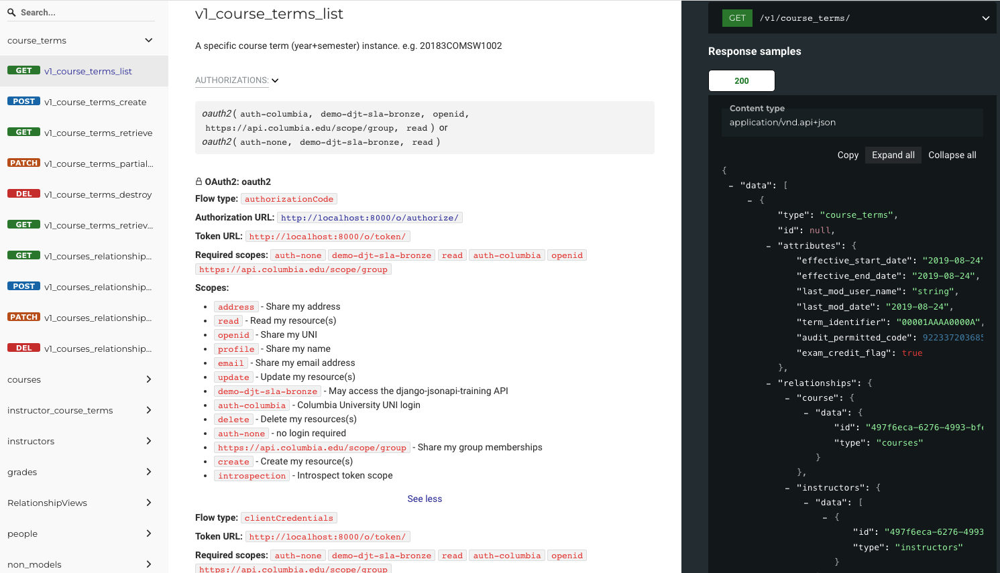

# Documenting the API with OAS 3

The [Open API Specification](https://spec.openapis.org/oas/latest.html)
(OAS 3) allows us to model and document our APIs
in a machine- and human-readable format.
OAS 3 has become the standard machine-readable representation of API schemas.

## Why an OAS 3 Schema?

Having a standardized schema document enables API consumer and producer developers to formally agree on the
API details in an automated way, providing tools for developers to perform basic data input validation
and to provide developer documentation and the familiar swagger "Try it out" functionality.


!!! Note
    "Built-in" DRF/DJA support of openapi schema generation is
	[deprecated](https://github.com/django-json-api/django-rest-framework-json-api/discussions/1082)
	in favor of using [drf-spectacular](https://drf-spectacular.readthedocs.io/en/latest/)
    and [drf-spectacular-json-api](https://github.com/jokiefer/drf-spectacular-json-api) which is what's
	documented here.

### Viewing the OAS schema via the Swagger UI

The Swagger UI shows the API documentation and includes a "Try it out" feature which can be used to
provide access to a live backend API. This includes the ability to login and obtain authorization to
access the API.


TODO: Update to [Swagger Editor 5.x](https://github.com/swagger-api/swagger-editor)

### View the OAS schema via The Redoc UI

[redoc](https://redocly.com/redoc) provides a nice view of the API as well, although it doesn't
include "Try it out".



!!! Warning
    The Swagger UI does not display [OAS Security Requirements objects](https://spec.openapis.org/oas/latest#security-requirement-object)
	even though they may exist in the OAS schema document. Redoc does display that information.


## Generating a static schema document

To generate a YAML schema document, use the `spectacular` management command:
```text
./manage.py spectacular --file openapi.yaml
```

If you want a JSON schema document:
```text
./manage.py spectacular --format openapi-json --file openapi.json
```

Or you can let `tox` do the work:
```text
tox -e openapi
```

I've added a few commands to `tox.ini` to generate schema documents.
```
[testenv:openapi]
deps =
     -rrequirements.txt
allowlist_externals =
    /bin/sh
setenv =
    DJANGO_SETTINGS_MODULE = training.settings
commands =
    /bin/sh -c "python manage.py spectacular --file docs/schemas/openapi.yaml"
    /bin/sh -c "python manage.py spectacular --format openapi-json --file docs/schemas/openapi.json"
```

## How "true" is the generated OAS schema?

See [this comparison](spectacular-actual.md) of the schema example generated by DSJA vs. what
the server API actually returns. There are still a few gaps here.

## Use the schema with the swagger-ui CLI

!!! Warning
    I'm still having some problems getting the OAuth2 authorization to properly integrate with Swagger UI.
	Watch this space for updates (or submit a PR that fixes it!).

You can try out your static schema document with `swagger-ui-watcher`:
Install it with
```
npm install swagger-ui-watcher -g
```
and then use
```
swagger-ui-watcher -p 8080 docs/openapi.yaml
```
to open the schema document in your browser.

## Use the schema with Postman

Postman can [import an OAS 3 schema](https://learning.postman.com/docs/designing-and-developing-your-api/importing-an-api/)


## Dynamic schema view

Our demo app has views defined for the openapi schema document and the
[swagger](https://swagger.io/docs/open-source-tools/swagger-ui/usage/installation/) and
[redoc](https://redocly.com/redoc) user interfaces. 

```python
from drf_spectacular.views import SpectacularAPIView, SpectacularRedocView, SpectacularSwaggerView, SpectacularSwaggerOauthRedirectView
# ...

urlpatterns = [
    # ...
    # OpenAPI schema using drf-spectacular and drf-spectacular-json-api:
    path('api/schema/', SpectacularAPIView.as_view(), name='schema'),
    # Optional UI:
    path('api/schema/swagger-ui/', SpectacularSwaggerView.as_view(url_name='schema'), name='swagger-ui'),
    path('api/schema/redoc/', SpectacularRedocView.as_view(url_name='schema'), name='redoc'),
    # not sure if this is needed or how to serve this when DEBUG is false
    path('api/schema/swagger-ui/oauth2-redirect.html', SpectacularSwaggerOauthRedirectView.as_view()),
    # ...
]
```

Open http://127.0.0.1:8000/api/schema/swagger-ui/ to get the swagger UI or http://127.0.0.1:8000/api/schema/redoc/ for
redoc.

## Adding what's missing to the generated schema

The generated schema is pretty much complete other than some of the issues noted in [the comparison](spectacular-actual.md).

## OAuth2 Client Configuration Changes

In order to use OAuth2, clients need to be configured in the Authorization Server to include these
request_uris:

- http://127.0.0.1/api/schema/swagger-ui/oauth2-redirect.html (for swagger-ui)
- https://www.postman.com/oauth2/callback (for Postman)

!!! Warning
    As noted above, I'm having trouble getting this to work with Swagger UI.
	It works great with Postman.

## DRF-spectacular and DRF-spectacular-json-api configuration

### Settings
Most changes happen in `settings.py` with minor changes to `urls.py` as well:

```diff
diff --git a/training/settings.py b/training/settings.py
index 4d121bc..1c3a82e 100644
--- a/training/settings.py
+++ b/training/settings.py
@@ -11,6 +11,7 @@ https://docs.djangoproject.com/en/2.1/ref/settings/
 """
+from myapp import __title__, __version__, __author__, __email__, __license__, __license_url__, __copyright__
 
 # Build paths inside the project like this: os.path.join(BASE_DIR, ...)
@@ -55,6 +56,8 @@ INSTALLED_APPS = [
+    'drf_spectacular',
+    'drf_spectacular_sidecar',  # required for Django collectstatic discovery
 ]
 REST_FRAMEWORK = {
+    "DEFAULT_PAGINATION_CLASS": "drf_spectacular_jsonapi.schemas.pagination.JsonApiPageNumberPagination",
+    "DEFAULT_SCHEMA_CLASS": "drf_spectacular_jsonapi.schemas.openapi.JsonApiAutoSchema",

+SPECTACULAR_SETTINGS = {
+    'TITLE': __title__,
+    'DESCRIPTION':
+         ''
+         '\n'
+         '\n'
+         '\n'
+         'A sample API that uses courses as an example to demonstrate representing\n'
+         '[JSON:API 1.0](http://jsonapi.org/format) in the OpenAPI 3.0 specification.\n'
+         '\n'
+         '\n'
+         '\n' + __copyright__ + '\n',
+    'VERSION': __version__,
+    'CONTACT': {
+        'name': __author__,
+        'email': __email__,
+    },
+    'LICENSE': {
+        'name': __license__,
+        'url': __license_url__,
+    },
+    'EXTERNAL_DOCS': {
+        'description': 'Read all about this JSONAPI demonstration app.',
+        'url': 'https://columbia-it-django-jsonapi-training.readthedocs.io'
+    },
+    'SERVE_INCLUDE_SCHEMA': False,
+    # OTHER SETTINGS
+    'SWAGGER_UI_DIST': 'SIDECAR',  # shorthand to use the sidecar instead
+    'SWAGGER_UI_FAVICON_HREF': 'SIDECAR',
+    'REDOC_DIST': 'SIDECAR',
+    # To provide different schema components for patch and post
+    "COMPONENT_SPLIT_REQUEST": True,
+    # to fix path parameter names for nested routes https://chibisov.github.io/drf-extensions/docs/#nested-routes
+    "PREPROCESSING_HOOKS": [
+        "drf_spectacular_jsonapi.hooks.fix_nested_path_parameters"
+    ],
+    "POSTPROCESSING_HOOKS": [
+        "drf_spectacular.hooks.postprocess_schema_enums",
+    ],
+    # this stuff gets added to SpectacularSwaggerView:
+    "SWAGGER_UI_OAUTH2_CONFIG": {
+        "clientId": "demo_djt_web_client",
+        "clientSecret": "demo_djt_web_secret",
+        "usePkceWithAuthorizationCodeGrant": True,
+    },
+    "OAUTH2_FLOWS": [ "authorizationCode", "clientCredentials", ],
+    "OAUTH2_AUTHORIZATION_URL": "http://localhost:8000/o/authorize/" if OAUTH2_SERVER == 'self' else OAUTH2_SERVER + '/as/introspect.oauth2',
+    "OAUTH2_TOKEN_URL": "http://localhost:8000/o/token/" if OAUTH2_SERVER == 'self' else OAUTH2_SERVER + '/as/token.oauth2',
+    "OAUTH2_REFRESH_URL": None,  # same as token url?
+    "OAUTH2_SCOPES": OAUTH2_PROVIDER["SCOPES"],
+    "SERVERS": [
+        {'url': 'http://localhost:8000', 'description': 'local dev'},
+        {'url': 'https://localhost', 'description': 'local docker'},
+        {'url': 'https://ac45devapp01.cc.columbia.edu', 'description': 'demo'},
+        {'url': '{serverURL}', 'description': 'provide your server URL',
+         'variables': {'serverURL': {'default': 'http://localhost:8000'}}}
+    ]
+}
```
```diff
diff --git a/training/urls.py b/training/urls.py
index e66a72f..65c12b8 100644
--- a/training/urls.py
+++ b/training/urls.py
@@ -22,9 +22,9 @@ from django.contrib.staticfiles.views import serve
+from drf_spectacular.views import SpectacularAPIView, SpectacularRedocView, SpectacularSwaggerView, SpectacularSwaggerOauthRedirectView
 
 urlpatterns = [
+    path('', RedirectView.as_view(url='api/schema/swagger-ui/', permanent=False)),
+    # OpenAPI schema using drf-spectacular and drf-spectacular-json-api:
+    path('api/schema/', SpectacularAPIView.as_view(), name='schema'),
+    # Optional UI:
+    path('api/schema/swagger-ui/', SpectacularSwaggerView.as_view(url_name='schema'), name='swagger-ui'),
+    path('api/schema/redoc/', SpectacularRedocView.as_view(url_name='schema'), name='redoc'),
+    # not sure if this is needed or how to serve this when DEBUG is false
+    path('api/schema/swagger-ui/oauth2-redirect.html', SpectacularSwaggerOauthRedirectView.as_view()),
 ]
```

### Extending the schema for OAuth2 security requirements

`myapp/django_oauth_toolkit.py` is where our customizations get added:

```python
from drf_spectacular.extensions import OpenApiAuthenticationExtension


class DjangoOAuthToolkitScheme(OpenApiAuthenticationExtension):
    target_class = 'oauth2_provider.contrib.rest_framework.OAuth2Authentication'
    name = 'oauth2'

    def get_security_requirement(self, auto_schema):
        """
        Generate the OAS [Oauth2 security requirement object](https://spec.openapis.org/oas/latest#oauth2-security-requirement).

        Looks through the view permissions for relevent OAuth2 permission classes such as TokenMatchesOASRequirements
        in order to generate a list of alternative required scopes.

        TODO: Better deal with hierarchical (AND, OR) permissions.
        """
        from oauth2_provider.contrib.rest_framework import (
            IsAuthenticatedOrTokenHasScope, TokenHasScope, TokenMatchesOASRequirements,
        )
        view = auto_schema.view
        request = view.request

        for permission in auto_schema.view.get_permissions():
            if isinstance(permission, TokenMatchesOASRequirements):
                alt_scopes = permission.get_required_alternate_scopes(request, view)
                alt_scopes = alt_scopes.get(auto_schema.method, [])
                return [{self.name: group} for group in alt_scopes]
            if isinstance(permission, IsAuthenticatedOrTokenHasScope):
                return {self.name: TokenHasScope().get_scopes(request, view)}
            if isinstance(permission, TokenHasScope):
                # catch-all for subclasses of TokenHasScope like TokenHasReadWriteScope
                return {self.name: permission.get_scopes(request, view)}
            # deal with hierarchical boolean permissions.
            scopes = getattr(view,"required_alternate_scopes")
            if scopes is None:
                scopes = getattr(view, "required_scopes")  # try for required_scopes
                return {self.name: scopes if scopes else []}
            return [{self.name: a} for a in scopes[auto_schema.method]]

    def get_security_definition(self, auto_schema):
        """
        Render the securitySchemes for our oauth2 service.
        """
        from oauth2_provider.scopes import get_scopes_backend
        from drf_spectacular.settings import spectacular_settings

        flows = {}
        for flow_type in spectacular_settings.OAUTH2_FLOWS:
            flows[flow_type] = {}
            if flow_type in ('implicit', 'authorizationCode'):
                flows[flow_type]['authorizationUrl'] = spectacular_settings.OAUTH2_AUTHORIZATION_URL
            if flow_type in ('password', 'clientCredentials', 'authorizationCode'):
                flows[flow_type]['tokenUrl'] = spectacular_settings.OAUTH2_TOKEN_URL
            if spectacular_settings.OAUTH2_REFRESH_URL:
                flows[flow_type]['refreshUrl'] = spectacular_settings.OAUTH2_REFRESH_URL
            scope_backend = get_scopes_backend()
            flows[flow_type]['scopes'] = scope_backend.get_all_scopes()

        return {
            'type': 'oauth2',
            'flows': flows
        }
```
