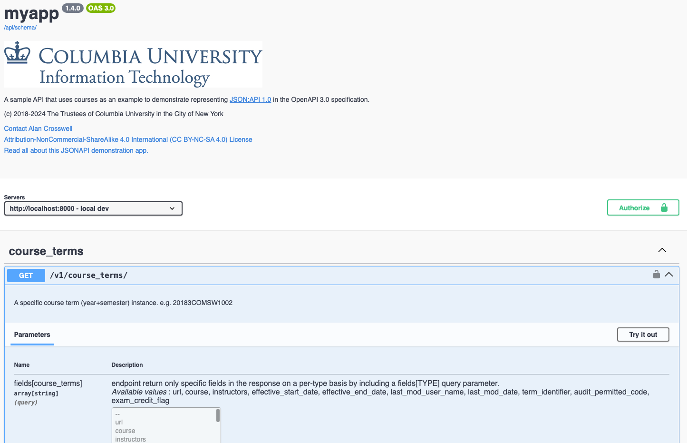
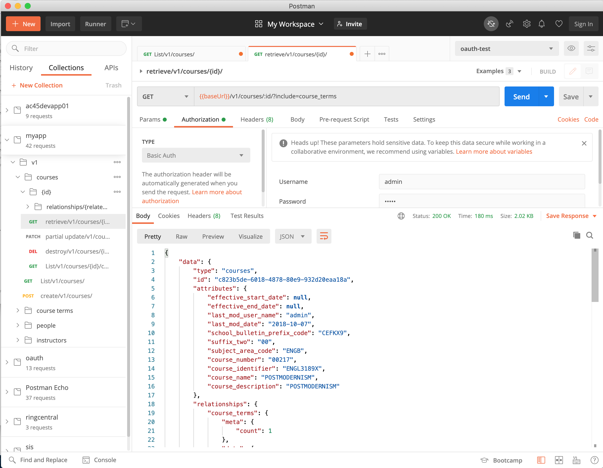

# Documenting the API with OAS 3

The [Open API Specification](https://spec.openapis.org/oas/latest.html)
(OAS 3), a follow-on to Swagger 2.0 which merges in many of the
modeling features of
[RAML](https://raml.org/)
1.0, allows us to model and document our APIs
in a machine- and human-readable format.
OAS 3 has become the standard machine-readable representation of API schemas.

DRF release [3.12](https://www.django-rest-framework.org/community/release-notes/#312x-series)
and DJA release [4.0](https://django-rest-framework-json-api.readthedocs.io/en/stable/usage.html#generating-an-openapi-specification-oas-3-0-schema-document)
now have fairly comprehensive
[OAS 3](https://www.django-rest-framework.org/community/3.9-announcement/#built-in-openapi-schema-support) support.

!!! Warning
    Built-in DRF support for OAS has been
	[deprecated in lieu of third-party packages](https://www.django-rest-framework.org/topics/documenting-your-api/)
	such as [drf-spectacular](https://drf-spectacular.readthedocs.io/en/latest/).

    Watch this space for future updates on using drf-spectacular.

## Why an OAS 3 Schema?

Having a standardized schema document enables API consumer and producer developers to formally agree on the
API details in an automated way, providing tools for developers to perform basic data input validation
and to provide developer documentation and the familiar swagger "Try it out" functionality.



## Generating a static schema document

To generate a YAML schema document:
```text
./manage.py generateschema --generator_class myapp.schemas.SchemaGenerator --file openapi.yaml
```

If you want a JSON schema document:
```text
./manage.py generateschema --generator_class myapp.schemas.SchemaGenerator --format openapi-json --file openapi.json
```

I've added a few commands to `tox.ini` to generate schema documents.
```
[testenv:openapi]
deps =
     -rrequirements.txt
setenv =
    DJANGO_SETTINGS_MODULE = training.settings
commands =
    /bin/sh -c "python manage.py generateschema  --generator_class myapp.schemas.SchemaGenerator >docs/schemas/openapi.yaml"
    /bin/sh -c "python manage.py generateschema  --generator_class myapp.schemas.SchemaGenerator --format openapi-json >docs/schemas/openapi.json"
```

### Use the schema with swagger-ui

You can try out your static schema document with `swagger-ui-watcher`:
Install it with `npm install swagger-ui-watcher -g` and then use
`swagger-ui-watcher -p 8080 docs/openapi.yaml` to open the schema document in your browser.

### Use the schema with Postman

Postman can import an openapi schema document and create a [collection](https://www.postman.com/collection/) 
or API(?). However there are a few caveats:
* The `fields` deepObject is incorrectly rendered. See bug [9053](https://github.com/postmanlabs/postman-app-support/issues/9053).
* All of the many query parameters are selected by default and set to a value of `<string>`. This will result in queries
  finding nothing unless you laboriously go through and uncheck each one.
  See feature request [9241](https://github.com/postmanlabs/postman-app-support/issues/9241).




## Dynamic schema view

Our demo app has views defined for the openapi schema document and the swagger user interface. Use `get_schema_view()`
for the openapi document and the `swagger-ui.html` template in the `TemplateView` class:

```python
from rest_framework.schemas import get_schema_view

urlpatterns = [
    # ...
    path('v1/openapi', get_schema_view(generator_class=schemas.SchemaGenerator, public=True),
         name='openapi-schema'),
    path('swagger-ui/', TemplateView.as_view(
        template_name='swagger-ui.html',
        extra_context={'schema_url': 'openapi-schema', 'title': API_TITLE}
    ), name='swagger-ui'),
    # ...
]
```

Open http://127.0.0.1:8000/swagger-ui/ to get the swagger UI.

## Adding what's missing to the generated schema

!!! Warning
    DRF support of openapi schema generation is deprecated
	in favor of using [drf-spectacular](https://drf-spectacular.readthedocs.io/en/latest/).
	This documentation will be updated once I update the code to use drf-spectacular.

DRF's openapi schema support lacks `securitySchemes` and `security` requirement objects. This 
[feature](https://github.com/encode/django-rest-framework/pull/7516) is expected to never be added in DRF
as the approach has changed to use [drf-spectacular](https://drf-spectacular.readthedocs.io/en/latest/).

Without defining these security requirements, the openapi schema can't be used to access our demo app 
with swagger due to lack of authentication and permissions. You can extend the generated schema to add some additional
info about the app, a list of servers to test against, as well as the basic required security features by
extending `SchemaGenerator.get_schema()`:

```python
from rest_framework_json_api.schemas.openapi import SchemaGenerator as JSONAPISchemaGenerator
from myapp import __author__, __copyright__, __license__, __license_url__, __title__, __version__

class SchemaGenerator(JSONAPISchemaGenerator):
    """
    Extend the schema to include some documentation and override not-yet-implemented security.
    """
    def get_schema(self, request, public):
        schema = super().get_schema(request, public)
        schema['info'] = {
            'version': __version__,
            'title': __title__,
            'description':
                ''
                '\n'
                '\n'
                '\n'
                'A sample API that uses courses as an example to demonstrate representing\n'
                '[JSON:API 1.0](http://jsonapi.org/format) in the OpenAPI 3.0 specification.\n'
                '\n'
                '\n'
                'See [https://columbia-it-django-jsonapi-training.readthedocs.io]'
                '(https://columbia-it-django-jsonapi-training.readthedocs.io)\n'
                'for more about this.\n'
                '\n'
                '\n' + __copyright__ + '\n',
            'contact': {
                'name': __author__
            },
            'license': {
                'name': __license__,
                'url': __license_url__
            }
        }
        schema['servers'] = [
            {'url': 'http://localhost:8000', 'description': 'local dev'},
            {'url': 'https://localhost', 'description': 'local docker'},
            {'url': 'https://ac45devapp01.cc.columbia.edu', 'description': 'demo'},
            {'url': '{serverURL}', 'description': 'provide your server URL',
             'variables': {'serverURL': {'default': 'http://localhost:8000'}}}
        ]

        # temporarily add securitySchemes until implemented upstream
        if 'securitySchemes' not in schema['components']:
            schema['components']['securitySchemes'] = {
                'basicAuth': {
                    'type': 'http',
                    'scheme': 'basic',
                    'description': 'basic authentication',
                },
                'sessionAuth': {
                    'type': 'apiKey',
                    'in': 'cookie',
                    'name': 'JSESSIONID',
                    'description': 'Session authentication'
                },
                'oauth-test': {
                    'type': 'oauth2',
                    'description': 'test OAuth2 service',
                    'flows': {
                        'authorizationCode': {
                            'authorizationUrl': 'https://oauth-test.cc.columbia.edu/as/authorization.oauth2',
                            'tokenUrl': 'https://oauth-test.cc.columbia.edu/as/token.oauth2',
                             'scopes': {
                                 'auth-columbia': 'Columbia UNI login',
                                 'create': 'create',
                                 'read': 'read',
                                 'update': 'update',
                                 'delete': 'delete',
                                 'openid': 'disclose your identity',
                                 'profile': 'your user profile',
                                 'email': 'your email address',
                                 'https://api.columbia.edu/scope/group': 'groups you are a member of',
                                 'demo-django-jsonapi-training-sla-bronze':
                                     'permitted to access the django-jsonapi-training demo: 1 request per second',
                                 'demo-django-jsonapi-training-sla-update':
                                     'permitted to update the django-jsonapi-training resources'
                             }
                        }
                    }
                }
            }

        # temporarily add default security object at top-level
        if 'security' not in schema:
            schema['security'] = [
                {'basicAuth': []},
                {'sessionAuth': []},
                {'oauth-test': [
                    ['auth-columbia', 'openid', 'https://api.columbia.edu/scope/group',]
                ]}
            ]

        return schema
```

## OAuth2 Client Configuration

Furthermore, in order to use OAuth2, clients need to be configured in the Authorization Server to include these
request_uris:

- http://127.0.0.1/oauth2-redirect.html (for swagger-ui)
- http://localhost/oauth2-redirect.html
- https://www.postman.com/oauth2/callback (for Postman)

