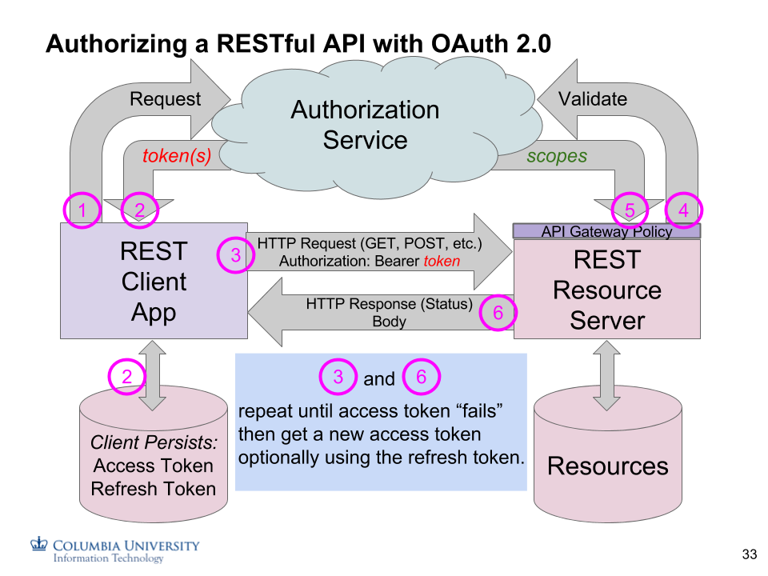

## More About Using OAuth 2.0

Review the [CU-STD-INTR-001: OAuth 2.0 Scope
Standard](https://docs.google.com/document/d/13XW4-L_j9CCeB6jAPjPHK6V5-rMpcBUiF90RIAK0f6Y/edit#heading=h.tlbkpm4wjg60):

N.B. OAuth 2.0 is largely *unrelated* to OAuth 1.0; it's not just an upgrade, but a totally
new protocol.  Many [LTI](https://andyfmiller.com/2013/02/10/does-lti-use-oauth/)
APIs are based on OAuth 1.0. Different thing entirely.

### Dramatis Personae

The players in the world of OAuth 2.0 are:

**User:** The user is the human who logs in the usual way via a browser (e.g. using CAS in our case).
The user login is generally initiated by the client making a request of the AS (below).

**Client:** The client app operates on behalf of the user. Since it's frequently referred to
as just the "client", it is sometimes confused with the user, but it isn't. It is the app
that the user is authorizing to act on her behalf, sometimes even when the user is no longer present.

**Resource Server (RS):** The resource server is the "backend" (in our cast RESTful Django) server.
It uses information passed by the client (an Access Token) to see if the resources it manages are
permitted to be manipulated using the HTTP methods. This information is usually validated using
Access Token *introspection*, described below.

**Authorization Server (AS):** This is the central control point. All clients and RS's talk to the
AS to get and validate a *Token*. Clients and RS's are registered in advance with the AS.

More on these roles below.

### Tokens

*Access Tokens* are used for all authorization decisions. An *Access Token*
is usually an opaque object that has no intrinsic meaning to the client app that received
it from the AS. How access tokens get
created and constrained is described below. Additional token types
include *Refresh* and *ID tokens*.

*Refresh Tokens*, which can only be granted for an Authorization Code grant,
are used to get a new *Access Token* when the old one expires. These are
used for long-term authorization of 3rd-party apps to do something on
behalf of the initial authorizing user without them having to be present at the time.

*ID tokens* contain information that identifies the user to the client app
and are only made available if using the Open ID Connect (OIDC) profile (with
`openid` scope, described below). In general, the client app does not know
who their user is, since the *Access Token* is an opaque object; the ID Token (or Userinfo endpoint)
discloses that information. (As such, one should be careful when provisioning a client app in the AS
to be allowed to request the **openid** scope.)

### Scopes, and how we use them

Scopes are *requested* by a registered Client app. They are *granted* by the
OAuth 2.0 Authorization Server (AS). Scopes are then validated by the
Resource Server based on the `access_token` provided in the Authorization
Bearer header of the HTTP request. The set of scopes "in" the
access_token must match the scopes *required* by the Resource Server.
Beyond the required scopes, additional scopes might be useful for
optional capabilities.

How scopes are used can vary greatly. Our implementation of scopes includes several flavors:

#### Resource Server SLA Scopes

Resource Server Service Level Agreement scopes are used to indicate that a registered Client is:
- permitted to access a given Resource Server, and
- optionally, at a specified (set of) service level(s).

Examples of Service Levels might indicate an allowable number of API calls per second, such that
casual users ("Bronze" SLA) might be rate limited to a farily low number while a fully-vetted service-to-service
integration might perform an unlimited number of calls per second ("Gold" SLA).

Use of SLA scopes is our primary means of *binding* a particular Client to a specific Resource Server;
the Client is registered in the AS with permission to request the given RS SLA Scope. This further
requires that the RS confirm that scope is present in the Access Token when it
[introspects](#register-resource-server-for-token-introspection) it. (This is comparable and an
alternative to the use of an [API key](https://en.wikipedia.org/wiki/Application_programming_interface_key).)

#### Authentication Selector Scopes

Authentication selector scopes specify what method of user
authentication the client app is requesting the AS to use. The two we
are concerned with are:

**auth-columbia**: Perform a CAS user login. See 
[Client is operating with an end user present](#client-is-operating-with-an-end-user-present),
below.

**auth-none**: Do not perform a user login. This scope is used for backend server-to-server relationships.
See [Client is a trusted server](#client-is-a-trusted-server), below.

#### User Data Generic Scopes

A series of generic scopes are generally used for end-user data. Remember that the Client app is
delegated rights by virtue of the end-user's login and authorization to act on the end-user's behalf.
Scopes we use are:

**create**: Permission to create new resources (POST) on my behalf.

**read**: Permission to read an existing resource (GET) of mine.

**update:** Permission to update an existing resource (PATCH) of mine.

**delete**: Permission to delete a resource (DELETE) of mine.

#### OpenID Connect (OIDC) 1.0 Scopes

In normal OAuth 2.0 operations, there may be no need for the client app
to know who the end user is. If the client does need to know this, then
use the **openid** scope. This results in an
[id_token](http://openid.net/specs/openid-connect-core-1_0.html#IDToken)
being returned to the requesting client, in addition to the usual
*access_token* -- only if the client app has been
[registered](#registering-with-the-as) with permission to request
the **openid** scope. *id_tokens* only return the "sub" claim
(*uni*@columbia.edu) unless additional scopes are added:

**profile:** includes user's name, etc.

**email:** includes user's email address.

OIDC defines several
[claims](https://openid.net/specs/openid-connect-core-1_0.html#ScopeClaims)
that we don't currently implement (e.g. picture, phone number, birthdate, etc.)

##### Grouper Claim Group Membership

We've implemented a custom
[additional claim](https://openid.net/specs/openid-connect-core-1_0.html#AdditionalClaims)
using a [Collision-Resistant Name](https://tools.ietf.org/html/rfc7519#section-2)
of `https://api.columbia.edu/claim/group` that represents the list of "Claim Groups"
that an end-user is a member of. These groups are managed by the
[Grouper](https://grouper.columbia.edu) group management system.

To request this claim, add this scope: `https://api.columbia.edu/scope/group`.

##### Userinfo Endpoint

There's a complementary
[userinfo](http://openid.net/specs/openid-connect-core-1_0.html#UserInfo)
endpoint that also returns Claims.
It is authorized using the *access_token* meaning anybody that has the *access_token*
can retrieve this information. This can be used in the event that an **id_token**
was not returned to the Client, for example.

### What kind of client is it?

No matter the OAuth 2.0 "style", the Resource Server (RS) is always
presented with basically the same information: an opaque *Access Token*
in the `Authorization: Bearer <token>` header.
The RS (backend Django app in this context) must
validate the *Access Token* to grant or deny appropriate permission
for a given HTTP request.

#### Client is operating with an end user present

This use case is similar to the typical front-end client app connecting
to a back-end resource server in which the user must log in (via a
browser redirect to Shibboleth/CAS/Duo). The result is, as above, an
access token. In a fully browser-based client, the access token would be
persisted in a cookie, analogously to the way a session cookie is used.

#### Client is pre-authorized by the end user who is no longer present

What OAuth 2.0 adds is the ability for a user to delegate permission
once to your "third party" app. In this use case, the client app
(running with it's own backend server) can persist a *Refresh Token*
which it can use to get a series of new access tokens to perform some
offline activity with the user's data. This case is powerful but not
likely to be one we use -- at least initially. Refresh Tokens are only
available with the Authorization Code grant type.

#### Client is a trusted server

This use case is the example of backend server-to-server trust that
would traditionally use IP addresses or HTTP Basic Auth to determine
whether one server should trust another. In the OAuth 2.0 world, this is
implemented by the client using HTTP Basic Auth with the AS to get back
an Access Token. Validation of (introspecting) the access token
is done by the server using
HTTP Basic Auth to identify itself and then introspecting the token. No
user identity Claims are provided because there is no user. In
addition to using the scopes associated with the access token, the
server app can always keep a list of Client IDs if necessary. However,
the cleanest design approach is to base the authorization decision
entirely on the access token's granted scopes, in this case using the Resource Server
SLA scope rather than tracking Cliend IDs.

### Determining Resource Server Authorization Requirements

In all use cases, the Resource Server is presented with an access token
in the Authorization header. The resource server decides what actions
are authorized based on the scopes associated with the token, which it
learns from token introspection. It can also make decisions based on the
identity of the user, in the cases where a user was identified
(Authorization Code or Implicit grants) as this is exposed by the
introspection (and userinfo).

Resource server designers need to decide:

1. Is a human user approval required vs. a trusted server.
2. On a per-REST method and resource basis, what scopes are required to
   implement the action (coarse-grained authorization).
3. What additional security decisions need to be made based on the
   logged-in user and/or data (fine-grained authorization).

One should attempt to be "RESTful" in designing application security:
Base permissions on HTTP methods and resources. Using a modeling
language like OAS 3.0 can help. See
[Documenting the API in OAS 3.0](documenting-api.html), and the
equivalent Django
[permission_classes](building.html#adding-authentication-and-authorization).

### Registering with the AS
#### Register Resource Server for Token Introspection

The Resource Server must be a registered client with the OAuth 2.0
Authorization Server before it is allowed to perform token
introspection.

This process is currently manual via a service request to the IAM team.
You need to provide:

-   the name of your Resource Server (e.g. cas-coursemgt-server)
-   that it should be allowed to perform introspection (is a resource
    server)

You'll be given a *client_id* and *client_secret*. Configure these in
[settings.OAUTH2_PROVIDER](building.html#edit-settings-to-add-drf-dja-oauth-debug-etc)
using environment variables or some other method to protect the credentials (e.g. not in the source code!).

#### Register Client App(s)

Every client app must be a registered OAuth 2.0 client. Things to think
about when registering a client are:

##### Client is operating on behalf of an end user

1.  Is it a fully in-browser (javascript) app? If so, it will likely be using
    the Implicit grant type and will require a user to log in,
    using the auth-columbia scope selector.
2.  What scopes should the app be allowed to request on behalf of the
    user and what scopes are required by its Resource Server?
3.  Should the end-user scope-approval page be presented or bypassed? In
    most cases, this will be bypassed.

##### Client is a server

In this case, the app should be registered with permission to request
the **auth-none** and additional scopes.
