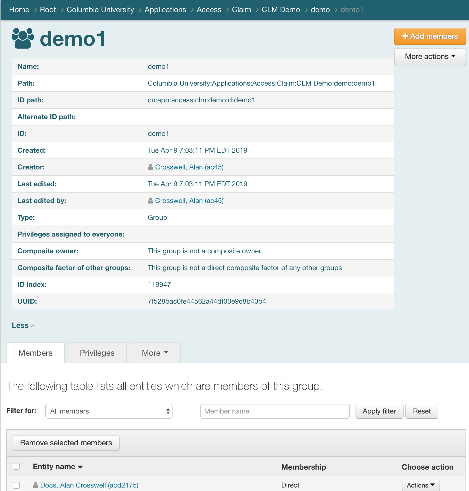

# Adding OIDC 1.0 Claims
`GIT TAG: claims`

At Columbia we've implemented a custom OIDC claim that is provided when the scope
`https://api.columbia.edu/scope/group` is requested. Let's use this claim
to determine some user permissions.

While django-oauth-toolkit (DOT) supports OIDC functionality, it does not yet
cache userinfo claims, so we'll extend the toolkit by tacking on a
[UserInfo](http://openid.net/specs/openid-connect-core-1_0.html#UserInfo)
query result to the AccessToken model and then define a new HasClaim Permission class
that uses it.

First, since you probably don't care about the gory details, let's show how to use the
new HasClaim class. Following that are details on the implementation.

## Defining Claims in Grouper

Any Grouper group members in groups found under the `cu:app:access:clm` tree are
put into LDAP as affiliations starting with `CLM`. These in turn are then
mapped into the OIDC `https://api.columbia.claim/group` list via our Shibboleth SAML2
integration: 



The following table shows the mappings from Grouper through the OIDC Claim:

| description            | sample value                   | 
| :--------------------- | :----------------------------- |
| Grouper group ID path  | cu:app:access:clm:demo:d:demo2 | 
| LDAP affiliation       | CLM_demo_d_demo2               | 
| https://api.columbia.edu/claim/group | demo_d_demo2     | 

For a "real" application, all the power of Grouper is available to assert Claims
for users.

## Using the new HasClaim class

Here's how our Permission class configures HasClaim:
```python
from oauth.oauth2_introspection import HasClaim

class MyClaimPermission(HasClaim):
    """
    Use OIDC claim 'https://api.columbia.edu/claim/group' to determine permission
    to create/update/delete stuff: If the user has the claim `demo_d_demo2`, then
    they can do writes. Read access doesn't require a claim.
    """
    #: in order to be able to do a write, the user must have claim `demo_d_demo2`
    WRITE_CLAIM = 'demo_d_demo2'
    #: any user can do a read (empty string indicates so vs. None which means deny).
    READ_CLAIM = ''
    #: the name of our custom claim group
    claim = 'https://api.columbia.edu/claim/group'
    #: mapping of HTTP methods to required claim group values
    claims_map = {
        'GET': READ_CLAIM,
        'HEAD': READ_CLAIM,
        'OPTIONS': READ_CLAIM,
        'POST': WRITE_CLAIM,
        'PATCH': WRITE_CLAIM,
        'DELETE': WRITE_CLAIM,
        }
```

We revise the mixin used in the view like this. It's a little kludgy.... 

```python
class AuthnAuthzSchemaMixIn(object):
    """
    Common Authn/Authz mixin for all View and ViewSet-derived classes:
    """
    #: In production Oauth2 is preferred; Allow Basic and Session for testing and browseable API.
    #: (authentication_classes is an implied OR list)
    authentication_classes = (OAuth2Authentication, BasicAuthentication, SessionAuthentication,)
    #: permissions are any one of:
    #: 1. auth-columbia scope, which means there's an authenticated user, plus required claim, or
    #: 2. auth-none scope (a server-to-server integration)
    #: 3. an authenticated user (session or basic auth) using user-based model permissions.
    permission_classes = [
        (TokenMatchesOASRequirements & IsAuthenticated & MyClaimPermission)
        | (TokenMatchesOASRequirements)
        | (IsAuthenticated & MyDjangoModelPermissions)
    ]
    #: Implicit/Authorization code scopes
    CU_SCOPES = ['auth-columbia', 'cas-tsc-sla-gold', 'openid', 'https://api.columbia.edu/scope/group']
    #: Client Credentials scopes
    NONE_SCOPES = ['auth-none', 'cas-tsc-sla-gold']
    #: allow either USER_SCOPES or BACKEND_SCOPES
    required_alternate_scopes = {
        'OPTIONS': [['read']],
        'HEAD': [CU_SCOPES + ['read'], NONE_SCOPES + ['read']],
        'GET': [CU_SCOPES + ['read'], NONE_SCOPES + ['read']],
        'POST': [CU_SCOPES + ['create'], NONE_SCOPES + ['create']],
        'PATCH': [CU_SCOPES + ['update'], NONE_SCOPES + ['update']],
        'DELETE': [CU_SCOPES + ['delete'], NONE_SCOPES + ['delete']],
    }
```

## Advanced Topic: Extending the DOT AccessToken Model

Now for the gory details of how HasClaim was implemented:

In order to do this, we have to redefine DOT swappable models in a multi-step process which
results in replacing some of the DOT models with our own for which we'll define a new app called `oauth`.

### Unmigrate oauth2_provider

We start by dropping the `oauth2_provider` models from the database using a *zero* reverse migration.
This will clobber any cached Access Tokens -- which is not a terrible thing as they'll just
get re-cached the next time they are presented in the Authorization Bearer header.

```text
(env) django-training$ ./manage.py migrate oauth2_provider zero
Operations to perform:
  Unapply all migrations: oauth2_provider
Running migrations:
  Rendering model states... DONE
  Unapplying oauth2_provider.0002_auto_20190406_1805... OK
  Unapplying oauth2_provider.0001_initial... OK
(env) django-training$ ./manage.py showmigrations
admin
 [X] 0001_initial
 [X] 0002_logentry_remove_auto_add
 [X] 0003_logentry_add_action_flag_choices
auth
 [X] 0001_initial
 [X] 0002_alter_permission_name_max_length
 [X] 0003_alter_user_email_max_length
 [X] 0004_alter_user_username_opts
 [X] 0005_alter_user_last_login_null
 [X] 0006_require_contenttypes_0002
 [X] 0007_alter_validators_add_error_messages
 [X] 0008_alter_user_username_max_length
 [X] 0009_alter_user_last_name_max_length
 [X] 0010_alter_group_name_max_length
 [X] 0011_update_proxy_permissions
contenttypes
 [X] 0001_initial
 [X] 0002_remove_content_type_name
corsheaders
 [X] 0001_initial
myapp
 [X] 0001_initial
 [X] 0002_auto_20181019_1821
 [X] 0003_unique_term_identifier
 [X] 0004_instructor
 [X] 0005_auto_20181205_1532
 [X] 0006_person
 [X] 0007_auto_20181206_1727
oauth2_provider
 [ ] 0001_initial
 [ ] 0002_auto_20190406_1805
sessions
 [X] 0001_initial
(env) django-training$ 
```

### Create the new oauth app and models

We create some new models that are based on the Abstract models that DOT uses.
While we only care about extending AccessToken to add the `userinfo` field,
we need to make the others because of all the relationship references
among the various models.

```python
from django.db import models
from oauth2_provider import models as oauth2_models


class MyAccessToken(oauth2_models.AbstractAccessToken):
    """
    extend the AccessToken model with the external userinfo server response
    """
    class Meta(oauth2_models.AbstractAccessToken.Meta):
        swappable = "OAUTH2_PROVIDER_ACCESS_TOKEN_MODEL"

    userinfo = models.TextField(null=True, blank=True)


class MyRefreshToken(oauth2_models.AbstractRefreshToken):
    """
    extend the AccessToken model with the external introspection server response
    """
    class Meta(oauth2_models.AbstractRefreshToken.Meta):
        swappable = "OAUTH2_PROVIDER_REFRESH_TOKEN_MODEL"


class MyApplication(oauth2_models.AbstractApplication):
    class Meta(oauth2_models.AbstractApplication.Meta):
        swappable = "OAUTH2_PROVIDER_APPLICATION_MODEL"
```

Unfortuantetly, one can't just say `manage.py makemigrations` for these models due to circular
relationships between the Access and RefreshToken Models. So, steal the migrations that DOT
uses and tweak them a little (TODO: This may no longer be necessary):

```python
# Generated by Django 3.0.3 on 2020-04-03 20:33

from django.conf import settings
from django.db import migrations, models
import django.db.models.deletion
import oauth2_provider.generators

class Migration(migrations.Migration):
    initial = True

    dependencies = [
        migrations.swappable_dependency(settings.OAUTH2_PROVIDER_ACCESS_TOKEN_MODEL),
        migrations.swappable_dependency(settings.AUTH_USER_MODEL),
        migrations.swappable_dependency(settings.OAUTH2_PROVIDER_REFRESH_TOKEN_MODEL),
        migrations.swappable_dependency(settings.OAUTH2_PROVIDER_APPLICATION_MODEL),
    ]

    operations = [
        # ...
        migrations.CreateModel(
            name='MyAccessToken',
            fields=[
                ('id', models.BigAutoField(primary_key=True, serialize=False)),
                ('token', models.CharField(max_length=255, unique=True)),
                ('expires', models.DateTimeField()),
                ('scope', models.TextField(blank=True)),
                ('created', models.DateTimeField(auto_now_add=True)),
                ('updated', models.DateTimeField(auto_now=True)),
                ('userinfo', models.TextField(blank=True, null=True)),
                ('application', models.ForeignKey(blank=True, null=True, on_delete=django.db.models.deletion.CASCADE, related_name='oauth_myaccesstoken_related_app', to=settings.OAUTH2_PROVIDER_APPLICATION_MODEL)),
                # can't add this field yet because the RefreshToken Model hasn't been created:
                # ('source_refresh_token', models.OneToOneField(blank=True, null=True, on_delete=django.db.models.deletion.SET_NULL, related_name='oauth_myaccesstoken_refreshed_access_token', to=settings.OAUTH2_PROVIDER_REFRESH_TOKEN_MODEL)),
                ('user', models.ForeignKey(blank=True, null=True, on_delete=django.db.models.deletion.CASCADE, related_name='oauth_myaccesstoken', to=settings.AUTH_USER_MODEL)),
            ],
            options={
                'abstract': False,
                'swappable': 'OAUTH2_PROVIDER_ACCESS_TOKEN_MODEL',
            },
        ),
        #...        
        # now that the RefreshToken Model exists we can add the reference to it in AccessToken:
        migrations.AddField(
            model_name='MyAccessToken',
            name='source_refresh_token',
            field=models.OneToOneField(blank=True, null=True, on_delete=django.db.models.deletion.SET_NULL, related_name='oauth_myaccesstoken_refreshed_access_token', to=settings.OAUTH2_PROVIDER_REFRESH_TOKEN_MODEL),
        ),
    ]
```
(A second auto-generated migration then gets made and I'm not sure why!)

### Add the oauth app and swappable models to settings

Now that we have everything set up and `oauth2_provider` has been unmigrated, it's time to add 
the `oauth` replacements for DOT's Models:

```diff
diff --git a/training/settings.py b/training/settings.py
index 2f08362..a462e3c 100644
--- a/training/settings.py
+++ b/training/settings.py
@@ -50,6 +50,7 @@ INSTALLED_APPS = [
     'debug_toolbar',
     'corsheaders',
     'oauth2_provider',
+    'oauth',
     'django_filters',
     'django_extensions',
 ]
@@ -250,7 +251,10 @@ OAUTH2_CONFIG = {
     ],
 } 
 
-
+OAUTH2_PROVIDER_APPLICATION_MODEL = "oauth.MyApplication"
+OAUTH2_PROVIDER_ACCESS_TOKEN_MODEL = "oauth.MyAccessToken"
+OAUTH2_PROVIDER_REFRESH_TOKEN_MODEL = "oauth.MyRefreshToken"
+OAUTH2_PROVIDER_GRANT_MODEL = "oauth2_provider.Grant"
 
 # debug logging
 LOGGING = {
```

### Migrate oauth and oauth2_provider

Now we can do a migration to create the new `oauth` tables that replace the `oauth2_provider` tables:

```text
(env) django-training$ ./manage.py migrate
Operations to perform:
  Apply all migrations: admin, auth, contenttypes, corsheaders, myapp, oauth, oauth2_provider, sessions
Running migrations:
  Applying oauth.0001_initial... OK
  Applying oauth.0002_auto_20200413_1746... OK
  Applying oauth2_provider.0001_initial... OK
  Applying oauth2_provider.0002_auto_20190406_1805... OK
(env) django-training$
```

And take a look in the database to see what happened. Note that oauth2_provider_grant
is the "original" from DOT but the others are now all "oauth_*" and the AccessToken
model has the new `userinfo` text field.

```text
(env) django-training$ sqlite3 db.sqlite3 
-- Loading resources from /Users/ac45/.sqliterc
SQLite version 3.24.0 2018-06-04 14:10:15
Enter ".help" for usage hints.
sqlite> .tables
auth_group                     django_session               
auth_group_permissions         myapp_course                 
auth_permission                myapp_courseterm             
auth_user                      myapp_instructor             
auth_user_groups               myapp_instructor_course_terms
auth_user_user_permissions     myapp_person                 
corsheaders_corsmodel          oauth2_provider_grant        
django_admin_log               oauth_myaccesstoken          
django_content_type            oauth_myapplication          
django_migrations              oauth_myrefreshtoken         
sqlite> .schema --indent oauth_myaccesstoken
CREATE TABLE IF NOT EXISTS "oauth_myaccesstoken"(
  "id" integer NOT NULL PRIMARY KEY AUTOINCREMENT,
  "token" varchar(255) NOT NULL UNIQUE,
  "expires" datetime NOT NULL,
  "scope" text NOT NULL,
  "created" datetime NOT NULL,
  "updated" datetime NOT NULL,
  "userinfo" text NULL,
  "application_id" bigint NULL REFERENCES "oauth_myapplication"("id") DEFERRABLE INITIALLY DEFERRED,
  "user_id" integer NULL REFERENCES "auth_user"("id") DEFERRABLE INITIALLY DEFERRED,
  "source_refresh_token_id" bigint NULL UNIQUE REFERENCES "oauth_myrefreshtoken"("id") DEFERRABLE INITIALLY DEFERRED
);
CREATE INDEX "oauth_myaccesstoken_application_id_14a2200b" ON "oauth_myaccesstoken"(
  "application_id"
);
CREATE INDEX "oauth_myaccesstoken_user_id_af7b1a7f" ON "oauth_myaccesstoken"(
  "user_id"
);
```

### Create a new HasClaim Permission Class

To actually get the UserInfo result cached with the result of the Access Token introspection,
extend DRF's BasePermission class to cache a UserInfo response as part of its associate Access Token: 

See [oauth/oauth2_introspection.py](https://github.com/columbia-it/django-jsonapi-training/tree/master/oauth/oauth2_introspection.py)

### Automated filling in OAUTH2_CONFIG

See `oauth/apps.py` where we automate filling in the OAUTH2_CONFIG give the OAUTH2_SERVER environment
variable. This uses OIDC's `.well-known/openid-configuration` endpoint. 
