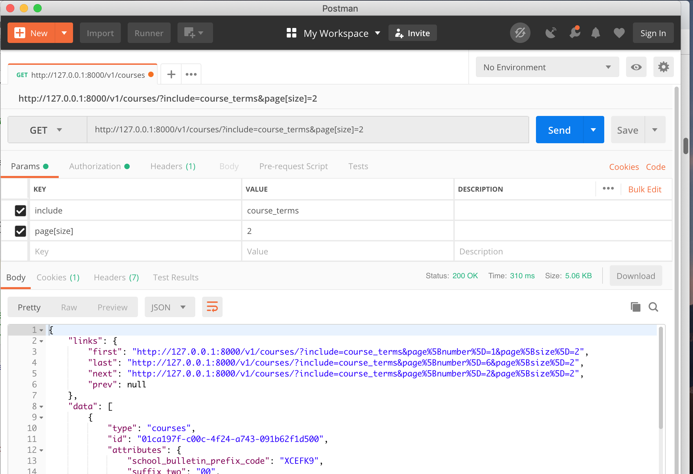

# Using the Django REST Framework and DRF-JSONAPI
_Lecture Notes_

**Alan Crosswell**

rev. 11/20/2018

Copyright © 2018 The Trustees of Columbia University in the City of New
York

 [Creative Commons Attribution-NonCommercial-ShareAlike 4.0 International LICENSE](../LICENSE)

<!-- markdown-toc -i outline.md -->
## Table of Contents

<!-- toc -->

- [Document Revision History](#document-revision-history)
- [Welcome and Caveat](#welcome-and-caveat)
- [Preparing for the classes](#preparing-for-the-classes)
  * [Overview](#overview)
  * [Level-setting survey](#level-setting-survey)
- [Motivation: Strategy and Architectural Standards](#motivation-strategy-and-architectural-standards)
- [Review of key concepts from Python and Git training](#review-of-key-concepts-from-python-and-git-training)
  * [Javascript Object Notation (JSON)](#javascript-object-notation-json)
  * [JSON data types](#json-data-types)
  * [(De)serializing JSON (to)from Python variables: a simple Python app](#deserializing-json-tofrom-python-variables-a-simple-python-app)
- [HTTP and REpresentational State Transfer (REST)](#http-and-representational-state-transfer-rest)
  * [RESTful APIs](#restful-apis)
    + [Avoid REST anti-patterns](#avoid-rest-anti-patterns)
    + [A good REST pattern](#a-good-rest-pattern)
  * [HTTP Requests](#http-requests)
    + [HATEOAS: Hypermedia As The Engine Of Application State.](#hateoas-hypermedia-as-the-engine-of-application-state)
    + [Request Body](#request-body)
    + [Response Body](#response-body)
    + [Query Parameters](#query-parameters)
    + [Headers](#headers)
    + [Authentication and Authorization](#authentication-and-authorization)
- [The {json:api} specification](#the-jsonapi-specification)
  * [Why use {json:api}?](#why-use-jsonapi)
  * [Media Type "Application/vnd.api+json"](#media-type-applicationvndapijson)
  * [Resources, Relationships](#resources-relationships)
  * [Hypertext References](#hypertext-references)
  * [Compound Documents](#compound-documents)
  * [Pagination](#pagination)
  * [Filtering](#filtering)
  * [Sorting](#sorting)
  * [Sparse Fieldsets](#sparse-fieldsets)
  * [Installing Postman](#installing-postman)
  * [POSTing and PATCHing: Resources and Relationships](#posting-and-patching-resources-and-relationships)
- [The Django REST Framework (DRF) and DRF-JSON API (DJA)](#the-django-rest-framework-drf-and-drf-json-api-dja)
  * [Models](#models)
  * [Serializers](#serializers)
  * [Views and ViewSets](#views-and-viewsets)
    + [Relationship and Related Views](#relationship-and-related-views)
      - [RelationshipView](#relationshipview)
      - [Related View, the new way](#related-view-the-new-way)
      - [Related View, the old way](#related-view-the-old-way)
  * [Authentication and Authorization (Permission)](#authentication-and-authorization-permission)
    + [Authentication: `authentication_classes`](#authentication-authentication_classes)
    + [Authorization: `permission_classes`](#authorization-permission_classes)
  * [What's with the Mixins?](#whats-with-the-mixins)
- [Building our DJA project](#building-our-dja-project)
  * [PIP Package Requirements](#pip-package-requirements)
  * [Start a new project with a blank slate](#start-a-new-project-with-a-blank-slate)
    + [Create initial project](#create-initial-project)
    + [Set up virtualenv](#set-up-virtualenv)
    + [Install required packages](#install-required-packages)
    + [Freeze Python package requirements](#freeze-python-package-requirements)
    + [Make sure git ignores irrelevant (non-source) files](#make-sure-git-ignores-irrelevant-non-source-files)
    + [Do initial migration and superuser account setup](#do-initial-migration-and-superuser-account-setup)
    + [Initial git checkin](#initial-git-checkin)
  * [Edit Settings to add DRF, DJA, OAuth, Debug, etc.](#edit-settings-to-add-drf-dja-oauth-debug-etc)
  * [Define Models](#define-models)
  * [Define Serializers](#define-serializers)
  * [Define URL routing and Views](#define-url-routing-and-views)
  * [Migrate the newly-installed apps.](#migrate-the-newly-installed-apps)
  * [Add some test data](#add-some-test-data)
  * [Run the server](#run-the-server)
  * [Experiment with Postman](#experiment-with-postman)
  * [Adding Authentication and Authorization](#adding-authentication-and-authorization)
  * [Pagination, Sorting and Sparse Fieldsets](#pagination-sorting-and-sparse-fieldsets)
  * [Configure additional Filter Backends](#configure-additional-filter-backends)
    + [Configuring SearchFilter](#configuring-searchfilter)
    + [Configuring DjangoFilterBackend](#configuring-djangofilterbackend)
  * [Advanced topic: Adding the `last_mod_user_name` to the Model](#advanced-topic-adding-the-last_mod_user_name-to-the-model)
    + [via the Serializer](#via-the-serializer)
    + [via the Model](#via-the-model)
  * [Using OAuth 2.0](#using-oauth-20)
    + [Get an OAuth 2.0 token](#get-an-oauth-20-token)
    + [Issue HTTP requests using the token](#issue-http-requests-using-the-token)
  * [Tests](#tests)
    + [Always write unit tests](#always-write-unit-tests)
    + [Test Models](#test-models)
    + [Trying things out with the Django Shell](#trying-things-out-with-the-django-shell)
    + [Developing tests in Pycharm.](#developing-tests-in-pycharm)
      - [Set up Run/Debug Configurations for Tests](#set-up-rundebug-configurations-for-tests)
      - [Set up Run/Debug Configurations for the Project](#set-up-rundebug-configurations-for-the-project)
    + [Check for Python Warnings](#check-for-python-warnings)
    + [Additional testing tips](#additional-testing-tips)
  * [Use Tox to automate testing](#use-tox-to-automate-testing)
    + [The `tox.ini`](#the-toxini)
    + [Run `tox`](#run-tox)
    + [`tox` automates more than just testing](#tox-automates-more-than-just-testing)
  * [Code Coverage](#code-coverage)
  * [Using unreleased packages](#using-unreleased-packages)
  * [It's best to pin versions](#its-best-to-pin-versions)
- [Deploying to Production](#deploying-to-production)
  * [TODO: Document Jenkins CI/CD setup.](#todo-document-jenkins-cicd-setup)
  * [Apache httpd `mod_wsgi`](#apache-httpd-mod_wsgi)
- [Modifying our DJA Project](#modifying-our-dja-project)
  * [Update CourseTerm](#update-courseterm)
  * [Make a new migration](#make-a-new-migration)
  * [Customizing the migration](#customizing-the-migration)
    + [Write a custom migration script](#write-a-custom-migration-script)
    + [Confirm the current database schema and non-unique content](#confirm-the-current-database-schema-and-non-unique-content)
    + [Run the custom migration](#run-the-custom-migration)
    + [Confirm the custom migration did what was expected](#confirm-the-custom-migration-did-what-was-expected)
    + [Reverse the migration](#reverse-the-migration)
    + [Do another migration](#do-another-migration)
  * [Fix the test fixtures.](#fix-the-test-fixtures)
- [Another Modification: Add an Instructor Model and additional relationship](#another-modification-add-an-instructor-model-and-additional-relationship)
  * [Instructor model](#instructor-model)
  * [Instructor serializer](#instructor-serializer)
  * [Instructor views](#instructor-views)
  * [Filters](#filters)
  * [Challenge Question: A Through Model](#challenge-question-a-through-model)
- [sqlite3 or MS SQL Server database](#sqlite3-or-ms-sql-server-database)
  * [database CLI tools](#database-cli-tools)
    + [sqlite3](#sqlite3)
    + [sqlcmd](#sqlcmd)
  * [Advanced Topic: SQL Server Workarounds](#advanced-topic-sql-server-workarounds)
    + [Reminder: DJANGO_SQLSERVER environnment variables](#reminder-django_sqlserver-environnment-variables)
    + [Fixing django-oauth-toolkit Migrations](#fixing-django-oauth-toolkit-migrations)
      - [Override migrations for oauth2_provider](#override-migrations-for-oauth2_provider)
      - [Workaround mishandling of NULL UNIQUE indexes](#workaround-mishandling-of-null-unique-indexes)
    + [TextField can't be unique](#textfield-cant-be-unique)
    + ["name" can't be a field name](#name-cant-be-a-field-name)
  * [Squashing Migrations](#squashing-migrations)
  * [Debugging Migration DDL](#debugging-migration-ddl)
- [Documenting the API in OAS 3.0](#documenting-the-api-in-oas-30)
- [More About Using OAuth 2.0](#more-about-using-oauth-20)
  * [Tokens](#tokens)
  * [Scopes](#scopes)
    + [Authentication Selector Scopes](#authentication-selector-scopes)
  * [Scope for Client to Learn the User's Identity](#scope-for-client-to-learn-the-users-identity)
    + [End-user Generic Scopes](#end-user-generic-scopes)
    + [Enterprise Scopes](#enterprise-scopes)
  * [Determine Resource Server Authentication Requirements](#determine-resource-server-authentication-requirements)
    + [Client is operating with an end user present](#client-is-operating-with-an-end-user-present)
    + [Caching end-user approval](#caching-end-user-approval)
    + [Client is a trusted server](#client-is-a-trusted-server)
  * [Determine Resource Server Authorization Requirements](#determine-resource-server-authorization-requirements)
  * [Register Resource Server for Token Introspection](#register-resource-server-for-token-introspection)
  * [Register Client App(s)](#register-client-apps)
    + [Client is operating on behalf of an end user](#client-is-operating-on-behalf-of-an-end-user)
    + [Client is a trusted server](#client-is-a-trusted-server-1)
- [Help Wanted](#help-wanted)

<!-- tocstop -->

## Document Revision History

| **Date**   | **Change**                                              |
| :--------- | :------------------------------------------------------ |
| 2018-11-20 | Kludges required when using sqlserver                   |
| 2018-11-15 | Add Instructor model.                                   |
| 2018-11-08 | Convert from google doc (to docx) to markdown with pandoc.|
|            | Changes for DJA 2.6.0 for related_serializers.          |
|            | Miscellaneous cleanup and expansion of examples.        | 
|            | prepare for initial github.com release                  |
| 2018-07-19 | Updates for added openid scopes and claims              |
| 2018-06-14 | Improved documentation of Relationship & Related views. |
|            | Tox, code coverage.                                     |
|            | More About Using OAuth 2.0                              |
|            | refresh code examples                                   |

---

## Welcome and Caveat

These are some lecture notes that we use for internal software developers at Columbia University. 
We are releasing the notes publicly on github in the hope that they are more generally useful and accessible,
with the caveat that, while [suggestions and improvements](../CONTRIBUTING.md) are appreciated,
there is no promise of support or even accuracy. Also, with apologies in advance, some
of the referenced internal Columbia University documents or IT services are not publicly available
at this time. In general, these are not something you need access to benefit from this material.

["Sharing is caring!"](http://barney.wikia.com/wiki/Sharing_Is_Caring!)

---

## Preparing for the classes

### Overview

~~Two~~ Three (more?) 90-minute class sessions a
week apart. Content will be mostly me droning on about the stuff in
these notes with participants doing some live Python/Django coding
on their laptops if
time permits. Some of the material here may be too basic or the opposite
so it's hard to estimate how much time it will take. We may refer to
some stuff and then skip ahead. Anything not done in class should be
done as homework. We can always add on more sessions if we need to. For CUIT staff, I'm
always on Slack channel `#python-dev` if you have questions.
If you see a question that you can answer, please do.

### Level-setting survey

-   How many will bring laptops that have dev environment set up
-   Have Pycharm installed and licensed (not required; Pycharm CE works fine too.)
-   git
    -   CLI tools installed
    -   access to gitlab/github
    -   have successfully created own personal repo for the class
-   level of familiarity with: XML, JSON, SOAP/WSDL, HTTP, REST, SQL
    database procedures & triggers, git, pycharm, Python Objects,
    Django, ...

---

## Motivation: Strategy and Architectural Standards

[Columbia University API Strategy](https://cuit.columbia.edu/sites/default/files/content/ColumbiaUniversityAPIStrategy_0.pdf)
or, Why are we doing this?

[Standards](https://confluence.columbia.edu/confluence/display/CUITEA/Enterprise+Integration)
or, How are we doing this?

-   API contract (~~RAML 1.0~~ or [OAS 3.0](https://github.com/OAI/OpenAPI-Specification/))
-   API content ([jsonapi.org 1.0](https://jsonapi.org/format))
-   JSON Schema ([json-schema.org](https://json-schema.org)) -
    [example](https://spacetelescope.github.io/understanding-json-schema/structuring.html)
-   API naming
-   OAuth 2.0 authorization

---

## Review of key concepts from Python and Git training

-   MVC: Model-View-Controller
    ([and Django's weird terminology](https://docs.djangoproject.com/en/2.0/faq/general/#django-appears-to-be-a-mvc-framework-but-you-call-the-controller-the-view-and-the-view-the-template-how-come-you-don-t-use-the-standard-names))
-   how to start a project and an app
-   models.py
-   git clone, checkout, add, commit, push

### Javascript Object Notation (JSON)

JSON is the machine-readable de-facto standard for serializing data over
the web, supplanting XML, HTML, etc.

Serialization of objects (for transmission across the net/sharing as
documents).

Simpler than XML: maps directly to programming language data structures.

Human readable/writeable.

### JSON data types

-   **strings** "hello, world"
-   **numbers** 1, 5.6, 1.3E22
-   **boolean** - true/false
-   **null**
-   **object** - unordered set of key/value pairs:
    {"given": "Alan", "surname": "Crosswell", "age": 59}
-   **array** - ordered list of any types:
    [1, 2, "three", {"color": "red"}, ["a", "b", null, true]]

### (De)serializing JSON (to)from Python variables: a simple Python app

```python
#!/usr/bin/env python
import json
from pprint import pprint

json_serialized = '[1,2,"three",{"color":"red"},["a","b",null,true]]'
json_deserialized = json.loads(json_serialized)
print("JSON serialized:", json_serialized)
print("Python object:")
pprint(json_deserialized)
for item in json_deserialized:
    print("item:",item)
print(json_deserialized[3]['color'])
```

```bash
$ python3 json-example.py
JSON serialized: [1,2,"three",{"color":"red"},["a","b",null,true]]
Python object:
[1, 2, 'three', {'color': 'red'}, ['a', 'b', None, True]]
item: 1
item: 2
item: three
item: {'color': 'red'}
item: ['a', 'b', None, True]
red
```

---

## HTTP and REpresentational State Transfer (REST)

### RESTful APIs

* ORM API using HTTP
* Client-server - separation of concerns, allows independent evolution of
components.
* Stateless - no session state maintained between requests
* Layered - Client/Server don't care if additional layers (e.g. caches,
  load balancers) are in between.
* Uniform interface:
  - Resource collections and items within collections: ID in URL
  - Use of HTTP request methods and responses as designed (contrasted with SOAP/WSDL?)
* Idempotent (hopefully) - same request can be duplicated with equivalent
  result
* Cacheable - frequently referenced data can be cached to avoid
  unnecessary network traffic. Can happen at multiple levels (client,
  cache in front of server, cached in server, etc.)

#### Avoid REST anti-patterns

It is unfortunately common to see non-RESTful patterns sneaking into RESTful APIs. The most
common of these anti-patterns is turning a REST API endpoint into a SOAP-like endpoint by invoking
a remote method call. For example, `POST /v1/courses/01ca197f-c00c-4f24-a743-091b62f1d500/register` (with
a request body containing a JSON document with other information like the identity of the registrant).
You can immediately tell this is an anti-pattern because "register" is a verb and RESTful resources
should only be nouns.

#### A good REST pattern

A RESTful approach to the above might be something along the lines of:
`POST /v1/registrations/` with a body containing:
```json
{
    "data": {
        "type": "registrations",
        "attributes": {
            "uni": "abc1234",
            "status": "pending"
        },
        "relationships": {
            "courses": {
                "data": {
                        "type": "courses",
                        "id": "01ca197f-c00c-4f24-a743-091b62f1d500"
                }
            }
        }
    }
}
```

A side-effect of this data being added to the Registration Model would be to invoke the
registration process. This could be synchronous, returning a final `201 Created` status
or asynchronous, returning a `202 Accepted` perhaps with a `Location` header indicate the URL
to check back at. See more in the [REST Cookbook](http://restcookbook.com/Resources/asynchroneous-operations/).

Keeping the HTTP RESTful allows us to take full advantage of all that HTTP has to offer including caching,
the ability to operate through stateless proxies and so on.

### HTTP Requests

Consists of a verb (HTTP method), scheme (http/https), server, port and
noun (resource), and query parameters.

e.g. GET `https://example.com:8000/api/widgets/123?sort=-name`


| **HTTP Method**       | **Action**            | **Usual Status Codes** |
| :-------------------- | :-------------------- | :-------------------- |
| POST                  | create a new item under the resource collection URL.  | 201 Created           |
|                       |                       | 202 Accepted          |
|                       |                       | 204 No content        |
|                       |                       | 403 Forbidden         |
|                       |                       | 404 Not found         |
|                       |                       | 409 Conflict          |
| GET                   | read either a collection or item within a collection  | 200 OK                |
|                       |                       | 403, 404              |
| PATCH or PUT          | update by changing some (or all) the data for a resource | 200, 202, 204         |
|                       |                       | 403, 404, 409         |
| DELETE                | delete an item (or collection!)  | 200, 202, 204         |
|                       |                       | 403, 404, 409         |
| OPTIONS               | obtain metadata about a resource collection or item | 200                   |


#### HATEOAS: Hypermedia As The Engine Of Application State.

Given a starting URL, client app *should* be able to navigate everything
without any separate external documentation of the interface.

#### Request Body

Usually where longer form parameters or content is POSTed. Content-type
header specifies what kind of content is being POSTed, PATCHed or PUT.
For our purposes this will be `application/json` or a variant such as `application/vnd.api+json`.

#### Response Body

The response to the request. Can be empty (204 No Content).
The response's _Content-type_ header specifies which of
the (possible list of) request's _Accept_ header content types is provided. 

#### Query Parameters

Usually short parameters to modify a request

Example: `GET /api/v1/widgets?sort=-name,+qty`

#### Headers

The HTTP Accepts header lists what (prioritized) content types the
requestor will accept: `Accept: application/json`

The HTTP Content-Type header specifies the format of the response:
`Content-type: application/json`

#### Authentication and Authorization

The HTTP Authorization header is commonly used for access control. There
are 3 main styles:

1.  **Authorization: Bearer *token*** header -- used with OAuth 2 and
    REST APIs. Stateless.

2.  **Authorization: Basic *b64-encoded-user:password*** header --
    Common for server-to-server, including REST. Stateless.

3.  **Session** -- Used by conventional browser-based apps with a user
    at one end. Maintains state across multiple HTTP request/response
    iterations via session cookies (`Set-Cookie` response and `Cookie` request headers)

Our "real" apps will use Bearer tokens. For testing in Django, it can be
more convenient to use Basic auth as Bearer tokens have to be refreshed
from time-to-time. We'll see how to configure these below.

---

## The {json:api} specification

### Why use {json:api}?

See [http://jsonapi.org/](http://jsonapi.org/) for their
propaganda. The spec provides consistent rules for how requests and
responses are formatted, is truly RESTful, and implements HATEOAS.
Any standard is better than none and this one seems pretty good.

[JSON API: Your smart default](https://jeremiahlee.com/blog/2017/10/10/pragmatic-design-with-json-api/)
by [Jeremiah H. Lee](https://jeremiahlee.com/blog/) also gives a concise overview of the what and why
of {json:api} and why, in his opinion, it is also a better choice than [GraphQL](https://en.wikipedia.org/wiki/GraphQL).

{json:api} implements most everything you would want and then some while
being relatively straightforward. It supports the [ORM](https://en.wikipedia.org/wiki/Object-relational_mapping)
by representing not just the primary entity but relationships to other entities. See
CU's [JSON API Architecture Pattern](https://docs.google.com/document/d/1p-gQNRzxFADHsyuWrk7zJnhL6iVu-16gr_-haNRXzRA/edit#)
and the example DJA app which we explore below.

### Media Type "Application/vnd.api+json"

{json:api} is a "special flavor" of JSON and has an
[IANA-registered MIME-type](http://www.iana.org/assignments/media-types/application/vnd.api+json)
which specifies that the
JSON request and response bodies are formatted a specific way. By using
these headers you tell the other party what you're sending or willing to
accept as a response:

**Content-type: application/vnd.api+json**

**Accepts: application/vnd.api+json**

Even if you don't know about this media type, the "+json" on the end
([structured syntax name suffix](https://tools.ietf.org/html/rfc6838#section-4.2.8))
says it's fundamentally JSON-serialized so, even if you don't know what
*vnd.api* is, a JSON parser will still be able to read it.

You may want to take a look at the {json:api} response
[schema](http://jsonapi.org/schema) which is written in
JSON using the [JSON-schema.org](http://json-schema.org/)
notation (although the [text description](http://jsonapi.org/format/) is easier to
understand).

### Resources, Relationships

The main {json:api} concept is that it manipulates a collection of
objects. Each resource item always has a *type* and *id* along with
*attributes*. Optional *relationships* show how this object relates to
others, which themselves are identified by their *type* and unique *id*. These can
be "to one" or "to many" relationships, with the latter represented in
JSON with an array.

### Hypertext References

{json:api} uses URLs extensively to facilitate navigation through a
resource collection, individual resource, related objects, pages of a
multi-page response and so on.

### Compound Documents

When a related object is referenced in a {json:api} response, it is
identified by the *type* and *id*. This is a compact representation
which is especially helpful in a to-many relationship.

To avoid extra HTTP requests, {json:api} optionally allows the client to
request that the full values of the related resources be included in the
same response. This is triggered using the *include* query parameter.

### Pagination

Since a resource collection may include thousands or millions of items,
you don't want to GET the entire collection in one HTTP transaction.
Pagination uses the *page[number]*, *page[size]*, query parameters
to specify a starting page and number of items per page (or a
*page[offset]* and *page[limit]*). Because this is HATEOAS, page
navigation links (*first, last, prev, next*) are included in the
response.

For example: GET http://localhost:8000/v1/courses/?page[size]=5&page[number]=2]

(_FYI - If you run the sample app and click on any of these sample URLs, they will open in your
browser using [DRF's Browseable API](https://www.django-rest-framework.org/topics/browsable-api/).
Enter `admin` for the user and `admin123` for the password._)

### Filtering

Filtering allows selecting only the items that match with the
*Filter[*fieldname*]* query parameter; a list of values is typically ORed and
multiple Filters are ANDed. Note that the {json:api} specification only
says the *filter* parameter is reserved but we've chosen to follow the
[recommended convention](http://jsonapi.org/recommendations/#filtering). For example:

GET http://127.0.0.1:8000/v1/courses/?filter[course_identifier]=ANTH3160V

Filters work on *course_identifier*.

### Sorting

Sorting using the *sort* query parameter can be ascending or descending:

GET http://127.0.0.1:8000/v1/courses/?sort=-course_name,course_number

### Sparse Fieldsets

Finally, since a resource may have dozens or hundreds of attributes, perhaps you only
want to see a few of them. This is requested using the
*fields[type]=fieldname1,fieldname2,...* query parameter.

GET http://127.0.0.1:8000/v1/courses/?fields[courses]=course_name

### Installing Postman

Postman is a powerful tool for testing HTTP. We'll be using it extensively to test our APIs.
If you don't already have it, install Postman. You can get it at
[https://www.getpostman.com/](https://www.getpostman.com/).

For the record, here's an example of a GET of the first page of the `courses` collection, paginated with two
courses per page and with the referenced `course_terms` related data included in the compound document, avoiding
the need for subsequent HTTP requests to get that information.



GET http://127.0.0.1:8000/v1/courses/?include=course_terms&page[size]=2

```json
{
    "links": {
        "first": "http://127.0.0.1:8000/v1/courses/?include=course_terms&page%5Bnumber%5D=1&page%5Bsize%5D=2",
        "last": "http://127.0.0.1:8000/v1/courses/?include=course_terms&page%5Bnumber%5D=5&page%5Bsize%5D=2",
        "next": "http://127.0.0.1:8000/v1/courses/?include=course_terms&page%5Bnumber%5D=2&page%5Bsize%5D=2",
        "prev": null
    },
    "data": [
        {
            "type": "courses",
            "id": "01ca197f-c00c-4f24-a743-091b62f1d500",
            "attributes": {
                "school_bulletin_prefix_code": "XCEFK9",
                "suffix_two": "00",
                "subject_area_code": "AMSB",
                "course_number": "00373",
                "course_identifier": "AMST3704X",
                "course_name": "SENIOR RESEARCH ESSAY SEMINAR",
                "course_description": "SENIOR RESEARCH ESSAY SEMINAR",
                "effective_start_date": null,
                "effective_end_date": null,
                "last_mod_user_name": "loader",
                "last_mod_date": "2018-08-03"
            },
            "relationships": {
                "course_terms": {
                    "meta": {
                        "count": 2
                    },
                    "data": [
                        {
                            "type": "course_terms",
                            "id": "f9aa1a51-bf3b-45cf-b1cc-34ce47ca9913"
                        },
                        {
                            "type": "course_terms",
                            "id": "01163a94-fc8f-47fe-bb4a-5407ad1a35fe"
                        }
                    ],
                    "links": {
                        "self": "http://127.0.0.1:8000/v1/courses/01ca197f-c00c-4f24-a743-091b62f1d500/relationships/course_terms",
                        "related": "http://127.0.0.1:8000/v1/courses/01ca197f-c00c-4f24-a743-091b62f1d500/course_terms/"
                    }
                }
            },
            "links": {
                "self": "http://127.0.0.1:8000/v1/courses/01ca197f-c00c-4f24-a743-091b62f1d500/"
            }
        },
        {
            "type": "courses",
            "id": "001b55e0-9a60-4386-98c7-4c856bb840b4",
            "attributes": {
                "school_bulletin_prefix_code": "XCEFK9",
                "suffix_two": "00",
                "subject_area_code": "ANTB",
                "course_number": "04961",
                "course_identifier": "ANTH3160V",
                "course_name": "THE BODY AND SOCIETY",
                "course_description": "THE BODY AND SOCIETY",
                "effective_start_date": null,
                "effective_end_date": null,
                "last_mod_user_name": "loader",
                "last_mod_date": "2018-08-03"
            },
            "relationships": {
                "course_terms": {
                    "meta": {
                        "count": 2
                    },
                    "data": [
                        {
                            "type": "course_terms",
                            "id": "243e2b9c-a3c6-4d40-9b9a-2750d6c03250"
                        },
                        {
                            "type": "course_terms",
                            "id": "00290ba0-ebae-44c0-9f4b-58a5f27240ed"
                        }
                    ],
                    "links": {
                        "self": "http://127.0.0.1:8000/v1/courses/001b55e0-9a60-4386-98c7-4c856bb840b4/relationships/course_terms",
                        "related": "http://127.0.0.1:8000/v1/courses/001b55e0-9a60-4386-98c7-4c856bb840b4/course_terms/"
                    }
                }
            },
            "links": {
                "self": "http://127.0.0.1:8000/v1/courses/001b55e0-9a60-4386-98c7-4c856bb840b4/"
            }
        }
    ],
    "included": [
        {
            "type": "course_terms",
            "id": "00290ba0-ebae-44c0-9f4b-58a5f27240ed",
            "attributes": {
                "term_identifier": "20191",
                "audit_permitted_code": 0,
                "exam_credit_flag": false,
                "effective_start_date": null,
                "effective_end_date": null,
                "last_mod_user_name": "loader",
                "last_mod_date": "2018-08-03"
            },
            "relationships": {
                "course": {
                    "links": {
                        "self": "http://127.0.0.1:8000/v1/course_terms/00290ba0-ebae-44c0-9f4b-58a5f27240ed/relationships/course",
                        "related": "http://127.0.0.1:8000/v1/course_terms/00290ba0-ebae-44c0-9f4b-58a5f27240ed/course/"
                    },
                    "data": {
                        "type": "courses",
                        "id": "001b55e0-9a60-4386-98c7-4c856bb840b4"
                    }
                }
            },
            "links": {
                "self": "http://127.0.0.1:8000/v1/course_terms/00290ba0-ebae-44c0-9f4b-58a5f27240ed/"
            }
        },
        {
            "type": "course_terms",
            "id": "01163a94-fc8f-47fe-bb4a-5407ad1a35fe",
            "attributes": {
                "term_identifier": "20191",
                "audit_permitted_code": 0,
                "exam_credit_flag": false,
                "effective_start_date": null,
                "effective_end_date": null,
                "last_mod_user_name": "loader",
                "last_mod_date": "2018-08-03"
            },
            "relationships": {
                "course": {
                    "links": {
                        "self": "http://127.0.0.1:8000/v1/course_terms/01163a94-fc8f-47fe-bb4a-5407ad1a35fe/relationships/course",
                        "related": "http://127.0.0.1:8000/v1/course_terms/01163a94-fc8f-47fe-bb4a-5407ad1a35fe/course/"
                    },
                    "data": {
                        "type": "courses",
                        "id": "01ca197f-c00c-4f24-a743-091b62f1d500"
                    }
                }
            },
            "links": {
                "self": "http://127.0.0.1:8000/v1/course_terms/01163a94-fc8f-47fe-bb4a-5407ad1a35fe/"
            }
        },
        {
            "type": "course_terms",
            "id": "243e2b9c-a3c6-4d40-9b9a-2750d6c03250",
            "attributes": {
                "term_identifier": "20181",
                "audit_permitted_code": 0,
                "exam_credit_flag": false,
                "effective_start_date": null,
                "effective_end_date": null,
                "last_mod_user_name": "loader",
                "last_mod_date": "2018-08-03"
            },
            "relationships": {
                "course": {
                    "links": {
                        "self": "http://127.0.0.1:8000/v1/course_terms/243e2b9c-a3c6-4d40-9b9a-2750d6c03250/relationships/course",
                        "related": "http://127.0.0.1:8000/v1/course_terms/243e2b9c-a3c6-4d40-9b9a-2750d6c03250/course/"
                    },
                    "data": {
                        "type": "courses",
                        "id": "001b55e0-9a60-4386-98c7-4c856bb840b4"
                    }
                }
            },
            "links": {
                "self": "http://127.0.0.1:8000/v1/course_terms/243e2b9c-a3c6-4d40-9b9a-2750d6c03250/"
            }
        },
        {
            "type": "course_terms",
            "id": "f9aa1a51-bf3b-45cf-b1cc-34ce47ca9913",
            "attributes": {
                "term_identifier": "20181",
                "audit_permitted_code": 0,
                "exam_credit_flag": false,
                "effective_start_date": null,
                "effective_end_date": null,
                "last_mod_user_name": "loader",
                "last_mod_date": "2018-08-03"
            },
            "relationships": {
                "course": {
                    "links": {
                        "self": "http://127.0.0.1:8000/v1/course_terms/f9aa1a51-bf3b-45cf-b1cc-34ce47ca9913/relationships/course",
                        "related": "http://127.0.0.1:8000/v1/course_terms/f9aa1a51-bf3b-45cf-b1cc-34ce47ca9913/course/"
                    },
                    "data": {
                        "type": "courses",
                        "id": "01ca197f-c00c-4f24-a743-091b62f1d500"
                    }
                }
            },
            "links": {
                "self": "http://127.0.0.1:8000/v1/course_terms/f9aa1a51-bf3b-45cf-b1cc-34ce47ca9913/"
            }
        }
    ],
    "meta": {
        "pagination": {
            "page": 1,
            "pages": 5,
            "count": 10
        }
    }
}
```

### POSTing and PATCHing: Resources and Relationships

While we mostly GET data, every now and then we will need to create
(POST) or update (PATCH) it. A POST creates a new object, so you are
posting to the collection URL. Since we want the system to automatically
assign the new UUID we don't include that in the request body. For
example:

POST `http://127.0.0.1:8000/v1/courses/` with a `Content-type: application/vnd.api+json` header and a
JSON request body containing:

```json
{
  "data": {
      "type": "courses",
      "attributes": {
          "school_bulletin_prefix_code": "B",
          "suffix_two": "00",
          "subject_area_code": "PHIL",
          "course_number": "9999",
          "course_identifier": "ZENM5001Z",
          "course_name": "Zen and the Art of APIs",
          "course_description": "Establish application harmony through RESTful thinking"
    }
  }
}
```

The 201 Created response body will include the newly-assigned *id*, among other things:
```json
{
    "data": {
        "type": "courses",
        "id": "e47eea72-8936-449d-a172-6510f54a0ddb",
        "attributes": {
            "school_bulletin_prefix_code": "B",
            "suffix_two": "00",
            "subject_area_code": "PHIL",
            "course_number": "9999",
            "course_identifier": "ZENM5001Z",
            "course_name": "Zen and the Art of APIs",
            "course_description": "Establish application harmony through RESTful thinking",
            "effective_start_date": null,
            "effective_end_date": null,
            "last_mod_user_name": "admin",
            "last_mod_date": "2018-10-19"
        },
        "relationships": {
            "course_terms": {
                "meta": {
                    "count": 0
                },
                "data": [],
                "links": {
                    "self": "http://127.0.0.1:8000/v1/courses/e47eea72-8936-449d-a172-6510f54a0ddb/relationships/course_terms",
                    "related": "http://127.0.0.1:8000/v1/courses/e47eea72-8936-449d-a172-6510f54a0ddb/course_terms/"
                }
            }
        },
        "links": {
            "self": "http://127.0.0.1:8000/v1/courses/e47eea72-8936-449d-a172-6510f54a0ddb/"
        }
    }
}
```

{json:api} uses PATCH rather than the more common PUT method (which
implies a full replacement) and can update not just the primary resource
but also *relationships*. A PATCH only replaces the fields that are
provided in the request body. For example, to change the
`school_bulletin_prefix_code` of a course, you can PATCH with this
`Application/vnd.api+json` request body:

```json
{
  "data": {
    "type": "courses",
    "id": "e47eea72-8936-449d-a172-6510f54a0ddb",
    "attributes": {
      "school_bulletin_prefix_code": "C"
    }
  }
}
```

See the [{json:api} spec](https://jsonapi.org/format/) for more.

---

## The Django REST Framework (DRF) and DRF-JSON API (DJA)

It is assumed here that you've [learned basic Django](https://django.readthedocs.io/en/stable/intro/index.html) via
the excellent Django documentation or perhaps
[via Lynda.com](http://www.columbia.edu/cgi-bin/cul/resolve?clio13070513)
(although the Lynda course is based on Django 1.11 which is somewhat dated). 
If you haven't yet learned the Django basics, the good news is that you can skip learning about HTTP templates,
forms, session management and so on as we're just doing pure REST APIs
with the [Django REST Framework](https://django-rest-framework.readthedocs.io) (DRF)
and the [Django REST Framework JSON API](https://django-rest-framework-json-api.readthedocs.io) (DJA) extension.
DRF and DJA are tools to enable delivering REST APIs. There is no
need for HTTP templates, session management, etc. that you may have learned about
when first learning Django. We'll leave all the UI/UX stuff to the Angular.js developers! 

DJA uses {json:api}-format parsers and renderers. A number of DRF classes are extended
by DJA using the same names, so make sure to import the right ones. Within the DJA framework,
starting at the database layer and moving up to the REST API, we have:
*models*, *serializers* and *views*:

### Models

The core ORM layer remains largely unchanged from basic Django. Here's a simple example pulled from `myapp/models.py`:
```python
class Course(CommonModel):
    """
    A course of instruction. e.g. COMSW1002 Computing in Context
    """
    school_bulletin_prefix_code = models.CharField(max_length=10)
    suffix_two = models.CharField(max_length=2)
    subject_area_code = models.CharField(max_length=10)
    course_number = models.CharField(max_length=10)
    course_identifier = models.CharField(max_length=10, unique=True)
    course_name = models.CharField(max_length=80)
    course_description = models.TextField()

    class Meta:
        ordering = ["course_number"]

        
class CourseTerm(CommonModel):
    """
    A specific course term (year+semester) instance.
    e.g. 20183COMSW1002
    """
    term_identifier = models.TextField(max_length=10)
    audit_permitted_code = models.PositiveIntegerField(blank=True, default=0)
    exam_credit_flag = models.BooleanField(default=True)
    course = models.ForeignKey('myapp.Course', related_name='course_terms',
                               on_delete=models.CASCADE, null=True, default=None)

    class Meta:
        ordering = ["term_identifier"]
``` 

These two DJA-specific settings (put them in `settings.py`) are used to customize the resource name and type to be a
lowercase plural noun to match our (arbitrary) standards such that the above `Course` will be represented as
`courses` and `CourseTerm` as `course_terms`, respectively:

```python
JSON_API_FORMAT_TYPES = 'underscore'
JSON_API_PLURALIZE_TYPES = True
```

### Serializers

Serializers are used to serialize our model data to "put it on the wire". We serialize
to and from JSON.

The serializer is also where we define the DJA "to-one" or "to-many" *relationships* between parent
and child Models using the
[`ResourceRelatedField`](https://django-rest-framework-json-api.readthedocs.io/en/stable/usage.html#resourcerelatedfield).

You can also add other fields in a serializer that are not directly in the underlying Model,
although this is less common.

We use the
[`HyperlinkedModelSerializer`](https://django-rest-framework-json-api.readthedocs.io/en/stable/apidoc/rest_framework_json_api.serializers.html#rest_framework_json_api.serializers.HyperlinkedModelSerializer).
This produces a [HATEOAS](https://en.wikipedia.org/wiki/HATEOAS)
serialization that includes URLs as shown above and in this partial
example:

```json
{
  "data": {
    "type": "courses",
    "id": "2e910bf2...",
    "attributes": {
      "course_number": "13342",
      "course_identifier": "ACCT7010B",
      "course_name": "Fundamental Analysis for Inves"
    },
    "links": {
      "self": "http://127.0.0.1:8000/v1/courses/2e910bf2.../"
    }
  }
}
```

See the following code snippet that produced the above JSON
serialization:

```python
from rest_framework_json_api.serializers import HyperlinkedModelSerializer 
from rest_framework_json_api.relations import ResourceRelatedField
from myapp.models import Course, CourseTerm

class CourseSerializer(HyperlinkedModelSerializer):
    class Meta:
        model = Course
        fields = (
            'url',
            'school_bulletin_prefix_code', 'suffix_two', 'subject_area_code',
            'course_number', 'course_identifier', 'course_name', 'course_description',
            'effective_start_date', 'effective_end_date',
            'last_mod_user_name', 'last_mod_date',
            'course_terms')

    course_terms = ResourceRelatedField(
        model=CourseTerm,
        many=True,
        read_only=False,
        allow_null=True,
        required=False,
        queryset=CourseTerm.objects.all(),
        self_link_view_name='course-relationships',
        related_link_view_name='course-related',
    )

    included_serializers = {
        'course_terms': 'myapp.serializers.CourseTermSerializer',
    }
```

In the above code, 'url' is supplied by the `HyperlinkedModelSerializer`,
'course_number' ... 'course_description' are from the underlying
Course Model (I could have been lazy and just said `fields = ("__all__",)`),
and 'course_terms' is "calculated" by the
`ResourceRelatedField` class to return the list of related CourseTerm instances (database rows).

### Views and ViewSets

Views tie-together the Models and Serializers to present the HTTP
request/response API endpoint, with the specific URL routing happening
in `urls.py`.

DRF has the concept of a *ViewSet* which corresponds to a REST resource
collection. ViewSets take care of all the details of implementing HTTP
methods like GET, POST, PATCH, DELETE, etc. for collections or items
within collections. They are pretty simple to configure. Just specify a
*queryset* and *serializer_class* attribute and then mix in some
security:

```python
class CourseViewSet(CourseBaseViewSet):
    queryset = Course.objects.all()
    serializer_class = CourseSerializer
```

`Course.objects` is the _manager_ for the Course model as we've seen
before. `.all()` returns all instances of the Model (database rows) as
an iterator. We'll get to `CourseBaseViewSet`, which is a common class
that all our model-based views share, soon.

#### Relationship and Related Views
Because {json:api} has the special `relationships` and `related`
properties, DJA adds a couple of special View classes that implement the various
special-handling HTTP methods for creating, reading, updating and
deleting entity relationships as well as HATEOAS URLs.

These are tied back to URL routes via the `ResourceRelatedField` 
`self_link_view_name` and `related_link_view_name` attributes and 
serializer "special" attributes named `included_serializers` and/or `related_serializers`.

##### RelationshipView
The RelationshipView shows basically the same thing as the main parent resource query's `relationships`;
it is the view for the `relationships.course_terms.links.self` URL.
A GET of that URL just returns a top-level `data` array containing the (`type`, `id`) tuples.

This requires a fancy URL route (using the easier `path()` function which supersedes the older `url()`
you may be familiar with from Django 1.11):

```python
    path('v1/courses/<pk>/relationships/<related_field>/',
        views.CourseRelationshipView.as_view(),
        name='course-relationships'),
```

That's just a URL pattern that matches, e.g.,
`/v1/courses/2e910bf2.../relationships/course_terms/` and 
**pk** and **related_field** are parameters that are passed in as
keyword arguments to the `.as_view()` function. In this example, `pk="2e910bf2..."` and
`related_field="course_terms"`. (**pk** is the usual default name for the primary key.)

```python
from rest_framework_json_api.views import RelationshipView

class CourseRelationshipView(AuthnAuthzMixIn, RelationshipView):
    """
    view for courses.relationships
    """
    queryset = Course.objects
    self_link_view_name = 'course-relationships'
```
There's not much to our code here: We just have to identify the `queryset` and `self_link_view_name` and all
the magic happens in `RelationshipView`.  If there had been more than one relationship defined, they
would all be enumerated by this one RelationshipView. 

Try GET http://127.0.0.1:8000/v1/courses/01ca197f-c00c-4f24-a743-091b62f1d500/relationships/course_terms/

```json
{
    "data": [
        {
            "type": "course_terms",
            "id": "f9aa1a51-bf3b-45cf-b1cc-34ce47ca9913"
        },
        {
            "type": "course_terms",
            "id": "01163a94-fc8f-47fe-bb4a-5407ad1a35fe"
        }
    ],
    "links": {
        "self": "http://127.0.0.1:8000/v1/courses/01ca197f-c00c-4f24-a743-091b62f1d500/relationships/course_terms/"
    }
}
```

##### Related View, the new way
The `relationships.<rel>.links.related` URL is handled by the Related view as of DJA 2.6

Here's the URL route:

```python
    path('v1/courses/<pk>/<related_field>/',
        views.CourseViewSet.as_view({'get': 'retrieve_related'}),
        name='course-related'),
```

For example, matching: `/v1/courses/2e910bf2.../course_terms` and setting
`pk="2e910bf2..."` and `related_field="course_terms"`

This performs the equivalent of a lookup on `course_terms` with a filter to match the
related (parent) Course, e.g. `/v1/course_terms/?filter[course.id]=2e910bf2...`

The "magic" here is `{'get': 'retrieve_related'}` which instructs the `HyperlinkedModelSerializer` (via
the `RetrieveRelated` mixin) to implement the related view.

_This feature is new as of DJA 2.6. There are some open issues with
this feature having to do with child relationship 
[permission checking](https://github.com/django-json-api/django-rest-framework-json-api/issues/496) and 
[an error raised](https://github.com/django-json-api/django-rest-framework-json-api/issues/489) when
the ResourceRelatedField is a to-one relationship.  If you run into those issues, try the old way:_

Try GET http://127.0.0.1:8000/v1/courses/01ca197f-c00c-4f24-a743-091b62f1d500/course_terms/ 

```json
{
    "data": [
        {
            "type": "course_terms",
            "id": "f9aa1a51-bf3b-45cf-b1cc-34ce47ca9913",
            "attributes": {
                "term_identifier": "20181",
                "audit_permitted_code": 0,
                "exam_credit_flag": false,
                "effective_start_date": null,
                "effective_end_date": null,
                "last_mod_user_name": "loader",
                "last_mod_date": "2018-08-03"
            },
            "relationships": {
                "course": {
                    "links": {
                        "self": "http://127.0.0.1:8000/v1/course_terms/f9aa1a51-bf3b-45cf-b1cc-34ce47ca9913/relationships/course/",
                        "related": "http://127.0.0.1:8000/v1/course_terms/f9aa1a51-bf3b-45cf-b1cc-34ce47ca9913/course/"
                    },
                    "data": {
                        "type": "courses",
                        "id": "01ca197f-c00c-4f24-a743-091b62f1d500"
                    }
                }
            },
            "links": {
                "self": "http://127.0.0.1:8000/v1/course_terms/f9aa1a51-bf3b-45cf-b1cc-34ce47ca9913/"
            }
        },
        {
            "type": "course_terms",
            "id": "01163a94-fc8f-47fe-bb4a-5407ad1a35fe",
            "attributes": {
                "term_identifier": "20191",
                "audit_permitted_code": 0,
                "exam_credit_flag": false,
                "effective_start_date": null,
                "effective_end_date": null,
                "last_mod_user_name": "loader",
                "last_mod_date": "2018-08-03"
            },
            "relationships": {
                "course": {
                    "links": {
                        "self": "http://127.0.0.1:8000/v1/course_terms/01163a94-fc8f-47fe-bb4a-5407ad1a35fe/relationships/course/",
                        "related": "http://127.0.0.1:8000/v1/course_terms/01163a94-fc8f-47fe-bb4a-5407ad1a35fe/course/"
                    },
                    "data": {
                        "type": "courses",
                        "id": "01ca197f-c00c-4f24-a743-091b62f1d500"
                    }
                }
            },
            "links": {
                "self": "http://127.0.0.1:8000/v1/course_terms/01163a94-fc8f-47fe-bb4a-5407ad1a35fe/"
            }
        }
    ]
}
```

The above is basically the same as 
GET http://127.0.0.1:8000/v1/course_terms/?filter[course.id]=01ca197f-c00c-4f24-a743-091b62f1d500 (assuming
a filterset_field of `course__id` was defined in the CourseTermViewSet.)

##### Related View, the old way

Prior to DJA 2.6, related views had to be explicitly enumerated in `urlpatterns`. Hopefully you can skip
this and just use the new way, but in case you can't, here it is:

In `urls.py`:
```python
    path('v1/courses/<course_pk>/course_terms/',
        views.CourseTermViewSet.as_view({'get': 'list'}),
        name='course-course_terms'),
    path('v1/course_terms/<course_term_pk>/course/',
        views.CourseViewSet.as_view({'get': 'retrieve'}),
        name='course_terms-course'),        
```

Furthermore, `get_querset()` had to be extended in the CourseTermViewSet and `get_object()` in CourseViewSet.
They differ because the first relationship is to-many while the latter is to-one.

Warning: The following may be incorrect!

In `views.py`:
```python
class CourseViewSet(CourseBaseViewSet):
    # ...
    # override get_object only when kwargs contains course_term_pk (is related) 
    def get_object(self):
        course_term_pk = self.kwargs.get('course_term_pk', None)
        if course_term_pk is not None:
            return CourseTerm.objects.get(id=course_term_pk).course

        return super(CourseViewSet, self).get_object()


class CourseTermViewSet(CourseBaseViewSet):
    # ... 
    # override get_queryset only when kwargs contains course_pk (is related) 
    def get_queryset(self, *args, **kwargs):
        course_pk = self.kwargs.get('course_pk', None)
        if course_pk is not None:
            return self.queryset.filter(course_id=course_pk)

        return super(CourseTermViewSet, self).get_queryset()
```

### Authentication and Authorization (Permission)

Since the ViewSet is the API endpoint, it is the place where HTTP
authentication and authorization takes place. These are configured with
the `authentication_classes` and `permission_classes` attributes of
the View or ViewSet. To keep it DRY, we use a "mix in" class for all our
permissions. There's a bunch of complicated-looking stuff here but bear with me....

```python
from oauth2_provider.contrib.rest_framework import (OAuth2Authentication,
                                                    TokenMatchesOASRequirements)
from rest_condition import And, Or
from rest_framework.authentication import (BasicAuthentication,
                                           SessionAuthentication)
from rest_framework.permissions import DjangoModelPermissions, IsAuthenticated
from rest_framework_json_api.views import ModelViewSet

REQUIRED_SCOPES_ALTS = {
    'GET': [['auth-columbia', 'read'], ['auth-none', 'read']],
    'HEAD': [['read']],
    'OPTIONS': [['read']],
    'POST': [
        ['auth-columbia', 'demo-netphone-admin', 'create'],
        ['auth-none', 'demo-netphone-admin', 'create'],
    ],
    'PATCH': [
        ['auth-columbia', 'demo-netphone-admin', 'update'],
        ['auth-none', 'demo-netphone-admin', 'update'],
    ],
    'DELETE': [
        ['auth-columbia', 'demo-netphone-admin', 'delete'],
        ['auth-none', 'demo-netphone-admin', 'delete'],
    ],
}

class MyDjangoModelPermissions(DjangoModelPermissions):
    """
    Override DjangoModelPermissions to require view permission as well.
    https://docs.djangoproject.com/en/dev/topics/auth/#permissions
    """
    perms_map = {
        'GET': ['%(app_label)s.view_%(model_name)s'],
        'OPTIONS': ['%(app_label)s.view_%(model_name)s'],
        'HEAD': ['%(app_label)s.view_%(model_name)s'],
        'POST': ['%(app_label)s.add_%(model_name)s'],
        'PATCH': ['%(app_label)s.change_%(model_name)s'],
        'DELETE': ['%(app_label)s.delete_%(model_name)s'],
    }
    
class AuthnAuthzMixIn(object):
    authentication_classes = (BasicAuthentication, SessionAuthentication, OAuth2Authentication, )
    permission_classes = [
        Or(TokenMatchesOASRequirements,
           And(IsAuthenticated, MyDjangoModelPermissions))
    ]
    required_alternate_scopes = REQUIRED_SCOPES_ALTS

class CourseBaseViewSet(AuthnAuthzMixIn, ModelViewSet):
    pass
```

#### Authentication: `authentication_classes`
Each authentication_classes's `.authenticate()` function is invoked, in
left-to-right order until one succeeds. In other words, an _OR_ of the
listed classes. If an Authentication Bearer token header is present and
is valid, then that will be used, otherwise we look for a valid session
or basic auth. Once authenticated, we'll possibly have the identity of
the logged-in user and/or some OAuth 2.0 scopes.

#### Authorization: `permission_classes`
Unlike authentication_classes' _OR_, each permission_classes'
`.has_permission()` function is invoked left-to-right and they **all** must
succeed -- an _AND_. In the example, there's only actually one
permission_class in the list, named `Or()`, a permission class defined
in the `rest_permission` package. `Or()` and `And()` are used here to
allow options of using an OAuth 2 Bearer token with some scopes (details
in `TokenMatchesOASRequirements`) OR to use the
conventional logged-in Django user combined with the basic Django Model
permissions. We won't be using the Django user admin system in
production, but it is a handy tool while developing. We've extended
DjangoModelPermissions to add requiring permission for view access since
the default allows view to everybody.

TODO: Refactor above to use DjangoModelPermissions whenever authenticated.

Note: Show Django admin UI user management.

### What's with the Mixins?

Mixins are heavily used in Django using Python's multiple-inheritance to
set various optional attributes or to add or override some methods. The
`AuthnAuthzMixin` just sets the authentication and permission options.
This enables a [DRY](https://en.wikipedia.org/wiki/Don%27t_repeat_yourself) approach.

---

## Building our DJA project

### PIP Package Requirements
We are going to use a few Python packages for Django and various add-ons. This mostly-complete list of requirements
is here, but, in practice, you would build up this list over time as you develop your project.

- **Django** is the core Django framework. 
- **Django Debug Toolbar** adds an in-browser debugger for the Django UI.
- **Django REST Framework** (DRF) makes it easy to write RESTful APIs.
- **Django REST Framework JSON API** (DJA) extends DRF to use the
  {json:api} format.
- **Django OAuth Toolkit** (DOT) adds an OAuth 2.0-based security layer.
- **Django CORS Middleware** is needed for OAuth
  [Cross-Origin Resource Sharing](https://en.wikipedia.org/wiki/Cross-origin_resource_sharing).
- **Django REST condition** allows for boolean composition of DRF view permissions.
- **Django Filter** for filtering results using the {json:api} `filter` query parameter.
- **PyYAML** for YAML file utilities.
- **tox** for automated unit tests, etc.
- **tox-pip-extensions** makes tox work better with `pip`.

For the complete list of required packages and any version constraints, see `requirements.txt`.

Following is an example of "manually" adding the packages, one at a time. 

### Start a new project with a blank slate

*FYI, development project teams generally have a starter template which avoids a lot of
these steps; they are provided here just as an illustration of what's happening.*

<!-- have to use HTML markup to highlight typing vs. output -->
#### Create initial project
<html><pre>
src$ <b>mkdir django-jsonapi-training</b>
src$ <b>cd django-jsonapi-training</b>
django-jsonapi-training$ <b>git init</b>
Initialized empty Git repository in /Users/alan/src/django-jsonapi-training/.git/
</pre></html>

#### Set up virtualenv
<html><pre>
django-jsonapi-training$ <b>python3 -m venv env</b>
django-jsonapi-training$ <b>source env/bin/activate</b>
</pre></html>

#### Install required packages
<html><pre>
(env) django-jsonapi-training$ <b>pip install django</b>
Collecting django
  Using cached https://files.pythonhosted.org/packages/32/ab/22530cc1b2114e6067eece94a333d6c749fa1c56a009f0721e51c181ea53/Django-2.1.2-py3-none-any.whl
Collecting pytz (from django)
  Using cached https://files.pythonhosted.org/packages/52/8b/876c5745f617630be90cfb8fafe363c6d7204b176dc707d1805d1e9a0a35/pytz-2018.6-py2.py3-none-any.whl
Installing collected packages: pytz, django
Successfully installed django-2.1.2 pytz-2018.6
You are using pip version 10.0.1, however version 18.1 is available.
You should consider upgrading via the 'pip install --upgrade pip' command.
(env) django-jsonapi-training$ <b>pip install --upgrade pip</b>
Collecting pip
  Using cached https://files.pythonhosted.org/packages/c2/d7/90f34cb0d83a6c5631cf71dfe64cc1054598c843a92b400e55675cc2ac37/pip-18.1-py2.py3-none-any.whl
Installing collected packages: pip
  Found existing installation: pip 10.0.1
    Uninstalling pip-10.0.1:
      Successfully uninstalled pip-10.0.1
Successfully installed pip-18.1
(env) django-jsonapi-training$ <b>pip install django-debug-toolbar</b>
Collecting django-debug-toolbar
  Downloading https://files.pythonhosted.org/packages/97/c6/523fc2ca98119d21c709bbc47217b1d5fd17c6f9449ef32490889363d97d/django_debug_toolbar-1.10.1-py2.py3-none-any.whl (207kB)
    100% |████████████████████████████████| 215kB 3.6MB/s 
Collecting sqlparse>=0.2.0 (from django-debug-toolbar)
  Downloading https://files.pythonhosted.org/packages/65/85/20bdd72f4537cf2c4d5d005368d502b2f464ede22982e724a82c86268eda/sqlparse-0.2.4-py2.py3-none-any.whl
Requirement already satisfied: Django>=1.11 in ./env/lib/python3.6/site-packages (from django-debug-toolbar) (2.1.2)
Requirement already satisfied: pytz in ./env/lib/python3.6/site-packages (from Django>=1.11->django-debug-toolbar) (2018.6)
Installing collected packages: sqlparse, django-debug-toolbar
Successfully installed django-debug-toolbar-1.10.1 sqlparse-0.2.4
(env) django-jsonapi-training$ <b>pip install djangorestframework</b>
Collecting djangorestframework
  Downloading https://files.pythonhosted.org/packages/99/0b/d37a5a96c5d301e23adcabcc2f3fa659fb34e6308590f95ebb50cdbe98a1/djangorestframework-3.9.0-py2.py3-none-any.whl (924kB)
    100% |████████████████████████████████| 931kB 4.8MB/s 
Installing collected packages: djangorestframework
Successfully installed djangorestframework-3.9.0
(env) django-jsonapi-training$ <b>pip install djangorestframework-jsonapi</b>
Collecting djangorestframework-jsonapi
  Downloading https://files.pythonhosted.org/packages/a8/cc/82bc28e584f38354eb0b803d683d8caf51161986baf70f1bb65c55cdcd24/djangorestframework_jsonapi-2.6.0-py2.py3-none-any.whl (195kB)
    100% |████████████████████████████████| 204kB 3.8MB/s 
Requirement already satisfied: djangorestframework>=3.6.3 in ./env/lib/python3.6/site-packages (from djangorestframework-jsonapi) (3.9.0)
Requirement already satisfied: django>=1.11 in ./env/lib/python3.6/site-packages (from djangorestframework-jsonapi) (2.1.2)
Collecting six (from djangorestframework-jsonapi)
  Downloading https://files.pythonhosted.org/packages/67/4b/141a581104b1f6397bfa78ac9d43d8ad29a7ca43ea90a2d863fe3056e86a/six-1.11.0-py2.py3-none-any.whl
Collecting inflection>=0.3.0 (from djangorestframework-jsonapi)
  Downloading https://files.pythonhosted.org/packages/d5/35/a6eb45b4e2356fe688b21570864d4aa0d0a880ce387defe9c589112077f8/inflection-0.3.1.tar.gz
Requirement already satisfied: pytz in ./env/lib/python3.6/site-packages (from django>=1.11->djangorestframework-jsonapi) (2018.6)
Installing collected packages: six, inflection, djangorestframework-jsonapi
  Running setup.py install for inflection ... done
Successfully installed djangorestframework-jsonapi-2.6.0 inflection-0.3.1 six-1.11.0
(env) django-jsonapi-training$ <b>pip install tox tox-pip-extensions</b>
Collecting tox
  Downloading https://files.pythonhosted.org/packages/8f/c3/64bade66e6188a0dc02689392d5c782a9eb6648b54ddc2db034aa495b6a2/tox-3.5.2-py2.py3-none-any.whl (52kB)
    100% |████████████████████████████████| 61kB 4.7MB/s 
Collecting tox-pip-extensions
  Downloading https://files.pythonhosted.org/packages/c5/51/7ccde9fb69a49d5e850fd98c80b9d57806abd148cab70697870988347325/tox_pip_extensions-1.4.1-py2.py3-none-any.whl
Collecting py<2,>=1.4.17 (from tox)
  Downloading https://files.pythonhosted.org/packages/3e/c7/3da685ef117d42ac8d71af525208759742dd235f8094221fdaafcd3dba8f/py-1.7.0-py2.py3-none-any.whl (83kB)
    100% |████████████████████████████████| 92kB 5.8MB/s 
Collecting virtualenv>=1.11.2 (from tox)
  Downloading https://files.pythonhosted.org/packages/b6/30/96a02b2287098b23b875bc8c2f58071c35d2efe84f747b64d523721dc2b5/virtualenv-16.0.0-py2.py3-none-any.whl (1.9MB)
    100% |████████████████████████████████| 1.9MB 5.8MB/s 
Collecting pluggy<1,>=0.3.0 (from tox)
  Downloading https://files.pythonhosted.org/packages/1c/e7/017c262070af41fe251401cb0d0e1b7c38f656da634cd0c15604f1f30864/pluggy-0.8.0-py2.py3-none-any.whl
Collecting toml>=0.9.4 (from tox)
  Downloading https://files.pythonhosted.org/packages/a2/12/ced7105d2de62fa7c8fb5fce92cc4ce66b57c95fb875e9318dba7f8c5db0/toml-0.10.0-py2.py3-none-any.whl
Collecting filelock<4,>=3.0.0 (from tox)
  Downloading https://files.pythonhosted.org/packages/b4/fe/5ca16d167849b980925d3bd706cda266c7435dcf21675c546374da207654/filelock-3.0.9-py3-none-any.whl
Requirement already satisfied: setuptools>=30.0.0 in ./env/lib/python3.6/site-packages (from tox) (39.0.1)
Requirement already satisfied: six<2,>=1.0.0 in ./env/lib/python3.6/site-packages (from tox) (1.11.0)
Installing collected packages: py, virtualenv, pluggy, toml, filelock, tox, tox-pip-extensions
Successfully installed filelock-3.0.9 pluggy-0.8.0 py-1.7.0 toml-0.10.0 tox-3.5.2 tox-pip-extensions-1.4.1 virtualenv-16.0.0
(env) django-jsonapi-training$ <b>pip install django-filter</b>
Collecting django-filter
  Downloading https://files.pythonhosted.org/packages/6a/8b/8517167a0adc45ce94d0873efb9487dd4cdeff7e10f96e837ad3d58f5837/django_filter-2.0.0-py3-none-any.whl (69kB)
    100% |████████████████████████████████| 71kB 3.9MB/s 
Requirement already satisfied: Django>=1.11 in ./env/lib/python3.6/site-packages (from django-filter) (2.1.2)
Requirement already satisfied: pytz in ./env/lib/python3.6/site-packages (from Django>=1.11->django-filter) (2018.6)
Installing collected packages: django-filter
Successfully installed django-filter-2.0.0
(env) django-jsonapi-training$ <b>pip install django-oauth-toolkit</b>
Collecting django-oauth-toolkit
  Downloading https://files.pythonhosted.org/packages/57/6a/42c5c2ac5bcae09559f29ab0ff8afb2ee94ca9a0816eae0b475944f86684/django_oauth_toolkit-1.2.0-py2.py3-none-any.whl (46kB)
    100% |████████████████████████████████| 51kB 4.7MB/s 
Collecting oauthlib>=2.0.3 (from django-oauth-toolkit)
  Downloading https://files.pythonhosted.org/packages/e6/d1/ddd9cfea3e736399b97ded5c2dd62d1322adef4a72d816f1ed1049d6a179/oauthlib-2.1.0-py2.py3-none-any.whl (121kB)
    100% |████████████████████████████████| 122kB 7.1MB/s 
Collecting requests>=2.13.0 (from django-oauth-toolkit)
  Downloading https://files.pythonhosted.org/packages/f1/ca/10332a30cb25b627192b4ea272c351bce3ca1091e541245cccbace6051d8/requests-2.20.0-py2.py3-none-any.whl (60kB)
    100% |████████████████████████████████| 61kB 6.6MB/s 
Requirement already satisfied: django>=2.0 in ./env/lib/python3.6/site-packages (from django-oauth-toolkit) (2.1.2)
Collecting urllib3<1.25,>=1.21.1 (from requests>=2.13.0->django-oauth-toolkit)
  Downloading https://files.pythonhosted.org/packages/8c/4b/5cbc4cb46095f369117dcb751821e1bef9dd86a07c968d8757e9204c324c/urllib3-1.24-py2.py3-none-any.whl (117kB)
    100% |████████████████████████████████| 122kB 8.8MB/s 
Collecting chardet<3.1.0,>=3.0.2 (from requests>=2.13.0->django-oauth-toolkit)
  Downloading https://files.pythonhosted.org/packages/bc/a9/01ffebfb562e4274b6487b4bb1ddec7ca55ec7510b22e4c51f14098443b8/chardet-3.0.4-py2.py3-none-any.whl (133kB)
    100% |████████████████████████████████| 143kB 7.3MB/s 
Collecting idna<2.8,>=2.5 (from requests>=2.13.0->django-oauth-toolkit)
  Downloading https://files.pythonhosted.org/packages/4b/2a/0276479a4b3caeb8a8c1af2f8e4355746a97fab05a372e4a2c6a6b876165/idna-2.7-py2.py3-none-any.whl (58kB)
    100% |████████████████████████████████| 61kB 9.3MB/s 
Collecting certifi>=2017.4.17 (from requests>=2.13.0->django-oauth-toolkit)
  Downloading https://files.pythonhosted.org/packages/56/9d/1d02dd80bc4cd955f98980f28c5ee2200e1209292d5f9e9cc8d030d18655/certifi-2018.10.15-py2.py3-none-any.whl (146kB)
    100% |████████████████████████████████| 153kB 9.0MB/s 
Requirement already satisfied: pytz in ./env/lib/python3.6/site-packages (from django>=2.0->django-oauth-toolkit) (2018.6)
Installing collected packages: oauthlib, urllib3, chardet, idna, certifi, requests, django-oauth-toolkit
Successfully installed certifi-2018.10.15 chardet-3.0.4 django-oauth-toolkit-1.2.0 idna-2.7 oauthlib-2.1.0 requests-2.20.0 urllib3-1.24
(env) django-jsonapi-training$ <b>pip install rest-condition</b>
Collecting rest-condition
  Downloading https://files.pythonhosted.org/packages/f2/e8/9f46207275f33df32a36d3755d5da8b551de053c61ec4cad8f71fe6e411f/rest_condition-1.0.3.tar.gz
Requirement already satisfied: django>=1.3 in ./env/lib/python3.6/site-packages (from rest-condition) (2.1.2)
Requirement already satisfied: djangorestframework in ./env/lib/python3.6/site-packages (from rest-condition) (3.9.0)
Requirement already satisfied: pytz in ./env/lib/python3.6/site-packages (from django>=1.3->rest-condition) (2018.6)
Installing collected packages: rest-condition
  Running setup.py install for rest-condition ... done
Successfully installed rest-condition-1.0.3
(env) django-jsonapi-training$ <b>pip install django-cors-middleware</b>
Collecting django-cors-middleware
  Downloading https://files.pythonhosted.org/packages/33/d8/23f4b1249021f0192a3d6f263c29b46637c1f03ab41608ed8477d992550d/django-cors-middleware-1.3.1.tar.gz
Installing collected packages: django-cors-middleware
  Running setup.py install for django-cors-middleware ... done
Successfully installed django-cors-middleware-1.3.1
(env) django-jsonapi-training$ <b>pip install Pyyaml</b>
Collecting Pyyaml
  Downloading https://files.pythonhosted.org/packages/9e/a3/1d13970c3f36777c583f136c136f804d70f500168edc1edea6daa7200769/PyYAML-3.13.tar.gz (270kB)
    100% |████████████████████████████████| 276kB 6.1MB/s 
Installing collected packages: Pyyaml
  Running setup.py install for Pyyaml ... done
Successfully installed Pyyaml-3.13
</pre></html>

#### Freeze Python package requirements

To make sure your code is working against a consistent known set of package versions, it's sometimes a good
idea to "pin" or "freeze" your installed package versions.  You will want to upgrade these from time to time though.
Next time you or someone else works on a clone of your project, all the preceding steps can be replaced by
`pip install -r requirements.txt`.

<html><pre>
(env) django-jsonapi-training$ <b>pip freeze >requirements.txt</b> 
(env) django-jsonapi-training$ <b>cat requirements.txt</b> 
certifi==2018.10.15
chardet==3.0.4
Django==2.1.2
django-cors-middleware==1.3.1
django-debug-toolbar==1.10.1
django-filter==2.0.0
django-oauth-toolkit==1.2.0
djangorestframework==3.9.0
djangorestframework-jsonapi==2.6.0
filelock==3.0.9
idna==2.7
inflection==0.3.1
oauthlib==2.1.0
pluggy==0.8.0
py==1.7.0
pytz==2018.6
PyYAML==3.13
requests==2.20.0
rest-condition==1.0.3
six==1.11.0
sqlparse==0.2.4
toml==0.10.0
tox==3.5.2
tox-pip-extensions==1.4.1
urllib3==1.24
virtualenv==16.0.0
</pre></html>

See [below](#using-unreleased-packages) for an example of a more sophisticated `requirements.txt` that uses
specific version ranges and pre-released package versions to work around some bugs or use new features.

#### Make sure git ignores irrelevant (non-source) files
<html><pre>
(env) django-jsonapi-training$ <b>cat >.gitignore
env/
*.pyc
db.sqlite3
.idea/
.tox/
.coverage
htmlcov/
*~
*.egg-info/
</b>
</pre></html>

#### Do initial migration and superuser account setup

Now that all the prerequisite Python packages are installed we can
start:

<html><pre>
(env) django-jsonapi-training$ <b>django-admin startproject training .</b>
(env) django-jsonapi-training$ <b>django-admin startapp myapp</b>
(env) django-jsonapi-training$ <b>./manage.py migrate</b>
Operations to perform:
  Apply all migrations: admin, auth, contenttypes, sessions
Running migrations:
  Applying contenttypes.0001_initial... OK
  Applying auth.0001_initial... OK
  Applying admin.0001_initial... OK
  Applying admin.0002_logentry_remove_auto_add... OK
  Applying admin.0003_logentry_add_action_flag_choices... OK
  Applying contenttypes.0002_remove_content_type_name... OK
  Applying auth.0002_alter_permission_name_max_length... OK
  Applying auth.0003_alter_user_email_max_length... OK
  Applying auth.0004_alter_user_username_opts... OK
  Applying auth.0005_alter_user_last_login_null... OK
  Applying auth.0006_require_contenttypes_0002... OK
  Applying auth.0007_alter_validators_add_error_messages... OK
  Applying auth.0008_alter_user_username_max_length... OK
  Applying auth.0009_alter_user_last_name_max_length... OK
  Applying sessions.0001_initial... OK
(env) django-jsonapi-training$ <b>./manage.py createsuperuser</b>
Username (leave blank to use 'ac45'): <b>admin</b>
Email address: 
Password: <b>admin123</b> 
Password (again): <b>admin123</b> 
This password is too common.
Bypass password validation and create user anyway? [y/N]: <b>y</b>
Superuser created successfully.
</pre></html>

#### Initial git checkin
Let's look at what's been created. We'll ignore the `env` directory as that's where the virtualenv stuff
lives, including all the Python packages in `env/lib/python3.6/site-packages/`.

<html><pre>
(env) django-jsonapi-training$ <b>ls</b>
db.sqlite3        env/              manage.py*        myapp/            requirements.txt  training/
(env) django-jsonapi-training$ <b>tree myapp training</b>
myapp
├── __init__.py
├── admin.py
├── apps.py
├── migrations
│   └── __init__.py
├── models.py
├── tests.py
└── views.py
training
├── __init__.py
├── __pycache__
│   ├── __init__.cpython-36.pyc
│   ├── settings.cpython-36.pyc
│   └── urls.cpython-36.pyc
├── settings.py
├── urls.py
└── wsgi.py

2 directories, 14 files
(env) django-jsonapi-training$ <b>git status</b>
On branch master

No commits yet

Untracked files:
  (use "git add <file>..." to include in what will be committed)

	.gitignore
	manage.py
	myapp/
	requirements.txt
	training/

nothing added to commit but untracked files present (use "git add" to track)
(env) django-jsonapi-training$ <b>git add .</b>
(env) django-jsonapi-training$ <b>git status</b>
On branch master

No commits yet

Changes to be committed:
  (use "git rm --cached <file>..." to unstage)

	new file:   .gitignore
	new file:   manage.py
	new file:   myapp/__init__.py
	new file:   myapp/admin.py
	new file:   myapp/apps.py
	new file:   myapp/migrations/__init__.py
	new file:   myapp/models.py
	new file:   myapp/tests.py
	new file:   myapp/views.py
	new file:   requirements.txt
	new file:   training/__init__.py
	new file:   training/settings.py
	new file:   training/urls.py
	new file:   training/wsgi.py

(env) django-jsonapi-training$ <b>git commit -m "initial project"</b>
[master (root-commit) f6c154d] initial project
 14 files changed, 221 insertions(+)
 create mode 100644 .gitignore
 create mode 100755 manage.py
 create mode 100644 myapp/__init__.py
 create mode 100644 myapp/admin.py
 create mode 100644 myapp/apps.py
 create mode 100644 myapp/migrations/__init__.py
 create mode 100644 myapp/models.py
 create mode 100644 myapp/tests.py
 create mode 100644 myapp/views.py
 create mode 100644 requirements.txt
 create mode 100644 training/__init__.py
 create mode 100644 training/settings.py
 create mode 100644 training/urls.py
 create mode 100644 training/wsgi.py
(env) django-jsonapi-training$ <b>git log</b>
commit f6c154d15771c01e3034a75024b308d0db36ae8d (HEAD -> master)
Author: Alan Crosswell <alan@columbia.edu>
Date:   Fri Oct 26 16:36:49 2018 -0400

    initial project

(env) django-jsonapi-training$ <b>git tag initial</b>
</pre></html>

You can now use the above commit as a template to start future projects if you like.

Browse the source code for this project or clone it. Most of the code is reproduced below as well,
but is likely not completely up to date.

### Edit Settings to add DRF, DJA, OAuth, Debug, etc.

An initial version of [training/settings.py](../training/settings.py) is created by
`django-admin startproject` and `django-admin startapp`. It's full of comments suggesting changes. 

We will make the following additions to the default settings.py:

1. Weaken security (allowed hosts) for CORS.
2. Identify when to show the debug toolkit (internal IPs)
3. Add installed apps
4. Add middleware
5. Configure admin view permissions
6. Configure DRF and DJA
7. Configure DOT
8. Enable debug logging so we can see what's happening
9. Parametrize various credentials and options using environment variables
10. Configure an optional external Microsoft SQLServer database 

You can just take a look at the latest version of `settings.py`. Following is the
diff between the initial boilerplate code and our edits.

```diff
diff --git a/training/settings.py b/training/settings.py
index 52940b5..a8dcdb6 100644
--- a/training/settings.py
+++ b/training/settings.py
@@ -11,22 +11,23 @@ https://docs.djangoproject.com/en/2.1/ref/settings/
 """
 
 import os
+from distutils.util import strtobool
 
 # Build paths inside the project like this: os.path.join(BASE_DIR, ...)
 BASE_DIR = os.path.dirname(os.path.dirname(os.path.abspath(__file__)))
 
-
 # Quick-start development settings - unsuitable for production
 # See https://docs.djangoproject.com/en/2.1/howto/deployment/checklist/
 
 # SECURITY WARNING: keep the secret key used in production secret!
-SECRET_KEY = 'qjsj20h)-^8418dp)jf)(v&+84jfv%!pc6&pm1lo(nxp-t7c$x'
+SECRET_KEY = os.environ.get('DJANGO_SECRET_KEY', 'c3pz+#@g%crl=bihc347a5)+l@cp==cs=d!3@p7*+_3!fd!yzu')
 
 # SECURITY WARNING: don't run with debug turned on in production!
-DEBUG = True
-
-ALLOWED_HOSTS = []
+DEBUG = strtobool(os.environ.get('DJANGO_DEBUG', 'true'))
+SQLSERVER = strtobool(os.environ.get('DJANGO_SQLSERVER', 'false'))
 
+ALLOWED_HOSTS = ['*']
+INTERNAL_IPS = ['127.0.0.1']
 
 # Application definition
 
@@ -37,6 +38,12 @@ INSTALLED_APPS = [
     'django.contrib.sessions',
     'django.contrib.messages',
     'django.contrib.staticfiles',
+    'rest_framework',
+    'debug_toolbar',
+    'corsheaders',
+    'oauth2_provider',
+    'django_filters',
+    'myapp',
 ]
 
 MIDDLEWARE = [
@@ -47,6 +54,8 @@ MIDDLEWARE = [
     'django.contrib.auth.middleware.AuthenticationMiddleware',
     'django.contrib.messages.middleware.MessageMiddleware',
     'django.middleware.clickjacking.XFrameOptionsMiddleware',
+    'debug_toolbar.middleware.DebugToolbarMiddleware',
+    'corsheaders.middleware.CorsMiddleware',
 ]
 
 ROOT_URLCONF = 'training.urls'
@@ -73,12 +82,33 @@ WSGI_APPLICATION = 'training.wsgi.application'
 # Database
 # https://docs.djangoproject.com/en/2.1/ref/settings/#databases
 
-DATABASES = {
-    'default': {
-        'ENGINE': 'django.db.backends.sqlite3',
-        'NAME': os.path.join(BASE_DIR, 'db.sqlite3'),
+if SQLSERVER:
+    # Use the following if testing with MS SQL:
+    DATABASES = {
+        'default': {
+            'ENGINE': 'sql_server.pyodbc',
+            'NAME': os.environ['DJANGO_SQLSERVER_DB'],
+            'USER': os.environ['DJANGO_SQLSERVER_USER'],
+            'PASSWORD': os.environ['DJANGO_SQLSERVER_PASS'],
+            'HOST': os.environ['DJANGO_SQLSERVER_HOST'],
+            'PORT': '1433',
+            'OPTIONS': {
+                'driver': 'ODBC Driver 17 for SQL Server',
+            },
+        },
     }
-}
+else:
+    DATABASES = {
+        'default': {
+            'ENGINE': 'django.db.backends.sqlite3',
+            'NAME': os.path.join(BASE_DIR, 'db.sqlite3'),
+            'OPTIONS': {
+                'timeout': 20,
+            }
+        }
+    }
+
 
 
 # Password validation
@@ -118,3 +148,94 @@ USE_TZ = True
 # https://docs.djangoproject.com/en/2.1/howto/static-files/
 
 STATIC_URL = '/static/'
+
+# DRF and DJA settings
+REST_FRAMEWORK = {
+    'PAGE_SIZE': 10,
+    'EXCEPTION_HANDLER': 'rest_framework_json_api.exceptions.exception_handler',
+    'DEFAULT_PAGINATION_CLASS': 'rest_framework_json_api.pagination.JsonApiPageNumberPagination',
+    # 'DEFAULT_PAGINATION_CLASS': 'rest_framework_json_api.pagination.JsonApiLimitOffsetPagination',
+    'DEFAULT_PARSER_CLASSES': (
+        'rest_framework_json_api.parsers.JSONParser',
+        'rest_framework.parsers.FormParser',
+        'rest_framework.parsers.MultiPartParser',
+    ),
+    'DEFAULT_RENDERER_CLASSES': (
+        'rest_framework_json_api.renderers.JSONRenderer',  # application/vnd.api+json
+        'rest_framework.renderers.BrowsableAPIRenderer',  # text/html: ?format=api
+    ),
+    'DEFAULT_FILTER_BACKENDS': (
+        'rest_framework_json_api.filters.QueryParameterValidationFilter',  # for query parameter validation
+        'rest_framework_json_api.filters.OrderingFilter',  # for sort
+        'rest_framework_json_api.django_filters.DjangoFilterBackend',    # for `filter[field]` filtering
+        'rest_framework.filters.SearchFilter',    # for keyword filtering across multiple fields
+    ),
+    'SEARCH_PARAM': 'filter[search]',
+    'DEFAULT_METADATA_CLASS': 'rest_framework_json_api.metadata.JSONAPIMetadata',
+    'TEST_REQUEST_DEFAULT_FORMAT': 'vnd.api+json',
+    'TEST_REQUEST_RENDERER_CLASSES': (
+        'rest_framework_json_api.renderers.JSONRenderer',
+    ),
+}
+
+JSON_API_FORMAT_TYPES = 'underscore'
+# JSON_API_FORMAT_FIELD_NAMES = 'camelize'
+JSON_API_PLURALIZE_TYPES = True
+
+# django-oauth-toolkit settings
+CORS_ORIGIN_ALLOW_ALL = True
+
+OAUTH2_PROVIDER = {
+    # here's where we add the external introspection endpoint:
+    'RESOURCE_SERVER_INTROSPECTION_URL': os.environ.get('OAUTH2_SERVER','https://oauth-test.cc.columbia.edu')
+                                            + '/as/introspect.oauth2',
+    'RESOURCE_SERVER_INTROSPECTION_CREDENTIALS': (
+        os.environ.get('RESOURCE_SERVER_ID','demo_resource_server'),
+        os.environ.get('RESOURCE_SERVER_SECRET','wL0pgS5RcNOgdOSSmejzZNA605d3MtkoXMVSDaJxmaTU70XnYQPOabBAYtfkWXay')
+    ),
+}
+
+# debug logging
+LOGGING = {
+    'version': 1,
+    'disable_existing_loggers': False,
+    'filters': {
+        'require_debug_true': {
+            '()': 'django.utils.log.RequireDebugTrue',
+        }
+    },
+    'formatters': {
+        'verbose': {
+            'format': '%(asctime)s %(message)s'
+        },
+        'simple': {
+            'format': '%(levelname)s %(message)s'
+        },
+    },
+    'handlers': {
+        'console': {
+            'level': 'DEBUG',
+            'filters': ['require_debug_true'],
+            'class': 'logging.StreamHandler',
+            'formatter': 'verbose'
+        }
+    },
+    'loggers': {
+        'django.db.backends': {
+            'level': 'DEBUG',
+            'handlers': ['console'],
+        },
+        'oauth2_provider': {
+            'level': 'DEBUG',
+            'handlers': ['console'],
+        },
+        'myapp': {
+            'level': 'INFO',
+            'handlers': ['console'],
+        },
+        'cuit_enterprise_scope_shim': {
+            'level': 'DEBUG',
+            'handlers': ['console'],
+        },
+    }
+}
```

### Define Models

`django-admin startapp` created a starter `myapp/models.py`. Now add some actual model definitions to it.
These are just like in "vanilla" Django.

We're going to:
1. Make a `CommonModel` abstract class that adds some common fields that we want all our models to include.
   These are things like various dates, modifying users, etc. We also choose to make our `id` a UUID4
   as [recommended in the {json:api} spec](https://jsonapi.org/format/#crud-creating-client-ids).
2. Create a `Course` "parent" model and a `CourseTerm` "child model" that references each `Course` instance via
   a `ForeignKey`.
3. Each model has a default parameter to order by. These will come in handy when we get to pagination and want
   consistent paginated results. 
```python
import uuid

from django.db import models


class CommonModel(models.Model):
    """
    Abstract model with common fields for all "real" Models:
    - id: globally unique UUID version 4
    - effective dates
    - last modified dates
    """
    id = models.UUIDField(primary_key=True, default=uuid.uuid4, editable=False)
    effective_start_date = models.DateField(default=None, blank=True, null=True)
    effective_end_date = models.DateField(default=None, blank=True, null=True)
    last_mod_user_name = models.CharField(default=None, null=True, max_length=80)
    last_mod_date = models.DateField(auto_now=True)

    class Meta:
        abstract = True


class Course(CommonModel):
    """
    A course of instruction. e.g. COMSW1002 Computing in Context
    """
    school_bulletin_prefix_code = models.CharField(max_length=10)
    suffix_two = models.CharField(max_length=2)
    subject_area_code = models.CharField(max_length=10)
    course_number = models.CharField(max_length=10)
    course_identifier = models.CharField(max_length=10, unique=True)
    course_name = models.CharField(max_length=80)
    course_description = models.TextField()

    class Meta:
        ordering = ["course_number"]

    def __str__(self):
        return '%s,%s,%s,%s' % (
            self.id,
            self.course_number,
            self.course_identifier,
            self.course_name
        )


class CourseTerm(CommonModel):
    """
    A specific course term (year+semester) instance.
    e.g. 20183COMSW1002
    """
    term_identifier = models.TextField(max_length=10)
    audit_permitted_code = models.PositiveIntegerField(blank=True, default=0)
    exam_credit_flag = models.BooleanField(default=True)
    course = models.ForeignKey('myapp.Course', related_name='course_terms', on_delete=models.CASCADE, null=True,
                               default=None)

    class Meta:
        ordering = ["term_identifier"]

    def __str__(self):
        return '%s,%s,%s' % (self.id, self.term_identifier, self.course.course_identifier)
```

### Define Serializers
Serializers render the Models in the "wire" format, which is JSON, and specifically {json:api},
so we import our serializers from `rest_framework_json_api.serializers`.
We will:
1. Use a `HyperlinkedModelSerializer` which gives us the HATEOAS links.
2. For each Model, choose which model fields to serialize.
3. Define the `ResourceRelatedField` linkage between the models and the {json:api} representation.
   This is where the {json:api} `relationships` and `related` attributes get created.
4. Add `included_serializers` which are needed to serialize the `included` compound document data.

See [myapp/serializers.py](../myapp/serializers.py) for the final code.

```python
from rest_framework_json_api.relations import ResourceRelatedField
from rest_framework_json_api.serializers import HyperlinkedModelSerializer

from myapp.models import Course, CourseTerm


class CourseSerializer(HyperlinkedModelSerializer):
    """
    (de-)serialize the Course.
    """
    class Meta:
        model = Course
        fields = (
            'url',
            'school_bulletin_prefix_code', 'suffix_two', 'subject_area_code',
            'course_number', 'course_identifier', 'course_name', 'course_description',
            'effective_start_date', 'effective_end_date',
            'last_mod_user_name', 'last_mod_date',
            'course_terms')

    course_terms = ResourceRelatedField(
        model=CourseTerm,
        many=True,
        read_only=False,
        allow_null=True,
        required=False,
        queryset=CourseTerm.objects.all(),
        self_link_view_name='course-relationships',
        related_link_view_name='course-related',
    )

    # {json:api} 'included' support (also used for `related_serializers` for DJA 2.6.0)
    included_serializers = {
        'course_terms': 'myapp.serializers.CourseTermSerializer',
    }
    # Uncomment this and the course_terms will be included by default,
    # otherwise '?include=course_terms' must be added to the URL.
    # class JSONAPIMeta:
    #    included_resources = ['course_terms']


class CourseTermSerializer(HyperlinkedModelSerializer):
    class Meta:
        model = CourseTerm
        fields = (
            'url',
            'term_identifier', 'audit_permitted_code',
            'exam_credit_flag',
            'effective_start_date', 'effective_end_date',
            'last_mod_user_name', 'last_mod_date',
            'course')

    course = ResourceRelatedField(
        model=Course,
        many=False,  # this breaks new 2.6.0 related support. Only works when True.
        read_only=False,
        allow_null=True,
        required=False,
        queryset=Course.objects.all(),
        self_link_view_name='course_term-relationships',
        related_link_view_name='course_term-related',
    )

    # {json:api} 'included' support
    included_serializers = {
        'course': 'myapp.serializers.CourseSerializer',
    }
```

Note the Django style of forward-referencing classes that have not yet been defined: In the `included_serializers`
you can either provide a reference to the serializer (e.g. `{'course': CourseSerializer}`) or a string containing
the full Python path name of the serializer (`{'course': 'myapp.serializers.CourseSerializer'}`). In a case like
the one shown here, where the first serializer references the second and vice-versa, there will always be one
that is referenced before being defined, so we just consistently use the string reference style. (We also saw this
in `settings.py` for `INSTALLED_APPS` and so on.)

### Define URL routing and Views 

A view function is defined for each HTTP endpoint in the app. DRF uses Class-based views (CBV) in which
the ViewSet class has an `as_view()` function that returns a view function. The HTTP endpoints are
defined in the `urlpatterns` list in `urls.py` and reference the CBV's in `views.py`.

See [training/urls.py](../training/urls.py).

Let's start with the URL routing:
1. Version our API by prepending `/v1` in front of our resources.
1. Redirect from `/` to `/v1` (the current version).
1. Use the DRF `DefaultRouter` to generate "the usual" URL routes to our ViewSets
  (`CourseViewSet` and `CourseTermViewSet`)
1. Because DJA doesn't (yet) have a `DefaultRouter`, we then have to explicitly add
   routes for each resource's `relationships` and `related` attributes.
   
We'll explain the `kwargs` that are set with `<arg>` in each `path()` when we get to the views.

```python
"""training URL Configuration

The `urlpatterns` list routes URLs to views. For more information please see:
    https://docs.djangoproject.com/en/2.1/topics/http/urls/
Examples:
Function views
    1. Add an import:  from my_app import views
    2. Add a URL to urlpatterns:  path('', views.home, name='home')
Class-based views
    1. Add an import:  from other_app.views import Home
    2. Add a URL to urlpatterns:  path('', Home.as_view(), name='home')
Including another URLconf
    1. Import the include() function: from django.urls import include, path
    2. Add a URL to urlpatterns:  path('blog/', include('blog.urls'))
"""

from django.conf import settings
from django.contrib import admin
from django.contrib.auth import views as auth_views
from django.contrib.staticfiles.urls import staticfiles_urlpatterns
from django.urls import include, path
from django.views.generic.base import RedirectView
from rest_framework import routers

from myapp import views

API_TITLE = 'Demo API'

admin.autodiscover()

router = routers.DefaultRouter()
router.register(r'courses', views.CourseViewSet)
router.register(r'course_terms', views.CourseTermViewSet)

urlpatterns = [
    path('', RedirectView.as_view(url='/v1', permanent=False)),
    path('v1/', include(router.urls)),
    # TODO: Is there a Router than can generate these for me? If not, create one.
    # course relationships:
    path('v1/courses/<pk>/relationships/<related_field>/',
        views.CourseRelationshipView.as_view(),
        name='course-relationships'),
    # use new `retrieve_related` functionality in DJA 2.6.0 which hangs all the related serializers off the parent.
    # (we only have one relationship in the current model so this doesn't really demonstrate the power).
    path('v1/courses/<pk>/<related_field>/',
        views.CourseViewSet.as_view({'get': 'retrieve_related'}),
        name='course-related'),
    # course_terms relationships
    path('v1/course_terms/<pk>/relationships/<related_field>/',
        views.CourseTermRelationshipView.as_view(),
        name='course_term-relationships'),
    # use new `retrieve_related` functionality in DJA 2.6.0:
    path('v1/course_terms/<pk>/<related_field>/',
        views.CourseTermViewSet.as_view({'get': 'retrieve_related'}), # a toOne relationship
        name='course_term-related'),
    # browseable API and admin stuff. TODO: Consider leaving out except when debugging.
    path('api-auth/', include('rest_framework.urls', namespace='rest_framework')),
    path('admin/', admin.site.urls),
    path('accounts/login/', auth_views.LoginView.as_view()),
    path('accounts/logout/', auth_views.LogoutView.as_view(), {'next_page': '/'}, name='logout'),
]

urlpatterns += staticfiles_urlpatterns()

if settings.DEBUG:
    import debug_toolbar
    urlpatterns = [
        path('__debug__/', include(debug_toolbar.urls)),
    ] + urlpatterns
```  

See [myapp/views.py](../myapp/views.py) for the views.

The views is where a lot of the work happens regarding authentication and authorization. We're going
to start simple and leave all that out initially so we can focus on our ViewSets.

```python
from rest_framework_json_api.views import ModelViewSet, RelationshipView

from myapp.models import Course, CourseTerm
from myapp.serializers import CourseSerializer, CourseTermSerializer

class CourseViewSet(ModelViewSet):
    """                                                                                                                          
    API endpoint that allows course to be viewed or edited.                                                                      
    """
    queryset = Course.objects.all()
    serializer_class = CourseSerializer


class CourseTermViewSet(ModelViewSet):
    """                                                                                                                          
    API endpoint that allows CourseTerm to be viewed or edited.                                                                  
    """
    queryset = CourseTerm.objects.all()
    serializer_class = CourseTermSerializer


class CourseRelationshipView(RelationshipView):
    """                                                                                                                          
    view for relationships.course                                                                                                
    """
    queryset = Course.objects
    self_link_view_name = 'course-relationships'


class CourseTermRelationshipView(RelationshipView):
    """                                                                                                                          
    view for relationships.course_terms                                                                                          
    """
    queryset = CourseTerm.objects
    self_link_view_name = 'course_term-relationships'
```

### Migrate the newly-installed apps.

Now we'll make sure our database is in sync with the newly-defined app models and then apply migrations
that include those for Django core and various add-on packages as well as `myapp`.

(Because we've configured debug logging for the database in `settings.py`, 
let's override DEBUG for the time being to reduce the noise. 
Recall that the `DJANGO_DEBUG` environment variable is used to customize `settings.DEBUG`.)

<html><pre>
(env) django-jsonapi-training$ <b>export DJANGO_DEBUG=false</b>
(env) django-jsonapi-training$ <b>./manage.py makemigrations</b>
Migrations for 'myapp':
  myapp/migrations/0001_initial.py
    - Create model Course
    - Create model CourseTerm
(env) django-jsonapi-training$ <b>./manage.py migrate</b>
Operations to perform:
  Apply all migrations: admin, auth, contenttypes, myapp, oauth2_provider, sessions
Running migrations:
  Applying contenttypes.0001_initial... OK
  Applying auth.0001_initial... OK
  Applying admin.0001_initial... OK
  Applying admin.0002_logentry_remove_auto_add... OK
  Applying admin.0003_logentry_add_action_flag_choices... OK
  Applying contenttypes.0002_remove_content_type_name... OK
  Applying auth.0002_alter_permission_name_max_length... OK
  Applying auth.0003_alter_user_email_max_length... OK
  Applying auth.0004_alter_user_username_opts... OK
  Applying auth.0005_alter_user_last_login_null... OK
  Applying auth.0006_require_contenttypes_0002... OK
  Applying auth.0007_alter_validators_add_error_messages... OK
  Applying auth.0008_alter_user_username_max_length... OK
  Applying auth.0009_alter_user_last_name_max_length... OK
  Applying myapp.0001_initial... OK
  Applying oauth2_provider.0001_initial... OK
  Applying oauth2_provider.0002_08_updates... OK
  Applying oauth2_provider.0003_auto_20160316_1503... OK
  Applying oauth2_provider.0004_auto_20160525_1623... OK
  Applying oauth2_provider.0005_auto_20170514_1141... OK
  Applying oauth2_provider.0006_auto_20171214_2232... OK
  Applying sessions.0001_initial... OK
</pre></html>

Anytime things are feeling confusing, just remove the sqlite3 database and re-migrate.
<html><pre>
(env) django-training$ <b>rm db.sqlite3</b>
(env) django-training$ <b>/manage.py makemigrations</b>
(env) django-training$ <b>/manage.py migrate</b>
(env) django-training$ <b>/manage.py createsuperuser</b>
</pre></html>

### Add some test data

See [client/loader.py](../client/loader.py) which loads some data found at
[opendataservice.columbia.edu](http://opendataservice.columbia.edu/).

A small subset of this data is available in a
[test fixture](https://django-testing-docs.readthedocs.io/en/latest/fixtures.html) 
in [myapp/fixtures/testcases.yaml](../myapp/fixtures/testcases.yaml) which can be
conveniently loaded into the database as follows:
<html><pre>
(env) django-jsonapi-training$ <b>./manage.py loaddata myapp/fixtures/testcases.yaml</b>
Installed 28 object(s) from 1 fixture(s)
</pre></html>

A much larger test dataset (best not used with sqlite3) is in
[myapp/fixtures/courseterm.yaml](../myapp/fixtures/courseterm.yaml)

### Run the server
Now let's run the server and see what happens.

<html><pre>
(env) django-jsonapi-training$ <b>./manage.py runserver</b>
Performing system checks...

System check identified no issues (0 silenced).
October 27, 2018 - 21:16:53
Django version 2.1.2, using settings 'training.settings'
Starting development server at http://127.0.0.1:8000/
Quit the server with CONTROL-C.
[27/Oct/2018 21:34:40] "GET /v1/courses/ HTTP/1.1" 200 8820
[27/Oct/2018 21:43:27] "GET /v1/courses/?page%5Bnumber%5D=2 HTTP/1.1" 200 8902
[27/Oct/2018 21:43:37] "GET /v1/courses/fb223036-ee99-496a-b3c3-34e0accc98a3/ HTTP/1.1" 200 875
[27/Oct/2018 21:45:40] "POST /v1/courses/ HTTP/1.1" 201 814
^C
</pre></html>

### Experiment with Postman
Now do a few experiments with Postman, using it to simulate a client
application.


### Adding Authentication and Authorization
To make life easy, we started the example above with no 
[authentication](#authentication-authentication_classes) (identifying clients)
or [authorization](#authorization-permission_classes) (permission to GET, POST, PATCH, DELETE resources).
Let's add them in to [views.py](../myapp/views.py):

1. We'll use [OAuth 2.0](#more-about-using-oauth-20) to authenticate clients:
   - The client app can have a live person using it, using the Authorization Code or Implicit grant type, or, 
   - it can be a program, using the Client Credentials grant.
   
   These are indicated by the use of a Columbia-specific OAuth 2.0 scope configuration:
   - `auth-columbia` indicates that a Shibboleth/CAS login is required.
   - `auth-none` indicates that there is no user login.
   
   OAuth 2.0 clients are (carefully) configured such that the above scopes are only grantable
   in the "right" cases. (e.g. `auth-none` scope is not generally available unless the client app is a trusted
   program that has properly secured its OAuth 2 client credentials.)
   
1. In addition to OAuth 2.0, to make life easy for testing and perhaps using the DRF Browseable API
   (which is *not* meant to be used for production clients), we'll add options for
   HTTP Basic Auth and Session cookies.
   
1. Additional OAuth 2.0 scopes are used to authorize those clients (CRUD: `create`, `read`, `update`, `delete`)
   as well as app-specific scopes such as `demo-netphone-admin`. (TODO: change this to a meaningful name!)
   _N.B. These are all Columbia-specific scope configurations._

1. As an **alternative** to OAuth 2.0 scopes for permissions, using `rest_condition.Or()` and `.And()`, 
   we'll also take advantage of the Django authorization framework's
   [`DjangoModelPermissions`](https://www.django-rest-framework.org/api-guide/permissions/#djangomodelpermissions)
   for known users. The key thing we do here is disallow blanket GET by just anyone, which is the Django default.
   Again, for this sample app, DjangoModelPermissions don't apply; it's all about OAuth 2.0 scopes. A real app
   will likely do the `Or`s and `And`s differently.
   
Lot's more can be done with Django's permission system such as adding object and/or field-level permissions.

```diff
diff --git a/myapp/views.py b/myapp/views.py
index 3fbc325..57897c8 100644
--- a/myapp/views.py
+++ b/myapp/views.py
@@ -1,9 +1,79 @@
+from oauth2_provider.contrib.rest_framework import (OAuth2Authentication,
+                                                    TokenMatchesOASRequirements)
+from rest_condition import And, Or
+from rest_framework.authentication import (BasicAuthentication,
+                                           SessionAuthentication)
+from rest_framework.permissions import DjangoModelPermissions, IsAuthenticated
 from rest_framework_json_api.views import ModelViewSet, RelationshipView
 
 from myapp.models import Course, CourseTerm
 from myapp.serializers import CourseSerializer, CourseTermSerializer
 
-class CourseViewSet(ModelViewSet):
+# TODO: simplify the following
+REQUIRED_SCOPES_ALTS = {
+    'GET': [['auth-columbia', 'read'], ['auth-none', 'read']],
+    'HEAD': [['read']],
+    'OPTIONS': [['read']],
+    'POST': [
+        ['auth-columbia', 'demo-netphone-admin', 'create'],
+        ['auth-none', 'demo-netphone-admin', 'create'],
+    ],
+    # 'PUT': [
+    #     ['auth-columbia', 'demo-netphone-admin', 'update'],
+    #     ['auth-none', 'demo-netphone-admin', 'update'],
+    # ],
+    'PATCH': [
+        ['auth-columbia', 'demo-netphone-admin', 'update'],
+        ['auth-none', 'demo-netphone-admin', 'update'],
+    ],
+    'DELETE': [
+        ['auth-columbia', 'demo-netphone-admin', 'delete'],
+        ['auth-none', 'demo-netphone-admin', 'delete'],
+    ],
+}
+
+
+class MyDjangoModelPermissions(DjangoModelPermissions):
+    """
+    Override DjangoModelPermissions to require view permission as well.
+    https://docs.djangoproject.com/en/dev/topics/auth/#permissions
+    """
+    perms_map = {
+        'GET': ['%(app_label)s.view_%(model_name)s'],
+        'OPTIONS': ['%(app_label)s.view_%(model_name)s'],
+        'HEAD': ['%(app_label)s.view_%(model_name)s'],
+        'POST': ['%(app_label)s.add_%(model_name)s'],
+        # PUT not allowed by JSON:API; use PATCH
+        # 'PUT': ['%(app_label)s.change_%(model_name)s'],
+        'PATCH': ['%(app_label)s.change_%(model_name)s'],
+        'DELETE': ['%(app_label)s.delete_%(model_name)s'],
+    }
+
+
+class AuthnAuthzMixIn(object):
+    """
+    Common Authn/Authz stuff for all View and ViewSet-derived classes:
+    - authentication_classes: in production: Oauth2 preferred; Basic and Session for testing purposes.
+    - permission_classes: either use Scope-based OAuth 2.0 token checking
+      OR authenticated user w/Model Permissions.
+    """
+    authentication_classes = (BasicAuthentication, SessionAuthentication, OAuth2Authentication, )
+    permission_classes = [
+        Or(TokenMatchesOASRequirements,
+           And(IsAuthenticated, MyDjangoModelPermissions))
+    ]
+    required_alternate_scopes = REQUIRED_SCOPES_ALTS
+
+
+class CourseBaseViewSet(AuthnAuthzMixIn, ModelViewSet):
+    """
+    Base ViewSet for all our ViewSets:
+    - Adds Authn/Authz
+    """
+    pass
+
+
+class CourseViewSet(CourseBaseViewSet):
     """
     API endpoint that allows course to be viewed or edited.
     """
@@ -11,7 +81,7 @@ class CourseViewSet(ModelViewSet):
     serializer_class = CourseSerializer
 
 
-class CourseTermViewSet(ModelViewSet):
+class CourseTermViewSet(CourseBaseViewSet):
     """
     API endpoint that allows CourseTerm to be viewed or edited.
     """
@@ -19,7 +89,7 @@ class CourseTermViewSet(ModelViewSet):
     serializer_class = CourseTermSerializer
 
 
-class CourseRelationshipView(RelationshipView):
+class CourseRelationshipView(AuthnAuthzMixIn, RelationshipView):
     """
     view for relationships.course
     """
@@ -27,7 +97,7 @@ class CourseRelationshipView(RelationshipView):
     self_link_view_name = 'course-relationships'
 
 
-class CourseTermRelationshipView(RelationshipView):
+class CourseTermRelationshipView(AuthnAuthzMixIn, RelationshipView):
     """
     view for relationships.course_terms
     """
```

Let's give these changes a try with Postman:


We get denied with a `401 Unauthorized`:
```json
{
    "errors": [
        {
            "detail": "Authentication credentials were not provided.",
            "source": {
                "pointer": "/data"
            },
            "status": "401"
        }
    ]
}
```

Since we're just testing and Oauth 2.0 is pretty complicated, let's just use Basic Auth with our
previously-added `admin` superuser:


 

### Pagination, Sorting and Sparse Fieldsets

For "free" out of the box with DJA are pagination, sorting and _sparse fieldsets_. For an example,
try this GET: 

http://127.0.0.1:8000/v1/courses/?page[size]=3&page[number]=42&sort=-course_number&fields[courses]=course_number,course_name


The result should look like this:
```json
{
    "links": {
        "first": "http://127.0.0.1:8000/v1/courses/?fields%5Bcourses%5D=course_number%2Ccourse_name&page%5Bnumber%5D=1&page%5Bsize%5D=3&sort=-course_number",
        "last": "http://127.0.0.1:8000/v1/courses/?fields%5Bcourses%5D=course_number%2Ccourse_name&page%5Bnumber%5D=1491&page%5Bsize%5D=3&sort=-course_number",
        "next": "http://127.0.0.1:8000/v1/courses/?fields%5Bcourses%5D=course_number%2Ccourse_name&page%5Bnumber%5D=43&page%5Bsize%5D=3&sort=-course_number",
        "prev": "http://127.0.0.1:8000/v1/courses/?fields%5Bcourses%5D=course_number%2Ccourse_name&page%5Bnumber%5D=41&page%5Bsize%5D=3&sort=-course_number"
    },
    "data": [
        {
            "type": "courses",
            "id": "ad326e70-bc7f-4068-a67e-75e0ca6cbb50",
            "attributes": {
                "course_number": "93635",
                "course_name": "EVID & POLITICS OF HLTH POL"
            },
            "links": {
                "self": "http://127.0.0.1:8000/v1/courses/ad326e70-bc7f-4068-a67e-75e0ca6cbb50/"
            }
        },
        {
            "type": "courses",
            "id": "09f60887-8e2b-494d-8ff8-d83077488d0e",
            "attributes": {
                "course_number": "93634",
                "course_name": "PHILOSOPHY OF BIOETHICS"
            },
            "links": {
                "self": "http://127.0.0.1:8000/v1/courses/09f60887-8e2b-494d-8ff8-d83077488d0e/"
            }
        },
        {
            "type": "courses",
            "id": "a903c98a-bd4b-4da4-8470-3058b7dcc94d",
            "attributes": {
                "course_number": "93633",
                "course_name": "BASKETBALL ANALYTICS"
            },
            "links": {
                "self": "http://127.0.0.1:8000/v1/courses/a903c98a-bd4b-4da4-8470-3058b7dcc94d/"
            }
        }
    ],
    "meta": {
        "pagination": {
            "page": 42,
            "pages": 1491,
            "count": 4473
        }
    }
}
```

See [settings.py](../training/settings.py) for where the `REST_FRAMEWORK` default classes are configured.
You can also add these classes on a per-view basis using, for example, the `.pagination_class` attribute.
 
### Configure additional Filter Backends

As you may have noticed in `settings.py`, we've added several Filter Backends: 
- [`rest_framework_json_api.filters.QueryParameterValidationFilter`](https://django-rest-framework-json-api.readthedocs.io/en/stable/usage.html#queryparametervalidationfilter)
  makes sure only valid {json:api} query
  parameters are provided. If you leave this out, a client could misspell `sprt` and they'd wonder why
  the results were not properly sorted.
- [`rest_framework_json_api.filters.OrderingFilter`](https://django-rest-framework-json-api.readthedocs.io/en/stable/usage.html#orderingfilter)
  implements sorting.
- [`rest_framework_json_api.django_filters.DjangoFilterBackend`](https://django-rest-framework-json-api.readthedocs.io/en/stable/usage.html#djangofilterbackend)
  implements the `filter` query parameter and requires additional configuration to define what filters are allowed.
- [`rest_framework.filters.SearchFilter`](https://django-rest-framework.readthedocs.io/en/latest/api-guide/filtering/#searchfilter)
  implements a keyword search across multiple fields.

Both the `DjangoFilterBackend` and `SearchFilter` require additional configuration before they'll work:

```diff
diff --git a/myapp/views.py b/myapp/views.py
index 57897c8..7d58129 100644
--- a/myapp/views.py
+++ b/myapp/views.py
@@ -79,6 +79,21 @@ class CourseViewSet(CourseBaseViewSet):
     """
     queryset = Course.objects.all()
     serializer_class = CourseSerializer
+    usual_rels = ('exact', 'lt', 'gt', 'gte', 'lte', 'in')
+    text_rels = ('icontains', 'iexact', 'contains')
+    # See https://docs.djangoproject.com/en/2.0/ref/models/querysets/#field-lookups for all the possible filters.
+    filterset_fields = {
+        'id': usual_rels,
+        'subject_area_code': usual_rels,
+        'course_name': ('exact', ) + text_rels,
+        'course_description': text_rels + usual_rels,
+        'course_identifier': text_rels + usual_rels,
+        'course_number': ('exact', ),
+        'course_terms__term_identifier': usual_rels,
+        'school_bulletin_prefix_code': ('exact', 'regex'),
+    }
+    search_fields = ('course_name', 'course_description', 'course_identifier',
+                     'course_number')
 
 
 class CourseTermViewSet(CourseBaseViewSet):
@@ -87,6 +102,14 @@ class CourseTermViewSet(CourseBaseViewSet):
     """
     queryset = CourseTerm.objects.all()
     serializer_class = CourseTermSerializer
+    usual_rels = ('exact', 'lt', 'gt', 'gte', 'lte')
+    filterset_fields = {
+        'id': usual_rels,
+        'term_identifier': usual_rels,
+        'audit_permitted_code': ['exact'],
+        'exam_credit_flag': ['exact'],
+    }
+    search_fields = ('term_identifier', )
``` 

#### Configuring SearchFilter

The `search_fields` attribute is used by the `SearchFilter`. Try this GET:

http://127.0.0.1:8000/v1/courses/?filter[search]=data analytics&fields[courses]=course_name,course_description


Expect to see this result:
```json
{
    "links": {
        "first": "http://127.0.0.1:8000/v1/courses/?fields%5Bcourses%5D=course_name%2Ccourse_description&filter%5Bsearch%5D=data+analytics&page%5Bnumber%5D=1",
        "last": "http://127.0.0.1:8000/v1/courses/?fields%5Bcourses%5D=course_name%2Ccourse_description&filter%5Bsearch%5D=data+analytics&page%5Bnumber%5D=1",
        "next": null,
        "prev": null
    },
    "data": [
        {
            "type": "courses",
            "id": "0e3f05e6-ab39-4e4c-82d3-10ba329e4cdb",
            "attributes": {
                "course_name": "TOPICS-INFORMATION PROCESSING",
                "course_description": "TPC: ADV BIG DATA ANALYTICS"
            },
            "links": {
                "self": "http://127.0.0.1:8000/v1/courses/0e3f05e6-ab39-4e4c-82d3-10ba329e4cdb/"
            }
        },
        {
            "type": "courses",
            "id": "4fa73679-aeef-482d-97b2-fab1e9e92cae",
            "attributes": {
                "course_name": "IoT - SYS &PHY DATA ANALYTICS",
                "course_description": "IoT - SYS & PHY DATA ANALYSIS"
            },
            "links": {
                "self": "http://127.0.0.1:8000/v1/courses/4fa73679-aeef-482d-97b2-fab1e9e92cae/"
            }
        },
        {
            "type": "courses",
            "id": "4fd59f80-4359-4a94-a610-30284a0b5e55",
            "attributes": {
                "course_name": "DATA ANALYTICS/METRICS IN NONPROF SECTOR",
                "course_description": "DATA ANL/MTRC IN NONPROF"
            },
            "links": {
                "self": "http://127.0.0.1:8000/v1/courses/4fd59f80-4359-4a94-a610-30284a0b5e55/"
            }
        }
    ],
    "meta": {
        "pagination": {
            "page": 1,
            "pages": 1,
            "count": 3
        }
    }
}
```

#### Configuring DjangoFilterBackend

In our example, we configure `filterset_fields` with a variety of relational operations. Note that
some of these perform related field path searches, for example: `course_terms__term_identifier`.
This is configured using the standard Django double-underscore notation but can also use {json:api} dotted
notation: `course_terms.term_identifier`.

Try this GET:

http://127.0.0.1:8000/v1/courses/?page[size]=2&filter[course_terms.term_identifier.lt]=20182&include=course_terms&filter[search]=psych

And expect this result:
```json
{
    "links": {
        "first": "http://127.0.0.1:8000/v1/courses/?filter%5Bcourse_terms.term_identifier.lt%5D=20182&filter%5Bsearch%5D=psych&include=course_terms&page%5Bnumber%5D=1&page%5Bsize%5D=2",
        "last": "http://127.0.0.1:8000/v1/courses/?filter%5Bcourse_terms.term_identifier.lt%5D=20182&filter%5Bsearch%5D=psych&include=course_terms&page%5Bnumber%5D=29&page%5Bsize%5D=2",
        "next": "http://127.0.0.1:8000/v1/courses/?filter%5Bcourse_terms.term_identifier.lt%5D=20182&filter%5Bsearch%5D=psych&include=course_terms&page%5Bnumber%5D=2&page%5Bsize%5D=2",
        "prev": null
    },
    "data": [
        {
            "type": "courses",
            "id": "e92164fc-4d87-4a27-867a-bd05c1a5d108",
            "attributes": {
                "school_bulletin_prefix_code": "XCEFK9",
                "suffix_two": "00",
                "subject_area_code": "PSYB",
                "course_number": "00241",
                "course_identifier": "PSYC1138X",
                "course_name": "SOCIAL PSYCHOLOGY-LEC",
                "course_description": "SOCIAL PSYCHOLOGY-LEC",
                "effective_start_date": null,
                "effective_end_date": null,
                "last_mod_user_name": "admin",
                "last_mod_date": "2018-10-07"
            },
            "relationships": {
                "course_terms": {
                    "meta": {
                        "count": 1
                    },
                    "data": [
                        {
                            "type": "course_terms",
                            "id": "70034667-3159-4f0d-9158-a7e256d37931"
                        }
                    ],
                    "links": {
                        "self": "http://127.0.0.1:8000/v1/courses/e92164fc-4d87-4a27-867a-bd05c1a5d108/relationships/course_terms/",
                        "related": "http://127.0.0.1:8000/v1/courses/e92164fc-4d87-4a27-867a-bd05c1a5d108/course_terms/"
                    }
                }
            },
            "links": {
                "self": "http://127.0.0.1:8000/v1/courses/e92164fc-4d87-4a27-867a-bd05c1a5d108/"
            }
        },
        {
            "type": "courses",
            "id": "3df00e8f-6fd2-4dcb-ab1b-c6480287944c",
            "attributes": {
                "school_bulletin_prefix_code": "XCEFK9",
                "suffix_two": "00",
                "subject_area_code": "PSYB",
                "course_number": "00721",
                "course_identifier": "PSYC3382X",
                "course_name": "ADOLESCENT PSYCHOLOGY",
                "course_description": "ADOLESCENT PSYCHOLOGY",
                "effective_start_date": null,
                "effective_end_date": null,
                "last_mod_user_name": "admin",
                "last_mod_date": "2018-10-07"
            },
            "relationships": {
                "course_terms": {
                    "meta": {
                        "count": 1
                    },
                    "data": [
                        {
                            "type": "course_terms",
                            "id": "3d45d0bb-2584-4be1-8682-58fbf6f4f779"
                        }
                    ],
                    "links": {
                        "self": "http://127.0.0.1:8000/v1/courses/3df00e8f-6fd2-4dcb-ab1b-c6480287944c/relationships/course_terms/",
                        "related": "http://127.0.0.1:8000/v1/courses/3df00e8f-6fd2-4dcb-ab1b-c6480287944c/course_terms/"
                    }
                }
            },
            "links": {
                "self": "http://127.0.0.1:8000/v1/courses/3df00e8f-6fd2-4dcb-ab1b-c6480287944c/"
            }
        }
    ],
    "included": [
        {
            "type": "course_terms",
            "id": "3d45d0bb-2584-4be1-8682-58fbf6f4f779",
            "attributes": {
                "term_identifier": "20181",
                "audit_permitted_code": 0,
                "exam_credit_flag": false,
                "effective_start_date": null,
                "effective_end_date": null,
                "last_mod_user_name": "admin",
                "last_mod_date": "2018-10-07"
            },
            "relationships": {
                "course": {
                    "links": {
                        "self": "http://127.0.0.1:8000/v1/course_terms/3d45d0bb-2584-4be1-8682-58fbf6f4f779/relationships/course/",
                        "related": "http://127.0.0.1:8000/v1/course_terms/3d45d0bb-2584-4be1-8682-58fbf6f4f779/course/"
                    },
                    "data": {
                        "type": "courses",
                        "id": "3df00e8f-6fd2-4dcb-ab1b-c6480287944c"
                    }
                }
            },
            "links": {
                "self": "http://127.0.0.1:8000/v1/course_terms/3d45d0bb-2584-4be1-8682-58fbf6f4f779/"
            }
        },
        {
            "type": "course_terms",
            "id": "70034667-3159-4f0d-9158-a7e256d37931",
            "attributes": {
                "term_identifier": "20181",
                "audit_permitted_code": 0,
                "exam_credit_flag": false,
                "effective_start_date": null,
                "effective_end_date": null,
                "last_mod_user_name": "admin",
                "last_mod_date": "2018-10-07"
            },
            "relationships": {
                "course": {
                    "links": {
                        "self": "http://127.0.0.1:8000/v1/course_terms/70034667-3159-4f0d-9158-a7e256d37931/relationships/course/",
                        "related": "http://127.0.0.1:8000/v1/course_terms/70034667-3159-4f0d-9158-a7e256d37931/course/"
                    },
                    "data": {
                        "type": "courses",
                        "id": "e92164fc-4d87-4a27-867a-bd05c1a5d108"
                    }
                }
            },
            "links": {
                "self": "http://127.0.0.1:8000/v1/course_terms/70034667-3159-4f0d-9158-a7e256d37931/"
            }
        }
    ],
    "meta": {
        "pagination": {
            "page": 1,
            "pages": 29,
            "count": 58
        }
    }
}
```

Try a few other permutations to convince yourself.

As the developer, you specify exactly which filters are available to your clients.

If a client requests a filter that is not defined, they'll see a `400 Bad Request` response like this:
```json
{
    "errors": [
        {
            "detail": "invalid filter[subject_area_code__neq]",
            "source": {
                "pointer": "/data"
            },
            "status": "400"
        }
    ]
}
```  

Note that some conditions are not easily represented, including NOT and empty string (as contrasted with `null`).
Hint: try a regex:

http://127.0.0.1:8000/v1/courses/?page[size]=2&filter[search]=psych&filter[school_bulletin_prefix_code.regex]=[^M]

Resulting in:
```json
{
    "links": {
        "first": "http://127.0.0.1:8000/v1/courses/?filter%5Bschool_bulletin_prefix_code.regex%5D=%5B%5EM%5D&filter%5Bsearch%5D=psych&page%5Bnumber%5D=1&page%5Bsize%5D=2",
        "last": "http://127.0.0.1:8000/v1/courses/?filter%5Bschool_bulletin_prefix_code.regex%5D=%5B%5EM%5D&filter%5Bsearch%5D=psych&page%5Bnumber%5D=24&page%5Bsize%5D=2",
        "next": "http://127.0.0.1:8000/v1/courses/?filter%5Bschool_bulletin_prefix_code.regex%5D=%5B%5EM%5D&filter%5Bsearch%5D=psych&page%5Bnumber%5D=2&page%5Bsize%5D=2",
        "prev": null
    },
    "data": [
        {
            "type": "courses",
            "id": "e92164fc-4d87-4a27-867a-bd05c1a5d108",
            "attributes": {
                "school_bulletin_prefix_code": "XCEFK9",
                "suffix_two": "00",
                "subject_area_code": "PSYB",
                "course_number": "00241",
                "course_identifier": "PSYC1138X",
                "course_name": "SOCIAL PSYCHOLOGY-LEC",
                "course_description": "SOCIAL PSYCHOLOGY-LEC",
                "effective_start_date": null,
                "effective_end_date": null,
                "last_mod_user_name": "admin",
                "last_mod_date": "2018-10-07"
            },
            "relationships": {
                "course_terms": {
                    "meta": {
                        "count": 1
                    },
                    "data": [
                        {
                            "type": "course_terms",
                            "id": "70034667-3159-4f0d-9158-a7e256d37931"
                        }
                    ],
                    "links": {
                        "self": "http://127.0.0.1:8000/v1/courses/e92164fc-4d87-4a27-867a-bd05c1a5d108/relationships/course_terms/",
                        "related": "http://127.0.0.1:8000/v1/courses/e92164fc-4d87-4a27-867a-bd05c1a5d108/course_terms/"
                    }
                }
            },
            "links": {
                "self": "http://127.0.0.1:8000/v1/courses/e92164fc-4d87-4a27-867a-bd05c1a5d108/"
            }
        },
        {
            "type": "courses",
            "id": "3df00e8f-6fd2-4dcb-ab1b-c6480287944c",
            "attributes": {
                "school_bulletin_prefix_code": "XCEFK9",
                "suffix_two": "00",
                "subject_area_code": "PSYB",
                "course_number": "00721",
                "course_identifier": "PSYC3382X",
                "course_name": "ADOLESCENT PSYCHOLOGY",
                "course_description": "ADOLESCENT PSYCHOLOGY",
                "effective_start_date": null,
                "effective_end_date": null,
                "last_mod_user_name": "admin",
                "last_mod_date": "2018-10-07"
            },
            "relationships": {
                "course_terms": {
                    "meta": {
                        "count": 1
                    },
                    "data": [
                        {
                            "type": "course_terms",
                            "id": "3d45d0bb-2584-4be1-8682-58fbf6f4f779"
                        }
                    ],
                    "links": {
                        "self": "http://127.0.0.1:8000/v1/courses/3df00e8f-6fd2-4dcb-ab1b-c6480287944c/relationships/course_terms/",
                        "related": "http://127.0.0.1:8000/v1/courses/3df00e8f-6fd2-4dcb-ab1b-c6480287944c/course_terms/"
                    }
                }
            },
            "links": {
                "self": "http://127.0.0.1:8000/v1/courses/3df00e8f-6fd2-4dcb-ab1b-c6480287944c/"
            }
        }
    ],
    "meta": {
        "pagination": {
            "page": 1,
            "pages": 24,
            "count": 48
        }
    }
}
```

### Advanced topic: Adding the `last_mod_user_name` to the Model

#### via the Serializer

Say we want to prevent the client from updating who the `last_mod_user_name` was or when the `last_mod_date`
happened. This example _silently_ overrides the serializer `create` and `update` methods to use the authenticated
user and current date when updating the underlying Model. Let's mark those fields read-only as well.

```diff
diff --git a/myapp/serializers.py b/myapp/serializers.py
index 4075d9c..cabd404 100644
--- a/myapp/serializers.py
+++ b/myapp/serializers.py
@@ -6,6 +6,36 @@ from rest_framework_json_api.serializers import HyperlinkedModelSerializer
 from myapp.models import Course, CourseTerm
 
 
+class HyperlinkedModelSerializer(HyperlinkedModelSerializer):
+    """
+    .models.CommonModel.last_mod_user_name/date should come from auth.user on a POST/PATCH, not from the client app.
+    """
+    read_only_fields = ('last_mod_user_name', 'last_mod_date')
+
+    def _last_mod(self, validated_data):
+        """
+        override any last_mod_user_name or date with current auth user and current date.
+        """
+        # N.B. if OAuth2 Client Credentials is used, there is no user *and* the `client_id` is not
+        # currently properly tracked for an external AS: https://github.com/jazzband/django-oauth-toolkit/issues/664
+        validated_data['last_mod_user_name'] = str(self.context['request'].user)
+        validated_data['last_mod_date'] = datetime.now().date()
+
+    def create(self, validated_data):
+        """
+        extended ModelSerializer to set last_mod_user/date
+        """
+        self._last_mod(validated_data)
+        return super(HyperlinkedModelSerializer, self).create(validated_data)
+
+    def update(self, instance, validated_data):
+        """
+        extended ModelSerializer to set last_mod_user/date
+        """
+        self._last_mod(validated_data)
+        return super(HyperlinkedModelSerializer, self).update(instance, validated_data)
```

#### via the Model

The serializer is probably **not** the right place for "business logic" in general as it allows Model
manipulation to bypass that logic. It should probably
[happen in the Model](https://sunscrapers.com/blog/where-to-put-business-logic-django/) as that
is the closest layer to the data and we want to always enforce the business rules.

The main reason the preceding code is implemented in the serializer is that the Model does not have the
current _request context_ directly available, so it is hard to identify who the `user` is. In fact, if the Model
is being manipulated by code that runs outside the context of an HTTP request, there is no user!  This is an argument
for leaving the user-specific code in the serializer.

If you need to do it in the Model, you'll want to use 
[thread local data](https://docs.python.org/3/library/threading.html#thread-local-data)
and grab the `request.user` in a [Django Middleware](https://docs.djangoproject.com/en/2.1/topics/http/middleware/)
function and store it in thread local storage so it can be retrieved in the Model manager. Also, take a look
at the [Django Signals](https://docs.djangoproject.com/en/2.1/ref/signals/#django.db.models.signals.pre_save)
documentation for some alternative ideas.

### Using OAuth 2.0

Our example use of OAuth 2.0 uses an external OAuth 2.0 Authorization Server (AS). It's also possible to
add an AS using Django's auth models and the [`django-oauth-toolkit`](http://dot.evonove.it/) (DOT).

#### Get an OAuth 2.0 token

You'll need to configure Postman for OAuth 2.0. 

**N.B.** The example Client Credentials below may cease
to work some day. If you are not affiliated with Columbia University, consider running your own
OAuth 2.0 provider using DOT, since the `auth-columbia` scope will not work for you.

Select the Authorization tab, select OAuth 2.0 and click on Get New
Access Token:


You can cut-n-paste the above from here:

```
Token Name: *pick a name*
Grant Type: Authorization Code
Callback URL: http://localhost:5432/oauth2client
Auth URL: https://oauth-test.cc.columbia.edu/as/authorization.oauth2
Access Token URL: https://oauth-test.cc.columbia.edu/as/token.oauth2
Client ID: demo_client
Client Secret: b322573a7176A49FCBEF46554d3381d5
Scope: auth-columbia read
Client Authentication: Send as Basic Auth header
```

and then click Request Token.

You'll see a Columbia Login screen popup:


Followed by a multifactor authentication:


You'll then see a Request for Approval that looks like this:


This is an *optional* user approval popup that is configured as part of
registering your client app with the OAuth service. As you can see, the
user is allowed to uncheck the scopes, effectively giving your client
app less permission than it asked for. You need to scroll it down to
click Allow:


Now you are logged in and have an Access Token which Postman shows you:


#### Issue HTTP requests using the token

Click on Use Token and then fill in the URL and do the
GET by clicking SEND:


There's lots more to Postman, but this should get you started. You'll
want to explore selecting different methods (GET, POST, PATCH, DELETE),
understanding which scopes are required for those methods (see
views.py), and perhaps adding the `Accept` or `Content-Type` headers to
contain `application/vnd.api+json`.

If you don't set an appropriate header you'll sometimes see an error
like this:

```json
{
  "errors": [
    {
      "detail": "Could not satisfy the request Accept header.",
      "source": {
        "pointer": "/data"
      },
      "status": "406"
    }
  ]
}
```

### Tests

#### Always write unit tests

It's imperative that you add unit tests in parallel with (or even
before) developing your code.

The following two test suites first test the Models and then the Views.
Make sure to add some intentional errors and test for those cases as
well.

We're going to get rid of the starter `tests.py` that was created by `django-admin startapp` and
make a test suite module instead.

<html><pre>
(env) django-jsonapi-training$ <b>git rm myapp/tests.py</b> 
rm 'myapp/tests.py'
(env) django-jsonapi-training$ <b>mkdir myapp/tests</b>
(env) django-jsonapi-training$ <b>touch myapp/tests/__init__.py</b>
</pre></html> 

#### Test Models 

Let's start with the basics and make sure our Models make sense. Django has a nice testing framework that,
by default, makes a new in-memory sqlite database each time a test suite is run. This guarantees that the
test data is always in a known state.

See [myapp/tests/test_models.py](../myapp/tests/test_models.py)

We'll create a few `Course` and `CourseTerm` objects and do some trivial tests to make sure they work. 

```python
from datetime import date, datetime

from django.db.utils import IntegrityError
from django.test import TestCase

from myapp.models import Course, CourseTerm


class CourseTestCase(TestCase):

    def setUp(self):
        c1 = Course.objects.create(
            school_bulletin_prefix_code='123',
            suffix_two='11',
            subject_area_code='A101',
            course_number='123',
            course_identifier='ABC123',
            course_name='Corp. Finance',
            course_description='bla bla bla 123',
            last_mod_user_name='Fred Gary')
        c1.save()

        c2 = Course.objects.create(
            school_bulletin_prefix_code='888',
            suffix_two='22',
            subject_area_code='A102',
            course_number='456',
            course_identifier='XYZ321',
            course_name='Data Science III',
            course_description='bla bla bla 456',
            last_mod_user_name='Tom Smith')
        c2.save()

        CourseTerm.objects.create(
            term_identifier='term_id_1',
            audit_permitted_code=123,
            exam_credit_flag=True,
            last_mod_user_name='Fred Gary',
            effective_start_date=datetime.now(),
            effective_end_date=date(2019, 1, 31),
            course=c1
        ).save()

        CourseTerm.objects.create(
            term_identifier='term_id_2',
            audit_permitted_code=222,
            exam_credit_flag=False,
            last_mod_user_name='Tom Frank',
            effective_start_date=datetime.now(),
            effective_end_date=date(2019, 2, 28),
            course=c1
        ).save()

        CourseTerm.objects.create(
            term_identifier='term_id_21',
            audit_permitted_code=321,
            exam_credit_flag=True,
            last_mod_user_name='Fred Gary',
            effective_start_date=datetime.now(),
            effective_end_date=date(2020, 1, 31),
            course=c2
        ).save()

        CourseTerm.objects.create(
            term_identifier='term_id_22',
            audit_permitted_code=422,
            exam_credit_flag=False,
            last_mod_user_name='Tom Frank',
            last_mod_date=datetime.now(),
            effective_start_date=datetime.now(),
            effective_end_date=date(2020, 12, 28),
            course=c2
        ).save()

    def test_str(self):
        courses = Course.objects.all()
        c = courses.get(course_identifier='ABC123')
        self.assertEquals(c.course_identifier, 'ABC123')

    def test_date(self):
        courses = Course.objects.all()
        c = courses.get(course_identifier='ABC123')
        self.assertEquals(c.last_mod_date, date.today())

    def test_num(self):
        cs = Course.objects.all()
        self.assertEquals(2, cs.count())

        terms = CourseTerm.objects.all()
        self.assertEquals(4, terms.count())

        # field look up
        ts = CourseTerm.objects.filter(course__course_identifier='123ABC')
        self.assertEquals(0, ts.count())

        ts = CourseTerm.objects.filter(course__course_identifier='ABC123')
        self.assertEquals(2, ts.count())

        ts = CourseTerm.objects.filter(last_mod_user_name__startswith='Tom')
        self.assertEquals(2, ts.count())

        cs = Course.objects.filter(course_terms__last_mod_user_name__startswith='Tom')
        self.assertEquals(2, cs.count())

    def test_dup_fail(self):
        c1 = Course.objects.create(
            school_bulletin_prefix_code='123',
            suffix_two='11',
            subject_area_code='A101',
            course_number='123',
            course_identifier='ABC123',
            course_name='Corp. Finance',
            course_description='bla bla bla 123',
            last_mod_user_name='Fred Gary')
        c1.save()
```

Let's run those tests:

<html><pre>
(env) django-jsonapi-training$ <b>./manage.py test</b>
Creating test database for alias 'default'...
System check identified no issues (0 silenced).
.E..
======================================================================
ERROR: test_dup_fail (myapp.tests.test_models.CourseTestCase)
----------------------------------------------------------------------
Traceback (most recent call last):
  File "/Users/alan/src/django-jsonapi-training/env/lib/python3.6/site-packages/django/db/backends/utils.py", line 85, in _execute
    return self.cursor.execute(sql, params)
  File "/Users/alan/src/django-jsonapi-training/env/lib/python3.6/site-packages/django/db/backends/sqlite3/base.py", line 296, in execute
    return Database.Cursor.execute(self, query, params)
sqlite3.IntegrityError: UNIQUE constraint failed: myapp_course.course_identifier

The above exception was the direct cause of the following exception:

Traceback (most recent call last):
  File "/Users/alan/src/django-jsonapi-training/myapp/tests/test_models.py", line 114, in test_dup_fail
    last_mod_user_name='Fred Gary')
  File "/Users/alan/src/django-jsonapi-training/env/lib/python3.6/site-packages/django/db/models/manager.py", line 82, in manager_method
    return getattr(self.get_queryset(), name)(*args, **kwargs)
  File "/Users/alan/src/django-jsonapi-training/env/lib/python3.6/site-packages/django/db/models/query.py", line 413, in create
    obj.save(force_insert=True, using=self.db)
  File "/Users/alan/src/django-jsonapi-training/env/lib/python3.6/site-packages/django/db/models/base.py", line 718, in save
    force_update=force_update, update_fields=update_fields)
  File "/Users/alan/src/django-jsonapi-training/env/lib/python3.6/site-packages/django/db/models/base.py", line 748, in save_base
    updated = self._save_table(raw, cls, force_insert, force_update, using, update_fields)
  File "/Users/alan/src/django-jsonapi-training/env/lib/python3.6/site-packages/django/db/models/base.py", line 831, in _save_table
    result = self._do_insert(cls._base_manager, using, fields, update_pk, raw)
  File "/Users/alan/src/django-jsonapi-training/env/lib/python3.6/site-packages/django/db/models/base.py", line 869, in _do_insert
    using=using, raw=raw)
  File "/Users/alan/src/django-jsonapi-training/env/lib/python3.6/site-packages/django/db/models/manager.py", line 82, in manager_method
    return getattr(self.get_queryset(), name)(*args, **kwargs)
  File "/Users/alan/src/django-jsonapi-training/env/lib/python3.6/site-packages/django/db/models/query.py", line 1136, in _insert
    return query.get_compiler(using=using).execute_sql(return_id)
  File "/Users/alan/src/django-jsonapi-training/env/lib/python3.6/site-packages/django/db/models/sql/compiler.py", line 1289, in execute_sql
    cursor.execute(sql, params)
  File "/Users/alan/src/django-jsonapi-training/env/lib/python3.6/site-packages/django/db/backends/utils.py", line 68, in execute
    return self._execute_with_wrappers(sql, params, many=False, executor=self._execute)
  File "/Users/alan/src/django-jsonapi-training/env/lib/python3.6/site-packages/django/db/backends/utils.py", line 77, in _execute_with_wrappers
    return executor(sql, params, many, context)
  File "/Users/alan/src/django-jsonapi-training/env/lib/python3.6/site-packages/django/db/backends/utils.py", line 85, in _execute
    return self.cursor.execute(sql, params)
  File "/Users/alan/src/django-jsonapi-training/env/lib/python3.6/site-packages/django/db/utils.py", line 89, in __exit__
    raise dj_exc_value.with_traceback(traceback) from exc_value
  File "/Users/alan/src/django-jsonapi-training/env/lib/python3.6/site-packages/django/db/backends/utils.py", line 85, in _execute
    return self.cursor.execute(sql, params)
  File "/Users/alan/src/django-jsonapi-training/env/lib/python3.6/site-packages/django/db/backends/sqlite3/base.py", line 296, in execute
    return Database.Cursor.execute(self, query, params)
django.db.utils.IntegrityError: UNIQUE constraint failed: myapp_course.course_identifier

----------------------------------------------------------------------
Ran 4 tests in 0.025s

FAILED (errors=1)
Destroying test database for alias 'default'...
</pre></html>

It's always good to write some negative tests to make sure expected errors actually occur. In
`test_dup_fail()` we see that it failed on a uniqueness constraint, which is an expected error. So let's update
the test code to check for the error:

```python
    def test_dup_fail(self):
        with self.assertRaises(IntegrityError):
            c1 = Course.objects.create(
                school_bulletin_prefix_code='123',
                suffix_two='11',
                subject_area_code='A101',
                course_number='123',
                course_identifier='ABC123',
                course_name='Corp. Finance',
                course_description='bla bla bla 123',
                last_mod_user_name='Fred Gary')
            c1.save()
```

<html><pre>
(env) django-jsonapi-training$ <b>./manage.py test</b>
Creating test database for alias 'default'...
System check identified no issues (0 silenced).
....
----------------------------------------------------------------------
Ran 4 tests in 0.021s

OK
Destroying test database for alias 'default'...
</pre></html>

#### Trying things out with the Django Shell

One of the cool things about Python is you can drop into the Python shell and interactively try
things:

<html><pre>
(env) django-jsonapi-training$ <b>python</b>
Python 3.6.6 (default, Jul 27 2018, 14:31:43) 
[GCC 4.2.1 Compatible Apple LLVM 9.1.0 (clang-902.0.39.2)] on darwin
Type "help", "copyright", "credits" or "license" for more information.
>>> a=[1,2,3]
>>> a
[1, 2, 3]
>>> a[2:]
[3]
>>> a[1:]
[2, 3]
>>> a[-1]
3
>>> <b>^D</b>
</pre></html>

You can use the Django shell to do the same, making sure all the "stuff" configured in `settings.py`
is properly loaded:

<html><pre>
(env) django-jsonapi-training$ <b>./manage.py shell</b>
Python 3.6.6 (default, Jul 27 2018, 14:31:43) 
[GCC 4.2.1 Compatible Apple LLVM 9.1.0 (clang-902.0.39.2)] on darwin
Type "help", "copyright", "credits" or "license" for more information.
(InteractiveConsole)
>>> <b>from myapp.models import Course</b>
>>> <b>cs = Course.objects.all()</b>
>>> <b>cs[1]</b>
<Course: e92164fc-4d87-4a27-867a-bd05c1a5d108,00241,PSYC1138X,SOCIAL PSYCHOLOGY-LEC>
>>> <b>cs[1].subject_area_code</b>
'PSYB'
>>> <b>dir(cs[1])</b>
['DoesNotExist', 'Meta', 'MultipleObjectsReturned', '__class__', '__delattr__', '__dict__', '__dir__', '__doc__', '__eq__', '__format__', '__ge__', '__getattribute__', '__getstate__', '__gt__', '__hash__', '__init__', '__init_subclass__', '__le__', '__lt__', '__module__', '__ne__', '__new__', '__reduce__', '__reduce_ex__', '__repr__', '__setattr__', '__setstate__', '__sizeof__', '__str__', '__subclasshook__', '__weakref__', '_check_column_name_clashes', '_check_field_name_clashes', '_check_fields', '_check_id_field', '_check_index_together', '_check_indexes', '_check_local_fields', '_check_long_column_names', '_check_m2m_through_same_relationship', '_check_managers', '_check_model', '_check_model_name_db_lookup_clashes', '_check_ordering', '_check_property_name_related_field_accessor_clashes', '_check_single_primary_key', '_check_swappable', '_check_unique_together', '_do_insert', '_do_update', '_get_FIELD_display', '_get_next_or_previous_by_FIELD', '_get_next_or_previous_in_order', '_get_pk_val', '_get_unique_checks', '_meta', '_perform_date_checks', '_perform_unique_checks', '_save_parents', '_save_table', '_set_pk_val', '_state', 'check', 'clean', 'clean_fields', 'course_description', 'course_identifier', 'course_name', 'course_number', 'course_terms', 'date_error_message', 'delete', 'effective_end_date', 'effective_start_date', 'from_db', 'full_clean', 'get_deferred_fields', 'get_next_by_last_mod_date', 'get_previous_by_last_mod_date', 'id', 'last_mod_date', 'last_mod_user_name', 'objects', 'pk', 'prepare_database_save', 'refresh_from_db', 'save', 'save_base', 'school_bulletin_prefix_code', 'serializable_value', 'subject_area_code', 'suffix_two', 'unique_error_message', 'validate_unique']
>>> 
</pre></html>

#### Developing tests in Pycharm.

[Pycharm](https://www.jetbrains.com/pycharm/) is an IDE for Python. There are both licensed and 
community editions. I'm using the licensed edition
which has some Django-specific support, but even Pycharm CE can be used to develop and debug. 

(If you are an
old-school CLI purist, I guess you could always use `python -m pdb ./manage.py shell`;-)

##### Set up Run/Debug Configurations for Tests

Here's an example of confguring a Pycharm test. This will run all the tests under Pycharm -- equivalent
to `./manage.py test`. We will:

1. Configure run/debug test.
2. Set a breakpoint on line 87 of `test_models.py` and start the debugger.
4. Take a look at values and/or use the expression evaluator to evaluate any expression in the current context.


I find this a really powerful way to develop new tests as I can have a look at a result
before writing the test assertion code.

##### Set up Run/Debug Configurations for the Project 

You can also set up the equivalent of `./manage.py runserver` which I've found is very
handy for settting various environment variables. For example, I have both a sqlite3 and a sqlserver
"flavor" for running this project.


#### Check for Python Warnings

An especially useful enviroment variable to set from time-to-time (either in pycharm or just
in the shell) is:
`PYTHONWARNINGS=default` since the _default_ value for
[PYTHONWARNINGS](https://docs.python.org/3/using/cmdline.html#envvar-PYTHONWARNINGS) is `ignore`.

This helps find all those deprecation warnings that are otherwise not displayed:

```text
Testing started at 3:20 PM ...
/Users/alan/src/django-training/env/bin/python /Applications/PyCharm.app/Contents/helpers/pycharm/django_test_manage.py test /Users/alan/src/django-training
/Users/ac45/.pyenv/versions/3.6.6/lib/python3.6/importlib/_bootstrap_external.py:426: ImportWarning: Not importing directory /Users/alan/src/django-training/env/lib/python3.6/site-packages/aspy: missing __init__
  _warnings.warn(msg.format(portions[0]), ImportWarning)
Creating test database for alias 'default'...
System check identified no issues (0 silenced).

/Users/alan/src/django-training/myapp/tests/test_models.py:83: DeprecationWarning: Please use assertEqual instead.
  self.assertEquals(c.last_mod_date, date.today())
/Users/alan/src/django-training/myapp/tests/test_models.py:87: DeprecationWarning: Please use assertEqual instead.
  self.assertEquals(2, cs.count())
/Users/alan/src/django-training/myapp/tests/test_models.py:90: DeprecationWarning: Please use assertEqual instead.
  self.assertEquals(4, terms.count())
/Users/alan/src/django-training/myapp/tests/test_models.py:94: DeprecationWarning: Please use assertEqual instead.
  self.assertEquals(0, ts.count())
/Users/alan/src/django-training/myapp/tests/test_models.py:97: DeprecationWarning: Please use assertEqual instead.
  self.assertEquals(2, ts.count())
/Users/alan/src/django-training/myapp/tests/test_models.py:100: DeprecationWarning: Please use assertEqual instead.
  self.assertEquals(2, ts.count())
/Users/alan/src/django-training/myapp/tests/test_models.py:103: DeprecationWarning: Please use assertEqual instead.
  self.assertEquals(2, cs.count())
/Users/alan/src/django-training/myapp/tests/test_models.py:78: DeprecationWarning: Please use assertEqual instead.
  self.assertEquals(c.course_identifier, 'ABC123')

test_patch_primary_rel not yet implemented

test_patch_rel not yet implemented
Destroying test database for alias 'default'...

Process finished with exit code 0
```

#### Additional testing tips

This project has a much more complex set of test cases in
[`test_views.py`](../myapp/test_views.py).
 
A few things that happen here are:

1. Use `fixtures` for the test case data. Unlike the prior example where we explicitly did a bunch
   of `Course.objects.create()` calls to create the test data, we instead load the data from a fixture.
2. Create a bunch of test users with various permissions (in preparation for doing some permission testing). 

```python
Class DJATestCase(APITestCase):
    """
    test cases using Django REST Framework drf-json-api (DJA)
    """
    fixtures = ('testcases',)

    def setUp(self):
        # define some users
        self.superuser = User.objects.create_user('tester', is_superuser=True)
        # `somebody` can view course but not anything else
        self.someuser = User.objects.create_user('somebody', is_superuser=False)
        self.someuser.user_permissions.add(Permission.objects.get(codename='view_course').id)
        # `nobody` has no permissions
        self.noneuser = User.objects.create_user('nobody', is_superuser=False)
        # most tests just use the superuser
        self.client.force_authenticate(user=self.superuser)
        self.courses = Course.objects.all()
        self.courses_url = reverse('course-list')
        self.course_terms = CourseTerm.objects.all()
        self.course_terms_url = reverse('courseterm-list')

    # ...
```

At this point, two of the tests are skipped and labeled as such with `@unittest.skip` to remind me to write them.
Also, one test fails, exercising a bug in the current DJA 2.6.0 release. We'll get to how to deal with that
[later](#using-unreleased-packages). 

### Use Tox to automate testing

#### The `tox.ini`
Add a
[tox.ini](./tox.ini)
to automate testing for coding style standards as well as running the tests
you wrote:

1. run [`flake8`](http://flake8.pycqa.org/en/latest/) for Python [(PEP-8)](https://www.python.org/dev/peps/pep-0008/)
   style compliance.
1. run [`isort`](https://isort.readthedocs.io) to sort imports.
1. run `./manage.py check` to make sure all the Django stuff is correct.
1. run [`bandit`](https://bandit.readthedocs.io) to check for common static security vulernabilities.
1. run [`safety`](https://pyup.io/safety/) to check for that there are no problems
   with the pinned requirements versions. 
1. wrap `./manage.py test` in a test [coverage](https://coverage.readthedocs.io) report.  

```ini
[tox]
envlist =
    py36
tox_pip_extensions_ext_venv_update = True

[testenv]
deps =
    -rrequirements.txt
    flake8
    coverage
    isort
    bandit
    safety
setenv =
    DJANGO_SETTINGS_MODULE = training.settings
commands =
    flake8 --exclude **/migrations myapp
    isort -vb -df -c --recursive --skip migrations myapp
    python manage.py check
    bandit --recursive myapp
    safety check --full-report
    coverage erase
    coverage run --source='{toxinidir}/myapp' manage.py test
    coverage html

[testenv:devenv]
envdir = env
basepython = python3.6
usedevelop = True
deps =
    -rrequirements.txt
commands =
    /usr/bin/printf '\n\033[0;31m  dont forget to source env/bin/activate\033[0m\n'

[flake8]
max-line-length = 120
exclude = docs/, myapp/migrations/, .tox/, env/
application-import-names = myapp
builtins = __class__

[isort]
known_first_party = myapp
```

Note that I've included running `bandit` and `safety` as part of the default tox test environment, so that
they always get run with `tox`. Some developers prefer to only run these via, e.g. `tox -e bandit`
(with a `[testenv:bandit]` section in the tox.ini). It really
depends on how long they take to run. For this tiny demonstration app, they make little difference and it's
best to always check this stuff.

Before we can use `tox`, a couple other things are needed:
- [`setup.py`](../setup.py) because `tox` requires it.
- [`README.md`](../README.md) because our `setup.py` references it.

#### Run `tox`

<html><pre>
(env) django-jsonapi-training$ <b>tox</b>
GLOB sdist-make: /Users/alan/src/django-jsonapi-training/setup.py
py36 create: /Users/alan/src/django-jsonapi-training/.tox/py36
py36 bootstrap: venv-update>=2.1.3
py36 installdeps: -rrequirements.txt,flake8,coverage,isort
py36 inst: /Users/alan/src/django-jsonapi-training/.tox/.tmp/package/1/myapp-0.1.0.zip
py36 installed: You are using pip version 18.0, however version 18.1 is available.,You should consider upgrading via the 'pip install --upgrade pip' command.,certifi==2018.10.15,chardet==3.0.4,coverage==4.5.1,Django==2.1.2,django-admin==1.3.2,django-cors-middleware==1.3.1,django-debug-toolbar==1.10.1,django-excel-response2==2.0.8,django-filter==2.0.0,django-oauth-toolkit==1.2.0,django-six==1.0.4,djangorestframework==3.9.0,djangorestframework-jsonapi==2.6.0,filelock==3.0.9,flake8==3.6.0,idna==2.7,inflection==0.3.1,isort==4.3.4,mccabe==0.6.1,myapp==0.1.0,oauthlib==2.1.0,pluggy==0.8.0,py==1.7.0,pycodestyle==2.4.0,pyflakes==2.0.0,pytz==2018.6,PyYAML==3.13,requests==2.20.0,rest-condition==1.0.3,screen==1.0.1,six==1.11.0,sqlparse==0.2.4,toml==0.10.0,tox==3.5.2,tox-pip-extensions==1.4.1,urllib3==1.24,venv-update==3.1.1,virtualenv==16.0.0,xlwt==1.3.0
py36 bootstrap: venv-update>=2.1.3
py36 installdeps: -rrequirements.txt,flake8,coverage,isort
py36 installed: You are using pip version 18.0, however version 18.1 is available.,You should consider upgrading via the 'pip install --upgrade pip' command.,certifi==2018.10.15,chardet==3.0.4,coverage==4.5.1,Django==2.1.2,django-admin==1.3.2,django-cors-middleware==1.3.1,django-debug-toolbar==1.10.1,django-excel-response2==2.0.8,django-filter==2.0.0,django-oauth-toolkit==1.2.0,django-six==1.0.4,djangorestframework==3.9.0,djangorestframework-jsonapi==2.6.0,filelock==3.0.9,flake8==3.6.0,idna==2.7,inflection==0.3.1,isort==4.3.4,mccabe==0.6.1,myapp==0.1.0,oauthlib==2.1.0,pluggy==0.8.0,py==1.7.0,pycodestyle==2.4.0,pyflakes==2.0.0,pytz==2018.6,PyYAML==3.13,requests==2.20.0,rest-condition==1.0.3,screen==1.0.1,six==1.11.0,sqlparse==0.2.4,toml==0.10.0,tox==3.5.2,tox-pip-extensions==1.4.1,urllib3==1.24,venv-update==3.1.1,virtualenv==16.0.0,xlwt==1.3.0
py36 run-test-pre: PYTHONHASHSEED='4264747819'
py36 runtests: commands[0] | flake8 --exclude '**/migrations' myapp
myapp/admin.py:1:1: F401 'django.contrib.admin' imported but unused
myapp/tests/test_views.py:3:1: F401 'unittest.expectedFailure' imported but unused
ERROR: InvocationError for command '/Users/alan/src/django-jsonapi-training/.tox/py36/bin/flake8 --exclude **/migrations myapp' (exited with code 1)
_________________________________________________ summary __________________________________________________
ERROR:   py36: commands failed
</pre></html>

Above we see a couple of `flake8` errors that have to be fixed before the tests can be run.
1. `myapp/admin.py` (an `django-admin startapp` auto-generated file that we don't need) has an unused `import`.
2. `myapp/tests/test_views.py` also has an unused `import`.
3. Let's use that `expectedFailure` import and label the failing test so we can move on.

```diff
diff --git a/myapp/admin.py b/myapp/admin.py
index 8c38f3f..4185d36 100644
--- a/myapp/admin.py
+++ b/myapp/admin.py
@@ -1,3 +1,3 @@
-from django.contrib import admin
+# from django.contrib import admin
 
 # Register your models here.
diff --git a/myapp/tests/test_views.py b/myapp/tests/test_views.py
index 698538b..c2dc37e 100644
--- a/myapp/tests/test_views.py
+++ b/myapp/tests/test_views.py
@@ -384,6 +384,7 @@ class DJATestCase(APITestCase):
             course_terms_data.append(course_term['data'])
         self.assertEqual(course_terms_data, related['data'])
 
+    @expectedFailure
     def test_related_course_terms_course(self):
         """
         test toOne relationship and related links for course_terms.related.course
``` 

After making those changes, the `tox` succeeds:

```text
GLOB sdist-make: /Users/alan/src/django-jsonapi-training/setup.py
py36 inst-nodeps: /Users/alan/src/django-jsonapi-training/.tox/.tmp/package/1/myapp-0.1.0.zip
py36 installed: You are using pip version 18.0, however version 18.1 is available.,You should consider upgrading via the 'pip install --upgrade pip' command.,certifi==2018.10.15,chardet==3.0.4,coverage==4.5.1,Django==2.1.2,django-admin==1.3.2,django-cors-middleware==1.3.1,django-debug-toolbar==1.10.1,django-excel-response2==2.0.8,django-filter==2.0.0,django-oauth-toolkit==1.2.0,django-six==1.0.4,djangorestframework==3.9.0,djangorestframework-jsonapi==2.6.0,filelock==3.0.9,flake8==3.6.0,idna==2.7,inflection==0.3.1,isort==4.3.4,mccabe==0.6.1,myapp==0.1.0,oauthlib==2.1.0,pluggy==0.8.0,py==1.7.0,pycodestyle==2.4.0,pyflakes==2.0.0,pytz==2018.6,PyYAML==3.13,requests==2.20.0,rest-condition==1.0.3,screen==1.0.1,six==1.11.0,sqlparse==0.2.4,toml==0.10.0,tox==3.5.2,tox-pip-extensions==1.4.1,urllib3==1.24,venv-update==3.1.1,virtualenv==16.0.0,xlwt==1.3.0
py36 bootstrap: venv-update>=2.1.3
py36 installdeps: -rrequirements.txt,flake8,coverage,isort
py36 installed: You are using pip version 18.0, however version 18.1 is available.,You should consider upgrading via the 'pip install --upgrade pip' command.,certifi==2018.10.15,chardet==3.0.4,coverage==4.5.1,Django==2.1.2,django-admin==1.3.2,django-cors-middleware==1.3.1,django-debug-toolbar==1.10.1,django-excel-response2==2.0.8,django-filter==2.0.0,django-oauth-toolkit==1.2.0,django-six==1.0.4,djangorestframework==3.9.0,djangorestframework-jsonapi==2.6.0,filelock==3.0.9,flake8==3.6.0,idna==2.7,inflection==0.3.1,isort==4.3.4,mccabe==0.6.1,myapp==0.1.0,oauthlib==2.1.0,pluggy==0.8.0,py==1.7.0,pycodestyle==2.4.0,pyflakes==2.0.0,pytz==2018.6,PyYAML==3.13,requests==2.20.0,rest-condition==1.0.3,screen==1.0.1,six==1.11.0,sqlparse==0.2.4,toml==0.10.0,tox==3.5.2,tox-pip-extensions==1.4.1,urllib3==1.24,venv-update==3.1.1,virtualenv==16.0.0,xlwt==1.3.0
py36 run-test-pre: PYTHONHASHSEED='4222582931'
py36 runtests: commands[0] | flake8 --exclude '**/migrations' myapp
py36 runtests: commands[1] | isort -vb -df -c --recursive --skip migrations myapp

/#######################################################################\

     `sMMy`
     .yyyy-                                                      `
    ##soos##                                                    ./o.
          `     ``..-..`         ``...`.``         `   ```` ``-ssso```
     .s:-y-   .+osssssso/.     ./ossss+:so+:`    :+o-`/osso:+sssssssso/
     .s::y-   osss+.``.``     -ssss+-.`-ossso`   ssssso/::..::+ssss:::.
     .s::y-   /ssss+//:-.`   `ssss+     `ssss+   sssso`       :ssss`
     .s::y-   `-/+oossssso/  `ssss/      sssso   ssss/        :ssss`
     .y-/y-       ````:ssss`  ossso.    :ssss:   ssss/        :ssss.
     `/so:`    `-//::/osss+   `+ssss+-/ossso:    /sso-        `osssso/.
       \/      `-/oooo++/-      .:/++:/++/-`      ..           `://++/.


         isort your Python imports for you so you don't have to

                            VERSION 4.3.4

\########################################################################/

else-type place_module for uuid returned STDLIB
from-type place_module for django.db returned THIRDPARTY
SUCCESS: /Users/alan/src/django-jsonapi-training/myapp/models.py Everything Looks Good!
from-type place_module for datetime returned STDLIB
from-type place_module for rest_framework_json_api.relations returned THIRDPARTY
from-type place_module for rest_framework_json_api.serializers returned THIRDPARTY
from-type place_module for myapp.models returned FIRSTPARTY
SUCCESS: /Users/alan/src/django-jsonapi-training/myapp/serializers.py Everything Looks Good!
WARNING: /Users/alan/src/django-jsonapi-training/myapp/__init__.py was skipped as it's listed in 'skip' setting or matches a glob in 'skip_glob' setting
from-type place_module for django.apps returned THIRDPARTY
SUCCESS: /Users/alan/src/django-jsonapi-training/myapp/apps.py Everything Looks Good!
SUCCESS: /Users/alan/src/django-jsonapi-training/myapp/admin.py Everything Looks Good!
from-type place_module for oauth2_provider.contrib.rest_framework returned THIRDPARTY
from-type place_module for rest_condition returned THIRDPARTY
from-type place_module for rest_framework.authentication returned THIRDPARTY
from-type place_module for rest_framework.permissions returned THIRDPARTY
from-type place_module for rest_framework_json_api.views returned THIRDPARTY
from-type place_module for myapp.models returned FIRSTPARTY
from-type place_module for myapp.serializers returned FIRSTPARTY
SUCCESS: /Users/alan/src/django-jsonapi-training/myapp/views.py Everything Looks Good!
WARNING: /Users/alan/src/django-jsonapi-training/myapp/tests/__init__.py was skipped as it's listed in 'skip' setting or matches a glob in 'skip_glob' setting
else-type place_module for json returned STDLIB
else-type place_module for math returned STDLIB
from-type place_module for unittest returned STDLIB
from-type place_module for django.contrib.auth.models returned THIRDPARTY
from-type place_module for rest_framework.reverse returned THIRDPARTY
from-type place_module for rest_framework.test returned THIRDPARTY
from-type place_module for myapp.models returned FIRSTPARTY
SUCCESS: /Users/alan/src/django-jsonapi-training/myapp/tests/test_views.py Everything Looks Good!
from-type place_module for datetime returned STDLIB
from-type place_module for django.db.utils returned THIRDPARTY
from-type place_module for django.test returned THIRDPARTY
from-type place_module for myapp.models returned FIRSTPARTY
SUCCESS: /Users/alan/src/django-jsonapi-training/myapp/tests/test_models.py Everything Looks Good!
WARNING: migrations was skipped as it's listed in 'skip' setting or matches a glob in 'skip_glob' setting
Skipped 3 files
py36 runtests: commands[2] | python manage.py check
System check identified no issues (0 silenced).
py36 runtests: commands[3] | bandit --recursive myapp
[main]	INFO	profile include tests: None
[main]	INFO	profile exclude tests: None
[main]	INFO	cli include tests: None
[main]	INFO	cli exclude tests: None
[main]	INFO	running on Python 3.6.6
Run started:2018-11-01 19:21:50.055332

Test results:
	No issues identified.

Code scanned:
	Total lines of code: 728
	Total lines skipped (#nosec): 0

Run metrics:
	Total issues (by severity):
		Undefined: 0.0
		Low: 0.0
		Medium: 0.0
		High: 0.0
	Total issues (by confidence):
		Undefined: 0.0
		Low: 0.0
		Medium: 0.0
		High: 0.0
Files skipped (0):
py36 runtests: commands[4] | safety check --full-report
╒══════════════════════════════════════════════════════════════════════════════╕
│                                                                              │
│                               /$$$$$$            /$$                         │
│                              /$$__  $$          | $$                         │
│           /$$$$$$$  /$$$$$$ | $$  \__//$$$$$$  /$$$$$$   /$$   /$$           │
│          /$$_____/ |____  $$| $$$$   /$$__  $$|_  $$_/  | $$  | $$           │
│         |  $$$$$$   /$$$$$$$| $$_/  | $$$$$$$$  | $$    | $$  | $$           │
│          \____  $$ /$$__  $$| $$    | $$_____/  | $$ /$$| $$  | $$           │
│          /$$$$$$$/|  $$$$$$$| $$    |  $$$$$$$  |  $$$$/|  $$$$$$$           │
│         |_______/  \_______/|__/     \_______/   \___/   \____  $$           │
│                                                          /$$  | $$           │
│                                                         |  $$$$$$/           │
│  by pyup.io                                              \______/            │
│                                                                              │
╞══════════════════════════════════════════════════════════════════════════════╡
│ REPORT                                                                       │
│ checked 54 packages, using default DB                                        │
╞══════════════════════════════════════════════════════════════════════════════╡
│ No known security vulnerabilities found.                                     │
╘══════════════════════════════════════════════════════════════════════════════╛
py36 runtests: commands[3] | coverage erase
py36 runtests: commands[4] | coverage run --source=/Users/alan/src/django-jsonapi-training/myapp manage.py test
Creating test database for alias 'default'...
System check identified no issues (0 silenced).
..........ss...x...
----------------------------------------------------------------------
Ran 19 tests in 0.698s

OK (skipped=2, expected failures=1)
Destroying test database for alias 'default'...
py36 runtests: commands[5] | coverage html
_________________________________________________ summary __________________________________________________
  py36: commands succeeded
  congratulations :)
```

#### `tox` automates more than just testing

This particular tox.ini file also includes one additional
script to help automate your world:

`tox -e devenv` sets up your virtual dev environment. You can use this instead of typing
all that [junk](#set-up-virtualenv) we did earlier.

If you're developing modules that get installed in a pypi repo, add something like this to
your tox.ini:
```ini
[testenv:install]
deps =
    twine
    setuptools>=39.0
    wheel
whitelist_externals=
    rm
commands =
    rm -rf dist
    python setup.py sdist bdist_wheel
    twine upload dist/*
```

### Code Coverage

One of the steps that ourt `tox.ini` performs is to generate a code coverage
report. After running tox, open `htmlcov/index.html` in your browser and
check out the coverage reports on which lines of code that
have been tested by the unit tests and which have been missed:


From this report we see that we could perhaps focus on improving
`myapp/serializers.py`. Let's take a look:


This highlights the fact that our tests are entirely missing any tests
involving the `HyperlinkedModelSerializer.update()` function, so perhaps
that's what the next test we write should do. In fact, this is not a surprise since
we have these two incomplete test functions in `test_views.py`:

```python
from unittest import skip
# ...

    @skip("test_patch_primary_rel not yet implemented")
    def test_patch_primary_rel(self):
        """
        TODO: I should be able to PATCH the primary data and updated relationships.
        """
        pass

    @skip("test_patch_rel not yet implemented")
    def test_patch_rel(self):
        """
        TODO: I should be able to PATCH the relationships.
        """
        pass
```

By the way, Pycharm's `TODO` view shows me any comments marked "TODO" (except those in `.md` files:-()

I also found that I have code that is never tested (myapp/apps.py).
This is another auto-generated file from `django-admin startapp` and is a candidate to
remove from the project.

### Using unreleased packages

Sometimes we'll run into a bug or want to use a new feature in one of the packages we rely on, that
is available but hasn't been released yet. It's actually pretty easy to do this via updates to
`requirements.txt`. Simply replace a package name and version dependency with a git reference. 
A couple of real-world examples have to do with a race condition in DOT and a bug in DRF 2.6.0's
new `RelatedMixin`. Here's our modified `requirements.txt` that has a few changes from our simplistic
earlier version:
1. We are OK with any version of Django 2.1.x and matching versions of django-cors-middleware, etc.
2. We replace `django-oauth-toolkit`'s latest published release (1.2.0) with a newer commit that has been
   merged into the project but is not yet published.
3. We replace `djangorestframework-jsonapi` 2.6.0 with a commit of merged
   [PR](https://github.com/django-json-api/django-rest-framework-json-api/pull/517) that is not yet released.
4. All the customizations are commented so we know why they are there.

```text
Django>=2.1.0,<2.2
django-filter==2.0.0
django-cors-middleware
django-debug-toolbar
# django-oauth-toolkit==1.2.0
# TODO: fix this when next release comes out
# fix duplicate null key error
git+https://github.com/n2ygk/django-oauth-toolkit.git@issue-663/duplicate_null_key
django-pyodbc-azure
djangorestframework>=3.8,<3.9
# TODO: fix this when next release comes out
# see https://github.com/django-json-api/django-rest-framework-json-api/pull/517
# djangorestframework-jsonapi==2.6.0
git+https://github.com/django-json-api/django-rest-framework-json-api.git@8c075d0
requests
rest-condition
# tox-pip-extensions breaks with tox 3.3+
tox>=3.3.0,<3.4
tox-pip-extensions==1.4.0
PyYAML
```
Let's clean up our world and try again:
1. Deactivate and remove the current virtualenv.
2. Use tox to set up our dev enviroment this time.
3. Run the tests and see we now have an _unexpected_ success.

```text
(env) django-jsonapi-training$ deactivate
django-jsonapi-training$ rm -r env 
django-jsonapi-training$ tox -e devenv
devenv create: /Users/alan/src/django-jsonapi-training/env
devenv installdeps: -rrequirements.txt
devenv develop-inst: /Users/alan/src/django-jsonapi-training
devenv installed: ----------------------------------------,Error when trying to get requirement for VCS system Command "git config --get-regexp remote\..*\.url" failed with error code 1 in /Users/alan/src/django-jsonapi-training, falling back to uneditable format,Could not determine repository location of /Users/alan/src/django-jsonapi-training,certifi==2018.10.15,chardet==3.0.4,Django==2.1.2,django-admin==1.3.2,django-cors-middleware==1.3.1,django-debug-toolbar==1.10.1,django-excel-response2==2.0.8,django-filter==2.0.0,django-oauth-toolkit==1.2.0,django-pyodbc-azure==2.1.0.0,django-six==1.0.4,djangorestframework==3.8.2,djangorestframework-jsonapi==2.6.0,idna==2.7,inflection==0.3.1,## !! Could not determine repository location,myapp==0.1.0,oauthlib==2.1.0,pluggy==0.8.0,py==1.7.0,pyodbc==4.0.24,pytz==2018.7,PyYAML==3.13,requests==2.20.0,rest-condition==1.0.3,screen==1.0.1,six==1.11.0,sqlparse==0.2.4,toml==0.10.0,tox==3.3.0,tox-pip-extensions==1.4.0,urllib3==1.24,virtualenv==16.1.0,xlwt==1.3.0
devenv runtests: PYTHONHASHSEED='2853687863'
devenv runtests: commands[0] | /usr/bin/printf '\n\033[0;31m  dont forget to source env/bin/activate\033[0m\n'

  dont forget to source env/bin/activate
_________________________________________________ summary __________________________________________________
  devenv: commands succeeded
  congratulations :)
django-jsonapi-training$ <b>source env/bin/activate</b>
(env) django-jsonapi-training$ <b>./manage.py test</b>
Creating test database for alias 'default'...
System check identified no issues (0 silenced).
..........ss...u...
----------------------------------------------------------------------
Ran 19 tests in 0.427s

FAILED (skipped=2, unexpected successes=1)
Destroying test database for alias 'default'...
```

Alternatively, run `tox` instead of `./manage.py test` and see a little more verbose output
but ultimately the same success.

### It's best to pin versions

It's probably a better practice to pin all package versions (e.g. via `pip freeze`) to make sure your
production deployment is immutable.

```text
Django==2.1.3
django-filter==2.0.0
django-cors-middleware==1.3.1
django-debug-toolbar==1.9.1
# django-oauth-toolkit==1.2.0
# master has my fix:
git+https://github.com/jazzband/django-oauth-toolkit.git@07f6430b
django-pyodbc-azure==2.1.0.0
djangorestframework==3.9.0
# djangorestframework-jsonapi==2.6.0
# see https://github.com/django-json-api/django-rest-framework-json-api/pull/492
git+https://github.com/n2ygk/django-rest-framework-json-api.git@related_disable_pk_only
requests==2.19.1
rest-condition==1.0.3
# tox-pip-extensions breaks with tox 3.3+
tox>=3.3.0,<3.4
tox-pip-extensions==1.4.0
PyYAML==3.13
```
---

## Deploying to Production

### TODO: Document Jenkins CI/CD setup.

### Apache httpd `mod_wsgi`

Our preferred environment for running Django apps is with `mod_wsgi` under Apache httpd. At CUIT,
this is generally done with Puppet. For simplicity, I'll just show some sample files:

`/etc/httpd/conf.d/wsgi.conf`:
```text
# The WSGI Apache module configuration file is being
# managed by Puppet an changes will be overwritten.
<IfModule mod_wsgi.c>
  WSGISocketPrefix /var/run/wsgi
  WSGIPythonHome "/var/www/django-jsonapi-training/env"
  WSGIPythonPath "/var/www/django-jsonapi-training/env/lib/python3.6/site-packages"
</IfModule>
```

`/etc/httpd/conf.d/wsgi.load`:
```text
LoadModule wsgi_module modules/mod_wsgi_python3.6.so
```

`/etc/httpd/conf.d/10-myserver.cc.columbia.edu`:
```text
# ************************************
# Vhost template in module puppetlabs-apache
# Managed by Puppet
# ************************************

<VirtualHost *:8443>
  ServerName myserver.cc.columbia.edu

  ## Vhost docroot
  DocumentRoot "/var/www/django-jsonapi-training"

  ## Directories, there should at least be a declaration for /var/www/django-jsonapi-training

  <Directory "/var/www/django-jsonapi-training">
    Options Indexes FollowSymLinks MultiViews
    AllowOverride All
    Order allow,deny
    Allow from all
  </Directory>

  ## Logging
  ErrorLog "/var/log/httpd/myserver.cc.columbia.edu_error_ssl.log"
  ServerSignature Off
  CustomLog "/var/log/httpd/myserver.cc.columbia.edu_access_ssl.log" "virtualhost_snat" 

  ## SSL directives
  SSLEngine on
  SSLCertificateFile      "/etc/pki/tls/certs/localhost.crt"
  SSLCertificateKeyFile   "/etc/pki/tls/private/localhost.key"
  SSLCertificateChainFile "/etc/pki/tls/certs/localhost.csr"
  SSLCACertificatePath    "/etc/pki/tls/certs"
  SSLCACertificateFile    "/etc/pki/tls/certs/intermediateCAbundle.crt"
  WSGIDaemonProcess django-jsonapi-training
  WSGIProcessGroup django-jsonapi-training
  WSGIScriptAlias / "/var/www/django-jsonapi-training/wsgi.py"
  WSGIPassAuthorization On
  WSGIChunkedRequest On
</VirtualHost>
```

and `/var/www/django-jsonapi-training/wsgi.py`:
```python
"""
Generated by Puppet. DO NOT EDIT.

WSGI config for django-jsonapi-training project.

It exposes the WSGI callable as a module-level variable named ``application``.

https://modwsgi.readthedocs.io/en/develop/user-guides/virtual-environments.html
"""

import sys
import site
import os

# Calculate path to site-packages directory.
python_home = "/var/www/django-jsonapi-training/env"
python_version = ".".join(map(str, sys.version_info[:2]))
site_packages = python_home + "/lib/python%s/site-packages" % python_version

# Add the site-packages directory.
site.addsitedir(site_packages)

from django.core.wsgi import get_wsgi_application

os.environ["DJANGO_SETTINGS_MODULE"] = "training.settings"
os.environ["DJANGO_SECRET_KEY"] = "123456789012345687890"
os.environ["DJANGO_DEBUG"] = "false"
os.environ["DJANGO_SQLSERVER"] = "true"
os.environ["DJANGO_SQLSERVER_DB"] = "mydb"
os.environ["DJANGO_SQLSERVER_USER"] = "myuser"
os.environ["DJANGO_SQLSERVER_PASS"] = "mypass"
os.environ["DJANGO_SQLSERVER_HOST"] = "mydbhost"
os.environ["OAUTH2_SERVER"] = "https://oauth-test.cc.columbia.edu"
os.environ["RESOURCE_SERVER_ID"] = "demo_resource_server"
os.environ["RESOURCE_SERVER_SECRET"] = "wL0pgS5RcNOgdOSSmejzZNA605d3MtkoXMVSDaJxmaTU70XnYQPOabBAYtfkWXay"

application = get_wsgi_application()
```

Make careful note to have **`WSGIPassAuthorization On`** or the `Authorization` header will not be
passed through to the Django app. Alternatively, look into
[`mod_auth_openidc`](https://github.com/zmartzone/mod_auth_openidc) and use the `REMOTE_USER`. I have not
tested this approach. It depends on whether your backend server needs to introspect the Bearer token.

---

## Modifying our DJA Project

Let's say we've decided that a change needs to be made to our project:
We found a mistake in the CourseTerm Model: The `term_identifier` is supposed to look like `20183COMSW1002`
which is 14 characters (not 10) and unique. What will this involve:

1. Update the CourseTerm Model
2. Make a new migration
3. Fix the data loader client
4. Fix our test and sample fixtures.

### Update CourseTerm

This is pretty simple:
```diff
diff --git a/myapp/models.py b/myapp/models.py
index 524ae40..49ed0d1 100644
--- a/myapp/models.py
+++ b/myapp/models.py
@@ -49,7 +49,7 @@ class CourseTerm(CommonModel):
     A specific course term (year+semester) instance.
     e.g. 20183COMSW1002
     """
-    term_identifier = models.TextField(max_length=10)
+    term_identifier = models.TextField(max_length=14, unique=True)
     audit_permitted_code = models.PositiveIntegerField(blank=True, default=0)
     exam_credit_flag = models.BooleanField(default=True)
     course = models.ForeignKey('myapp.Course', related_name='course_terms', on_delete=models.CASCADE, null=True,
```

### Make a new migration

1. Make the new migration.
2. Show the current status of migrations.
3. Attempt to migrate (and fail).

<html><pre>
(env) django-training$ <b>./manage.py makemigrations</b>
Migrations for 'myapp':
  myapp/migrations/0003_auto_20181109_1923.py
    - Alter field term_identifier on courseterm
(env) django-training$ <b>./manage.py showmigrations</b>
admin
 [X] 0001_initial
 [X] 0002_logentry_remove_auto_add
 [X] 0003_logentry_add_action_flag_choices
auth
 [X] 0001_initial
 [X] 0002_alter_permission_name_max_length
 [X] 0003_alter_user_email_max_length
 [X] 0004_alter_user_username_opts
 [X] 0005_alter_user_last_login_null
 [X] 0006_require_contenttypes_0002
 [X] 0007_alter_validators_add_error_messages
 [X] 0008_alter_user_username_max_length
 [X] 0009_alter_user_last_name_max_length
contenttypes
 [X] 0001_initial
 [X] 0002_remove_content_type_name
myapp
 [X] 0001_initial
 [X] 0002_auto_20181019_1821
 [ ] 0003_auto_20181109_1923
oauth2_provider
 [X] 0001_initial
 [X] 0002_08_updates
 [X] 0003_auto_20160316_1503
 [X] 0004_auto_20160525_1623
 [X] 0005_auto_20170514_1141
 [X] 0006_auto_20171214_2232
sessions
 [X] 0001_initial
(env) django-training$ <b>cat myapp/migrations/0003_auto_20181109_1923.py</b> 
</pre></html>

```python
# Generated by Django 2.1.3 on 2018-11-09 19:23

from django.db import migrations, models


class Migration(migrations.Migration):

    dependencies = [
        ('myapp', '0002_auto_20181019_1821'),
    ]

    operations = [
        migrations.AlterField(
            model_name='courseterm',
            name='term_identifier',
            field=models.TextField(max_length=14, unique=True),
        ),
    ]

```

<html><pre>
(env) django-training$ <b>./manage.py migrate</b>
Operations to perform:
  Apply all migrations: admin, auth, contenttypes, myapp, oauth2_provider, sessions
Running migrations:
  Applying myapp.0003_auto_20181109_1923...Traceback (most recent call last):
  File "/Users/alan/src/django-training/env/lib/python3.6/site-packages/django/db/backends/utils.py", line 85, in _execute
    return self.cursor.execute(sql, params)
  File "/Users/alan/src/django-training/env/lib/python3.6/site-packages/django/db/backends/sqlite3/base.py", line 296, in execute
    return Database.Cursor.execute(self, query, params)
sqlite3.IntegrityError: UNIQUE constraint failed: myapp_courseterm.term_identifier

The above exception was the direct cause of the following exception:

Traceback (most recent call last):
  ... lots of stack trace here ...
</pre></html>

### Customizing the migration

This migration doesn't "just work" because our test data has a repeated non-unique field
which we have to fix to be unique. We can describe this pretty easily as "Concatentate old non-unique term_identifier
(e.g. '20181') with course.course_identifier('COMSW1002') to create new term_identifier ('20181COMSW1002')".

One approach would be to just manually "fix" the data. But a much cooler approach is to 
develop some migration code, which documents what we fixed and is reproducible and _reversible_. See
[this migration how-to](https://docs.djangoproject.com/en/2.1/howto/writing-migrations/#migrations-that-add-unique-fields)
for an example.

Let's try it:

1. Change the migration to alter the `term_identifier` field length but not yet make it unique.
2. Run some custom code to fix the `term_identifier`.
3. Alter it to unique now.

#### Write a custom migration script

Start by renaming the auto migration to a name that makes it clear this is a custom migration:
<html><pre>
(env) django-training$ <b>mv myapp/migrations/0003_auto_20181109_1923.py myapp/migrations/0003_unique_term_identifier.py</b>
</pre></html> 

Then edit it to add the forward and reverse migration functions:
```python
from django.db import migrations, models

def fix_term_id(apps, schema_editor):
    """
    Concatentate old non-unique term_identifier (e.g. '20181') with course.course_identifier('COMSW1002')
    to create new term_identifier ('20181COMSW1002')
    """
    CourseTerm = apps.get_model('myapp', 'CourseTerm')
    for row in CourseTerm.objects.all():
        if row.course:  # there's a parent course relationship
            course_id = row.course.course_identifier
            row.term_identifier = row.term_identifier + course_id
            row.save(update_fields=['term_identifier'])
        else:  # there's no parent course so throw this row away
            row.delete()

def undo_fix_term_id(apps, schema_editor):
    """
    Revert fix_term_id().
    """
    CourseTerm = apps.get_model('myapp', 'CourseTerm')
    for row in CourseTerm.objects.all():
        row.term_identifier = row.term_identifier[:5]
        row.save(update_fields=['term_identifier'])


class Migration(migrations.Migration):

    dependencies = [
        ('myapp', '0002_auto_20181019_1821'),
    ]

    operations = [
        migrations.AlterField(
            model_name='courseterm',
            name='term_identifier',
            field=models.TextField(max_length=14),
        ),
        migrations.RunPython(
            fix_term_id,
            reverse_code=undo_fix_term_id
        ),
        migrations.AlterField(
            model_name='courseterm',
            name='term_identifier',
            field=models.TextField(unique=True),
        ),
    ]
```

#### Confirm the current database schema and non-unique content 

Let's first take a look at our current database before the migration (noting that `term_identifier` is `text NOT NULL`).
<html><pre>
(env) django-training$ sqlite3 db.sqlite3 
-- Loading resources from /Users/ac45/.sqliterc
SQLite version 3.24.0 2018-06-04 14:10:15
Enter ".help" for usage hints.
sqlite> .schema --indent myapp_courseterm
CREATE TABLE IF NOT EXISTS "myapp_courseterm"(
  "term_identifier" text NOT NULL,
  "id" char(32) NOT NULL PRIMARY KEY,
  "effective_start_date" date NULL,
  "effective_end_date" date NULL,
  "last_mod_user_name" varchar(80) NULL,
  "last_mod_date" date NOT NULL,
  "audit_permitted_code" integer unsigned NOT NULL,
  "exam_credit_flag" bool NOT NULL,
  "course_id" char(32) NULL REFERENCES "myapp_course"("id") DEFERRABLE INITIALLY DEFERRED
);
CREATE INDEX "myapp_courseterm_course_id_edb833e8" ON "myapp_courseterm"(
  "course_id"
);
sqlite> <b>select term_identifier from myapp_courseterm;</b>
term_identifier
---------------
20181          
20191          
20181          
20191          
20181          
20191          
20181          
20191          
20181          
20182          
20181          
20183          
20181          
20191          
20181          
20183          
20181          
20192          
sqlite> 
</pre></html>

#### Run the custom migration

<html><pre>
(env) django-training$ <b>./manage.py showmigrations</b>
admin
 [X] 0001_initial
 [X] 0002_logentry_remove_auto_add
 [X] 0003_logentry_add_action_flag_choices
auth
 [X] 0001_initial
 [X] 0002_alter_permission_name_max_length
 [X] 0003_alter_user_email_max_length
 [X] 0004_alter_user_username_opts
 [X] 0005_alter_user_last_login_null
 [X] 0006_require_contenttypes_0002
 [X] 0007_alter_validators_add_error_messages
 [X] 0008_alter_user_username_max_length
 [X] 0009_alter_user_last_name_max_length
contenttypes
 [X] 0001_initial
 [X] 0002_remove_content_type_name
myapp
 [X] 0001_initial
 [X] 0002_auto_20181019_1821
 [ ] 0003_unique_term_identifier
oauth2_provider
 [X] 0001_initial
 [X] 0002_08_updates
 [X] 0003_auto_20160316_1503
 [X] 0004_auto_20160525_1623
 [X] 0005_auto_20170514_1141
 [X] 0006_auto_20171214_2232
sessions
 [X] 0001_initial
(env) django-training$ <b>./manage.py migrate</b>
Operations to perform:
  Apply all migrations: admin, auth, contenttypes, myapp, oauth2_provider, sessions
Running migrations:
  Applying myapp.0003_unique_term_identifier... OK
</pre></html>

#### Confirm the custom migration did what was expected

`term_identifier` is now `text NOT NULL UNIQUE` and the values are the concatentation of the
prior `term_identifer` and `course_identifier`.

<html><pre>
(env) django-training$ <b>sqlite3 db.sqlite3</b> 
-- Loading resources from /Users/ac45/.sqliterc
SQLite version 3.24.0 2018-06-04 14:10:15
Enter ".help" for usage hints.
sqlite> .schema --indent myapp_courseterm
CREATE TABLE IF NOT EXISTS "myapp_courseterm"(
  "id" char(32) NOT NULL PRIMARY KEY,
  "effective_start_date" date NULL,
  "effective_end_date" date NULL,
  "last_mod_user_name" varchar(80) NULL,
  "last_mod_date" date NOT NULL,
  "audit_permitted_code" integer unsigned NOT NULL,
  "exam_credit_flag" bool NOT NULL,
  "course_id" char(32) NULL REFERENCES "myapp_course"("id") DEFERRABLE INITIALLY DEFERRED,
  "term_identifier" text NOT NULL UNIQUE
);
CREATE INDEX "myapp_courseterm_course_id_edb833e8" ON "myapp_courseterm"(
  "course_id"
);
sqlite> <b>select term_identifier from myapp_courseterm;</b>
term_identifier
---------------
20181ACCT7022B 
20181ACCT8122B 
20181AMST3704X 
20181ANTH3160V 
20181APPH9143E 
20181AUPH1010O 
20181BUEC7255B 
20181CIEN3304E 
20181COMS3102W 
20182AUPH1010O 
20183CIEN3304E 
20183COMS3102W 
20191ACCT7022B 
20191ACCT8122B 
20191AMST3704X 
20191ANTH3160V 
20191APPH9143E 
20192BUEC7255B 
sqlite> 
</pre></html>

#### Reverse the migration

And, here's the coolest part: You can reverse a migration to go back to a previous state, assuming
you included a`reverse_code` migration script:
 
<html><pre>
(env) django-training$ ./manage.py migrate myapp 0002_auto_20181019_1821
Operations to perform:
  Target specific migration: 0002_auto_20181019_1821, from myapp
Running migrations:
  Rendering model states... DONE
  Unapplying myapp.0003_unique_term_identifier... OK
</pre></html>

#### Do another migration

Finally, as an optional exercise, notice that I inadvertently made `term_identifier = models.TextField`
when it should have been `term_identifier = models.CharField`. Fix that.

### Fix the test fixtures.

Assuming the only data in the sqlite3 database was what's in the `myapp/fixtures/testcases.yaml`, dump
out an updated version of those fixtures.

<html><pre>
(env) django-training$ <b>./manage.py dumpdata --format yaml myapp  >myapp/fixtures/testcases.yaml</b>
</pre></html>

And look at a diff of a small portion of it:
```diff
 - model: myapp.courseterm
   pk: bca761f7-03f6-4ff5-bbb8-b58467ef3970
   fields: {effective_start_date: null, effective_end_date: null, last_mod_user_name: loader,
-    last_mod_date: 2018-08-03, term_identifier: '20181', audit_permitted_code: 0,
+    last_mod_date: 2018-08-03, term_identifier: 20181BUEC7255B, audit_permitted_code: 0,
     exam_credit_flag: false, course: 046741cd-c700-4752-b57a-e37a948ebc44}
```

Here's a hint if the data is _not_ just the testcases:
1. Reverse the migration as above.
2. Delete the content of the `course` and `courseterm` tables:
3. Load the testcases fixture: `./manage.py loaddata myapp/fixtures/testcases.yaml`
4. Migrate forward.
5. Dump the new testcases fixture: `./manage.py dumpdata --format yaml myapp >myapp/fixtures/testcases.yaml`

Now do the same for the big `courseterm.yaml` fixture. This could take a while! Actually, with DEBUG turned off,
it went pretty quickly:

<html><pre>
(env) django-training$ <b>./manage.py migrate myapp 0002_auto_20181019_1821</b>
Operations to perform:
  Target specific migration: 0002_auto_20181019_1821, from myapp
Running migrations:
  Rendering model states... DONE
  Unapplying myapp.0004_auto_20181109_2050... OK
  Unapplying myapp.0003_unique_term_identifier... OK
(env) <b>django-training$ sqlite3 db.sqlite3</b> 
-- Loading resources from /Users/ac45/.sqliterc
SQLite version 3.24.0 2018-06-04 14:10:15
Enter ".help" for usage hints.
sqlite> <b>delete from myapp_courseterm;</b>
sqlite> <b>delete from myapp_course;</b>
sqlite> <b>^D</b>
(env) django-training$ <b>./manage.py loaddata myapp/fixtures/courseterm.yaml</b> 
Installed 8944 object(s) from 1 fixture(s)
(env) django-training$ <b>./manage.py migrate</b>
Operations to perform:
  Apply all migrations: admin, auth, contenttypes, myapp, oauth2_provider, sessions
Running migrations:
  Applying myapp.0003_unique_term_identifier... OK
  Applying myapp.0004_auto_20181109_2050... OK
(env) django-training$ <b>./manage.py dumpdata --format yaml myapp  >myapp/fixtures/courseterm.yaml</b> 
</pre></html>

---

## Another Modification: Add an Instructor Model and additional relationship

Let's further enhance our model such that any given instance of a Course (a CourseTerm) can have zero
or more Instructors. We'll:
1. Add an Instructor model.
2. Do a new migration.
3. Create new serializers and views for that Instructor model.
4. Update the existing serializers to demonstrate a second relationship for CourseTerm.
5. Add some fancy searching features that allow a client to, for instance. GET all the instructors for
   a given course name:
   http://localhost:8000/v1/instructors/?filter[course_name]=accounting%20for%20consultants

   Or keyword search the Course and Instructor names:
   http://localhost:8000/v1/instructors/?filter[search]=accounting%20morris

### Instructor model
This model is ManyToMany with CourseTerm.

```python
class Instructor(CommonModel):
    """
    An instructor.
    """
    name = models.TextField(max_length=100, unique=True)
    course_terms = models.ManyToManyField('myapp.CourseTerm', related_name='instructors')

    class Meta:
        ordering = ['name']

    def __str__(self):
        return '%s,%s' % (self.id, self.name)

```

See [myapp/migrations/0005_instructor.py](../myapp/migrations/0005_instructor.py) for the migration
and some updates to the [test case fixture](../myapp/fixtures/testcases.yaml).

### Instructor serializer 

We define a new `InstructorSerializer` but also add an _instructors_ `ResourceRelatedField` to the
`CourseTermSerializer`. This demonstrates a second relationship for CourseTerm such that GET
http://localhost:8000/v1/course_terms/00d14ddb-9fb5-4cff-9954-d52fc33217e7/ now returns two flavors
of `relationships` and `related` links: course (to-one) and instructors (to-many).

```json
{
    "data": {
        "type": "course_terms",
        "id": "00d14ddb-9fb5-4cff-9954-d52fc33217e7",
        "attributes": {
            "term_identifier": "20191ACCT8122B",
            "audit_permitted_code": 0,
            "exam_credit_flag": false,
            "effective_start_date": null,
            "effective_end_date": null,
            "last_mod_user_name": "loader",
            "last_mod_date": "2018-08-03"
        },
        "relationships": {
            "course": {
                "links": {
                    "self": "http://localhost:8000/v1/course_terms/00d14ddb-9fb5-4cff-9954-d52fc33217e7/relationships/course/",
                    "related": "http://localhost:8000/v1/course_terms/00d14ddb-9fb5-4cff-9954-d52fc33217e7/course/"
                },
                "data": {
                    "type": "courses",
                    "id": "00fb17bb-e4a0-49a0-a27e-6939e3e04b62"
                }
            },
            "instructors": {
                "meta": {
                    "count": 3
                },
                "data": [
                    {
                        "type": "instructors",
                        "id": "aae87c7f-8515-44cf-b1c7-79c6f81cc5c5"
                    },
                    {
                        "type": "instructors",
                        "id": "0a879dc6-63d4-4a79-aae6-63ee2b379b32"
                    },
                    {
                        "type": "instructors",
                        "id": "40678ab5-07fa-4c93-a680-bceda8a34735"
                    }
                ],
                "links": {
                    "self": "http://localhost:8000/v1/course_terms/00d14ddb-9fb5-4cff-9954-d52fc33217e7/relationships/instructors/",
                    "related": "http://localhost:8000/v1/course_terms/00d14ddb-9fb5-4cff-9954-d52fc33217e7/instructors/"
                }
            }
        },
        "links": {
            "self": "http://localhost:8000/v1/course_terms/00d14ddb-9fb5-4cff-9954-d52fc33217e7/"
        }
    }
}
```

Here's the new code:

```diff
diff --git a/myapp/serializers.py b/myapp/serializers.py
index cabd404..f60741f 100644
--- a/myapp/serializers.py
+++ b/myapp/serializers.py
@@ -3,7 +3,7 @@ from datetime import datetime
 from rest_framework_json_api.relations import ResourceRelatedField
 from rest_framework_json_api.serializers import HyperlinkedModelSerializer
 
-from myapp.models import Course, CourseTerm
+from myapp.models import Course, CourseTerm, Instructor
 
 
 class HyperlinkedModelSerializer(HyperlinkedModelSerializer):
@@ -80,7 +80,7 @@ class CourseTermSerializer(HyperlinkedModelSerializer):
             'exam_credit_flag',
             'effective_start_date', 'effective_end_date',
             'last_mod_user_name', 'last_mod_date',
-            'course')
+            'course', 'instructors')
 
     course = ResourceRelatedField(
         model=Course,
@@ -92,8 +92,40 @@ class CourseTermSerializer(HyperlinkedModelSerializer):
         self_link_view_name='course_term-relationships',
         related_link_view_name='course_term-related',
     )
+    instructors = ResourceRelatedField(
+        model=Instructor,
+        many=True,
+        read_only=False,
+        allow_null=True,
+        required=False,
+        queryset=Instructor.objects.all(),
+        self_link_view_name='course_term-relationships',
+        related_link_view_name='course_term-related',
+    )
 
     # json api 'included' support
     included_serializers = {
         'course': 'myapp.serializers.CourseSerializer',
+        'instructors': 'myapp.serializers.InstructorSerializer',
+    }
+
+
+class InstructorSerializer(HyperlinkedModelSerializer):
+    class Meta:
+        model = Instructor
+        fields = ('name', 'course_terms', 'url')
+
+    course_terms = ResourceRelatedField(
+        model=CourseTerm,
+        many=True,
+        read_only=False,
+        allow_null=True,
+        required=False,
+        queryset=CourseTerm.objects.all(),
+        self_link_view_name='instructor-relationships',
+        related_link_view_name='instructor-related',
+    )
+
+    included_serializers = {
+        'course_terms': 'myapp.serializers.CourseTermSerializer',
     }
```

### Instructor views

Here's the new InstructorViewSet and InstructorRelationshipView:
```python
class InstructorViewSet(CourseBaseViewSet):
    """
    API endpoint that allows Instructor to be viewed or edited.
    """
    queryset = Instructor.objects.all()
    serializer_class = InstructorSerializer
    

class InstructorRelationshipView(AuthnAuthzMixIn, RelationshipView):
    """
    view for instructors.relationships
    """
    queryset = Instructor.objects
    self_link_view_name = 'instructor-relationships'
```

and the new urlpatterns:
```diff
diff --git a/training/urls.py b/training/urls.py
index d186cf0..f29c44f 100644
--- a/training/urls.py
+++ b/training/urls.py
@@ -32,6 +32,7 @@ admin.autodiscover()
 router = routers.DefaultRouter()
 router.register(r'courses', views.CourseViewSet)
 router.register(r'course_terms', views.CourseTermViewSet)
+router.register(r'instructors', views.InstructorViewSet)
 
 urlpatterns = [
 
@@ -55,6 +56,14 @@ urlpatterns = [
     path('v1/course_terms/<pk>/<related_field>/',
         views.CourseTermViewSet.as_view({'get': 'retrieve_related'}), # a toOne relationship
         name='course_term-related'),
+    # instructor relationships
+    path('v1/instructors/<pk>/relationships/<related_field>/',
+        views.InstructorRelationshipView.as_view(),
+        name='instructor-relationships'),
+    # use new `retrieve_related` functionality in DJA 2.6.0:
+    path('v1/instructors/<pk>/<related_field>/',
+        views.InstructorViewSet.as_view({'get': 'retrieve_related'}), # a toMany relationship
+        name='instructor-related'),
     # browseable API and admin stuff. TODO: Consider leaving out except when debugging.
     path('api-auth/', include('rest_framework.urls', namespace='rest_framework')),
     path('admin/', admin.site.urls),
```

### Filters

Let's further make the InstructorViewSet more useful by adding a few filters. In this case,
we'll use the [django-filter](https://django-filter.readthedocs.io/en/master/guide/rest_framework.html)
"long form" method of specifying a FilterSet to the `DjangoFilterBackend`
as a means of aliasing a more complex ORM-based filter search keyword for *course_name*:

```python
from django_filters import rest_framework as filters


class InstructorFilterSet(filters.FilterSet):
    """
    :py:class:`django_filters.rest_framework.FilterSet` for the Instructor model
    """
    # A filter "alias" for a chained search from instructor->course_term->course:
    # There does not appear to be a way to supply a list of `lookup_expr`'s as is allowed with the `fields` dict.
    #: `course_name` is an alias for the path `course_terms.course.course_name`
    course_name = filters.CharFilter(field_name="course_terms__course__course_name", lookup_expr="iexact")
    course_name__gt = filters.CharFilter(field_name="course_terms__course__course_name", lookup_expr="gt")
    course_name__gte = filters.CharFilter(field_name="course_terms__course__course_name", lookup_expr="gte")
    course_name__lt = filters.CharFilter(field_name="course_terms__course__course_name", lookup_expr="lt")
    course_name__lte = filters.CharFilter(field_name="course_terms__course__course_name", lookup_expr="lte")

    class Meta:
        usual_rels = ('exact', 'lt', 'gt', 'gte', 'lte')
        model = Instructor
        fields = {
            'id': usual_rels,
            'name': usual_rels,
        }
```

We'll also use the `rest_framework.filters.SearchFilter` to add a keyword search that spans multiple fields,
including via ORM paths. 

```python
class InstructorViewSet(CourseBaseViewSet):
    """
    API endpoint that allows Instructor to be viewed or edited.
    """
    queryset = Instructor.objects.all()
    serializer_class = InstructorSerializer
    filterset_class = InstructorFilterSet
    search_fields = ('name', 'course_terms__course__course_name')
```

### Challenge Question: A Through Model

Using a filter we can see which named Courses have CourseTerm and Instructor instances associated with them,
but wouldn't it be cool to GET `/courses/<id>` and get back an `instructors` relationship? This means drilling
down to the CourseTerm model and then from there to the Instructor model.

How would you do this?  Let me know! 

---

## sqlite3 or MS SQL Server database

When playing around with our demo app, the default sqlite3 is plenty. Once moving the app to production,
you'll want to use a "real" database, or Microsoft SQL Server ([as the case may be](#sql-server-workarounds)).

See [settings](../training/settings.py#L85-110) for an example of alternative database settings
that are configured via environment variables.

See [Microsoft instructions](https://docs.microsoft.com/en-us/sql/connect/odbc/linux-mac/installing-the-microsoft-odbc-driver-for-sql-server?view=sql-server-2017)
to install the SQL Server ODBC client code. In summary:

```bash
brew tap microsoft/mssql-release https://github.com/Microsoft/homebrew-mssql-release
brew update
brew install --no-sandbox msodbcsql17 mssql-tools
```

### database CLI tools

Following are some examples of how to use your database from the command line for [sqlite3](#sqlite3)
or [sqlserver](#sqlcmd). 

#### sqlite3

For the sqlite3 database, use sqlite3. For example:
```text
(env) django-training$ sqlite3 db.sqlite3 
-- Loading resources from /Users/ac45/.sqliterc
SQLite version 3.24.0 2018-06-04 14:10:15
Enter ".help" for usage hints.
sqlite> .tables
auth_group                    django_migrations           
auth_group_permissions        django_session              
auth_permission               myapp_course                
auth_user                     myapp_courseterm            
auth_user_groups              oauth2_provider_accesstoken 
auth_user_user_permissions    oauth2_provider_application 
django_admin_log              oauth2_provider_grant       
django_content_type           oauth2_provider_refreshtoken
sqlite> 
sqlite> select * from myapp_course limit 5;
id                                effective_start_date  effective_end_date  last_mod_user_name  last_mod_date  school_bulletin_prefix_code  suffix_two  subject_area_code  course_number  course_identifier  course_name     course_description
--------------------------------  --------------------  ------------------  ------------------  -------------  ---------------------------  ----------  -----------------  -------------  -----------------  --------------  ------------------
000f21d9c303426394cc0c8b4bfcd859                                            admin               2018-10-07     0                            00          DVSP               87847          BUSI5330K          LEADING PEOPLE  LEADING PEOPLE    
001f1ec8584a4cecba476f8e75b2cac3                                            admin               2018-10-07     B                            00          FINC               24650          FINC8368B          Security Analy  Security Analysis 
0025a7938ae54678bb8598328aecc83f                                            admin               2018-10-07     L                            00          LAW                70101          LAW 8941L          C INTERNATIONA  C INTERNATIONAL CR
002979f72f7042c8a9d56f06c569d8e5                                            admin               2018-10-07     GIU                          00          HNUT               71847          NUTR9011G          DOCTORAL RESEA  DOCTORAL RESEARCH 
002b66ce0506447090b609020d763afb                                            admin               2018-10-07     R                            00          FILM               21435          FILM5010W          CINEMA HIST I:  CINEMA HIST I: BEG
sqlite> 
sqlite> select * from myapp_courseterm where course_id='000f21d9c303426394cc0c8b4bfcd859';
id                                effective_start_date  effective_end_date  last_mod_user_name  last_mod_date  term_identifier  audit_permitted_code  exam_credit_flag  course_id                       
--------------------------------  --------------------  ------------------  ------------------  -------------  ---------------  --------------------  ----------------  --------------------------------
fbee2ba9b4d649a2b4e58d13317d65bc                                            admin               2018-10-07     20181            0                     0                 000f21d9c303426394cc0c8b4bfcd859
sqlite> 
```

#### sqlcmd

Install sqlcmd with homebrew on MacOS:
```bash
$ brew install mssql-tools
```

Use sqlcmd:

```text
django-training$ sqlcmd -S 127.0.0.1,1433 -d foo -U foo -P 'foobar!'
1> select top(4) * from myapp_course;
2> go
id                               effective_start_date effective_end_date last_mod_user_name                                                               last_mod_date    school_bulletin_prefix_code suffix_two subject_area_code course_number course_identifier course_name                                                                      course_description                                                                                                                                                                                                                                              
-------------------------------- -------------------- ------------------ -------------------------------------------------------------------------------- ---------------- --------------------------- ---------- ----------------- ------------- ----------------- -------------------------------------------------------------------------------- ----------------------------------------------------------------------------------------------------------------------------------------------------------------------------------------------------------------------------------------------------------------
000f21d9c303426394cc0c8b4bfcd859                 NULL               NULL admin                                                                                  2018-10-07 0                           00         DVSP              87847         BUSI5330K         LEADING PEOPLE                                                                   LEADING PEOPLE                                                                                                                                                                                                                                                  
001f1ec8584a4cecba476f8e75b2cac3                 NULL               NULL admin                                                                                  2018-10-07 B                           00         FINC              24650         FINC8368B         Security Analysis                                                                Security Analysis                                                                                                                                                                                                                                               
0025a7938ae54678bb8598328aecc83f                 NULL               NULL admin                                                                                  2018-10-07 L                           00         LAW               70101         LAW 8941L         C INTERNATIONAL CRIMINAL LAW                                                     C INTERNATIONAL CRIMINAL                                                                                                                                                                                                                                        
002979f72f7042c8a9d56f06c569d8e5                 NULL               NULL admin                                                                                  2018-10-07 GIU                         00         HNUT              71847         NUTR9011G         DOCTORAL RESEARCH IN NUTRITION                                                   DOCTORAL RESEARCH IN NUTR                                                                                                                                                                                                                                       

(4 rows affected)
1> select * from myapp_courseterm where course_id='000f21d9c303426394cc0c8b4bfcd859';
2> go
id                               effective_start_date effective_end_date last_mod_user_name                                                               last_mod_date    term_identifier                                                                                                                                                                                                                                                  audit_permitted_code exam_credit_flag course_id                       
-------------------------------- -------------------- ------------------ -------------------------------------------------------------------------------- ---------------- ---------------------------------------------------------------------------------------------------------------------------------------------------------------------------------------------------------------------------------------------------------------- -------------------- ---------------- --------------------------------
fbee2ba9b4d649a2b4e58d13317d65bc                 NULL               NULL admin                                                                                  2018-10-07 20181                                                                                                                                                                                                                                                                               0                0 000f21d9c303426394cc0c8b4bfcd859

(1 rows affected)
```


### Advanced Topic: SQL Server Workarounds

Unforuntately, Microsoft SQL Server (and perhaps its [Transact SQL](https://en.wikipedia.org/wiki/Transact-SQL)-based
variants like Sybase) have a number of implementation deficiences and failures to comply with the
[ANSI SQL](https://en.wikipedia.org/wiki/SQL#SQL_standards_documents) standard or the
[popular database engines](https://docs.djangoproject.com/en/stable/topics/migrations/#backend-support)
used by the Django community (sqlite3, mysql, postgresql). Many of these features are used
by [Django Migrations](https://docs.djangoproject.com/en/stable/topics/migrations/) and will cause problems.
Things we've seen so far and have had to work around after prototyping our app using sqlite3:

- Can't ALTER TABLE to change the primary key's type to an AutoField (e.g. AutoField to BigAutoField).
- TextFields can't be unique. Use CharField.
- [The NULL UNIQUE constraint considers multiple rows containing NULL values to violate uniqueness](https://stackoverflow.com/questions/767657/how-do-i-create-a-unique-constraint-that-also-allows-nulls/767702#767702)
  (even though no two NULL values are equal).
  
#### Reminder: DJANGO_SQLSERVER environnment variables

Because we conditionalized the database in settings.py via environment variables, don't forget to set them
in the environment. I did this with a script which I can either source or use to run one-off commands:
<html><pre>
(env) django-training$ <b>cat sqlserver.sh</b>
#!/bin/sh
export DJANGO_SQLSERVER=true
export DJANGO_SQLSERVER_DB=foo
export DJANGO_SQLSERVER_USER=foo
export DJANGO_SQLSERVER_PASS="foo!"
export DJANGO_SQLSERVER_HOST=127.0.0.1,1433
$*
(env) django-training$ <b>source sqlserver.sh</b>
</pre></html>

See ["Set up Run/Debug Configurations for the Project"](#set-up-rundebug-configurations-for-tests), above, for how
to set environment variables in PyCharm. 

#### Fixing django-oauth-toolkit Migrations

The migrations used by DOT break for SQL Server. One approach to fix this is to fork the project and keep a local
copy with edited migrations that work around the problems. Another is to use the standard package but
override the migrations locally. In both cases, we are "fixing" existing migrations; it's just a matter of
how we keep track of them. Let's look at the latter approach.

1. Override the migrations in settings only for SQL Server.
1. Undo the partial oauth2_provider migrations.
1. Copy the current oauth2_provder migrations to 
   [myapp/migration_overrides/oauth2_provider](../myapp/migration_overrides/oauth2_provider)
1. Manually edit the migrations to squash in later changes that SQL Server can't do (like AutoFields).

##### Override migrations for oauth2_provider

We only want to maintain this kludge if using SQL Server, so conditionalize the overridden migration:

```diff
diff --git a/training/settings.py b/training/settings.py
index 327dafd..c7468b0 100644
--- a/training/settings.py
+++ b/training/settings.py
@@ -83,7 +83,7 @@ WSGI_APPLICATION = 'training.wsgi.application'
 # https://docs.djangoproject.com/en/2.1/ref/settings/#databases
 
 if SQLSERVER:
-    # Use the following if testing with MS SQL:
+    # Use the following if using with MS SQL:
     DATABASES = {
         'default': {
             'ENGINE': 'sql_server.pyodbc',
@@ -97,6 +97,12 @@ if SQLSERVER:
             },
         },
     }
+
+    # override the standard migrations because they break due to SQL Server deficiences.
+    MIGRATION_MODULES = {
+        'oauth2_provider': 'myapp.migration_overrides.oauth2_provider',
+    }
+
 else:
     DATABASES = {
         'default': {
```

Undo any partial migrations (0001-4 worked just fine; 0005 is where things start to break down.)

<html><pre>
(env) django-training$ <b>./manage.py migrate oauth2_provider zero</b>
Operations to perform:
  Unapply all migrations: oauth2_provider
Running migrations:
  Rendering model states... DONE
  Unapplying oauth2_provider.0004_auto_20160525_1623... OK
  Unapplying oauth2_provider.0003_auto_20160316_1503... OK
  Unapplying oauth2_provider.0002_08_updates... OK
  Unapplying oauth2_provider.0001_initial... OK
</pre></html>


Edit the `0001_initial` migration to make the later schema changes happen at the outset. We have no old
`oauth2_provider` data that we care about so this is not a problem.

```diff
--- a/myapp/migration_overrides/oauth2_provider/0001_initial.py
+++ b/myapp/migration_overrides/oauth2_provider/0001_initial.py
@@ -1,4 +1,5 @@
 from django.conf import settings
+import django.db.models.deletion
 from django.db import migrations, models
 
 import oauth2_provider.generators
@@ -7,7 +8,15 @@ from oauth2_provider.settings import oauth2_settings
 
 
 class Migration(migrations.Migration):
-
+    """
+    The following migrations are squashed here:
+    - 0001_initial.py
+    - 0002_08_updates.py
+    - 0003_auto_20160316_1503.py
+    - 0004_auto_20160525_1623.py
+    - 0005_auto_20170514_1141.py
+    - 0006_auto_20171214_2232.py
+    """
     dependencies = [
         migrations.swappable_dependency(settings.AUTH_USER_MODEL)
     ]
@@ -16,14 +25,17 @@ class Migration(migrations.Migration):
         migrations.CreateModel(
             name='Application',
             fields=[
-                ('id', models.AutoField(verbose_name='ID', serialize=False, auto_created=True, primary_key=True)),
+                ('id', models.BigAutoField(serialize=False, primary_key=True)),
                 ('client_id', models.CharField(default=oauth2_provider.generators.generate_client_id, unique=True, max_length=100, db_index=True)),
                 ('redirect_uris', models.TextField(help_text='Allowed URIs list, space separated', blank=True)),
                 ('client_type', models.CharField(max_length=32, choices=[('confidential', 'Confidential'), ('public', 'Public')])),
                 ('authorization_grant_type', models.CharField(max_length=32, choices=[('authorization-code', 'Authorization code'), ('implicit', 'Implicit'), ('password', 'Resource owner password-based'), ('client-credentials', 'Client credentials')])),
                 ('client_secret', models.CharField(default=oauth2_provider.generators.generate_client_secret, max_length=255, db_index=True, blank=True)),
                 ('name', models.CharField(max_length=255, blank=True)),
-                ('user', models.ForeignKey(to=settings.AUTH_USER_MODEL, on_delete=models.CASCADE)),
+                ('user', models.ForeignKey(related_name="oauth2_provider_application", blank=True, to=settings.AUTH_USER_MODEL, null=True, on_delete=models.CASCADE)),
+                ('skip_authorization', models.BooleanField(default=False)),
+                ('created', models.DateTimeField(auto_now_add=True)),
+                ('updated', models.DateTimeField(auto_now=True)),
             ],
             options={
                 'abstract': False,
@@ -33,12 +45,16 @@ class Migration(migrations.Migration):
         migrations.CreateModel(
             name='AccessToken',
             fields=[
-                ('id', models.AutoField(verbose_name='ID', serialize=False, auto_created=True, primary_key=True)),
-                ('token', models.CharField(max_length=255, db_index=True)),
+                ('id', models.BigAutoField(serialize=False, primary_key=True)),
+                ('token', models.CharField(unique=True, max_length=255)),
                 ('expires', models.DateTimeField()),
                 ('scope', models.TextField(blank=True)),
-                ('application', models.ForeignKey(to=oauth2_settings.APPLICATION_MODEL, on_delete=models.CASCADE)),
-                ('user', models.ForeignKey(to=settings.AUTH_USER_MODEL, on_delete=models.CASCADE)),
+                ('application', models.ForeignKey(blank=True, null=True, on_delete=django.db.models.deletion.CASCADE, to=oauth2_settings.APPLICATION_MODEL)),
+                ('user', models.ForeignKey(blank=True, null=True, on_delete=django.db.models.deletion.CASCADE, related_name='oauth2_provider_accesstoken', to=settings.AUTH_USER_MODEL)),
+                ('created', models.DateTimeField(auto_now_add=True)),
+                ('updated', models.DateTimeField(auto_now=True)),
+                # Circular reference. Can't add it here.
+                #('source_refresh_token', models.OneToOneField(blank=True, null=True, on_delete=django.db.models.deletion.SET_NULL, to=oauth2_settings.REFRESH_TOKEN_MODEL, related_name="refreshed_access_token")),
             ],
             options={
                 'abstract': False,
@@ -48,13 +64,15 @@ class Migration(migrations.Migration):
         migrations.CreateModel(
             name='Grant',
             fields=[
-                ('id', models.AutoField(verbose_name='ID', serialize=False, auto_created=True, primary_key=True)),
-                ('code', models.CharField(max_length=255, db_index=True)),
+                ('id', models.BigAutoField(serialize=False, primary_key=True)),
+                ('code', models.CharField(unique=True, max_length=255)),
                 ('expires', models.DateTimeField()),
                 ('redirect_uri', models.CharField(max_length=255)),
                 ('scope', models.TextField(blank=True)),
                 ('application', models.ForeignKey(to=oauth2_settings.APPLICATION_MODEL, on_delete=models.CASCADE)),
-                ('user', models.ForeignKey(to=settings.AUTH_USER_MODEL, on_delete=models.CASCADE)),
+                ('user', models.ForeignKey(on_delete=django.db.models.deletion.CASCADE, related_name='oauth2_provider_grant', to=settings.AUTH_USER_MODEL)),
+                ('created', models.DateTimeField(auto_now_add=True)),
+                ('updated', models.DateTimeField(auto_now=True)),
             ],
             options={
                 'abstract': False,
@@ -64,15 +82,24 @@ class Migration(migrations.Migration):
         migrations.CreateModel(
             name='RefreshToken',
             fields=[
-                ('id', models.AutoField(verbose_name='ID', serialize=False, auto_created=True, primary_key=True)),
-                ('token', models.CharField(max_length=255, db_index=True)),
-                ('access_token', models.OneToOneField(related_name='refresh_token', to=oauth2_settings.ACCESS_TOKEN_MODEL, on_delete=models.CASCADE)),
+                ('id', models.BigAutoField(serialize=False, primary_key=True)),
+                ('token', models.CharField(max_length=255)),
+                ('access_token', models.OneToOneField(blank=True, null=True, related_name="refresh_token", to=oauth2_settings.ACCESS_TOKEN_MODEL, on_delete=models.SET_NULL)),
                 ('application', models.ForeignKey(to=oauth2_settings.APPLICATION_MODEL, on_delete=models.CASCADE)),
-                ('user', models.ForeignKey(to=settings.AUTH_USER_MODEL, on_delete=models.CASCADE)),
+                ('user', models.ForeignKey(on_delete=django.db.models.deletion.CASCADE, related_name='oauth2_provider_refreshtoken', to=settings.AUTH_USER_MODEL)),
+                ('created', models.DateTimeField(auto_now_add=True)),
+                ('updated', models.DateTimeField(auto_now=True)),
+                ('revoked', models.DateTimeField(null=True)),
             ],
             options={
                 'abstract': False,
                 'swappable': 'OAUTH2_PROVIDER_REFRESH_TOKEN_MODEL',
+                'unique_together': set([("token", "revoked")]),
             },
         ),
+        migrations.AddField(
+            model_name='AccessToken',
+            name='source_refresh_token',
+            field=models.OneToOneField(blank=True, null=True, on_delete=django.db.models.deletion.SET_NULL, to=oauth2_settings.REFRESH_TOKEN_MODEL, related_name="refreshed_access_token"),
+        ),
     ]
```

<html><pre>
(env) django-training$ <b>git rm myapp/migration_overrides/oauth2_provider/000[23456]*</b>
rm 'myapp/migration_overrides/oauth2_provider/0002_08_updates.py'
rm 'myapp/migration_overrides/oauth2_provider/0003_auto_20160316_1503.py'
rm 'myapp/migration_overrides/oauth2_provider/0004_auto_20160525_1623.py'
rm 'myapp/migration_overrides/oauth2_provider/0005_auto_20170514_1141.py'
rm 'myapp/migration_overrides/oauth2_provider/0006_auto_20171214_2232.py'
</pre></html>

##### Workaround mishandling of NULL UNIQUE indexes 

Since sqlserver is
[broken](https://stackoverflow.com/questions/767657/how-do-i-create-a-unique-constraint-that-also-allows-nulls/767702#767702)
we'll want to work around the NULL UNIQUE constraint. Here's the error that is thrown:

```text
('23000', "[23000] [Microsoft][ODBC Driver 17 for SQL Server][SQL Server]Violation of UNIQUE KEY constraint 'UQ__oauth2_p__A1C69CA6C6465E5D'. Cannot insert duplicate key in object 'dbo.oauth2_provider_accesstoken'. The duplicate key value is (<NULL>). (2627) (SQLExecDirectW)")
``` 

Let's start by seeing what SQL DDL is generated by our migration:

<html><pre>
(env) django-training$ <b>./manage.py sqlmigrate oauth2_provider 0001_initial</b>
</pre></html>

```tsql
BEGIN TRANSACTION
--
-- Create model Application
--
CREATE TABLE [oauth2_provider_application] ([id] bigint IDENTITY (1, 1) NOT NULL PRIMARY KEY, [client_id] nvarchar(100) NOT NULL UNIQUE, [redirect_uris] nvarchar(max) NOT NULL, [client_type] nvarchar(32) NOT NULL, [authorization_grant_type] nvarchar(32) NOT NULL, [client_secret] nvarchar(255) NOT NULL, [name] nvarchar(255) NOT NULL, [user_id] int NULL, [skip_authorization] bit NOT NULL, [created] datetime2 NOT NULL, [updated] datetime2 NOT NULL);
--
-- Create model AccessToken
--
CREATE TABLE [oauth2_provider_accesstoken] ([id] bigint IDENTITY (1, 1) NOT NULL PRIMARY KEY, [token] nvarchar(255) NOT NULL UNIQUE, [expires] datetime2 NOT NULL, [scope] nvarchar(max) NOT NULL, [application_id] bigint NULL, [user_id] int NULL, [created] datetime2 NOT NULL, [updated] datetime2 NOT NULL);
--
-- Create model Grant
--
CREATE TABLE [oauth2_provider_grant] ([id] bigint IDENTITY (1, 1) NOT NULL PRIMARY KEY, [code] nvarchar(255) NOT NULL UNIQUE, [expires] datetime2 NOT NULL, [redirect_uri] nvarchar(255) NOT NULL, [scope] nvarchar(max) NOT NULL, [application_id] bigint NOT NULL, [user_id] int NOT NULL, [created] datetime2 NOT NULL, [updated] datetime2 NOT NULL);
--
-- Create model RefreshToken
--
CREATE TABLE [oauth2_provider_refreshtoken] ([id] bigint IDENTITY (1, 1) NOT NULL PRIMARY KEY, [token] nvarchar(255) NOT NULL, [access_token_id] bigint NULL UNIQUE, [application_id] bigint NOT NULL, [user_id] int NOT NULL, [created] datetime2 NOT NULL, [updated] datetime2 NOT NULL, [revoked] datetime2 NULL);
--
-- Add field source_refresh_token to AccessToken
--
ALTER TABLE [oauth2_provider_accesstoken] ADD [source_refresh_token_id] bigint NULL UNIQUE;
ALTER TABLE [oauth2_provider_application] ADD CONSTRAINT [oauth2_provider_application_user_id_79829054_fk_auth_user_id] FOREIGN KEY ([user_id]) REFERENCES [auth_user] ([id]);
CREATE INDEX [oauth2_provider_application_client_secret_53133678] ON [oauth2_provider_application] ([client_secret]);
CREATE INDEX [oauth2_provider_application_user_id_79829054] ON [oauth2_provider_application] ([user_id]);
ALTER TABLE [oauth2_provider_accesstoken] ADD CONSTRAINT [oauth2_provider_accesstoken_application_id_b22886e1_fk_oauth2_provider_application_id] FOREIGN KEY ([application_id]) REFERENCES [oauth2_provider_application] ([id]);
ALTER TABLE [oauth2_provider_accesstoken] ADD CONSTRAINT [oauth2_provider_accesstoken_user_id_6e4c9a65_fk_auth_user_id] FOREIGN KEY ([user_id]) REFERENCES [auth_user] ([id]);
CREATE INDEX [oauth2_provider_accesstoken_application_id_b22886e1] ON [oauth2_provider_accesstoken] ([application_id]);
CREATE INDEX [oauth2_provider_accesstoken_user_id_6e4c9a65] ON [oauth2_provider_accesstoken] ([user_id]);
ALTER TABLE [oauth2_provider_grant] ADD CONSTRAINT [oauth2_provider_grant_application_id_81923564_fk_oauth2_provider_application_id] FOREIGN KEY ([application_id]) REFERENCES [oauth2_provider_application] ([id]);
ALTER TABLE [oauth2_provider_grant] ADD CONSTRAINT [oauth2_provider_grant_user_id_e8f62af8_fk_auth_user_id] FOREIGN KEY ([user_id]) REFERENCES [auth_user] ([id]);
CREATE INDEX [oauth2_provider_grant_application_id_81923564] ON [oauth2_provider_grant] ([application_id]);
CREATE INDEX [oauth2_provider_grant_user_id_e8f62af8] ON [oauth2_provider_grant] ([user_id]);
ALTER TABLE [oauth2_provider_refreshtoken] ADD CONSTRAINT [oauth2_provider_refreshtoken_access_token_id_775e84e8_fk_oauth2_provider_accesstoken_id] FOREIGN KEY ([access_token_id]) REFERENCES [oauth2_provider_accesstoken] ([id]);
ALTER TABLE [oauth2_provider_refreshtoken] ADD CONSTRAINT [oauth2_provider_refreshtoken_application_id_2d1c311b_fk_oauth2_provider_application_id] FOREIGN KEY ([application_id]) REFERENCES [oauth2_provider_application] ([id]);
ALTER TABLE [oauth2_provider_refreshtoken] ADD CONSTRAINT [oauth2_provider_refreshtoken_user_id_da837fce_fk_auth_user_id] FOREIGN KEY ([user_id]) REFERENCES [auth_user] ([id]);
ALTER TABLE [oauth2_provider_refreshtoken] ADD CONSTRAINT [oauth2_provider_refreshtoken_token_revoked_af8a5134_uniq] UNIQUE ([token], [revoked]);
CREATE INDEX [oauth2_provider_refreshtoken_application_id_2d1c311b] ON [oauth2_provider_refreshtoken] ([application_id]);
CREATE INDEX [oauth2_provider_refreshtoken_user_id_da837fce] ON [oauth2_provider_refreshtoken] ([user_id]);
ALTER TABLE [oauth2_provider_accesstoken] ADD CONSTRAINT [oauth2_provider_accesstoken_source_refresh_token_id_e66fbc72_fk_oauth2_provider_refreshtoken_id] FOREIGN KEY ([source_refresh_token_id]) REFERENCES [oauth2_provider_refreshtoken] ([id]);
COMMIT;
```

Let's start by reproducing the error in sqlcmd so that we can confirm we've fixed it. We'll insert two NULL
`source_refresh_token_id`'s:

<html><pre>
1> <b>insert into oauth2_provider_accesstoken(token,expires,created,updated,scope)</b>
2> <b>values('abc','2018-12-01','2018-11-18','2018-11-18','foo')</b>
3> <b>go</b>

(1 rows affected)
1> <b>insert into oauth2_provider_accesstoken(token,expires,created,updated,scope)</b>
2> <b>values('def','2018-12-01','2018-11-18','2018-11-18','foo')</b>
3> <b>go</b>
Msg 2627, Level 14, State 1, Server ad864306b113, Line 1
Violation of UNIQUE KEY constraint 'UQ__oauth2_p__A1C69CA698B1DABA'. Cannot insert duplicate key in object 'dbo.oauth2_provider_accesstoken'. The duplicate key value is (<NULL>).
The statement has been terminated.
</pre></html>

Looks like there's not actually an index but maybe the `bigint NULL UNIQUE` column. Let's try:

1. Undo the migration.
1. Change `accesstoken(source_refresh_token_id)` from 'NULL UNIQUE' to 'NULL' in 0001 by making it a `ForeignKey`.
2. Add a UNIQUE INDEX to enforce uniqueness to get back the `OneToOneField` behavior.

<html><pre>
(env) django-training$ <b>./sqlserver.sh ./manage.py migrate oauth2_provider zero</b>
Operations to perform:
  Unapply all migrations: oauth2_provider
Running migrations:
  Rendering model states... DONE
  Unapplying oauth2_provider.0001_initial... OK
</pre></html>

We'll add some SQL to remove the NULL UNIQUE from the column attributes and
instead implement proper NULL UNIQUE enforcement by manually adding a "CREATE UNIQUE INDEX ... WHERE ... IS NOT NULL".

Due to the various referential intregrity constraints in the models, we have to do a bit of extra work:
1. Dummy up an Application.
1. Count on a User already existing (via `./manage.py createsuperuser`)
1. Dummy up a RefreshToken.
1. Add a couple of AccessTokens that have NULL `source_refresh_token`.
1. Try to add an AccessToken that references a non-existant RefreshToken id (1).
1. Add an AccessToken that references an existing RefreshToken id (4).
1. Try to add it again and get a duplicate key error.
1. Confirm that we have multiple NULL `source_refresh_token` id's as well as a unique value (4).
1. Drop the unique index to prove we can screw things up with a duplicate.
1. Finally, drop and recreate the database so we have a clean starting point to test our fix.


```text
1> SET QUOTED_IDENTIFIER ON
2> go
1> CREATE UNIQUE INDEX [oauth2_provider_accesstoken_source_refresh_token] ON [oauth2_provider_accesstoken][(source_refresh_token_id)] where [source_refresh_token_id] IS NOT NULL;
2> go
1> insert into oauth2_provider_application(client_id,redirect_uris,client_type,authorization_grant_type,client_secret,name,skip_authorization,created,updated)
2> values('foofoo','http://go.away','foo','foo','secret','name',1,'2018-11-18','2018-11-18')
3> go

(1 rows affected)
1> insert into oauth2_provider_refreshtoken(token,created,updated,application_id,user_id)
2> values('ghi','2018-11-18','2018-11-18',1,1)
3> go

(1 rows affected)
1> insert into oauth2_provider_accesstoken(token,expires,created,updated,scope)
2> values('123','2018-12-01','2018-11-18','2018-11-18','foo')
3> go

(1 rows affected)
1> insert into oauth2_provider_accesstoken(token,expires,created,updated,scope)
2> values('321','2018-12-01','2018-11-18','2018-11-18','foo')
3> go

(1 rows affected)
1> insert into oauth2_provider_accesstoken(token,expires,created,updated,scope,source_refresh_token_id)
2> values('999','2018-12-01','2018-11-18','2018-11-18','foo',1)
3> go
Msg 547, Level 16, State 1, Server ad864306b113, Line 1
The INSERT statement conflicted with the FOREIGN KEY constraint "oauth2_provider_accesstoken_source_refresh_token_id_e66fbc72_fk_oauth2_provider_refreshtoken_id". The conflict occurred in database "proposal", table "dbo.oauth2_provider_refreshtoken", column 'id'.
The statement has been terminated.
1> select id from oauth2_provider_refreshtoken;
2> go
id                  
--------------------
                   4

(1 rows affected)
1> insert into oauth2_provider_accesstoken(token,expires,created,updated,scope,source_refresh_token_id)
2> values('1010','2018-12-01','2018-11-18','2018-11-18','foo',4)
3> go

(1 rows affected)
1> insert into oauth2_provider_accesstoken(token,expires,created,updated,scope,source_refresh_token_id)
2> values('111','2018-12-01','2018-11-18','2018-11-18','foo',4)
3> go
Msg 2601, Level 14, State 1, Server ad864306b113, Line 1
Cannot insert duplicate key row in object 'dbo.oauth2_provider_accesstoken' with unique index 'oauth2_provider_accesstoken_source_refresh_token'. The duplicate key value is (4).
The statement has been terminated.
1> select id,token,source_refresh_token_id from oauth2_provider_accesstoken
2> go
id                   token                                                                                                                                                                                                                                                           source_refresh_token_id
-------------------- --------------------------------------------------------------------------------------------------------------------------------------------------------------------------------------------------------------------------------------------------------------- -----------------------
                   1 abc                                                                                                                                                                                                                                                                                NULL
                   2 def                                                                                                                                                                                                                                                                                NULL
                   3 ghi                                                                                                                                                                                                                                                                                NULL
                   6 123                                                                                                                                                                                                                                                                                NULL
                   7 321                                                                                                                                                                                                                                                                                NULL
                   9 999                                                                                                                                                                                                                                                                                   4

(6 rows affected)
1> drop index oauth2_provider_accesstoken_source_refresh_token on oauth2_provider_accesstoken
2> go
1> insert into oauth2_provider_accesstoken(token,expires,created,updated,scope,source_refresh_token_id)
2> values('111','2018-12-01','2018-11-18','2018-11-18','foo',4)
3> go

(1 rows affected)
1> select id,token,source_refresh_token_id from oauth2_provider_accesstoken
2> go
id                   token                                                                                                                                                                                                                                                           source_refresh_token_id
-------------------- --------------------------------------------------------------------------------------------------------------------------------------------------------------------------------------------------------------------------------------------------------------- -----------------------
                   1 abc                                                                                                                                                                                                                                                                                NULL
                   2 def                                                                                                                                                                                                                                                                                NULL
                   3 ghi                                                                                                                                                                                                                                                                                NULL
                   6 123                                                                                                                                                                                                                                                                                NULL
                   7 321                                                                                                                                                                                                                                                                                NULL
                   9 999                                                                                                                                                                                                                                                                                   4
                  11 111                                                                                                                                                                                                                                                                                   4

(7 rows affected)
1> ^C
(env) django-training$ sqlcmd -S 127.0.0.1,1433  -U foo -P 'foo!' -Q "drop database foo"
(env) django-training$ sqlcmd -S 127.0.0.1,1433  -U foo -P 'foo!' -Q "create database foo"
```

Adding that Raw SQL to the migration was pretty easy.

```diff
--- a/myapp/migration_overrides/oauth2_provider/0001_initial.py
+++ b/myapp/migration_overrides/oauth2_provider/0001_initial.py
@@ -9,14 +9,32 @@ from oauth2_provider.settings import oauth2_settings
 
 class Migration(migrations.Migration):
     """
-    The following migrations are squashed here:
+    This migration is a workaround for django-pyodbc-azure and/or sqlserver deficiencies that cause the
+    standard oauth2_provider migrations to fail, specifically:
+    - changing AutoField to BigAutoField is not implemented
+    - sqlserver botches indexing UNIQUE NULL fields, acting as if two NULLs equal each other.
+
+    To use this, override the standard migrations in settings:
+    .. code-block:: python
+
+        MIGRATION_MODULES = {
+        'oauth2_provider': 'myapp.migration_overrides.oauth2_provider',
+        }
+
+    The following :py:mod:`oauth2_provider.migrations` are squashed here:
     - 0001_initial.py
     - 0002_08_updates.py
     - 0003_auto_20160316_1503.py
     - 0004_auto_20160525_1623.py
     - 0005_auto_20170514_1141.py
     - 0006_auto_20171214_2232.py
+
+    And SQL to work around the UNIQUE NULL issue is added.
     """
+    # TODO: Any future migrations will need to be copied here and the dependencies corrected until such time as
+    #       the django-oauth-toolkit project gets around to squashing migrations with a major release.
+    #       OR, fix django-pyodbc-azure.
+
     dependencies = [
         migrations.swappable_dependency(settings.AUTH_USER_MODEL)
     ]
@@ -97,9 +115,34 @@ class Migration(migrations.Migration):
                 'unique_together': set([("token", "revoked")]),
             },
         ),
+        # trying to change this to ForeignKey triggers a new migration so either:
+        # - add RunSQL to undo the NULL UNIQUE to just NULL and add a UNIQUE index
+        # - use a fixed version of django-pyodbc-azure that does that.
         migrations.AddField(
             model_name='AccessToken',
             name='source_refresh_token',
             field=models.OneToOneField(blank=True, null=True, on_delete=django.db.models.deletion.SET_NULL, to=oauth2_settings.REFRESH_TOKEN_MODEL, related_name="refreshed_access_token"),
         ),
+        migrations.RunSQL(
+            sql='ALTER TABLE [oauth2_provider_refreshtoken] ALTER COLUMN [access_token_id] bigint NULL',
+            reverse_sql='ALTER TABLE [oauth2_provider_refreshtoken] ALTER COLUMN [access_token_id] bigint NULL UNIQUE'
+        ),
+        migrations.RunSQL(
+            sql='CREATE UNIQUE INDEX [oauth2_provider_refreshtoken_access_token] '
+                'ON [oauth2_provider_refreshtoken]([access_token_id]) '
+                'where [access_token_id] IS NOT NULL',
+            reverse_sql='DROP INDEX [oauth2_provider_refreshtoken_access_token] '
+                        'on [oauth2_provider_refreshtoken]',
+        ),
+        migrations.RunSQL(
+            sql='ALTER TABLE [oauth2_provider_accesstoken] ALTER COLUMN [source_refresh_token_id] bigint NULL',
+            reverse_sql='ALTER TABLE [oauth2_provider_accesstoken] ALTER COLUMN [source_refresh_token_id] bigint NULL UNIQUE'
+        ),
+        migrations.RunSQL(
+            sql='CREATE UNIQUE INDEX [oauth2_provider_accesstoken_source_refresh_token] '
+                'ON [oauth2_provider_accesstoken]([source_refresh_token_id]) '
+                'where [source_refresh_token_id] IS NOT NULL',
+            reverse_sql='DROP INDEX [oauth2_provider_accesstoken_source_refresh_token] '
+                        'on [oauth2_provider_accesstoken]',
+        ),
     ]
```

Here's the difference for the resulting DDL:
```diff
21a22,37
> --
> -- Raw SQL operation
> --
> ALTER TABLE [oauth2_provider_refreshtoken] ALTER COLUMN [access_token_id] bigint NULL;
> --
> -- Raw SQL operation
> --
> CREATE UNIQUE INDEX [oauth2_provider_refreshtoken_access_token] ON [oauth2_provider_refreshtoken]([access_token_id]) where [access_token_id] IS NOT NULL;
> --
> -- Raw SQL operation
> --
> ALTER TABLE [oauth2_provider_accesstoken] ALTER COLUMN [source_refresh_token_id] bigint NULL;
> --
> -- Raw SQL operation
> --
> CREATE UNIQUE INDEX [oauth2_provider_accesstoken_source_refresh_token] ON [oauth2_provider_accesstoken]([source_refresh_token_id]) where [source_refresh_token_id] IS NOT NULL;```
```

And that does it!

Meanwhile, we'll go ahead and research the `django-pyodbc-azure` package and see if there's a fix: 
[#188](https://github.com/michiya/django-pyodbc-azure/pull/188) -- but the AutoField error is still present
so we need to continue using this overridden migration until that gets fixed or DOT squashes the migrations.

---

#### TextField can't be unique

In fact our [update of CourseTerm](#update-courseterm) breaks with SQL Server with this error:

```text
pyodbc.ProgrammingError: ('42000', "[42000] [Microsoft][ODBC Driver 17 for SQL Server][SQL Server]Column 'term_identifier' in table 'myapp_courseterm' is of a type that is invalid for use as a key column in an index. (1919) (SQLExecDirectW)")
```

In this case, it was probably because we inadvertently used a `TextField` instead of `CharField` in the original model.

Let's fix that:

1. Make the TextField to CharField change happen before making it unique in our manual migration
   ([0003_unique_term_identifier.py](../myapp/migrations/0003_unique_term_identifier.py)).
2. Remove the 0004 automigration that tries to make the TextField a unique index since we've already done it. Make
   sure to fix the dependency for any following migration to skip the removed one.
3. Migrate.

(Note that I also had to specify the CharField length a second time -- that shouldn't be necessary -- probably
due to a bug in the `django-pyodbc-azure` package which passed `None` for the field length to the SQL Server!) 

```diff
diff --git a/myapp/migrations/0003_unique_term_identifier.py b/myapp/migrations/0003_unique_term_identifier.py
index 1e0d26d..04dcda7 100644
--- a/myapp/migrations/0003_unique_term_identifier.py
+++ b/myapp/migrations/0003_unique_term_identifier.py
@@ -34,7 +34,7 @@ class Migration(migrations.Migration):
         migrations.AlterField(
             model_name='courseterm',
             name='term_identifier',
-            field=models.TextField(max_length=14),
+            field=models.CharField(max_length=14),
         ),
         migrations.RunPython(
             fix_term_id,
@@ -43,6 +43,6 @@ class Migration(migrations.Migration):
         migrations.AlterField(
             model_name='courseterm',
             name='term_identifier',
-            field=models.TextField(unique=True),
+            field=models.CharField(max_length=14, unique=True),
         ),
     ]
diff --git a/myapp/migrations/0005_instructor.py b/myapp/migrations/0005_instructor.py
index 93e7de9..ff41366 100644
--- a/myapp/migrations/0005_instructor.py
+++ b/myapp/migrations/0005_instructor.py
@@ -7,7 +7,7 @@ import uuid
 class Migration(migrations.Migration):
 
     dependencies = [
-        ('myapp', '0004_auto_20181109_2050'),
+        ('myapp', '0003_unique_term_identifier'),
     ]
 
     operations = [     
```

<html><pre>
(env) django-training$ <b>git rm myapp/migrations/0004_auto_20181109_2050.py</b> 
rm 'myapp/migrations/0004_auto_20181109_2050.py'
(env) django-training$ <b>./manage.py showmigrations myapp</b>
myapp
 [X] 0001_initial
 [X] 0002_auto_20181019_1821
 [ ] 0003_unique_term_identifier
 [ ] 0005_instructor
 [ ] 0006_auto_20181116_2058
(env) django-training$ <b>./manage.py migrate myapp</b>
</pre></html>

The above still now blows up on 0005 but at least 0003 worked:
<html><pre>
(env) django-training$ <b>./manage.py showmigrations myapp</b>
myapp
 [X] 0001_initial
 [X] 0002_auto_20181019_1821
 [X] 0003_unique_term_identifier
 [ ] 0005_instructor
 [ ] 0006_auto_20181116_2058
(env) django-training$ <b>./manage.py migrate myapp</b>
</pre></html>
 
Let's move on to the next error:

#### "name" can't be a field name

When we tried the `0005_instructor` migration, this error happened:
```text
django.db.utils.ProgrammingError: ('42000', "[42000] [Microsoft][ODBC Driver 17 for SQL Server][SQL Server]Column 'name' in table 'myapp_instructor' is of a type that is invalid for use as a key column in an index. (1919) (SQLExecDirectW)")
```
and then (after fixing the above, described below) this error, which is the same problem as earlier: TextField can't be unique:
```text
pyodbc.ProgrammingError: ('42000', "[42000] [Microsoft][ODBC Driver 17 for SQL Server][SQL Server]Column 'instr_name' in table 'myapp_instructor' is of a type that is invalid for use as a key column in an index. (1919) (SQLExecDirectW)")
```

So I guess we need to fix the model not to use `name` as a field name. I like `name` and don't want to screw up
my Model, serializer, views and so on, so let's use the `db_column` field to fix it.

1. Remove the existing instructor migrations.
2. Fix the model to specify a `db_column` name.
3. Make new migrations for instructor
4. Migrate.

<html><pre>
(env) django-training$ <b>git rm myapp/migrations/0005_instructor.py</b> 
rm 'myapp/migrations/0005_instructor.py'
(env) django-training$ <b>git rm myapp/migrations/0006_auto_20181116_2058.py</b> 
rm 'myapp/migrations/0006_auto_20181116_2058.py'
(env) django-training$ <b>./manage.py showmigrations myapp</b>
myapp
 [X] 0001_initial
 [X] 0002_auto_20181019_1821
 [X] 0003_unique_term_identifier
(env) django-training$ <b>./manage.py makemigrations myapp</b>
Migrations for 'myapp':
  myapp/migrations/0004_instructor.py
    - Create model Instructor
(env) django-training$ <b>./manage.py showmigrations myapp</b>
myapp
 [X] 0001_initial
 [X] 0002_auto_20181019_1821
 [X] 0003_unique_term_identifier
 [ ] 0004_instructor
(env) django-training$ <b>./manage.py migrate myapp</b>
Operations to perform:
  Apply all migrations: myapp
Running migrations:
  Applying myapp.0004_instructor... OK
(env) django-training$ <b>./manage.py loaddata myapp/fixtures/testcases.yaml</b>
Installed 38 object(s) from 1 fixture(s)  
</pre></html>

Here's what we fixed in the Instructor Model:
```diff
diff --git a/myapp/models.py b/myapp/models.py
index dbb13e3..aad33d1 100644
--- a/myapp/models.py
+++ b/myapp/models.py
@@ -66,7 +66,9 @@ class Instructor(CommonModel):
     """
     An instructor.
     """
-    name = models.TextField(max_length=100, unique=True)
+    # 'name' is a reserved word in SQL server so just force the db_column name to be different.
+    # TODO: This might be a django-pyodbc-azure bug. Check it.
+    name = models.CharField(db_column='instr_name', max_length=100, unique=True)
     course_terms = models.ManyToManyField('myapp.CourseTerm', related_name='instructors')
 
     class Meta:
```

### Squashing Migrations

If you don't have data in the database that you care about, an easier approach is to
[squash migrations](https://docs.djangoproject.com/en/2.1/topics/migrations/#migration-squashing) or just
remove all the migration scripts and re-do `./manage.py makemigrations`.


### Debugging Migration DDL

If you want to see the SQL DDL statements that are used, use the `./manage.py sqlmigrate` command.

<html><pre>
(env) django-training$ <b>./manage.py sqlmigrate myapp 0004_instructor</b>
</pre></html>

```sql
BEGIN TRANSACTION
--
-- Create model Instructor
--
CREATE TABLE [myapp_instructor] ([id] char(32) NOT NULL PRIMARY KEY, [effective_start_date] date NULL, [effective_end_date] date NULL, [last_mod_user_name] nvarchar(80) NULL, [last_mod_date] date NOT NULL, [instr_name] nvarchar(100) NOT NULL UNIQUE);
CREATE TABLE [myapp_instructor_course_terms] ([id] int IDENTITY (1, 1) NOT NULL PRIMARY KEY, [instructor_id] char(32) NOT NULL, [courseterm_id] char(32) NOT NULL);
ALTER TABLE [myapp_instructor_course_terms] ADD CONSTRAINT [myapp_instructor_course_terms_instructor_id_c1121f18_fk_myapp_instructor_id] FOREIGN KEY ([instructor_id]) REFERENCES [myapp_instructor] ([id]);
ALTER TABLE [myapp_instructor_course_terms] ADD CONSTRAINT [myapp_instructor_course_terms_courseterm_id_5af9ffbe_fk_myapp_courseterm_id] FOREIGN KEY ([courseterm_id]) REFERENCES [myapp_courseterm] ([id]);
ALTER TABLE [myapp_instructor_course_terms] ADD CONSTRAINT [myapp_instructor_course_terms_instructor_id_courseterm_id_8f50dbb5_uniq] UNIQUE ([instructor_id], [courseterm_id]);
CREATE INDEX [myapp_instructor_course_terms_instructor_id_c1121f18] ON [myapp_instructor_course_terms] ([instructor_id]);
CREATE INDEX [myapp_instructor_course_terms_courseterm_id_5af9ffbe] ON [myapp_instructor_course_terms] ([courseterm_id]);
COMMIT;
```

It's kind of interesting to compare this to what's done for sqlite3:
```sql
BEGIN;
--
-- Create model Instructor
--
CREATE TABLE "myapp_instructor" ("id" char(32) NOT NULL PRIMARY KEY, "effective_start_date" date NULL, "effective_end_date" date NULL, "last_mod_user_name" varchar(80) NULL, "last_mod_date" date NOT NULL, "instr_name" varchar(100) NOT NULL UNIQUE);
CREATE TABLE "myapp_instructor_course_terms" ("id" integer NOT NULL PRIMARY KEY AUTOINCREMENT, "instructor_id" char(32) NOT NULL REFERENCES "myapp_instructor" ("id") DEFERRABLE INITIALLY DEFERRED, "courseterm_id" char(32) NOT NULL REFERENCES "myapp_courseterm" ("id") DEFERRABLE INITIALLY DEFERRED);
CREATE UNIQUE INDEX "myapp_instructor_course_terms_instructor_id_courseterm_id_8f50dbb5_uniq" ON "myapp_instructor_course_terms" ("instructor_id", "courseterm_id");
CREATE INDEX "myapp_instructor_course_terms_instructor_id_c1121f18" ON "myapp_instructor_course_terms" ("instructor_id");
CREATE INDEX "myapp_instructor_course_terms_courseterm_id_5af9ffbe" ON "myapp_instructor_course_terms" ("courseterm_id");
COMMIT;
```

---

## Documenting the API in OAS 3.0

The [Open API Specification](https://github.com/OAI/OpenAPI-Specification/versions/3.0.0.md)
(OAS 3.0), a follow-on to Swagger 2.0 which merges in many of the
modeling features of RAML 1.0, allows us to model and document our APIs
in a machine- and human-readable format. See the following example.

*OAS 3.0 support is still evolving (the standard is just about one year
old) so many of the tools that work for Swagger 2.0 are not yet ready.
These tools (see [https://swagger.io](https://swagger.io))
will help clients build their apps.*

```yaml
openapi: "3.0.0"
info:
  title: courses
  version: v1
components:
  securitySchemes:
    course_auth:
      type: oauth2
      flows:
        implicit:
          authorizationUrl: https://oauth.cc.columbia.edu/as/authorization.oauth2
      scopes:
        create: create a new course
        read: read about a course
        update: update an existing course
        delete: delete a course
        demo-netphone-admin: sample enterprise scope
paths:
  /courses:
    get:
      security:
        - course_auth: [auth-columbia, read]
        - course_auth: [auth-none, read]
      responses:
        '200':
           description: A list of courses.
    post:
      security:
        - course_auth: [auth-columbia, demo-netphone-admin, create]
        - course_auth: [auth-none, demo-netphone-admin, create]
      responses:
        '201':
           description: new course added
    patch:
      security:
        - course_auth: [auth-columbia, demo-netphone-admin, create]
        - course_auth: [auth-none, demo-netphone-admin, create]
      responses:
        '204':
          description: course updated
    delete:
      security:
        - course_auth: [auth-columbia, demo-netphone-admin, create]
        - course_auth: [auth-none, demo-netphone-admin, create]
      responses:
        '200':
          description: course deleted
```

TODO: DRF 3.9 adds the beginnings of support to generate an OAS schema, eventually replacing `coreapi` but it
currently breaks when trying to render DJA's `ResourceRelatedField`.

---

## More About Using OAuth 2.0

Review the [CU-STD-INTR-001: OAuth 2.0 Scope
Standard](https://docs.google.com/document/d/13XW4-L_j9CCeB6jAPjPHK6V5-rMpcBUiF90RIAK0f6Y/edit#heading=h.tlbkpm4wjg60):


### Tokens

*Access Tokens* are used for all authorization decisions. How they get
created and constrained is described below. Additional token types
include Refresh and ID tokens.

### Scopes

Scopes are *requested* by a registered Client app. They are *granted*
(and possibly *down-scoped* for so-called Enterprise Scopes) by the
OAuth 2.0 Authorization Server (AS). Scopes are then validated by the
Resource Server based on the `access_token` provided in the Authorization
Bearer header of the HTTP request. The set of scopes "in" the
access_token must match the scopes *required* by the Resource Server.
Beyond the required scopes, additional scopes might be useful for
optional capabilities.

Our implementation of scopes includes several flavors:

#### Authentication Selector Scopes

Authentication selector scopes specify what method of user
authentication the client app is requesting the AS to use. The two we
are concerned with are:

**auth-columbia**: Perform a CAS user login. See 
[Client is operating with an end user present](#client-is-operating-with-an-end-user-present),
below.

**auth-none**: Do not perform a user login. See 
[Client is a trusted server](#client-is-a-trusted-server), below.

### Scope for Client to Learn the User's Identity

In normal OAuth 2.0 operations, there may be no need for the client app
to know who the end user is. If the client does need to know this, then
use the **openid** scope. This results in an
[id_token](http://openid.net/specs/openid-connect-core-1_0.html#IDToken)
being returned to the requesting client, in addition to the usual
*access_token* -- only if the client app has been
[registered](#_c6p5zshh92vf) with permission to request
the openid scope. id_tokens only return the "sub" claim
([uni@columbia.edu](mailto:uni@columbia.edu)) unless
additional scopes are added:

**openid**: Return an id_token to the Client app.

**profile:** Added to openid, includes user's name, etc.

**email:** Added to openid, includes user's email address

There's a complementary
[userinfo](http://openid.net/specs/openid-connect-core-1_0.html#UserInfo)
endpoint that returns similar information. It is authorized using the
access_token.

TODO: Update documentation for group claim.

#### End-user Generic Scopes

A series of generic scopes are generally used for end-user data. If
requested, these scopes are **always** granted if requested, so they are
not appropriate to limit access to enterprise-owned data that the
end-user might need special permissions for 
(see [Enterprise Scopes](#enterprise-scopes)):

**create**: Permission to create new resources (POST)

**read**: Permission to read an existing resource (GET)

**update:** Permission to update an existing resource (PATCH)

**delete**: Permission to delete a resource (DELETE)

#### Enterprise Scopes

Enterprise scopes confirm (in near real-time) end-user membership in a
Grouper-managed 
"[OAUTH Group](https://docs.google.com/document/d/13XW4-L_j9CCeB6jAPjPHK6V5-rMpcBUiF90RIAK0f6Y/edit#heading=h.rn3atn9b4l3y)"
and are only applicable when combined with **auth-columbia** scope.
There are currently no real enterprise scopes defined. There is one
named **demo-netphone-admin** for demonstration purposes. Also,
**auth-columbia** is both a scope selector and an enterprise scope; one
can be effectively blocked from access via Grouper removing a user's
membership from the **auth-columbia** OAUTH Group.

Enterprise Scopes may also be used with **auth-none** scope as a means
of defining access for [trusted servers](#client-is-a-trusted-server).
In this case, both the trusted server's client credentials must be
configured to allow auth-none and the enterprise scope, for example,
sas-coursemgt-create.

### Determine Resource Server Authentication Requirements

#### Client is operating with an end user present

This use case is similar to the typical front-end client app connecting
to a back-end resource server in which the user must log in (via a
browser redirect to Shibboleth/CAS/Duo). The result is, as above, an
access token. In a fully browser-based client, the access token would be
persisted in a cookie, analogously to the way a session cookie is used.

#### Caching end-user approval

What OAuth 2.0 adds is the ability for a user to delegate permission
once to your "third party" app. In this use case, the client app
(running with it's own backend server) can persist a *Refresh Token*
which it can use to get a series of new access tokens to perform some
offline activity with the user's data. This case is powerful but not
likely to be one we use -- at least initially. Refresh Tokens are only
available with the Authorization Code grant type.

#### Client is a trusted server

This use case is the example of backend server-to-server trust that
would traditionally use IP addresses or HTTP Basic Auth to determine
whether one server should trust another. In the OAuth 2.0 world, this is
implemented by the client using HTTP Basic Auth with the AS to get back
an Access Token. Validation of (introspecting) the access token
(Authorization: "Bearer *<token>*" header) is done by the server using
HTTP Basic Auth to identify itself and then introspecting the token. No
user identity or permissions are provided because there is no user. In
addition to using the scopes associated with the access token, the
server app can always keep a list of client IDs if necessary. However,
the cleanest design approach is to base the authorization decision
entirely on the access token's scopes.

### Determine Resource Server Authorization Requirements

In all use cases, the resource server is presented with an access token
in the Authorization header. The resource server decides what actions
are authorized based on the scopes associated with the token, which it
learns from token introspection. It can also make decisions based on the
identity of the user, in the cases where a user was identified
(Authorization Code or Implicit grants) as this is exposed by the
introspection.

Resource server designers need to decide:

1.  Is a user approval required vs. a trusted server.
2.  On a per-REST method and resource basis, what scopes are required to
    implement the action (coarse-grained authorization).
3.  What additional security decisions need to be made based on the
    logged-in user and/or data (fine-grained authorization).

One should attempt to be "RESTful" in designing application security:
Base permissions on HTTP methods and resources. Using a modeling
language like OAS 3.0 can help. See
[Documenting the API in OAS 3.0](#documenting-the-api-in-oas-3.0), and the
equivalent Django
[permission_classes](#authentication-and-authorization-permission),
above.

### Register Resource Server for Token Introspection

The Resource Server must be a registered client with the OAuth 2.0
Authorization Server before it is allowed to perform token
introspection.

This process is currently manual via a service request to the IAM team.
You need to provide:

-   the name of your Resource Server (e.g. cas-coursemgt-server)
-   that it should be allowed to perform introspection (is a resource
    server)

You'll be given a *client_id* and *client_secret*. Configure these in
[settings.OAUTH2_PROVIDER](#edit-settings-to-add-drf-dja-oauth-debug-etc)
using environment variables or some other method to protect the credentials (e.g. not in the source code!).

### Register Client App(s)

Every client app must be a registered OAuth 2.0 client. Things to think
about when registering a client are:

#### Client is operating on behalf of an end user

1.  Is it a fully in-browser (javascript) app? If so, it will be using
    the Implicit grant type and will be requiring a user to log in,
    using the auth-columbia scope selector.
2.  What scopes should the app be allowed to request on behalf of the
    user and what scopes are required by its Resource Server?
3.  Should the end-user scope-approval page be presented or bypassed? In
    most cases, this will be bypassed.

#### Client is a trusted server

In this case, the app should be registered with permission to request
the auth-none and additional scopes.

---

## Help Wanted

There are still quite a few things I want to test and document. Contributions are welcome and encouraged!
- [`django-guardian`](https://django-guardian.readthedocs.io/en/stable/) model and object-level permissions.
- [`django-signals`](https://docs.djangoproject.com/en/2.1/topics/signals/)
- Complete the full suite of {json:api} tests to make sure all the various flavors of PATCH actually work.
- Convert this document to ReST with sphinx?
- Use sphinx apidoc to document the sample app's docstrings.
- Document use of
  [sphinx confluence builder](https://sphinxcontrib-confluencebuilder.readthedocs.io/en/latest/index.html)
  to push documentation in Confluence.
- Create a jsonapi.DefaultRouter that automates the added urlpatterns for relationships and related paths.
