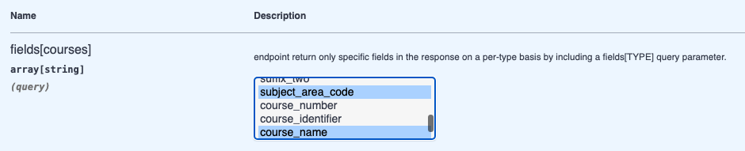

# spectacular-jsonapi OAS example vs. API response

This is a comparison of the [OAS schema](schemas/dsja-openapi.yaml) generated by drf-spectacular-jsonapi vs.
the actual API presented by the server.

## Actual API response for List of /v1/courses/

Here's a `GET /v1/courses/?filter[id]=c823b5de-6018-4878-80e9-932d20eaa18a` (a list filtered to one result):

```json
{
    "links": {
        "first": "http://localhost:8000/v1/courses/?filter%5Bid%5D=c823b5de-6018-4878-80e9-932d20eaa18a&page%5Bnumber%5D=1",
        "last": "http://localhost:8000/v1/courses/?filter%5Bid%5D=c823b5de-6018-4878-80e9-932d20eaa18a&page%5Bnumber%5D=1",
        "next": null,
        "prev": null
    },
    "data": [
        {
            "type": "courses",
            "id": "c823b5de-6018-4878-80e9-932d20eaa18a",
            "attributes": {
                "effective_start_date": null,
                "effective_end_date": null,
                "last_mod_user_name": "admin",
                "last_mod_date": "2018-10-07",
                "school_bulletin_prefix_code": "CEFKX9",
                "suffix_two": "00",
                "subject_area_code": "ENGB",
                "course_number": "00217",
                "course_identifier": "ENGL3189X",
                "course_name": "POSTMODERNISM",
                "course_description": "POSTMODERNISM"
            },
            "relationships": {
                "course_terms": {
                    "meta": {
                        "count": 1
                    },
                    "data": [
                        {
                            "type": "course_terms",
                            "id": "a1d34785-cc25-4c1c-9806-9d05a98068c7"
                        }
                    ],
                    "links": {
                        "self": "http://localhost:8000/v1/courses/c823b5de-6018-4878-80e9-932d20eaa18a/relationships/course_terms/",
                        "related": "http://localhost:8000/v1/courses/c823b5de-6018-4878-80e9-932d20eaa18a/course_terms/"
                    }
                }
            },
            "links": {
                "self": "http://localhost:8000/v1/courses/c823b5de-6018-4878-80e9-932d20eaa18a/"
            }
        }
    ],
    "meta": {
        "pagination": {
            "page": 1,
            "pages": 1,
            "count": 1
        }
    }
}
```

## drf-spectacular-jsonapi example

Here's an example response generated by drf-spectacular-jsonapi:

```json
{
  "data": [
    {
      "type": "courses",
      "id": "string",
      "attributes": {
        "effective_start_date": "2024-07-25",
        "effective_end_date": "2024-07-25",
        "last_mod_user_name": "string",
        "last_mod_date": "2024-07-25",
        "school_bulletin_prefix_code": "string",
        "suffix_two": "st",
        "subject_area_code": "string",
        "course_number": "string",
        "course_identifier": "stringstr",
        "course_name": "string",
        "course_description": "string"
      },
      "relationships": {
        "course_terms": {
          "data": [
            {
              "id": "3fa85f64-5717-4562-b3fc-2c963f66afa6",
              "type": "course_terms"
            }
          ]
        }
      }
    }
  ]
}
```

## Differences vs. API

### Missing HTTP links and Meta

The following HTTP links are missing:
* `data` self links.
* Pagination links: `first`, `last`, `next`, `pref`.
* Relationship links: `self`, `related`.

I suspect this may be due to introspecting the `ModelViewSets` instead of the Serializers. In this case,
the `HyperlinkedModelSerializer` is used rather than the `ModelSerializer`.

The Meta objects are also missing.

(scroll left-right to see the two columns.)

<table>
<tr>
<th>API response
</th>
<th>Spectacular example</th>
</tr>
<tr valign=top>
<td>

```json

"links": {
    "first": "http://localhost:8000/v1/courses/?filter%5Bid%5D=c823b5de-6018-4878-80e9-932d20eaa18a&page%5Bnumber%5D=1",
    "last": "http://localhost:8000/v1/courses/?filter%5Bid%5D=c823b5de-6018-4878-80e9-932d20eaa18a&page%5Bnumber%5D=1",
    "next": null,
    "prev": null
},
"meta": {
    "pagination": {
        "page": 1,
        "pages": 1,
        "count": 1
    }
}
```
</td>
<td>

```json
```

</td>
</tr>
<tr valign=top>
<td>

```json
"relationships": {
    "course_terms": {
        "meta": {
            "count": 1
        },
        "data": [
            {
                "type": "course_terms",
                "id": "a1d34785-cc25-4c1c-9806-9d05a98068c7"
            }
        ],
        "links": {
            "self": "http://localhost:8000/v1/courses/c823b5de-6018-4878-80e9-932d20eaa18a/relationships/course_terms/",
            "related": "http://localhost:8000/v1/courses/c823b5de-6018-4878-80e9-932d20eaa18a/course_terms/"
        }
    }
},
```
</td>
<td>

```json
"relationships": {
  "course_terms": {
    "data": [
      {
        "id": "3fa85f64-5717-4562-b3fc-2c963f66afa6",
        "type": "course_terms"
      }
    ]
  }
}
```
</td>
</tr>
</table>

### Breaks on RelationShipViews


The following paths had to be removed in order to get a schema to generate:

```python
    # course relationships:
    path('v1/courses/<pk>/relationships/<related_field>/',
        views.CourseRelationshipView.as_view(),
        name='course-relationships'),
    # course_terms relationships
    path('v1/course_terms/<pk>/relationships/<related_field>/',
        views.CourseTermRelationshipView.as_view(),
        name='course_term-relationships'),
    # person relationships
    path('v1/people/<pk>/relationships/<related_field>/',
        views.PersonRelationshipView.as_view(),
        name='person-relationships'),
    # instructor relationships
    path('v1/instructors/<pk>/relationships/<related_field>/',
        views.InstructorRelationshipView.as_view(),
        name='instructor-relationships'),
```


Here's the traceback with attemping `manage.py spectacular`:
```
  File "/Users/ac45/src/django-jsonapi-training/venv/lib/python3.12/site-packages/drf_spectacular/management/commands/spectacular.py", line 72, in handle
    schema = generator.get_schema(request=None, public=True)
             ^^^^^^^^^^^^^^^^^^^^^^^^^^^^^^^^^^^^^^^^^^^^^^^
  File "/Users/ac45/src/django-jsonapi-training/venv/lib/python3.12/site-packages/drf_spectacular/generators.py", line 285, in get_schema
    paths=self.parse(request, public),
          ^^^^^^^^^^^^^^^^^^^^^^^^^^^
  File "/Users/ac45/src/django-jsonapi-training/venv/lib/python3.12/site-packages/drf_spectacular/generators.py", line 256, in parse
    operation = view.schema.get_operation(
                ^^^^^^^^^^^^^^^^^^^^^^^^^^
  File "/Users/ac45/src/django-jsonapi-training/venv/lib/python3.12/site-packages/drf_spectacular_jsonapi/schemas/openapi.py", line 48, in get_operation
    return super().get_operation(path, path_regex, path_prefix, method, registry)
           ^^^^^^^^^^^^^^^^^^^^^^^^^^^^^^^^^^^^^^^^^^^^^^^^^^^^^^^^^^^^^^^^^^^^^^
  File "/Users/ac45/src/django-jsonapi-training/venv/lib/python3.12/site-packages/drf_spectacular/openapi.py", line 96, in get_operation
    tags = self.get_tags()
           ^^^^^^^^^^^^^^^
  File "/Users/ac45/src/django-jsonapi-training/venv/lib/python3.12/site-packages/drf_spectacular_jsonapi/schemas/openapi.py", line 143, in get_tags
    return [get_resource_name(context={"view": self.view})]
            ^^^^^^^^^^^^^^^^^^^^^^^^^^^^^^^^^^^^^^^^^^^^^^
  File "/Users/ac45/src/django-jsonapi-training/venv/lib/python3.12/site-packages/rest_framework_json_api/utils.py", line 51, in get_resource_name
    resource_name = view.resource_name
                    ^^^^^^^^^^^^^^^^^^
  File "/Users/ac45/src/django-jsonapi-training/venv/lib/python3.12/site-packages/rest_framework_json_api/views.py", line 422, in get_resource_name
    instance = getattr(self.get_object(), self.get_related_field_name())
                       ^^^^^^^^^^^^^^^^^
  File "/Users/ac45/src/django-jsonapi-training/venv/lib/python3.12/site-packages/rest_framework/generics.py", line 92, in get_object
    assert lookup_url_kwarg in self.kwargs, (
AssertionError: Expected view CourseTermRelationshipView to be called with a URL keyword argument named "pk". Fix your URL conf, or set the `.lookup_field` attribute on the view correctly.
```

### Related field not handled

```
/Users/ac45/src/django-jsonapi-training/myapp/views.py:213: Warning [CourseTermViewSet]: could not derive type of path parameter "related_field" because model "myapp.models.CourseTerm" contained no such field. Consider annotating parameter with @extend_schema. Defaulting to "string".
/Users/ac45/src/django-jsonapi-training/myapp/views.py:189: Warning [CourseViewSet]: could not derive type of path parameter "related_field" because model "myapp.models.Course" contained no such field. Consider annotating parameter with @extend_schema. Defaulting to "string".
/Users/ac45/src/django-jsonapi-training/myapp/views.py:301: Warning [InstructorViewSet]: could not derive type of path parameter "related_field" because model "myapp.models.Instructor" contained no such field. Consider annotating parameter with @extend_schema. Defaulting to "string".
/Users/ac45/src/django-jsonapi-training/myapp/views.py:229: Warning [PersonViewSet]: could not derive type of path parameter "related_field" because model "myapp.models.Person" contained no such field. Consider annotating parameter with @extend_schema. Defaulting to "string".
```

Also complains about non-unique operation IDs due to `related_field`:

```
Warning: operationId "course_terms_retrieve" has collisions [('/v1/course_terms/{id}/', 'get'), ('/v1/course_terms/{id}/{related_field}/', 'get')]. resolving with numeral suffixes.
Warning: operationId "courses_retrieve" has collisions [('/v1/courses/{id}/', 'get'), ('/v1/courses/{id}/{related_field}/', 'get')]. resolving with numeral suffixes.
Warning: operationId "instructors_retrieve" has collisions [('/v1/instructors/{id}/', 'get'), ('/v1/instructors/{id}/{related_field}/', 'get')]. resolving with numeral suffixes.
Warning: operationId "people_retrieve" has collisions [('/v1/people/{id}/', 'get'), ('/v1/people/{id}/{related_field}/', 'get')]. resolving with numeral suffixes.
```

### Does not (yet) support non-model serializers

```
/Users/ac45/src/django-jsonapi-training/venv/lib/python3.12/site-packages/drf_spectacular_jsonapi/schemas/utils.py:14: UserWarning: Can't resolve primary key for non model serializers.
  warn(message="Can't resolve primary key for non model serializers.")
```

## Quality of parameters in OAS schema

The DSJA query parameter support is top notch.

### Good support of fields, include, filter.

For example, the course sparse fieldsets `fields` parameter enumerates
all the possible fields that can be specified. One can select one or more of them from the swagger UI "try it":



and the resulting query properly includes them:

```
http://127.0.0.1:8000/v1/courses/?fields[courses]=course_terms,school_bulletin_prefix_code
```

Similarly, `include` enumerates the possible values to include.

Contrast this with the DJA implementation which generically describes the `fields` and `include` parameters.

Filters are also complete and differ from the DJA implementation only in that the conventional
Django double-underscore is used, e.g. `filter[course_terms__term_identifier__lt]` vs. the DJA
choice to accept the double-underscore but also allow and document single dot, e.g. `filter[course_terms.term_identifier.lt]`.

### Missing sort paramter

The `sort` parameter is missing.


