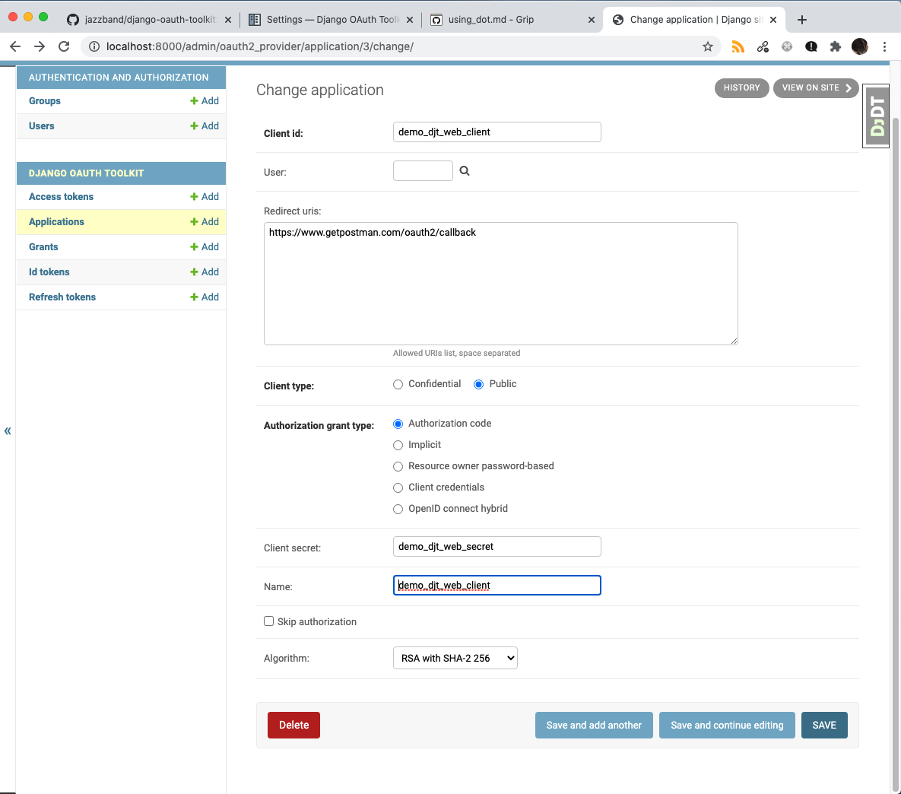
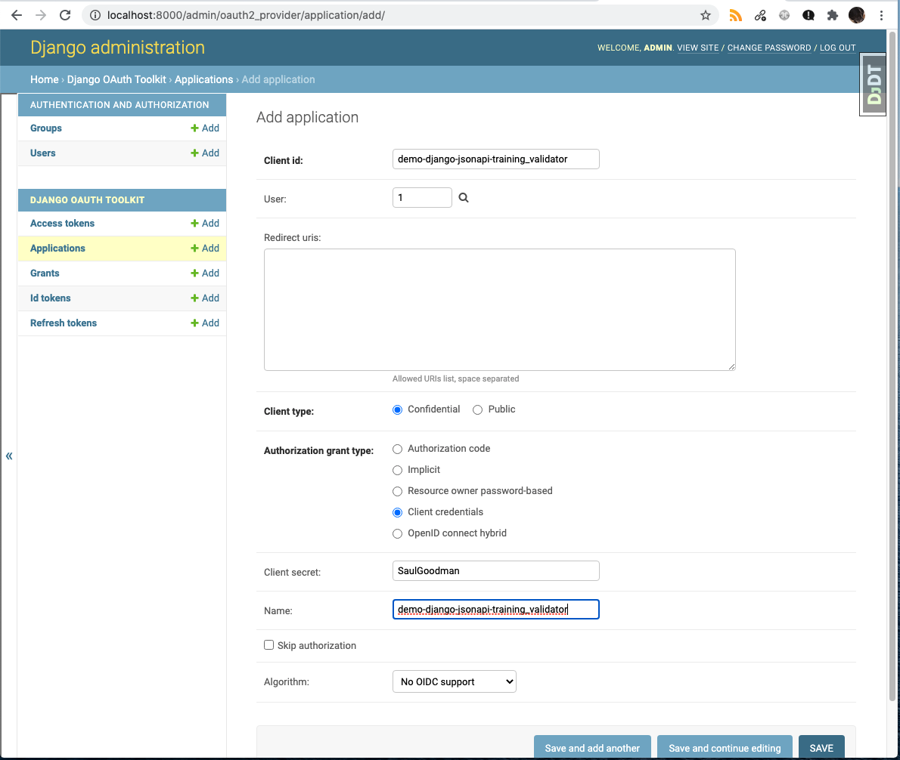
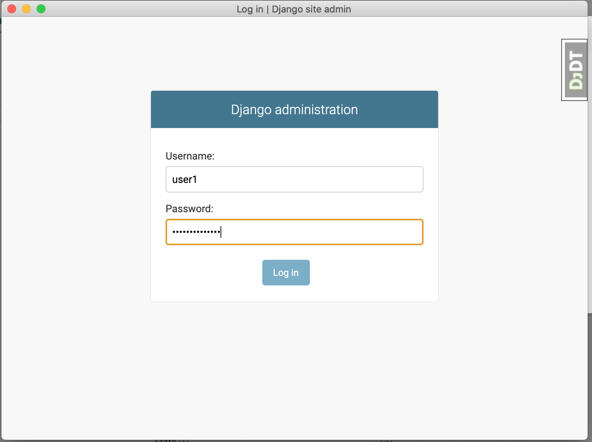
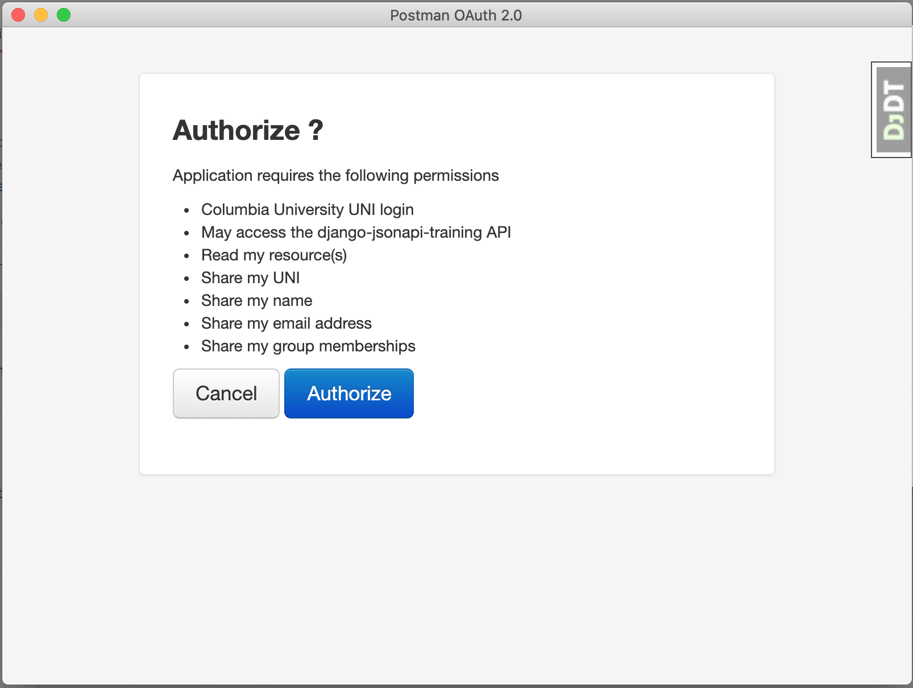
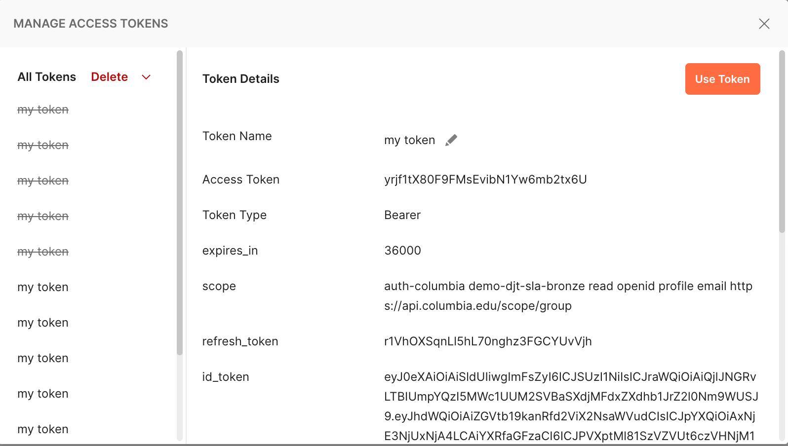
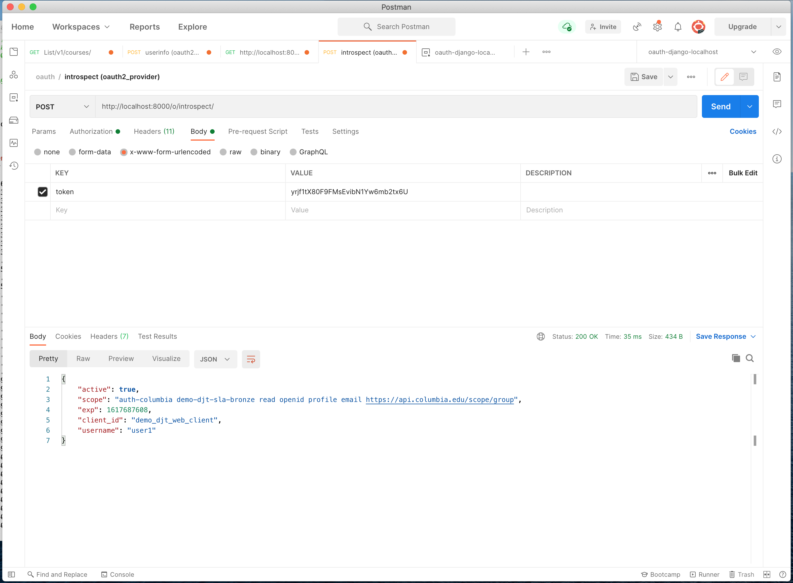
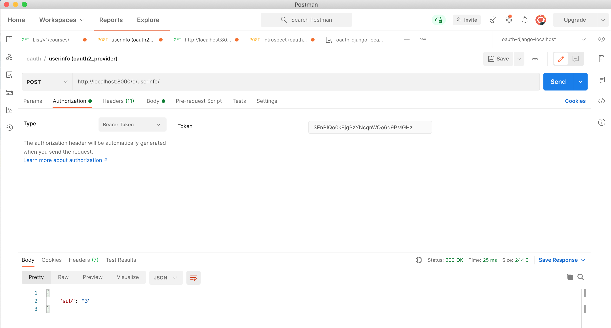

# Using django-oauth-toolkit as the AS

In case you don't have access to the [Columbia University OAuth2 AS](using_oauth2.md), or want to quickly experiment without
waiting for your requested client registration to be implemented, you can optionally configure 
the built-in Django OAuth Toolkit (DOT) AS.

It's fairly easy to use DOT as your AS, logging in Django "staff" users with the Authorization Code flow. To
keep it easy to switch between DOT and our external AS we'll
configure our DOT AS using the same scopes as used for the [Columbia AS](using_oauth2.md) &mdash; they just won't mean much. (For example,
the `auth-columbia` _scope selector_ will not lead to a Shibboleth login when using DOT.)

DOT >= 1.5.0 supports OpenID Connect (OIDC) 1.0, so we'll
[configure](https://django-oauth-toolkit.readthedocs.io/en/latest/oidc.html#openid-connect) that too. This means
we'll also get an ID Token along with the Access Token (and possible Refresh Token).

## Choosing which AS to use

In settings.py we use `OAUTH2_SERVER` as the base URL for our OAuth2 AS. We'll overload the meaning of this variable
with a value of "self" meaning to use the built-in DOT AS. Also, we'll configure the scopes our AS offers &mdash; matching
what our external AS currently supports. And, we'll add the RSA private key that we generated per the
[OIDC instructions](https://django-oauth-toolkit.readthedocs.io/en/latest/oidc.html#creating-rsa-private-key).

```text
(env) django-training$ openssl genrsa -out oidc.key 4096
```

Here are the settings.py changes:

```diff
+###
+# OAuth2/OIDC Server Configuration
+# Set env['OAUTH2_SERVER'] to 'self' to use the built-in django-oauth-toolkit server.
+# Otherwise et it to a baseURL of an external PingFederate AS.
+###
 OAUTH2_SERVER = os.environ.get('OAUTH2_SERVER','https://oauth-test.cc.columbia.edu')

+# Workaround inability of PyCharm to handle multi-line environment variables by reading
+# the OIDC RSA private key from a file. Otherwise just take it from the env.
+oidc_key_file = os.environ.get('OIDC_RSA_PRIVATE_KEY_FILE', None)
+if oidc_key_file:
+    oidc_key = open(oidc_key_file, 'rb').read().decode()
+else:
+    oidc_key = os.environ.get('OIDC_RSA_PRIVATE_KEY', None)
+
+
 OAUTH2_PROVIDER = {
     # here's where we add the external introspection endpoint:
-    'RESOURCE_SERVER_INTROSPECTION_URL': OAUTH2_SERVER + '/as/introspect.oauth2',
+    'RESOURCE_SERVER_INTROSPECTION_URL': None if OAUTH2_SERVER == 'self' else OAUTH2_SERVER + '/as/introspect.oauth2',
     'RESOURCE_SERVER_INTROSPECTION_CREDENTIALS': (
         os.environ.get('RESOURCE_SERVER_ID','demo-django-jsonapi-training_validator'),
         os.environ.get('RESOURCE_SERVER_SECRET','SaulGoodman')
     ),
+    'SCOPES': {
+        "address": "Share my address",
+        "read": "Read my resource(s)",
+        "openid": "Share my UNI",
+        "profile": "Share my name",
+        "email": "Share my email address",
+        "update": "Update my resource(s)",
+        "demo-djt-sla-bronze": "May access the django-jsonapi-training API",
+        "auth-columbia": "Columbia University UNI login",
+        "delete": "Delete my resources(s)",
+        "auth-none": "no login required",
+        "https://api.columbia.edu/scope/group": "Share my group memberships",
+        "create": "Create my resource(s)",
+        "introspection": "Introspect token scope",
+    },
+    'OIDC_ENABLED': True if oidc_key else False,
+    'OIDC_RSA_PRIVATE_KEY': oidc_key,
 }
```

(The "introspection" scope has special meaning for DOT only: It's how a client can get authorized to use the
token introspection endpoint.)


## Adding the DOT URLs

We've already got `oauth2_provider` in `INSTALLED_APPS` in settings.py. Now add the DOT path:

```diff
diff --git a/training/urls.py b/training/urls.py
index e784527..518a691 100644
--- a/training/urls.py
+++ b/training/urls.py
@@ -90,6 +90,7 @@ urlpatterns = [
     path('admin/', admin.site.urls),
     path('accounts/login/', auth_views.LoginView.as_view()),
     path('accounts/logout/', auth_views.LogoutView.as_view(), {'next_page': '/'}, name='logout'),
+    path('o/', include('oauth2_provider.urls', namespace='oauth2_provider')),
 ]
 
 urlpatterns += staticfiles_urlpatterns()
```

| OAuth2/OIDC endpoint | URL |
| -------------------- | --- |
| authorization        | /o/authorize/ |
| access token         | /o/token/     |
| introspection        | /o/introspect/ |
| OIDC discovery       | /o/.well-known/openid-configuration/ |
| OIDC userinfo        | /o/userinfo/ |

## Adding Users

When using the [Columbia AS](using_oauth2.md), users are members of the user community and show up with a Django
[request.user](https://docs.djangoproject.com/en/3.1/topics/auth/default/) of _UNI_@columbia.edu. When using DOT,
you need to create users in the
[Django Authentication System](https://docs.djangoproject.com/en/3.1/topics/auth/default/#using-the-django-authentication-system).
Since we've configured user `admin` in our app, you can go to http://localhost:8000/admin/ and login as the superuser
that we created with `manage.py createsuperuser` (see [building](building.md#do-initial-migration-and-superuser-account-setup)).

To save manual clicking around, you can load a few users (including the superuser) from a fixture:

```text
(env) django-training$ ./manage.py loaddata myapp/fixtures/auth.yaml 
Installed 71 object(s) from 1 fixture(s)
```

This creates (or updates) the `admin` user as well as users `user1`, `user2` and `user3`. It also creates three groups:
`team-a`, `team-b` and `team-c`, assigns some privileges to them and some user memberships.
See http://localhost:8000/admin/auth/ for these details:

| username | password       | staff   | su        | group memberships |
| -------- | -------------- | -----   | --------- | ----------------- |
| admin    | admin123       | &#9745; | &#9745;   | (none)            |
| user1    | user1password1 | &#9745; |           | team-a, team-c    |
| user2    | user2password2 | &#9745; |           | team-a, team-b    |
| user3    | user3password3 | &#9745; |           | (none)            |


## Adding our OAuth 2 Client

To save manual clicking around, you can load the clients shown below from a fixture:

```text
(env) django-training$ ./manage.py loaddata myapp/fixtures/oauth2.yaml
Installed 2 object(s) from 1 fixture(s)
```

DOT calls clients "applications". Let's add one. Go to http://localhost:8000/admin/oauth2_provider/application/
and select Add Application. DOT offers up a random string for the client ID and secret, but let's overwrite them
with our demo values:



## Adding our OAuth2 Introspection Client

Besides the "end user" client, your backend service may need an introspection client in order to introspect
the Access Token. We'll create one, copying the example client name and secret from settings.py



(When using client credentials for the introspection client, it appears there's no need for `introspection` scope
mentioned earlier; that appears to be a holdover from prior behavior which required a granted Bearer Access Token
rather than the more common approach of using Basic Auth to authenticate introspection.)

## Get an OAuth 2.0 token

You'll need to configure Postman for OAuth 2.0. 


You can cut-n-paste the above from here:


```text
Token Name: *pick a name*
Grant Type: Authorization Code (With PKCE)
Callback URL: https://www.getpostman.com/oauth2/callback
Auth URL: http://localhost:8000/authorize/
Access Token URL: http://localhost:8000/token/
Client ID: demo_djt_web_client
Client Secret: demo_djt_web_secret
Scope: auth-columbia demo-djt-sla-bronze read openid profile email https://api.columbia.edu/scope/group
Client Authentication: Send as Basic Auth header
```

You'll see a Django Admin Login screen popup:



You'll then see a Request for Approval that looks like this:



Unlike the [Columbia AS](using_oauth2.md) which allows you to individually approve scopes, DOT's is all-or-nothing.

Now you are logged in and have an Access Token which Postman shows you:



From there, things will mostly work the same as with the [Columbia AS](using_oauth2.md).

If you want to interrogate the DOT AS to see what the userinfo and introspection endpoints return, you can do that now.

## Introspection

For [Oauth 2.0 token introspection](https://tools.ietf.org/html/rfc7662), you'll use the introspection client
credentials described above. Enter these as basic auth and then, for the request body, send it x-url-form-encoded
with the value being the granted token. The result should look something like this for a valid token:



## Userinfo

OIDC adds the Userinfo endpoint which is very similar to introspection but uses the granted Access Token for 
authentication. Set the postman authorization type to Bearer Token, paste in the token and the response will
look like this:



You'll note that the default response simply provides the `sub` (subject) numeric ID.

Next, we'll explore extending DOT's userinfo and introspection responses to provide more details.

## Resolving Missing Claims: Extending ID Token and Userinfo

OIDC defines a set of [standard _claims_](https://openid.net/specs/openid-connect-core-1_0.html#StandardClaims)
that are supposed to be returned by the Userinfo endpoint or in the ID Token. As delivered, DOT returns only
a minimal set but documents how to 
[customize](https://django-oauth-toolkit.readthedocs.io/en/latest/oidc.html#customizing-the-oidc-responses) 
it to add additional claims.

### Adding ID Token Claims

For scopes including "auth-columbia demo-djt-sla-bronze read openid profile email https://api.columbia.edu/scope/group"

DOT returns these claims in the ID Token (Use https://jwt.io to easily decode the JWT):
```json
{
  "aud": "demo_djt_web_client",
  "iat": 1617644402,
  "at_hash": "lqMxqCdbINg2e6FN4eeARw",
  "sub": "3",
  "iss": "http://127.0.0.1:8000/o",
  "exp": 1617680402,
  "auth_time": 1617395518,
  "jti": "728a698f-51f1-4317-86ee-5d265c374bc6"
}
```

Whereas [[Columbia AS](using_oauth2.md)](using_oauth2.md) returns quite a bit more:
```json
{
  "sub": "ac45@columbia.edu",
  "aud": "demo_djt_web_client",
  "jti": "NkHIUY3pnLfZf4t4DpZGie",
  "iss": "https://oauth-test.cc.columbia.edu",
  "iat": 1617644596,
  "exp": 1617644896,
  "acr": "urn:oasis:names:tc:SAML:2.0:ac:classes:PasswordProtectedTransport",
  "auth_time": 1617644593,
  "https://api.columbia.edu/claim/group": "sds_inventory_editor sus_academicstructure-admin sus_inventory_editor cas_tsc_upd sds_coursecatalog-users sus_courseproposal-approvers sts_coursecatalog-admin sds_student sds_advisor sus_courseinventory-admin sts_cm-users sts_courseproposal-approvers sds_courseproposal-users sds_courseproposal-reviewers sds_academicstructure-users sds_coursecatalog-admin sus_classschedule-users sds_academicstructure-admin sts_courseproposal-authors sds_registrar_admins sds_courseproposal-authors demo_api_c sus_coursecatalog-admin sts_inventory_editor sds_courseproposal-approvers sus_courseinventory-users sts_system_admin sds_advisor-admin sds_da-users sus_da-users sds_superusers sds_courseinventory-admin sts_academicstructure-admin sts_classschedule-users sts_courseproposal-admin sds_cm-users sus_cm-users sts_academicstructure-users sts_classschedule-admin sts_courseinventory-users sts_da-users sds_classschedule-users sus_coursecatalog-users sds_courseinventory-users sus_courseproposal-admin sus_registrar_admins demo_d_demo2 sts_courseproposal-users sus_courseproposal-reviewers sds_classschedule-admin sts_courseinventory-admin sus_courseproposal-users sus_courseproposal-authors sts_registrar_admins sts_debug sts_coursecatalog-users sds_courseproposal-admin cas_tsc_view sds_system_admin sus_classschedule-admin sts_courseproposal-reviewers",
  "name": "Alan Crosswell",
  "given_name": "Alan",
  "family_name": "Crosswell",
  "email": "alan@columbia.edu"
}
```

Of the above, notably several are the result of two OIDC 
[standard scopes](https://openid.net/specs/openid-connect-core-1_0.html#ScopeClaims) 
that were requested: `profile` -- which requests several claims and `email`.

Let's [extend the ID Token](https://django-oauth-toolkit.readthedocs.io/en/latest/oidc.html#adding-claims-to-the-id-token)
to include those claims as well as our custom groups claim *only if the appropriate scopes are granted*.

Per the instructions, let's add class `CustomOauth2Validator` in `myapp/oauth2_validator.py` and define
`get_additional_claims` to replace the numeric `sub` ID with the `username` and add additional claims
if the required scopes are present:

```python
from oauth2_provider.oauth2_validators import OAuth2Validator

class CustomOAuth2Validator(OAuth2Validator):

    def get_additional_claims(self, request):
        """
        Return additional ID Token Claims based on the OIDC scope claims.
        Args:
            request:

        Returns:
            dict of additional claims
        """
        claims = {
            "sub": request.user.username
        }
        if 'profile' in request.scopes:
            claims["given_name"] = request.user.first_name
            claims["family_name"] = request.user.last_name
            claims["name"] = ' '.join([request.user.first_name, request.user.last_name])
        if 'email' in request.scopes:
            claims["email"] = request.user.email
        if 'https://api.columbia.edu/scope/group' in request.scopes:
            claims['https://api.columbia.edu/claim/group'] = ' '.join([g.name for g in request.user.groups.all()])
        return claims
```

```diff
diff --git a/training/settings.py b/training/settings.py
index d5e7ca2..30293da 100644
--- a/training/settings.py
+++ b/training/settings.py
@@ -245,7 +245,8 @@ OAUTH2_PROVIDER = {
     },
     'OIDC_ENABLED': True if oidc_key else False,
     'OIDC_RSA_PRIVATE_KEY': oidc_key,
-    'PKCE_REQUIRED': True
+    'PKCE_REQUIRED': True,
+    'OAUTH2_VALIDATOR_CLASS': 'myapp.oauth2_validator.CustomOAuth2Validator',
 }
```


This results in a much more satisfying ID token:
```json
{
  "aud": "demo_djt_web_client",
  "iat": 1617649953,
  "at_hash": "_MSaz2TmA_C9PFUr0Ftg_g",
  "sub": "user1",
  "given_name": "First",
  "family_name": "User",
  "name": "First User",
  "email": "user1@example.com",
  "https://api.columbia.edu/claim/group": "team-a team-c",
  "iss": "http://127.0.0.1:8000/o",
  "exp": 1617685953,
  "auth_time": 1617395518,
  "jti": "58a7041f-6c25-4934-b96c-08e7d0e85d5b"
}
```

### Adding Userinfo Claims

Somewhat surprisingly, the above change caused the default Userinfo response to now return the username rather than
ID number for the `sub`:
```json
{
    "sub": "user1"
}
```
It appears that extending the ID Token is somewhat related to the Userinfo response, even without extending Userinfo.

Here's what the [[Columbia AS](using_oauth2.md)](using_oauth2.md) returns for Userinfo:
```json
{
    "sub": "ac45@columbia.edu",
    "https://api.columbia.edu/claim/group": "sds_inventory_editor sus_academicstructure-admin sus_inventory_editor cas_tsc_upd sds_coursecatalog-users sus_courseproposal-approvers sts_coursecatalog-admin sds_student sds_advisor sus_courseinventory-admin sts_cm-users sts_courseproposal-approvers sds_courseproposal-users sds_courseproposal-reviewers sds_academicstructure-users sds_coursecatalog-admin sus_classschedule-users sds_academicstructure-admin sts_courseproposal-authors sds_registrar_admins sds_courseproposal-authors demo_api_c sus_coursecatalog-admin sts_inventory_editor sds_courseproposal-approvers sus_courseinventory-users sts_system_admin sds_advisor-admin sds_da-users sus_da-users sds_superusers sds_courseinventory-admin sts_academicstructure-admin sts_classschedule-users sts_courseproposal-admin sds_cm-users sus_cm-users sts_academicstructure-users sts_classschedule-admin sts_courseinventory-users sts_da-users sds_classschedule-users sus_coursecatalog-users sds_courseinventory-users sus_courseproposal-admin sus_registrar_admins demo_d_demo2 sts_courseproposal-users sus_courseproposal-reviewers sds_classschedule-admin sts_courseinventory-admin sus_courseproposal-users sus_courseproposal-authors sts_registrar_admins sts_debug sts_coursecatalog-users sds_courseproposal-admin cas_tsc_view sds_system_admin sus_classschedule-admin sts_courseproposal-reviewers",
    "name": "Alan Crosswell",
    "given_name": "Alan",
    "family_name": "Crosswell",
    "email": "alan@columbia.edu"
}
```

It should be pretty easy to extend DOT's Userinfo response to look similar. In fact, we should be able to reuse
the ID Token code we just wrote -- but it appears there's a 
[bug](https://github.com/jazzband/django-oauth-toolkit/issues/952)
in DOT 1.5.0 that the `request.scopes` is missing everything but `openid`:

```diff
diff --git a/myapp/oauth2_validator.py b/myapp/oauth2_validator.py
index 169550f..88dbffd 100644
--- a/myapp/oauth2_validator.py
+++ b/myapp/oauth2_validator.py
@@ -24,3 +24,20 @@ class CustomOAuth2Validator(OAuth2Validator):
         if 'https://api.columbia.edu/scope/group' in request.scopes:
             claims['https://api.columbia.edu/claim/group'] = ' '.join([g.name for g in request.user.groups.all()])
         return claims
+
+    def get_userinfo_claims(self, request):
+        """
+        Return additional Userinfo claims
+        Args:
+            request:
+
+        Returns: userinfo dict
+        """
+        claims = super().get_userinfo_claims(request)
+        # This version of request seems to only have the 'openid' scope. That's probably a bug.
+        # additional_claims = self.get_additional_claims(request)
+        # for now kludge it to provide all the stuff while we investigate if this is a bug.
+        kludged_request = request
+        kludged_request.scopes += ['profile', 'email', 'https://api.columbia.edu/scope/group']
+        additional_claims = self.get_additional_claims(kludged_request)
+        return {**claims, **additional_claims}
```

Now the Userinfo response looks like this:
```json
{
    "sub": "user1",
    "given_name": "First",
    "family_name": "User",
    "name": "First User",
    "email": "user1@example.com",
    "https://api.columbia.edu/claim/group": "team-a team-c"
}
```

