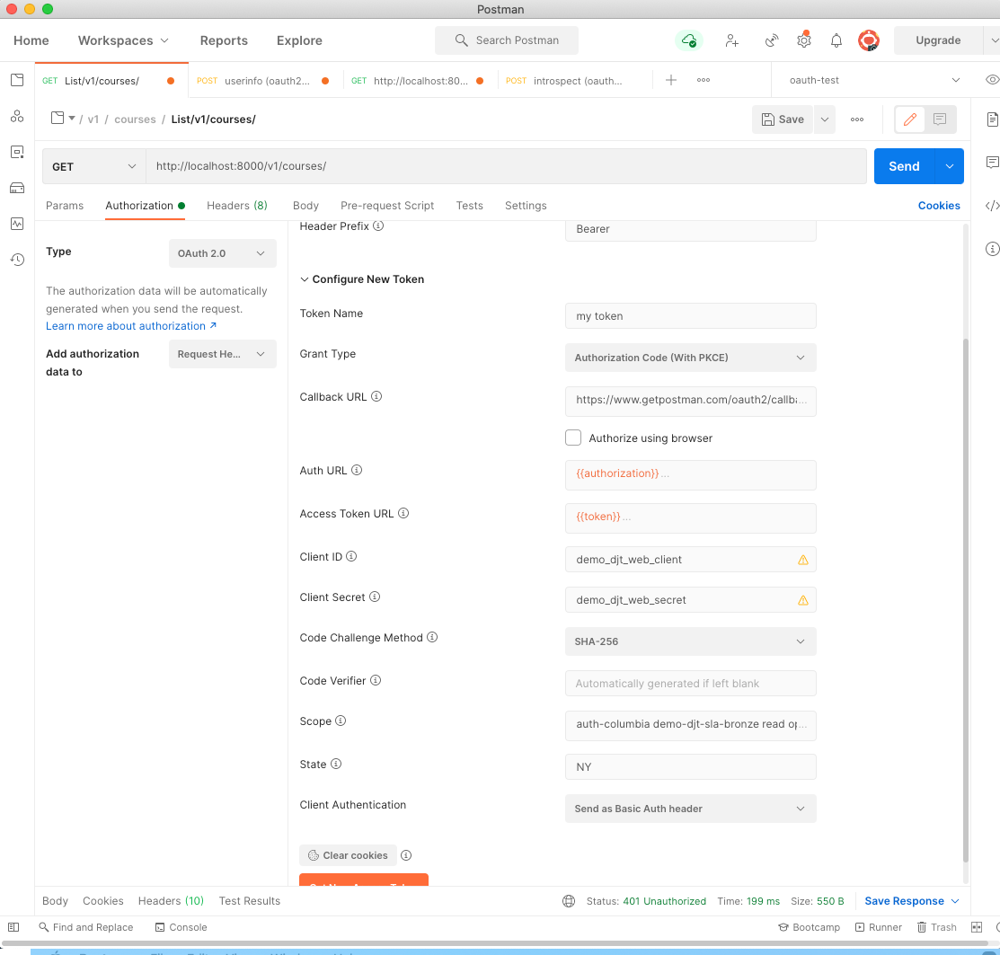
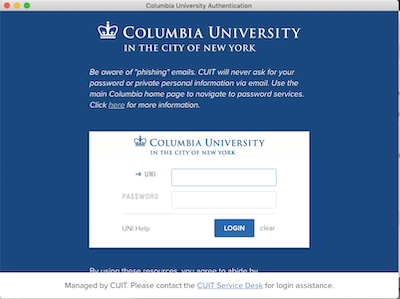
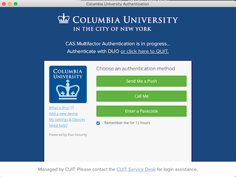
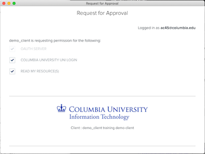
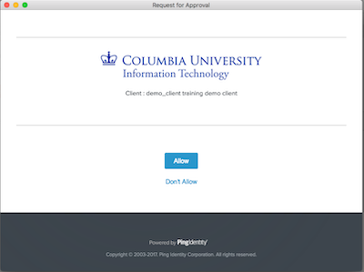
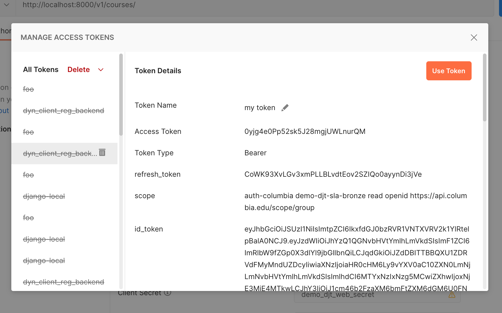
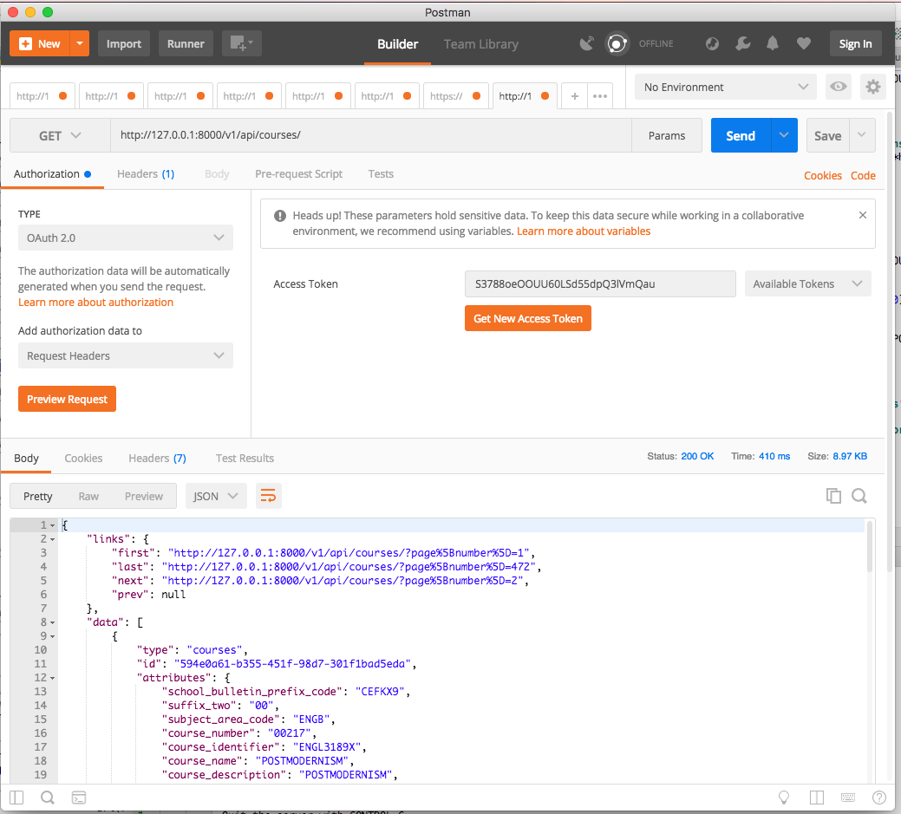

# Using OAuth 2.0

Our example use of OAuth 2.0 uses an external OAuth 2.0 Authorization Server (AS). It's also possible to
add an AS using Django's auth models and the [`django-oauth-toolkit`](http://dot.evonove.it/) (DOT).

## Get an OAuth 2.0 token

You'll need to configure Postman for OAuth 2.0. 

**N.B.** The example Client Credentials below may cease
to work some day. If you are not affiliated with Columbia University, consider running your own
OAuth 2.0 provider using DOT, since the `auth-columbia` scope will not work for you.

Select the Authorization tab, select OAuth 2.0 and click on Get New
Access Token:



You can cut-n-paste the above from here:

```text
Token Name: *pick a name*
Grant Type: Authorization Code
Callback URL: http://localhost:5432/oauth2client
Auth URL: https://oauth-test.cc.columbia.edu/as/authorization.oauth2
Access Token URL: https://oauth-test.cc.columbia.edu/as/token.oauth2
Client ID: demo_client
Client Secret: b322573a7176A49FCBEF46554d3381d5
Scope: auth-columbia read
Client Authentication: Send as Basic Auth header
```

and then click Request Token.

You'll see a Columbia Login screen popup:



Followed by a multifactor authentication:



You'll then see a Request for Approval that looks like this:



This is an *optional* user approval popup that is configured as part of
registering your client app with the OAuth service. As you can see, the
user is allowed to uncheck the scopes, effectively giving your client
app less permission than it asked for. You need to scroll it down to
click Allow:



Now you are logged in and have an Access Token which Postman shows you:



## Issue HTTP requests using the token

Click on Use Token and then fill in the URL and do the
GET by clicking SEND:



There's lots more to Postman, but this should get you started. You'll
want to explore selecting different methods (GET, POST, PATCH, DELETE),
understanding which scopes are required for those methods (see
views.py), and perhaps adding the `Accept` or `Content-Type` headers to
contain `application/vnd.api+json`.

If you don't set an appropriate header you'll sometimes see an error
like this:

```json
{
  "errors": [
    {
      "detail": "Could not satisfy the request Accept header.",
      "source": {
        "pointer": "/data"
      },
      "status": "406"
    }
  ]
}
```

